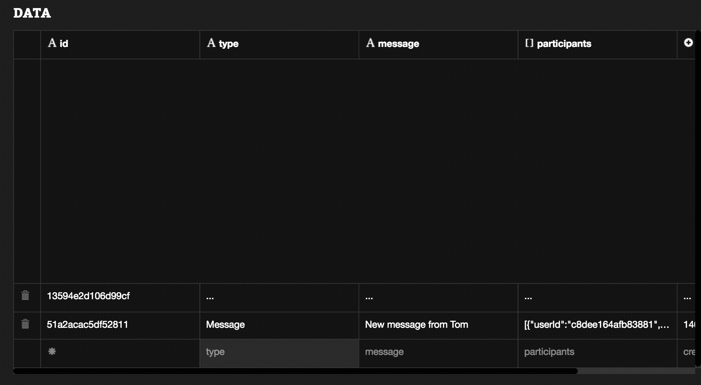
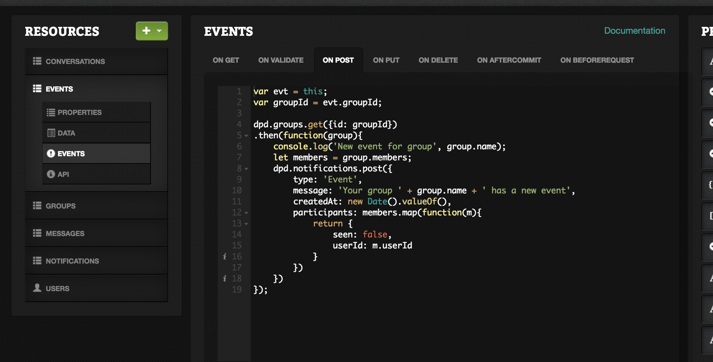
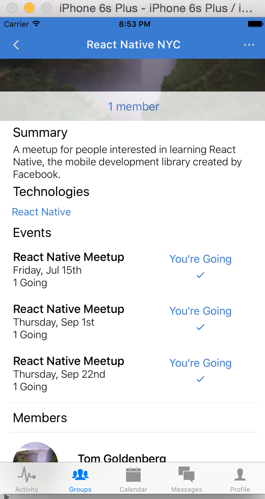
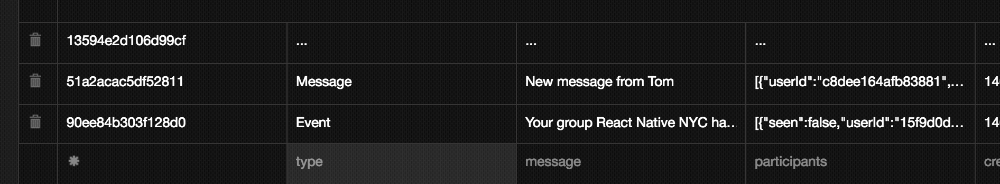
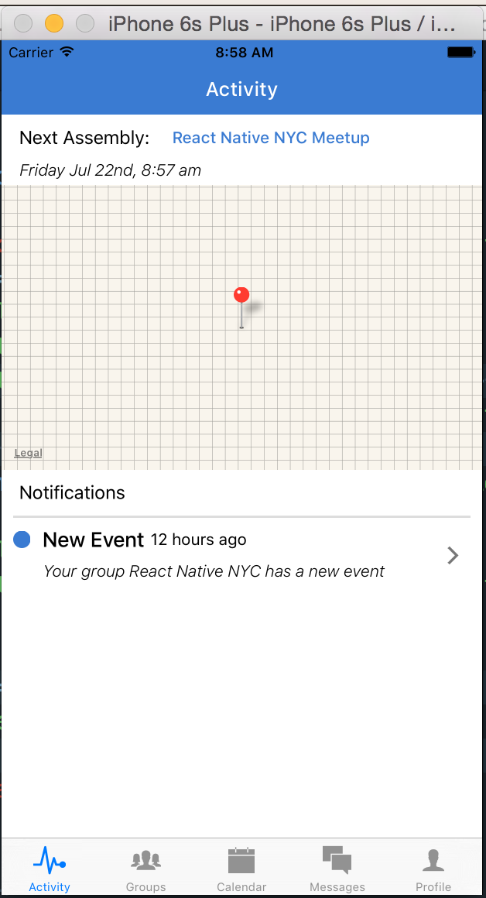
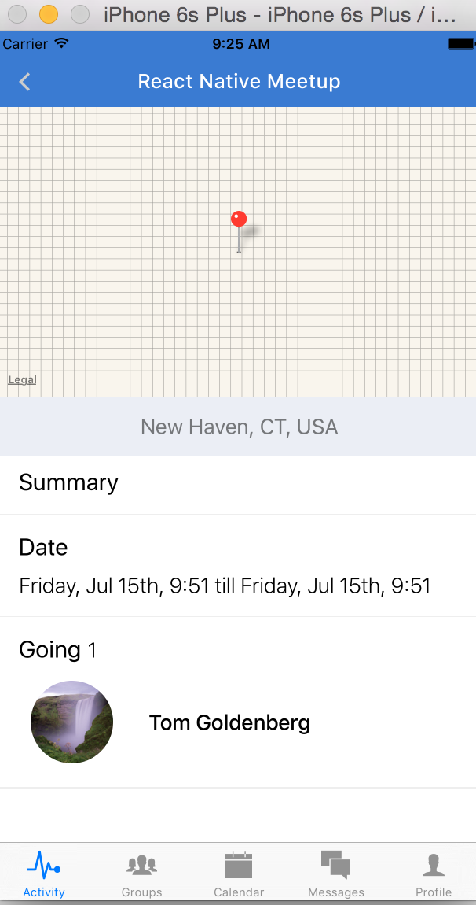

# Chapter 10: Building an Activity View
## 10.1 Building on the shoulders of giants

All the work we have done so far has led us to this point. We now have some pretty rich data to use for the rest of our app. Here is what we have so far:

-	User city and location, full name, avatar, and technologies
-	Which groups the user has joined, as well as the events for those groups
-	Which groups share the same technologies or location as the user
-	Which events the user has RSVP’d for

With this data, we can start to construct our `Calendar` and `Activity` Views. In our `Calendar` view, we want to show a list of events, both those that the user has RSVP’d for and those that are recommended based on the user’s preferences and location. 

In our `Activity View`, we want to show the next event that the user has RSVP’d for, along with a map of its location. We also want to display any notification messages for the user. 

We haven’t yet considered how we will implement notifications. We will actually need a separate collection for these, with the following fields: 

```
message: String
createdAt: Number
type: String
participants: Array
``` 

After each new message and event is created, we should send out a notification to the message recipient and the group members. Let's add this logic in Deployd with a callback after an event is created and after a message is created. Here's what that looks like.

```javascript
console.log('MESSAGE CREATED', this);
var text = this.text;
var senderId = this.senderId;
var recipientId = this.recipientId;
var createdAt = this.createdAt;

dpd.users.get({ id: recipientId })
.then(function(user){
    console.log('SENDER', user.firstName);
    dpd.notifications.post({
        type: 'Message',
        participants: [{userId: recipientId, seen: false}],
        message: 'New message from ' + user.firstName,
        createdAt: new Date().valueOf()
    })
})
...
```

Now create a new message and see that a notification gets created.


Now we can do the same thing with new events. Let's create a hook on the `POST` event of the `events` collection.

```javascript
var evt = this;
var groupId = evt.groupId;

dpd.groups.get({id: groupId})
.then(function(group){
    console.log('New event for group', group.name);
    let members = group.members;
    dpd.notifications.post({
        type: 'Event',
        message: 'Your group ' + group.name + ' has a new event',
        createdAt: new Date().valueOf(),
        participants: members.map(function(m){
            return {
                seen: false,
                userId: m.userId
            }
        })
    })
});

```





Now if we create another event, we will see a new notification has been created. Now it should be straightforward to render these in our `ActivityView`. We also want to load the next event that a user is signed up for, or if there is none, the next event nearby.

Let's edit `ActivityView.js`.

```javascript
import React, { Component } from 'react';
import {
  Navigator,
  StyleSheet
} from 'react-native';

import Activity from './Activity';
import Event from '../groups/Event';
import { API, DEV } from '../../config';

class ActivityView extends Component{
  constructor(){
    super();
    this.state = {
      notifications: [],
      nextEvents: [],
    }
  }
  componentDidMount(){
    let { currentUser } = this.props;
    let query = {
      participants: {
        $elemMatch: {
          userId: currentUser.id
        }
      }
    };
    fetch(`${API}/notifications?${JSON.stringify(query)}`)
    .then(response => response.json())
    .then(notifications => {
      this.setState({ notifications });
      let eventQuery = {
        $or: [
          {
            $elemMatch: {
              going: currentUser.id
            },
            start: { $gt: new Date().valueOf() }
          },
          {
            'location.city.long_name': currentUser.location.city.long_name,
            start: { $gt: new Date().valueOf() }
          }
        ]
      };
      let sort = {
        sort: { createdAt: 1 },
        limit: 1
      }
      fetch(`${API}/events?${eventQuery}${sort}`)
      .then(response => response.json())
      .then(events => this.setState({ nextEvents: events }))
      .catch(err => console.log('FETCH EVENTS ERROR: ', err))
      .done();
    })
    .catch(err => console.log('FETCH NOTIFICATIONS ERROR: ', err))
    .done();
  }
  render(){
    return (
      <Navigator
        style={styles.container}
        initialRoute={{name: 'Activity'}}
        renderScene={(route, navigator) => {
          switch(route.name){
            case 'Activity':
              return (
                <Activity
                  {...this.props}
                  {...route}
                  {...this.state}
                  navigator={navigator}
                />
            );
            case 'Event':
              return (
                <Event
                  {...this.props}
                  {...route}
                  {...this.state}
                  navigator={navigator}
                />
            );
          }
        }}
      />
    )
  }
}

let styles = StyleSheet.create({
  container: {
    flex: 1
  }
})

export default ActivityView;

```

Notice how we use `mongodb`'s $elemMatch to query both the notifications and the next event. This feature allows us to find all matches that contain a value with our current user's `id`. 

Now that we've set up our routing, let's render the fetched notifications and next event.

```javascript
import NavigationBar from 'react-native-navbar';
import Colors from '../../styles/colors';
import Icon from 'react-native-vector-icons/Ionicons';
import moment from 'moment';
import { upcomingEvent } from '../../fixtures';

import React, { Component } from 'react';
import {
  ScrollView,
  View,
  Text,
  StyleSheet,
  InteractionManager,
  TouchableOpacity,
  Image,
  Dimensions,
  MapView,
} from 'react-native';

let { width: deviceWidth, height: deviceHeight } = Dimensions.get('window');

export default class ActivityView extends Component{
  constructor(){
    super();
    this.renderEvent = this.renderEvent.bind(this);
    this.state = {
      ready: false
    }
  }
  componentDidMount(){
    InteractionManager.runAfterInteractions(() => {
      this.setState({ ready: true })
    });
  }

  renderEvent(){
    let upcomingEvent = this.props.nextEvents[0];
    this.props.navigator.push({
      name: 'Event',
      event: upcomingEvent,
    })
  }
  _renderNotification(notification){
    let { updateTab } = this.props;
    return (
      <TouchableOpacity style={styles.notificationsContainer} onPress={() => updateTab(notification.type)}>
        <View style={{ flex: 1 }}>
          <View style={styles.row}>
            <View style={styles.seenCircle}/>
            <View style={styles.subjectTextContainer}>
              <Text style={styles.subjectText}>New {notification.type}</Text>
            </View>
            <Text>{moment(new Date(new Date(notification.createdAt))).fromNow()}</Text>
          </View>
          <View style={styles.messageContainer}>
            <Text style={styles.messageText}>{notification.message}</Text>
          </View>
        </View>
        <View style={styles.timeContainer}>
          <Icon name='ios-arrow-forward' color='#777' size={25} />
        </View>
      </TouchableOpacity>
    );
  }
  _renderMapView(upcomingEvent){
    const mapRegion = {
      latitude: upcomingEvent.location.lat,
      longitude: upcomingEvent.location.lng,
      latitudeDelta: 0.01,
      longitudeDelta: 0.01,
    };
    return (
      <MapView
        style={styles.map}
        region={mapRegion}
        annotations={[{latitude: mapRegion.latitude, longitude: mapRegion.longitude}]}
      />
    )
  }
  _renderMapFiller(){
    return (
      <View style={styles.map} />
    )
  }
  _renderScrollView(){
    let { ready } = this.state;
    let upcomingEvent = this.props.nextEvents.length === 0 ? null : this.props.nextEvents[0];
    return (
      <ScrollView
        contentContainerStyle={styles.scrollView}
        automaticallyAdjustContentInsets={false}
      >
        <TouchableOpacity onPress={this.renderEvent}>
          <View style={styles.nextAssemblyContainer}>
            <Text style={styles.bodyText}>Next Assembly: </Text>
            <View>
              <Text style={styles.eventName}>{ upcomingEvent && upcomingEvent.name }</Text>
            </View>
          </View>
          <Text style={styles.dateText}>{upcomingEvent && moment(new Date(upcomingEvent.start)).format('dddd MMM Do, h:mm a')}</Text>
        </TouchableOpacity>
        {ready && upcomingEvent ? this._renderMapView(upcomingEvent) : this._renderMapFiller() }
        <View>
          <Text style={styles.bodyText}>Notifications</Text>
          <View style={styles.break}/>
          <View style={styles.notificationsHolder}>
            {this.props.notifications.map((n, idx) => {
              return (
                <View key={idx} style={{ flex: 1 }}>
                  {this._renderNotification(n)}
                </View>
              );
            })}
            <View style={styles.emptySpace} />
          </View>
        </View>
      </ScrollView>
    );
  }
  render() {
    let titleConfig = { title: 'Activity', tintColor: 'white' };
    return (
      <View style={{ flex: 1 }}>
        <NavigationBar
          title={titleConfig}
          tintColor={Colors.brandPrimary}
        />
        {this._renderScrollView()}
      </View>
    );
  }
};

let styles = StyleSheet.create({
  infoIcon: {
    marginHorizontal: 10,
  },
  scrollView: {
    flex: 1,
    paddingBottom: 80,
  },
  topTab: {
    flexDirection: 'row',
    justifyContent: 'center',
    alignItems: 'center',
    height: 80,
    paddingTop: 25,
    paddingBottom: 10,
    backgroundColor: Colors.brandPrimary,
  },
  nextAssemblyContainer: {
    flexDirection: 'row',
    alignItems: 'center',
  },
  eventName: {
    color: Colors.brandPrimary,
    fontWeight: '500',
  },
  selectTab:{
    flex: 1,
    paddingVertical: 8,
    paddingHorizontal: 10,
    borderWidth: 1,
    borderColor: 'white',
  },
  leftSelectTab: {
    borderRadius: 4,
    borderTopRightRadius: 0,
    borderBottomRightRadius: 0,
    marginLeft: 5,
    borderRightWidth: 0,
  },
  rightSelectTab: {
    borderRadius: 4,
    borderTopLeftRadius: 0,
    borderBottomLeftRadius: 0,
    borderLeftWidth: 0,
    marginRight: 5,
  },
  leftActiveTab: {
    backgroundColor: 'white',
  },
  leftInactiveTab: {
    backgroundColor: Colors.brandPrimary,
  },
  rightActiveTab: {
    backgroundColor: 'white',
  },
  rightInactiveTab: {
    backgroundColor: Colors.brandPrimary,
  },
  activeTabText: {
    textAlign: 'center',
    color: Colors.brandPrimary,
  },
  inactiveTabText: {
    textAlign: 'center',
    color: 'white',
  },
  map: {
    backgroundColor: Colors.inactive,
        height: (deviceHeight / 3),
        width: deviceWidth
    },
  bodyText: {
    color: Colors.bodyText,
        fontSize: 16,
    fontWeight: '400',
        paddingHorizontal: 15,
    paddingVertical: 10,
  },
  nextEvent: {
    color: Colors.bodyTextLight,
    fontSize: 14,
    fontWeight: '300',
    fontStyle: 'italic',
  },
  dateText: {
    fontSize: 14,
    paddingBottom: 4,
    fontWeight: '300',
    fontStyle: 'italic',
    paddingHorizontal: 15,
    color: Colors.bodyText,
  },
  notificationsHolder:{
    flex: 1,
  },
  break: {
    borderWidth: 1,
    borderColor: '#ddd',
    marginHorizontal: 10,
  },
  notificationsContainer: {
    flex: 1,
    flexDirection: 'row',
    justifyContent: 'space-between',
    alignItems: 'center',
  },
  row: {
    flexDirection: 'row',
    alignItems: 'center',
    marginVertical: 8,
  },
  seenCircle: {
    backgroundColor: Colors.brandPrimary,
    borderRadius: 7.5,
    width: 15,
    height: 15,
    marginHorizontal: 10,
  },
  emptySeen: {
    height: 15,
    width: 15,
    backgroundColor: 'white',
    marginHorizontal: 10,
  },
  subjectTextContainer: {
    marginRight: 5,
  },
  subjectText: {
    fontSize: 18,
    fontWeight: '500',
  },
  timeContainer: {
    alignItems: 'center',
    justifyContent: 'center',
    flexDirection: 'row',
    padding: 20,
  },
  timeText: {
    fontSize: 12,
    fontWeight: '300',
    paddingHorizontal: 4,
  },
  timeLink: {
    paddingHorizontal: 10,
  },
  messageContainer: {
    flex: 1,
  },
  messageText: {
    color: 'black',
    marginLeft: 35,
    fontSize: 14,
    fontStyle: 'italic',
    fontWeight: '300',
  },
});

```

We also have to add the `updateTab` method in our `Dashboard.js` file.
```javascript
...
export default class Dashboard extends Component{
  constructor(props){
    super(props);
    this.logout = this.logout.bind(this);
    this.updateTab = this.updateTab.bind(this);
    this.state = {
      selectedTab: 'Activity',
    };
  }
  updateTab(type){
    switch(type){
      case 'Message':
        this.setState({ selectedTab: 'Messages'});
        break;
      case 'Event':
        this.setState({ selectedTab: 'Groups'});
        break;
    }
  }
  ...
  
render() {
  let { selectedTab } = this.state;
  let { currentUser } = this.props;
  return (
    <TabBarIOS style={styles.outerContainer}>
      <TabBarItemIOS
        title='Activity'
        selected={ selectedTab == 'Activity' }
        iconName='ios-pulse'
        onPress={() => this.setState({ selectedTab: 'Activity' })}
      >
        <ActivityView {...this.props} updateTab={this.updateTab}/>
      </TabBarItemIOS>
...
```

Now when our user clicks on a new message notifications, they'll be directed to the `Mesages` tab, and when they receive a new event notification, they'll be directed to the `Groups` tab. Also, when they click on the next event, we will navigate to the `Event` screen.




