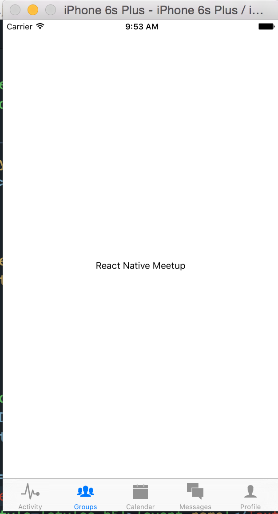
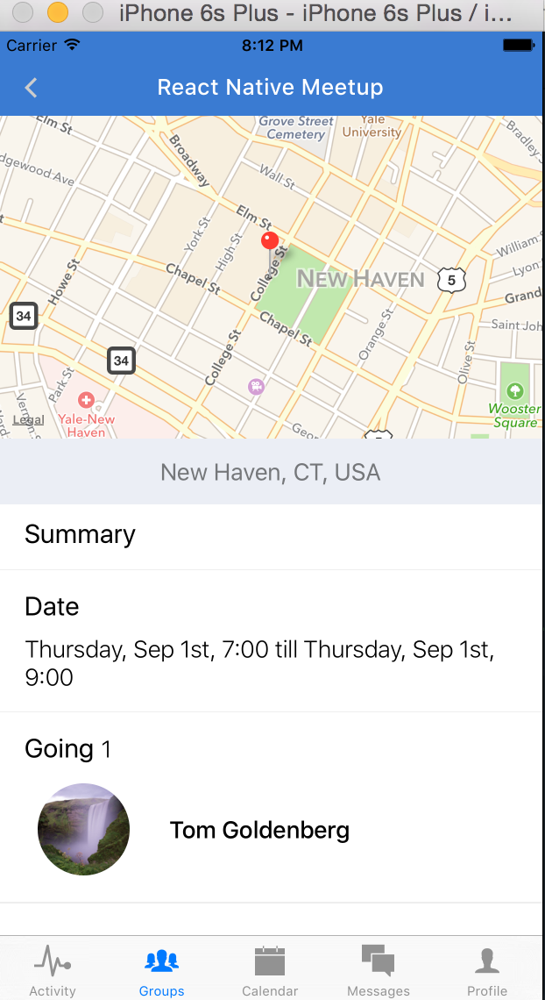

# Chapter 10: Swipe Left, Swipe Right


Now when a user completes the new event form and submits, they should be directed back to the `Group` page. From here, we will want to fetch the events related to that group on `componentDidMount` and then render them in the `events` section. Let's modify `Group.js`.

```javascript
application/components/groups/Group.js

class EventList extends Component{
  render(){
    return (
      <View>
        {this.props.events.map((event, idx) => (
          <Text key={idx}>{event.name}</Text>
        ))}
      </View>
    )
  }
};

...

class Group extends Component{
  constructor(){
    super();
    this.goBack = this.goBack.bind(this);
    this.visitProfile = this.visitProfile.bind(this);
    this.visitCreateEvent = this.visitCreateEvent.bind(this);
    this.openActionSheet = this.openActionSheet.bind(this);
    this.state = {
      events    : [],
      ready     : false,
      users     : [],
    }
  }
  componentDidMount(){
    this._loadEvents();
  }
  _loadEvents(){
    let query = {
      groupId: this.props.group.id,
      end: { $gt: new Date().valueOf() },
      $limit: 10,
      $sort: { start: -1 }
    };
    fetch(`${API}/events?${JSON.stringify(query)}`)
    .then(response => response.json())
    .then(events => this._loadUsers(events))
    .catch(err => {})
    .done();
  }
...
    <Text style={styles.h2}>Events</Text>
    <EventList 
      {...this.props}
      {...this.state}
    />
...
```

We should now see the names of the events that were created in a simple `<Text/>` component.


Let's spruce up our `EventList` component a bit.

```javascript
application/components/groups/Group.js
class EventList extends Component{
  constructor(){
    super();
    this._renderRow = this._renderRow.bind(this);
  }
  _renderRow(event, sectionID, rowID){
    let { currentUser, events, group } = this.props;
    let isGoing = find(event.going, (id) => isEqual(id, currentUser.id));
    return (
      <View style={styles.eventContainer}>
        <TouchableOpacity style={globals.flex} onPress={() => this.props.visitEvent(event)}>
          <Text style={globals.h5}>{event.name}</Text>
          <Text style={styles.h4}>{moment(event.start).format('dddd, MMM Do')}</Text>
          <Text style={styles.h4}>{event.going.length} Going</Text>
        </TouchableOpacity>
        <View style={[globals.flexRow, globals.pa1]}>
          <Text style={[globals.primaryText, styles.h4, globals.ph1]}>
            {isGoing ? "You're Going" : "Want to go?"}
          </Text>
          <Icon name={ isGoing ? "ios-checkmark" : "ios-add" } size={30} color={Colors.brandPrimary} />
        </View>
      </View>
    )
  }
  dataSource(){
    return (
      new ListView.DataSource({ rowHasChanged }).cloneWithRows(this.props.events)
    );
  }
  render(){
    if (! this.props.events.length ){ return <Text style={[globals.h5, globals.mh2]}>No events scheduled</Text>}
    return (
      <ListView
        enableEmptySections={true}
        dataSource={this.dataSource()}
        renderRow={this._renderRow}
        scrollEnabled={false}
        style={globals.flex}
      />
    )
  }
};
...
```

Let's review:
- We are using the `ListView` component to render our events. We initialize a `dataSource` with the events that are passed as props. We then check to see if the user is already attending the event, and if so, we show a success message. If not, we show a "want to join?" message. 

Now is a good time for a commit.

[Commit 21](https://github.com/buildreactnative/assemblies-tutorial/tree/f84c739f60c28a5d4355a4e7193755da1354af23) - "Render created events on Group screen"


## Joining an event

Once we have created an event, we want our users to be able to RSVP for them, or cancel their reservation. Now is a good opportunity to use a swipe-to-join functionality. When our user swipes left on the event, we want to show them the option to either join or leave the event. We can use the package `react-native-swipeout` for this. Add this line to your `package.json` file and then `npm install`.

```
    "react-native-swipeout": "dancormier/react-native-swipeout#829b7c01ba969cd70509944bc210289b759d48a6",
```

```javascript
application/components/groups/Group.js
...
import Swipeout from 'react-native-swipeout';
...
class EventList extends Component{
  constructor(){
    super();
    this._renderRow = this._renderRow.bind(this);
  }
  getButtons(isGoing, event, currentUser){
    if (isGoing){
      return [{
        text: 'Cancel',
        type: 'delete',
        onPress: () => { this.props.cancelRSVP(event, currentUser) }
      }];
    } else {
      return [{
        text: 'RSVP',
        type: 'primary',
        onPress: () => { this.props.joinEvent(event, currentUser) }
      }];
    }
  }
  _renderRow(event, sectionID, rowID){
    let { currentUser, events, group } = this.props;
    let isGoing = find(event.going, (id) => isEqual(id, currentUser.id));
    let right = this.getButtons(isGoing, event, currentUser);
    return (
      <Swipeout backgroundColor='white' rowID={rowID} right={right}>
        <View style={styles.eventContainer}>
          <TouchableOpacity style={globals.flex} onPress={() => this.props.visitEvent(event)}>
            <Text style={globals.h5}>{event.name}</Text>
            <Text style={styles.h4}>{moment(event.start).format('dddd, MMM Do')}</Text>
            <Text style={styles.h4}>{event.going.length} Going</Text>
          </TouchableOpacity>
          <View style={[globals.flexRow, globals.pa1]}>
            <Text style={[globals.primaryText, styles.h4, globals.ph1]}>
              {isGoing ? "You're Going" : "Want to go?"}
            </Text>
            <Icon name={ isGoing ? "ios-checkmark" : "ios-add" } size={30} color={Colors.brandPrimary} />
          </View>
        </View>
      </Swipeout>
    )
  }
...

```

Now we should be able to reveal either a "cancel" or "join" button when you swipe left on each event row.


In the `Swipeout` component we are referencing three actions, `this.props.cancelRSVP`, `this.props.visitEvent` and `this.props.joinEvent`. We should now define them in our `Group` component.

Here are the methods we need to add to `Group`:

```javascript
joinEvent(event, currentUser){
  let { events } = this.state;
  let updatedEvent = {
    ...event,
    going: [ ...event.going, currentUser.id ]
  };
  let index = findIndex(this.state.events, ({ id }) => isEqual(id, event.id));
  let updatedEvents = [
    ...this.state.events.slice(0, index),
    updatedEvent,
    ...this.state.events.slice(index + 1)
  ];
  this.setState({ events: updatedEvents })
  this.updateEventGoing(event);
}
cancelRSVP(event, currentUser){
  let updatedEvent = {
    ...event,
    going: event.going.filter((userId) => ! isEqual(userId, currentUser.id))
  };
  let index = findIndex(this.state.events, ({ id }) => isEqual(id, event.id));
  let updatedEvents = [
    ...this.state.events.slice(0, index),
    updatedEvent,
    ...this.state.events.slice(index + 1)
  ];
  this.setState({ events: updatedEvents })
  this.updateEventGoing(event);
}
visitEvent(event){
  this.props.navigator.push({
    name: 'Event',
    group: this.props.group,
    updateEvents: this.updateEvents,
    event,
  })
}
updateEvents(event){
  let idx = findIndex(this.state.events, ({ id }) => isEqual(id, event.id));
  let events = [
    ...this.state.events.slice(0, idx),
    event,
    ...this.state.events.slice(idx + 1)
  ];
  this.setState({ events })
}
updateEventGoing(event){
  fetch(`${API}/events/${event.id}`, {
    method: 'PUT',
    headers: Headers,
    body: JSON.stringify({
      going: event.going
    })
  })
  .then(response => response.json())
  .then(data => {})
  .catch(err => {})
  .done();
}
```
And then we add the methods in our `render` method:

```javascript
<EventList
  {...this.state}
  {...this.props}
  visitEvent={this.visitEvent}
  joinEvent={this.joinEvent}
  cancelRSVP={this.cancelRSVP}
/>
```
Let's go over what we just added:
- 


Now that we can join and leave a group, we should enable our user to view an individual event and its relevant information. Let’s create a new route, ‘Event’, and direct to it when the user presses on the event section..

```javascript
application/components/groups/GroupsView.js
...
import Event from './Event';
...
case 'Event':
  return (
    <Event 
      {...this.props}
      {...route}
      navigator={navigator}
    />
  )

application/components/groups/Event.js
import React from 'react';
import {
  View,
  Text,
  StyleSheet
} from 'react-native';

const Event = ({ event }) => (
  <View style={styles.container}>
    <Text>{event.name}</Text>
  </View>
);

let styles = StyleSheet.create({
  container: {
    flex: 1,
    backgroundColor: 'white',
    justifyContent: 'center',
    alignItems: 'center'
  }
});

export default Event;

...
<TouchableOpacity style={styles.eventInfo} onPress={navigator.push({ name: 'Event', event, group })}>
  <Text style={styles.h5}>{event.name}</Text>
  <Text style={styles.h4}>{moment(event.start).format('dddd, MMM Do')}</Text>
  <Text style={styles.h4}>{event.going.length} Going</Text>
</TouchableOpacity>
...
```

Now when you press on an event row, you should be directed to a screen with just the event name:


Now that this route is working, let’s fill in the parts with our `event` data.

```javascript
application/components/groups/Event.js

import moment from 'moment';
import Icon from 'react-native-vector-icons/Ionicons';
import NavigationBar from 'react-native-navbar';
import React, { Component } from 'react';
import { find, uniq } from 'underscore';
import {
  View,
  Text,
  StyleSheet,
  ScrollView,
  Image,
  Dimensions,
  MapView,
  InteractionManager,
  TouchableOpacity
} from 'react-native';

import Colors from '../../styles/colors';
import Globals from '../../styles/globals';
import LeftButton from '../accounts/LeftButton';
import { API, DEV } from '../../config';

const { width: deviceWidth, height: deviceHeight } = Dimensions.get('window');

const EmptyMap = ({ going }) => (
  <View>
    <View style={[Globals.map, {backgroundColor: Colors.inactive}]}/>
    <View style={styles.bottomPanel}>
      <Text style={styles.memberText}>{going.length} going</Text>
    </View>
  </View>
);

const MapFiller = () => (
  <View>
    <View style={[Globals.map, {backgroundColor: Colors.inactive}]}/>
    <View style={styles.bottomPanel}>
      <Text style={styles.memberText}/>
    </View>
  </View>
)

const Join = () => (
  <Icon name='ios-add' size={30} color='white' style={styles.joinIcon} />
)

const Joined = () => (
  <View style={styles.joinedContainer}>
    <Icon name="ios-checkmark" size={30} color='white' style={styles.joinIcon}/>
  </View>
);

const EventMap = ({ location, going, ready }) => {
  if (Object.keys(location).length === 0) { return <EmptyMap going={going}/>}
  if (! ready ){ return <MapFiller />}
  const mapRegion = {
      latitude        : location.lat,
      longitude       : location.lng,
      latitudeDelta   : 0.01,
      longitudeDelta  : 0.01
    }
  return (
    <View style={{backgroundColor: Colors.inactive}}>
      <MapView
        style={Globals.map}
        region={mapRegion}
        annotations={[{latitude: mapRegion.latitude, longitude: mapRegion.longitude}]}
      />
      <View style={styles.bottomPanel}>
        <Text style={styles.memberText}>{location.formattedAddress}</Text>
      </View>
    </View>
  )
}

const JoinControls = ({ hasJoined, joinEvent }) => (
  <View style={styles.joinContainer}>
    <TouchableOpacity
      onPress={() => { if (!hasJoined) joinEvent() }}
      style={styles.joinButton}>
      <Text style={styles.joinText}>{ hasJoined ? 'Joined' : 'Join'}</Text>
      { hasJoined ? <Joined /> : <Join /> }
    </TouchableOpacity>
  </View>
)
class Event extends Component{
  constructor(){
    super();
    this.joinEvent = this.joinEvent.bind(this);
    this.state = {
      ready         : false,
      eventMembers  : []
    }
  }
  componentDidMount(){
    let { event } = this.props;
    InteractionManager.runAfterInteractions(() => {
      this.setState({ ready: true })
    });
    let query = { id: { $in: event.going }}
    fetch(`${API}/users?${JSON.stringify(query)}`)
    .then(response => response.json())
    .then(eventMembers => this.setState({ eventMembers }))
    .catch(err => console.log('FETCH USERS ERROR: ', err))
    .done();
  }
  joinEvent(){
    let { eventMembers } = this.state;
    let { event, currentUser } = this.props;
    event.going = event.going.concat(currentUser.id);
    let users = eventMembers.concat(currentUser);
    this.setState({ eventMembers: users });
    fetch(`${API}/events/${event.id}`, {
      method: 'PUT',
      headers: { 'Content-Type': 'application/json' },
      body: JSON.stringify({going: event.going})
    })
    .then(response => response.json())
    .then(data => {})
    .catch(err => console.log('UPDATE EVENT ERROR: ', err))
    .done();
  }
  render(){
    let { ready, eventMembers } = this.state;
    let { event, group, currentUser, navigator } = this.props;
    let hasJoined = event.going.indexOf(currentUser.id) !== -1;
    let justJoined = this.state.eventMembers.map(m => m.id).indexOf(currentUser.id) !== -1;
    let hasDescription = event.description && event.description !== '';
    return (
      <View style={styles.container}>
        <NavigationBar
          title={{title: event.name, tintColor: 'white'}}
          tintColor={Colors.brandPrimary}
          leftButton={<LeftButton handlePress={() => navigator.pop()}/>}
        />
        <ScrollView style={styles.scrollView}>
          <EventMap location={event.location} going={event.going} ready={ready}/>
          <View style={styles.infoContainer}>
            <Text style={styles.h2}>Summary</Text>
            { hasDescription ? <Text style={[styles.h4, {paddingHorizontal: 20,}]}>{event.description}</Text> : null }
          </View>
          <View style={styles.break} />
          <View style={styles.infoContainer}>
            <Text style={styles.h2}>Date</Text>
            <Text style={styles.h4}>
              {moment(event.start).format('dddd, MMM Do, h:mm')} till {moment(event.end).format('dddd, MMM Do, h:mm')}
            </Text>
          </View>
          <View style={styles.break} />
          { event.going.indexOf(currentUser.id) === -1 ? <JoinControls hasJoined={justJoined} joinEvent={this.joinEvent} /> : null}
          <View style={styles.infoContainer}>
            <Text style={styles.h2}>Going <Text style={styles.h4}>{event.going.length}</Text></Text>
              {eventMembers.map((member, idx) => (
                <TouchableOpacity key={idx} style={styles.memberContainer}>
                  <Image source={{uri: member.avatar}} style={styles.avatar}/>
                  <View style={styles.memberInfo}>
                    <Text style={styles.h5}>{member.firstName} {member.lastName}</Text>
                  </View>
                </TouchableOpacity>
              ))}
            </View>
          <View style={styles.break} />
        </ScrollView>
      </View>
    )
  }
}

let styles = StyleSheet.create({
  backButton: {
    paddingLeft: 20,
    paddingBottom: 10,
    backgroundColor: 'transparent',
  },
  infoContainer: {
    marginHorizontal: 10,
    paddingVertical: 5,
  },
  submitButtonText: {
    color: 'white',
    textAlign: 'center',
    fontSize: 16,
    fontWeight: '300'
  },
  addButton: {
    backgroundColor: 'transparent',
    paddingRight: 20,
    paddingBottom: 10,
  },
  container: {
    flex: 1,
    backgroundColor: 'white',
  },
  inputBox: {
    height: 60,
    backgroundColor: '#f2f2f2',
    flexDirection: 'row',
  },
  input: {
    height: 40,
    padding: 8,
    flex: 1,
    fontSize: 16,
    margin: 10,
    marginRight: 5,
    borderColor: '#b4b4b4',
    borderRadius: 8,
    color: Colors.bodyText,
    backgroundColor: 'white',
  },
  buttonActive: {
    flex: 0.4,
    backgroundColor: Colors.brandPrimary,
    borderRadius: 6,
    justifyContent: 'center',
    margin: 10,
  },
  buttonInactive: {
    flex: 0.4,
    backgroundColor: "#eeeeee",
    borderWidth: 1,
    borderColor: '#ffffff',
    borderRadius: 6,
    justifyContent: 'center',
    margin: 10,
  },
  buttonText: {
    textAlign: 'center',
    color: 'white',
    fontSize: 16,
  },
  centering: {
    alignItems: 'center',
    justifyContent: 'center',
    height: deviceHeight,
  },
  sentText:{
    fontSize: 14,
    padding: 10,
    marginRight: 15,
    fontWeight: '300',
  },
  scrollView: {
    flex: 1,
  },
  commentTitleContainer: {
    flexDirection: 'row',
    justifyContent: 'space-between',
    alignItems: 'center',
    paddingRight: 20,
  },
  topImage: {
    width: deviceWidth,
    height: 200,
    flexDirection: 'column',
  },
  overlayBlur: {
    backgroundColor: '#333',
    opacity: 0.5,
    justifyContent: 'center',
    alignItems: 'center',
    flex: 1,
  },
  h1: {
    fontSize: 22,
    color: 'white',
    fontWeight: '500',
    textAlign: 'center',
  },
  bottomPanel: {
    flex: 0.3,
    backgroundColor: Colors.inactive,
    opacity: 0.5,
    height: 50,
    justifyContent: 'center',
    paddingVertical: 12,
    alignItems: 'center',
  },
  memberText: {
    textAlign: 'center',
    color: Colors.bodyText,
    fontSize: 18,
    fontWeight: '400',
  },
  h4: {
    fontSize: 18,
    fontWeight: '300',
    paddingHorizontal: 10,
    paddingVertical: 5,
  },
  h3: {
    fontSize: 18,
    color: Colors.brandPrimary,
    paddingHorizontal: 18,
    paddingVertical: 5,
    fontWeight: '500',
  },
  break: {
    height: 1,
    borderBottomWidth: 1,
    borderBottomColor: '#eee',
    marginVertical: 5,
  },
  h2: {
    fontSize: 20,
    fontWeight: '400',
    paddingHorizontal: 10,
    paddingVertical: 5,
  },
  eventContainer: {
    flexDirection: 'row',
    justifyContent: 'space-between',
    alignItems: 'center',
    paddingHorizontal: 20,
    paddingVertical: 10,
  },
  joinContainer: {
    flex: 1,
    paddingHorizontal: 20,
    marginVertical: 10,
  },
  joinButton: {
    flex: 1,
    flexDirection: 'row',
    justifyContent: 'center',
    alignItems: 'center',
    borderRadius: 4,
    backgroundColor: Colors.brandPrimary,
  },
  joinText: {
    fontSize: 22,
    color: 'white',
    fontWeight: 'bold',
    paddingHorizontal: 10,
    paddingVertical: 10,
    textAlign: 'center',
  },
  joinIcon: {
    paddingVertical: 10,
  },
  eventInfo: {
    flex: 1,
  },
  h5: {
    fontSize: 18,
    fontWeight: '500',
  },
  goingContainer: {
    backgroundColor: 'white',
    marginHorizontal: 10,
    overflow: 'hidden',
    marginBottom: 50,
    paddingHorizontal: 10,
  },
  goingText: {
    fontSize: 17,
    color: Colors.brandPrimary
  },
  memberContainer: {
    flexDirection: 'row',
    justifyContent: 'flex-start',
    paddingHorizontal: 20,
    paddingVertical: 10,
    alignItems: 'center',
  },
  avatar: {
    height: 70,
    width: 70,
    borderRadius: 35,
  },
  memberInfo: {
    paddingLeft: 30,
  },
});


export default Event;


```


## Wrapping Up

There are a lot of enhancements we can make, but we essentially have created the ability for our users to create, manage, and join groups, as well as to create and join events nearby. Here are some ideas for further enhancements / features:

-	More control over managing user roles within a group (ability to nominate another user as an ‘admin’, adding the ability to delete a group, etc.)
-	Ability to write comments in an event
-	Ability to contact group members and write private messages to them

These are all things that are possible, and indeed, are built into the final version of Assemblies! But for now, we’ll be moving on to building out our Calendar and Activity Views. 

Congrats on building out a pretty complex user interface! We have considered a lot of user interactions and data changes, so great job on completing this part!


