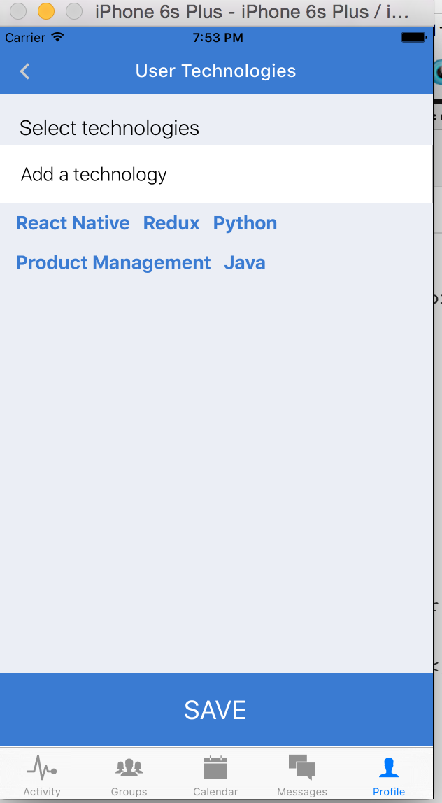
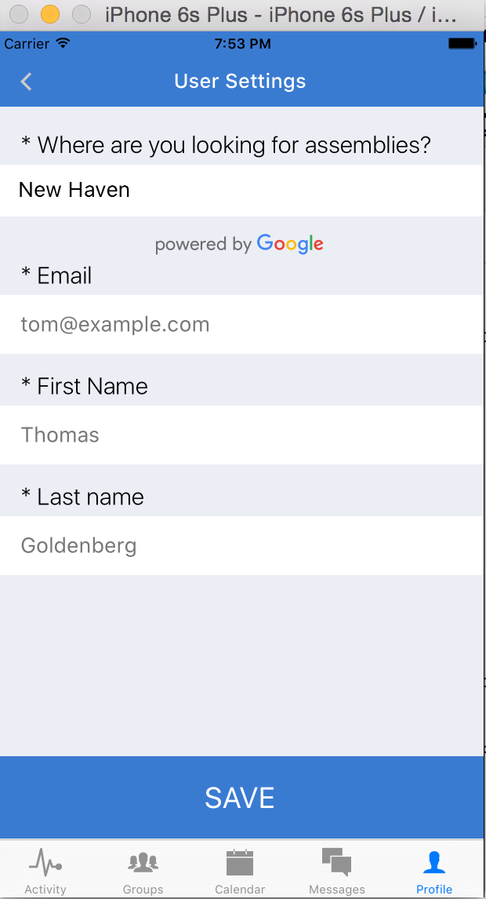

# Chapter 12: Creating a Calendar View

Now that we've successfully added notifications and sculpted our `ActivityView`, there's pretty much one view left to really build out, which is our `CalendarView`. We want to show a list of upcoming events, both those that our user is attending and those that they are not, in chronological order. We also want to have "sticky" headers for each day that we show  events. Let's see what we can do.

First let's set up the routing for our Calendar view.

```javascript
import React, { Component } from 'react';
import { Navigator } from 'react-native';

import Calendar from './Calendar';
import Event from '../groups/Event';
import { API, DEV } from '../../config';
import { extend } from 'underscore';
import { globals } from '../../styles';

class CalendarView extends Component{
  constructor(){
    super();
    this.state = {
      events  : [],
      ready   : false,
    }
  }
  _loadGroups(){
    let query = {
      members: {
        $elemMatch: {
          userId: this.props.currentUser.id
        }
      }
    };
    fetch(`${API}/groups?${JSON.stringify(query)}`)
    .then(response => response.json())
    .then(groups => this._loadEvents(groups))
    .catch(err => this.ready(err))
    .done()
  }
  ready(err){
    this.setState({ ready: true });
  }
  _loadEvents(groups){
    let dateQuery = { end: { $gt: new Date().valueOf() }};
    let query = {
      $or: [
        extend(dateQuery, { groupId: { $in: groups.map((g) => g.id) }}),
        extend(dateQuery, { going:  { $elemMatch: { $eq: this.props.currentUser.id }}}),
        extend(dateQuery, { 'location.city.long_name': this.props.currentUser.location.city.long_name })
      ],
      $limit: 20,
    };
    fetch(`${API}/events?${JSON.stringify(query)}`)
    .then(response => response.json())
    .then(events => this.setState({ events, ready: true }))
    .catch(err => this.ready(err))
    .done();
  }
  componentDidMount(){
    this._loadGroups();
  }
  render(){
    return (
      <Navigator
        initialRoute={{ name: 'Calendar' }}
        style={globals.flex}
        renderScene={(route, navigator) => {
          switch(route.name){
            case 'Calendar':
              return (
                <Calendar
                  {...this.props}
                  {...route}
                  {...this.state}
                  navigator={navigator}
                />
            );
            case 'Event':
              return (
                <Event
                  {...this.props}
                  {...route}
                  {...this.state}
                  navigator={navigator}
                />
            );
          }
        }}
      />
    )
  }
};

export default CalendarView;

```

Then let's flesh out `Calendar.js`.


```javascript
import moment from 'moment';
import Icon from 'react-native-vector-icons/Ionicons';
import NavigationBar from 'react-native-navbar';
import React, { Component } from 'react';
import { View, Text, ListView, TouchableOpacity } from 'react-native';
import { uniq, flatten, find } from 'underscore';
import { getSectionData, getRowData, sectionHeaderHasChanged, rowHasChanged } from '../../utilities';
import Loading from '../shared/Loading';
import { globals, calendarStyles } from '../../styles';

const styles = calendarStyles;

const EmptyList = ({ ready }) => {
  if (! ready ) { return <Loading /> }
  return (
    <View style={[globals.textContainer, globals.ph1]}>
      <Text style={styles.h2}>
        No events scheduled. Explore groups in the groups tab or create your own to start an event.
      </Text>
    </View>
  );
};

class EventList extends Component{
  constructor(props){
    super(props);
    this.renderRow = this.renderRow.bind(this);
    this.renderSectionHeader = this.renderSectionHeader.bind(this);
    this.visitEvent = this.visitEvent.bind(this);
    this.state = {
      dataSource: this._loadData(props.events)
    };
  }
  _loadData(events){
    let dataBlob = {};
    let dates = uniq(events.map(evt => new Date(evt.start).toLocaleDateString())); /* Get all unique dates */
    let sections = dates.map((date, id) => ({
      date    : new Date(date),
      events  : events.filter(event => new Date(event.start).toLocaleDateString() === date),
      id      : id,
    }));
    let sectionIDs = sections.map((section, id) => id);
    let rowIDs = sectionIDs.map(sectionID => sections[sectionID].events.map((e, id) => id));

    sections.forEach(section => {
      dataBlob[section.id] = section.date;
      section.events.forEach((event, rowID) => {
        dataBlob[`${section.id}:${rowID}`] = event;
      });
    });

    return new ListView.DataSource({
      getSectionData: getSectionData,
      getRowData: getRowData,
      rowHasChanged: rowHasChanged,
      sectionHeaderHasChanged: sectionHeaderHasChanged
    })
    .cloneWithRowsAndSections(dataBlob, sectionIDs, rowIDs);
  }
  visitEvent(event){
    this.props.navigator.push({
      name: 'Event',
      event
    })
  }
  renderRow(event, sectionID, rowID){
    let isGoing = find(event.going, (id) => id === this.props.currentUser.id) != 'undefined';
    return (
      <TouchableOpacity style={styles.row} onPress={() => this.visitEvent(event)}>
        <View style={globals.flex}>
          <View style={styles.textContainer}>
            <Text style={styles.h4}>{event.name}</Text>
            <Text style={styles.h5}> {event.going.length} going</Text>
            { isGoing && <Text style={[globals.primaryText, styles.h5]}><Icon name="ios-checkmark" color={Colors.brandSuccess}/> Yes</Text> }
          </View>
        </View>
        <View style={styles.textContainer}>
          <Text style={[styles.dateText, globals.mh1]}>{moment(event.start).format('h:mm a')}</Text>
          <Icon style={styles.arrow} name="ios-arrow-forward" size={25} color={Colors.bodyTextLight}/>
        </View>
      </TouchableOpacity>
    )
  }
  renderSectionHeader(sectionData, sectionID){
    return (
      <View style={styles.sectionHeader}>
        <Text style={styles.sectionHeaderText}>{moment(sectionData).format('dddd MMM Do')}</Text>
      </View>
    )
  }
  render(){
    return (
      <ListView
        enableEmptySectionHeaders={true}
        style={globals.flex}
        contentInset={{ bottom: 49 }}
        automaticallyAdjustContentInsets={false}
        dataSource={this.state.dataSource}
        renderRow={this.renderRow}
        renderSectionHeader={this.renderSectionHeader}
      />
    )
  }
}

class Calendar extends Component{
  render(){
    let { events, ready } = this.props;
    return (
      <View style={globals.flexContainer}>
        <NavigationBar
          tintColor={Colors.brandPrimary}
          title={{ title: 'Calendar ', tintColor: 'white' }}
        />
        { events && events.length ? <EventList {...this.props}/> : <EmptyList ready={ready} /> }
      </View>
    )
  }
};

export default Calendar;

```

Let’s go over a few things. Notice how in order to get proper section headers, we had to modify our `events` data. First we create an array of unique dates, which become our sections, and then for each of these sections, we create a rowID for each event that takes place on that date. We then use the `ListView` component to render them. As we are using sections, we define our event rows and section headers through the `renderRow` and `renderSectionHeaders` properties of the `ListView`.


## 11.2 Fixing the Profile View

Now that we have a functional `CalendarView`, we can focus our attention on some of the other areas of the app. What about our `ProfileView`? We are currently rendering the user information, but don’t have a way for the user to edit that information. This is a good opportunity to re-use some of the interface from the `Register` and `RegisterConfirm` components. We should also start to think about how the user experience will be on a mobile device. We can use the `react-native-keyboard-aware-scroll-view` package to make sure that the focused input is above the device’s keyboard. You can always check this with the `cmd + sft + k` command, which will toggle the native keyboard view on the iOS simulator.

Let’s go to parts of our app that didn’t consider this before and add the component `KeyboardAwareScrollView` in place of our regular `ScrollView`. 

Then our `Register.js` file will look like this:

```javascript
…
import { KeyboardAwareScrollView } from 'react-native-keyboard-aware-scroll-view';
…
return (
  <View style={styles.container}>
    <NavigationBar
      title={titleConfig}
      tintColor={Colors.brandPrimary}
      leftButton={<LeftButton handlePress={() => navigator.pop()}/>}
    />
    <KeyboardAwareScrollView style={styles.formContainer}>
      <TouchableOpacity onPress={()=> navigator.push({ name: 'Login' })}>
```

We can also add this to `CreateEvent.js`, `CreateGroup.js`, and `CreateEventConfirm.js`.

## 11.3 Adding to the Profile View

Now that we’ve addressed some user experience issues in our app, what about the Profile View? So far, the only action a user can take is `logout`. Let’s add the ability to change your avatar, technologies, and basic information. First let’s change our `ProfileView.js` component to be a navigation component with three routes:

```javascript
import React, { Component } from 'react';
import {
  Navigator,
  StyleSheet
} from 'react-native';
import UserProfile from './UserProfile';
import UserSettings from './UserSettings';
import UserTechnologies from './UserTechnologies';

export default class ProfileView extends Component{
  render(){
    return (
      <Navigator
        initialRoute={{ name: 'UserProfile' }}
        style={styles.container}
        renderScene={(route, navigator) => {
          switch(route.name){
            case 'UserProfile':
              return (
                <UserProfile
                  {...this.props}
                  {...route}
                  navigator={navigator}
                />
            );
            case 'UserSettings':
              return (
                <UserSettings
                  {...this.props}
                  {...route}
                  navigator={navigator}
                />
            );
            case 'UserTechnologies':
              return (
                <UserTechnologies
                  {...this.props}
                  {...route}
                  navigator={navigator}
                />
            );
          }
        }}
      />
    )
  }
}

let styles = StyleSheet.create({
  container: {
    flex: 1,
  }
});


```

Now we also have to define `UserTechnologies` and `UserSettings`, as well as link to them from the initial `UserProfile` route. Let’s create the links first:
```javascript
…
<TouchableOpacity
  style={styles.formField}
  onPress={() => navigator.push({ name: 'UserTechnologies', currentUser})}>
  <Text style={styles.formName}>My Technologies</Text>
  <View>
    <Icon name='ios-arrow-forward' size={30} color='#ccc' />
  </View>
</TouchableOpacity>
<TouchableOpacity
  style={styles.formField}
  onPress={() => navigator.push({ name: 'UserSettings', currentUser })}
  >
  <Text style={styles.formName}>Settings</Text>
  <View>
    <Icon name='ios-arrow-forward' size={30} color='#ccc' />
  </View>
</TouchableOpacity>
…
```

Then let’s create the `UserSettings` and `UserTechnologies` components, re-using parts of our `Register.js` component.


```javascript
application/components/profile/UserSettings.js

import _ from 'underscore';
import Config from 'react-native-config';
import Icon from 'react-native-vector-icons/Ionicons';
import NavigationBar from 'react-native-navbar';
import React, { Component } from 'react';
import {
  Text,
  View,
  ScrollView,
  TextInput,
  StyleSheet,
  TouchableOpacity,
  Dimensions
} from 'react-native';
import {GooglePlacesAutocomplete} from 'react-native-google-places-autocomplete';
import { KeyboardAwareScrollView } from 'react-native-keyboard-aware-scroll-view';
import { autocompleteStyles } from '../accounts/Register';

import Colors from '../../styles/colors';
import Globals from '../../styles/globals';
import LeftButton from '../accounts/LeftButton';
import {DEV, API} from '../../config';

const { width: deviceWidth, height: deviceHeight } = Dimensions.get('window');

class UserSettings extends Component{
  constructor(props){
    super(props);
    this.saveSettings = this.saveSettings.bind(this);
    this.state = {
      location: props.currentUser.location,
      firstName: props.currentUser.firstName,
      lastName: props.currentUser.lastName,
      email: props.currentUser.username,
      errorMsg: '',
    }
  }
  saveSettings(){
    let { location, firstName, lastName, email } = this.state;
    if (typeof location !== 'object' || ! location.city ) {
      this.setState({ errorMsg: 'Must provide valid location.'}); return;
    } else if (firstName === ''){
      this.setState({ errorMsg: 'Must provide a valid first name.'}); return;
    } else if (lastName === '') {
      this.setState({ errorMsg: 'Must provide a valid last name.'}); return;
    } else if (email === ''){
      this.setState({ errorMsg: 'Must provide a valid email address.'}); return;
    }
    fetch(`${API}/users/${this.props.currentUser.id}`, {
      method: 'PUT',
      headers: { 'Content-Type': 'application/json' },
      body: JSON.stringify({ location, firstName, lastName, email })
    })
    .then(response => response.json())
    .then(data => {
      this.props.updateUser(data);
      this.props.navigator.pop();
    })
    .catch(err => console.log('ERR:', err))
    .done();
  }
  render(){
    let { navigator } = this.props;
    let titleConfig = { title: 'User Settings', tintColor: 'white' };
    return (
      <View style={styles.container}>
        <NavigationBar
          title={titleConfig}
          tintColor={Colors.brandPrimary}
          leftButton={<LeftButton handlePress={() => navigator.pop()}/>}
        />
        <KeyboardAwareScrollView style={styles.formContainer}>
          <Text style={styles.h4}>{"* Where are you looking for assemblies?"}</Text>
          <View ref="location" style={{flex: 1,}}>
            <GooglePlacesAutocomplete
              styles={autocompleteStyles}
              placeholder='Your city'
              minLength={2}
              autoFocus={false}
              fetchDetails={true}
              onPress={(data, details = null) => { // 'details' is provided when fetchDetails = true
                if (DEV) {console.log(data);}
                if (DEV) {console.log(details);}
                this.setState({
                  location: _.extend({}, details.geometry.location, {
                    city: _.find(details.address_components, (c) => c.types[0] == 'locality'),
                    state: _.find(details.address_components, (c) => c.types[0] == 'administrative_area_level_1'),
                    county: _.find(details.address_components, (c) => c.types[0] == 'administrative_area_level_2'),
                    formattedAddress: details.formatted_address,
                  })
                });
              }}
              getDefaultValue={() => {return this.state.location.city.long_name;}}
              query={{
                key       :  Config.GOOGLE_PLACES_API_KEY,
                language  : 'en', // language of the results
                types     : '(cities)', // default: 'geocode'
              }}
              currentLocation={false}
              currentLocationLabel="Current location"
              nearbyPlacesAPI='GooglePlacesSearch'
              GoogleReverseGeocodingQuery={{}}
              GooglePlacesSearchQuery={{rankby: 'distance',}}
              filterReverseGeocodingByTypes={['street_address']} // filter the reverse geocoding results by types - ['locality', 'administrative_area_level_3'] if you want to display only cities
              predefinedPlaces={[]}>
            </GooglePlacesAutocomplete>
          </View>

          <Text style={styles.h4}>* Email</Text>

          <View ref="email" style={styles.formField}>
            <TextInput
              ref="emailField"
              returnKeyType="next"
              onChangeText={(text) => this.setState({email: text})}
              keyboardType="email-address"
              autoCapitalize="none"
              maxLength={144}
              value={this.state.email}
              placeholderTextColor='#bbb'
              style={styles.input}
              placeholder="Your email address"
            />
          </View>
          <Text style={styles.h4}>* First Name</Text>
          <View style={styles.formField} ref="firstName">
            <TextInput
              ref="firstNameField"
              returnKeyType="next"
              maxLength={20}
              value={this.state.firstName}
              onChangeText={(text) => this.setState({ firstName: text})}
              placeholderTextColor='#bbb'
              style={styles.input}
              placeholder="Your first name"
            />
          </View>
          <Text style={styles.h4}>* Last name</Text>
          <View style={styles.formField} ref="lastName">
            <TextInput
              returnKeyType="next"
              maxLength={20}
              ref="lastNameField"
              onChangeText={(text) => this.setState({lastName: text})}
              placeholderTextColor='#bbb'
              value={this.state.lastName}
              style={styles.input}
              placeholder="Your last name"
            />
         </View>
        </KeyboardAwareScrollView>
        <TouchableOpacity style={[Globals.submitButton, {marginBottom: 50}]} onPress={this.saveSettings}>
          <Text style={Globals.submitButtonText}>SAVE</Text>
        </TouchableOpacity>
      </View>
    )
  }
}


let styles = StyleSheet.create({
  container: {
    flex: 1,
  },
  backButton: {
    paddingLeft: 20,
    backgroundColor: 'transparent',
    paddingBottom: 10,
  },
  technologyList:{
    textAlign: 'left',
    fontSize: 16,
    fontWeight: 'bold',
    color: Colors.brandPrimary,
    paddingHorizontal: 20,
    marginLeft: 8,
    paddingVertical: 4,
  },
  formContainer: {
    backgroundColor: Colors.inactive,
    flex: 1,
    paddingTop: 15,
  },
  contentContainerStyle: {
    flex: 1,
  },
  h4: {
    fontSize: 20,
    fontWeight: '300',
    color: 'black',
    paddingHorizontal: 20,
    paddingVertical: 5,
  },
  h5: {
    fontSize: 16,
    paddingHorizontal: 20,
    paddingVertical: 5,
    textAlign: 'center',
  },
  formField: {
    backgroundColor: 'white',
    height: 50,
    paddingTop: 5,
    marginBottom: 10,
  },
  largeFormField: {
    backgroundColor: 'white',
    height: 100,
  },
  addPhotoContainer: {
    backgroundColor: 'white',
    marginVertical: 15,
      marginHorizontal: (deviceWidth - 200) / 2,
    width: 200,
    borderRadius: 30,
    paddingVertical: 15,
    paddingHorizontal: 10,
    flexDirection: 'row',
    justifyContent: 'center',
    alignItems: 'center',
  },
  photoText: {
    fontSize: 18,
    paddingHorizontal: 10,
    color: Colors.brandPrimary
  },
  input: {
    color: '#777',
    fontSize: 18,
    fontWeight: '300',
    height: 40,
    paddingHorizontal: 20,
    paddingVertical: 5,
  },
  pb: {
    paddingBottom: 10,
  },
  largeInput: {
    color: '#ccc',
    fontSize: 18,
    backgroundColor: 'white',
    fontWeight: '300',
    height: 100,
    paddingHorizontal: 20,
    paddingVertical: 5,
  },
});

export default UserSettings;


```

And we can do the same with `UserTechnologies.js`: 

```javascript
application/components/profile/UserTechnologies.js

import _ from 'underscore';
import Config from 'react-native-config';
import Icon from 'react-native-vector-icons/Ionicons';
import NavigationBar from 'react-native-navbar';
import Dropdown, {
  Select,
  Option,
  OptionList
} from 'react-native-selectme';
import React, { Component } from 'react';
import {
  Text,
  View,
  ScrollView,
  TextInput,
  StyleSheet,
  TouchableOpacity,
  Dimensions
} from 'react-native';
import { KeyboardAwareScrollView } from 'react-native-keyboard-aware-scroll-view';

import Colors from '../../styles/colors';
import Globals from '../../styles/globals';
import LeftButton from '../accounts/LeftButton';
import {DEV, API} from '../../config';
import { Technologies } from '../../fixtures';
import { selectStyles, optionTextStyles, overlayStyles, TechnologyList } from '../accounts/RegisterConfirm';

const { width: deviceWidth, height: deviceHeight } = Dimensions.get('window');

class UserTechnologies extends Component{
  constructor(props){
    super(props);
    this.selectTechnology = this.selectTechnology.bind(this);
    this.removeTechnology = this.removeTechnology.bind(this);
    this.getOptions = this.getOptions.bind(this);
    this.saveSettings = this.saveSettings.bind(this);
    this.state = {
      technologies: props.currentUser.technologies,
      errorMsg: '',
    }
  }
  selectTechnology(technology){
    this.setState({ technologies: this.state.technologies.concat(technology)});
  }
  getOptions(){
    return this.refs.optionList;
  }
  removeTechnology(index){
    let { technologies } = this.state;
    this.setState({ technologies: [
      ...technologies.slice(0, index),
      ...technologies.slice(index + 1)
    ]})
  }
  saveSettings(){
    let { technologies } = this.state;
    fetch(`${API}/users/${this.props.currentUser.id}`, {
      method: 'PUT',
      headers: { 'Content-Type': 'application/json' },
      body: JSON.stringify({ technologies })
    })
    .then(response => response.json())
    .then(data => {
      this.props.updateUser(data);
      this.props.navigator.pop();
    })
    .catch(err => console.log('ERR:', err))
    .done();
  }
  render(){
    let { navigator } = this.props;
    let { technologies } = this.state;
    let titleConfig = { title: 'User Technologies', tintColor: 'white' };
    return (
      <View style={styles.container}>
        <NavigationBar
          title={titleConfig}
          tintColor={Colors.brandPrimary}
          leftButton={<LeftButton handlePress={() => navigator.pop()}/>}
        />
        <KeyboardAwareScrollView style={styles.formContainer}>
          <View style={{ flex: 1 }}>
            <Text style={styles.h4}>{"Select technologies"}</Text>
            <Select
              width={deviceWidth}
              height={55}
              ref="select"
              styleText={optionTextStyles}
              style={selectStyles}
              optionListRef={this.getOptions}
              defaultValue="Add a technology"
              onSelect={this.selectTechnology}>
              {Technologies.map((tech, idx) => (
                <Option styleText={optionTextStyles} key={idx}>
                  {tech}
                </Option>
              ))}
            </Select>
            <OptionList ref="optionList" overlayStyles={overlayStyles}/>
          </View>
          <View>
            { technologies.length ? <TechnologyList technologies={technologies} handlePress={this.removeTechnology}/> : null }
          </View>
        </KeyboardAwareScrollView>
        <TouchableOpacity style={[Globals.submitButton, {marginBottom: 50}]} onPress={this.saveSettings}>
          <Text style={Globals.submitButtonText}>SAVE</Text>
        </TouchableOpacity>
      </View>
    )
  }
}


let styles = StyleSheet.create({
  container: {
    flex: 1,
  },
  backButton: {
    paddingLeft: 20,
    backgroundColor: 'transparent',
    paddingBottom: 10,
  },
  technologyList:{
    textAlign: 'left',
    fontSize: 16,
    fontWeight: 'bold',
    color: Colors.brandPrimary,
    paddingHorizontal: 20,
    marginLeft: 8,
    paddingVertical: 4,
  },
  formContainer: {
    backgroundColor: Colors.inactive,
    flex: 1,
    paddingTop: 15,
  },
  contentContainerStyle: {
    flex: 1,
  },
  h4: {
    fontSize: 20,
    fontWeight: '300',
    color: 'black',
    paddingHorizontal: 20,
    paddingVertical: 5,
  },
  h5: {
    fontSize: 16,
    paddingHorizontal: 20,
    paddingVertical: 5,
    textAlign: 'center',
  },
  formField: {
    backgroundColor: 'white',
    height: 50,
    paddingTop: 5,
    marginBottom: 10,
  },
  largeFormField: {
    backgroundColor: 'white',
    height: 100,
  },
  addPhotoContainer: {
    backgroundColor: 'white',
    marginVertical: 15,
      marginHorizontal: (deviceWidth - 200) / 2,
    width: 200,
    borderRadius: 30,
    paddingVertical: 15,
    paddingHorizontal: 10,
    flexDirection: 'row',
    justifyContent: 'center',
    alignItems: 'center',
  },
  photoText: {
    fontSize: 18,
    paddingHorizontal: 10,
    color: Colors.brandPrimary
  },
  input: {
    color: '#777',
    fontSize: 18,
    fontWeight: '300',
    height: 40,
    paddingHorizontal: 20,
    paddingVertical: 5,
  },
  pb: {
    paddingBottom: 10,
  },
  largeInput: {
    color: '#ccc',
    fontSize: 18,
    backgroundColor: 'white',
    fontWeight: '300',
    height: 100,
    paddingHorizontal: 20,
    paddingVertical: 5,
  },
});

export default UserTechnologies;

```



Notice how we were able to re-use a lot of styles / parts of our previous components. Optimizing this makes development faster and more enjoyable. Always remember the concept of DRY, don't repeat yourself. 


