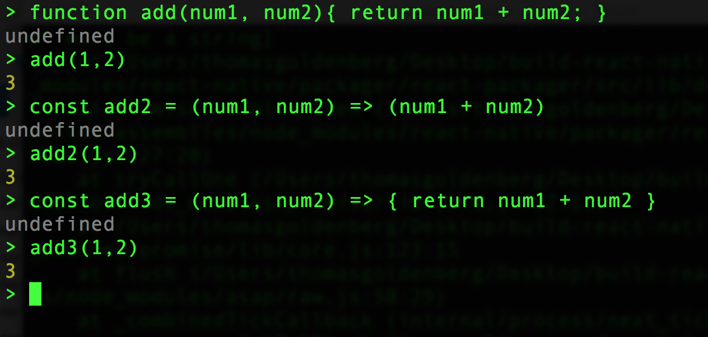
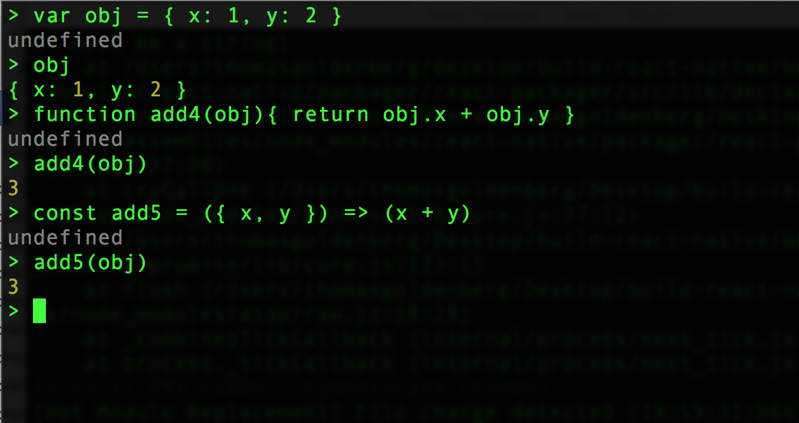

# Chapter 13: Understanding ES6 with React Native


## 13.1 A function by any other name

One of the more confusing things about working with React and React Native is the many different ways syntax is used, depending on the project/tutorial. Take the following examples and try them in your Node terminal. First make sure you are using the latest version of NodeJS (6 or above) by typing `node –v` in the terminal. If your version is lower, update it before continuing.

Once you’ve entered the terminal, try typing the following functions:



All of these are essentially the same function. With the advent of ES6 and compilers like Babel, it is possible to use this new syntax in your React and React Native projects. In fact, the community has embraced the new syntax whole-heartedly, so it is worth getting used to.

#### What is that Fat Arrow?

The fat arrow is used to continue the context of `this`. `this` is a confusing concept in JavaScript, and without the fat arrow, it can change unexpectedly within different functions. By using the fat arrow, we ensure that `this` remains the same. 

#### What `let` and `const`, and not `var`?

There are reasons why `let` is preferred to `var`, though they are not that important. Basically, it is an enhancement of performance through memory allocation. It is better to use `let` for variables that may change, and `const` for variables that are only assigned once.

Now that you understand how ES6 functions work, the following React Native component should make more sense: 

```javascript
const Button = (props) =>  (
  <TouchableOpacity onPress={props.handlePress}>
	<Text>Press Me!</Text>
  </TouchableOpacity>
);
```

Here we assign a new function called `Button`, which takes `props` as a parameter, and outputs the React Native component accordingly. Another way to write this is like this, which leads us to another concept --- destructuring…

```javascript
const Button = ({ handlePress }) => (
  <TouchableOpacity onPress={handlePress}>
	<Text>Press Me!</Text>
  </TouchableOpacity>
);
```

## 13.2 Destructuring Objects and Arrays

How were we able to access `handlePress` in the above example? Through a feature called `destructuring` in ES6. Type the following example in your Node console.



This is a very important concept in both React and React Native. Destructuring means we directly accessing properties of an object, instead of accessing the properties through the object itself. Let’s say we have a `props` object that is passed to a component.

```
let props = { username: ‘Tom’, city: ‘Long Beach’ };
```
To access `username` we would have to type `props.username`. With destructuring, however, we can assign `username` so we don’t have to reference `props` again. 

```let { username } = props;```

This is very important, since we import are dependencies in this way too. Which brings us to our next topic: modules.

## 13.3 Importing and exporting modules

As an experiment create a new directory, called `test`. Inside of test, create 2 files: `main.js` and `utilities.js`. Also create a directory `config` and inside that, the file `index.js`. 

Here is our `utilities.js`:

```javascript
function add(num1, num2){
  return num1 + num2;
};

const subtract = (num1, num2) => (
  num1 - num2
)

var divide = function(num1, num2){
  return num1 / num2;
}

let multiply = (num1, num2) => num1 * num2;

module.exports = {
  add,
  subtract,
  divide,
  multiply
}
```

Here is our `config/index.js` file.

```javascript
function doubleOperation(result){
  return result * 2;
}

export default doubleOperation;
```
Notice that we define 4 functions, in 4 different ways! Now, the closest thing to **best practice** would be the syntax for `subtract`, but all 4 work fine. Let's invoke these functions in our `main.js` file.


```javascript
import { add, subtract, divide, multiply } from './utilities';
import doubleOperation from './config';

var num1 = 20;
var num2 = 4;

console.log('ADDING ');
console.log(add(num1, num2));
console.log('SUBTRACTING');
console.log(subtract(num1, num2));
console.log('DIVIDE');
console.log(divide(num1, num2));
console.log('MULTIPLY');
console.log(multiply(num1, num2));
console.log('DOUBLE ADDING');
console.log(doubleOperation(add(num1,num2)));
```

Notice how we use `destructuring` to import our functions. 


