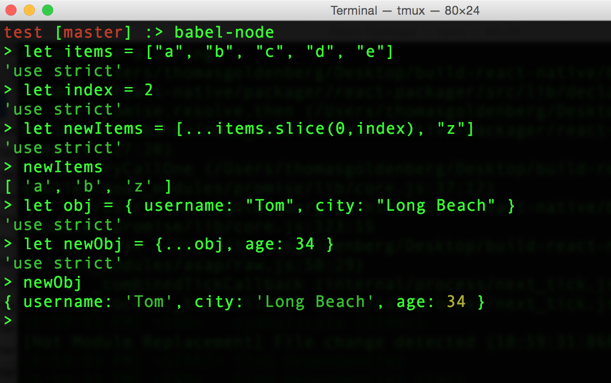

# Chapter 13: Understanding ES6 with React Native


### A function by any other name

One of the more confusing things about working with React and React Native is the many different ways syntax is used, depending on the project or tutorial. Take the following examples and try them in your Node terminal. First make sure you are using the latest version of NodeJS (6 or above) by typing `node –v` in the terminal. If your version is lower, update it before continuing.

Once you’ve entered the terminal, try typing the following functions:


All of these are essentially the same function. With the advent of ES6 and compilers like [**Babel**](https://babeljs.io/), it is possible to use this new syntax in your React and React Native projects. In fact, the community has embraced the new syntax whole-heartedly, so it is worth getting used to.

#### What is that Fat Arrow? `=>`

The fat arrow is used to continue the context of `this`. `this` is a confusing concept in JavaScript, and without the fat arrow, it can change unexpectedly within different functions. By using the fat arrow, we ensure that `this` remains the same. 

#### Why `let` and `const`, and not `var`?

There are [reasons](http://stackoverflow.com/questions/762011/let-keyword-vs-var-keyword) why `let` is preferred to `var`, though they are not that important. It is better to use `let` for variables that may change, and `const` for variables that are only assigned once.

Now that you understand how ES6 functions work, the following React Native component should make more sense: 

```javascript
const Button = (props) =>  (
  <TouchableOpacity onPress={props.handlePress}>
	<Text>Press Me!</Text>
  </TouchableOpacity>
);
```

Here we assign a new function called **Button**, which takes **props** as a parameter, and outputs the React Native component accordingly. Another way to write this is like this, which leads us to another concept --- destructuring…

```javascript
const Button = ({ handlePress }) => (
  <TouchableOpacity onPress={handlePress}>
	<Text>Press Me!</Text>
  </TouchableOpacity>
);
```

### Destructuring Objects and Arrays

How were we able to access `handlePress` in the above example? Through a feature called `destructuring` in ES6. Type the following example in your Node console.


This is a very important concept in both React and React Native. Destructuring means we directly accessing properties of an object, instead of accessing the properties through the object itself. Let’s say we have a **props** object that is passed to a component.

```javascript
let props = { username: ‘Tom’, city: ‘Long Beach’ };
```
To access **username** we would have to type **props.username**. With destructuring, however, we can assign **username** so we don’t have to reference **props** again. 

```javascript
let { username } = props;
```

This is very important, since we import are dependencies in this way too. Which brings us to our next topic: modules.

### Importing and exporting modules

As an experiment create a new directory, called `test`. Inside of test, create 2 files: `main.js` and `utilities.js`. Also create a directory `config` and inside that, the file `index.js`. Here is the structure so far:
```
test
  - main.js
  - utilities.js
  - config
     - index.js
```

Here is our `utilities.js`:

```javascript
function add(num1, num2){
  return num1 + num2;
};

const subtract = (num1, num2) => (
  num1 - num2
)

var divide = function(num1, num2){
  return num1 / num2;
}

let multiply = (num1, num2) => num1 * num2;

module.exports = {
  add,
  subtract,
  divide,
  multiply
}
```

Here is our `config/index.js` file.

```javascript
function doubleOperation(result){
  return result * 2;
}

export default doubleOperation;
```
Notice that we define 4 functions, in 4 different ways! Now, the closest thing to **best practice** would be the syntax for **subtract**, but all 4 work fine. Let's invoke these functions in our **main.js** file.


```javascript
import { add, subtract, divide, multiply } from './utilities';
import double from './config';

var num1 = 20;
var num2 = 4;

console.log('ADDING ');
console.log(add(num1, num2));
console.log('SUBTRACTING');
console.log(subtract(num1, num2));
console.log('DIVIDE');
console.log(divide(num1, num2));
console.log('MULTIPLY');
console.log(multiply(num1, num2));
console.log('DOUBLE ADDING');
console.log(double(add(num1,num2)));
```

Notice how we use **destructuring** to import our functions. Now to run these examples, just **node** won't be enough. This is because while vanilla Node offers a lot of **ES6** features, it doesn't yet support the **import** syntax. Luckily, there's an easy way around this. We can use the **babel-node** CLI tool to run our code. If you don't have the **babel-cli** installed, just enter ```npm install --save-dev babel-cli```. Then you can run the examples with `babel-node FILENAME`. Here's a screenshot of the output.


The example was chosen to illustrate a few interesting things about modules and **ES6**. First of all, it gives us practice seeing how there are many different ways of constructing a function, as we showed earlier. Secondly, it shows some of the different ways of exporting and importing modules. In **main.js**, we use our destructuring syntax to import the different math functions from **utilities.js**. In **utilities.js**, we export through the `module.exports = ` syntax, while in **config/index.js** we use the `export default ` syntax. Also notice how we invoke **double**, a function, which has the result of a function as its parameter. These are things you will see a lot in React, especially when dealing with **Redux**.

If we want to explore some more, we can change our **main.js** file a bit.

```javascript
import * as operations from './utilities';
import double from './config';

var num1 = 20;
var num2 = 4;

console.log('ADDING ');
console.log(operations.add(num1, num2));
console.log('SUBTRACTING');
console.log(operations.subtract(num1, num2));
console.log('DIVIDE');
console.log(operations.divide(num1, num2));
console.log('MULTIPLY');
console.log(operations.multiply(num1, num2));
console.log('DOUBLE ADD');
console.log(double(operations.add(num1, num2)));
```

The `import * as ` syntax imports all the exported functions as one object that we can refer to. This is also a familiar pattern when looking at Redux. If we check we get the same answers as before.

### Spread Operator

Along with destructuring, the spread operator is another useful tool that we can use with both objects and arrays. Take the example of updating an element in a list of TODO items.

```javascript
let todos = [
{ id: 0, title: 'Walk the dog' },
{ id: 1, title: 'Wash the dishes' },
{ id: 2, title: 'Learn ES6' }
];
```
Let's say we want to update the title of the item at the 1st index to `Clean the bathroom`. One way we can do this is through using the spead operator. 
```javascript
function updateItem(items, index, title){
  let newItem = {
    ...items[index],
    title: title
   };
  return [
    ...items.slice(0, index),
    newItem,
    ...items.slice(index + 1
   ];
}
```

Notice that we use the `...` syntax for both an object and an array. For an object, it is similar to this:

```
let newItem = Object.assign({}, items[index], { title: title})
```

For an array, it is similar to this:

```
return items.slice(0, index).concat(newItem).concat(items.slice(index + 1);
```

In both cases, `...` just looks more elegant and simpler. Now, another use of the spread operator in React Native is for passing `props` to components. Instead of passing each individual prop, we can just pass ` {...this.props}`. In other words, the two components are the same:

````javascript
class Card extends Component{
  render(){
    return (
      <View>
        <Title title={this.props.title} userId={this.props.userId} />
      </View>
    );
  }
}

class Card extends Component{
  render(){
    return (
      <View>
        <Title {...this.props} />
      </View>
    );
  }
}

```

Here are some more lines to practice the spread operator in your Node console with `babel-node`. Good luck and happy coding!



```javascript
let items = ["a", "b", "c", "d", "e"]
undefined
let index = 2;
undefined
let newItems = [ ...items.slice(0, index), "z" ]
undefined
newItems
["a", "b", "z"]
let obj = { username: "Tom", city: "Long Beach" }
undefined
let newObj = {...obj, age: 34 }
undefined
newObj
{ username: "Tom", city: "Long Beach", age: 34 }
```