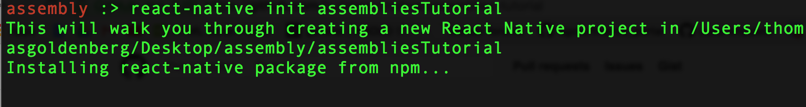
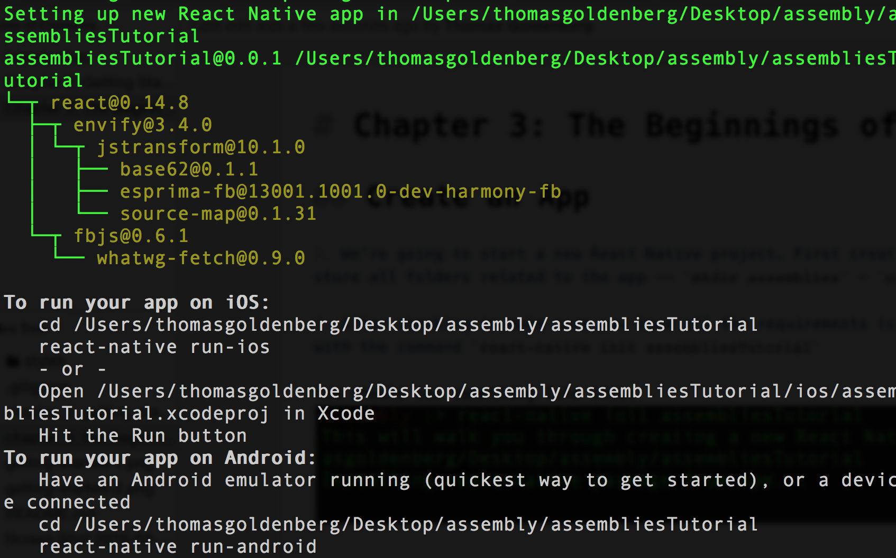

# Chapter 3: The Beginnings of an App

## Create an App

1. We're going to start a new React Native project. First create a directory where you will store all folders related to the app -- `mkdir assemblies` - `cd assemblies`

2. After checking to make sure you have all the requirements (see Chapter 2), create your app with the command `react-native init assembliesTutorial`

You should see something like this: 

3. Once the React Native packager is done installing, you will see a list of the packages installed by `NPM` (in a nested tree structure) and instructions on running the app. 

3. Let's run our app! 

`cd` into the directory, and type the command `react-native run-ios` to open XCode and run the app on the simulator. After opening another terminal window to run the JS, your app should finally load on the iOS simulator. (it's a lot of logs to look at the first time, but don't worry). 

Alternatively, you can open the `.xcodeproj` file in XCode with the command `open ios/assembliesTutorial.xcodeproj`, and then press the `run` button in Xcode to launch it on the Simulator. I prefer this way, just because it's good to get acquainted with the XCode environment. 

