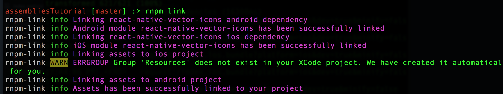
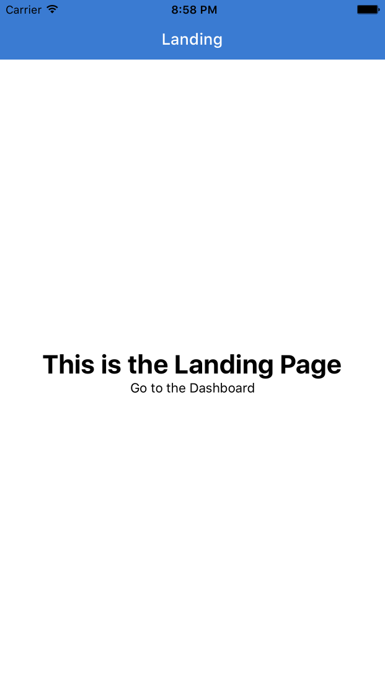
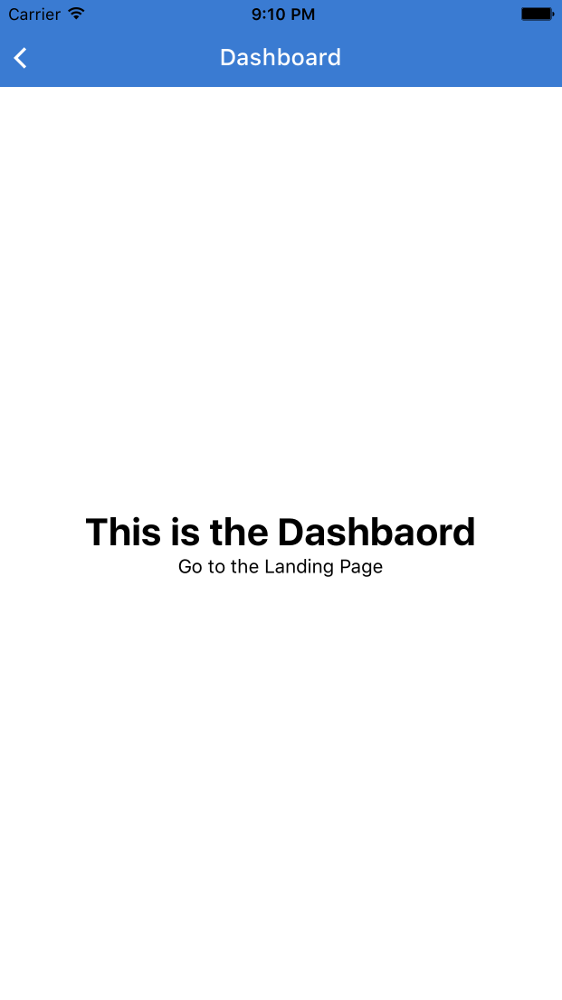

Mobile apps are comprised of many different parts - navigation, UI components, animations, integrating an external API, etc. We'll be looking first at navigation, which is how we tie different parts of the app together.


## Navigator Drama - Which Should I Use?

Since React Native is a budding technology, it is not always as opinionated as other frameworks. For example, we're given three different options for setting up navigation - `NavigatorIOS`,  `Navigator`, and `NavigationExperimental`. Since `NavigationExperimental` is as it is described, experimental, and `NavigatorIOS` is no longer maintained by Facebook, we'll be using `Navigator` for this tutorial. We will, however, look more at `NavigationExperimental` with `Redux` in the later chapters of the guide.


### Why Navigator?
`Navigator`, unlike `NavigatorIOS`, is highly customizable. It has options for different sliding and fading transitions, and is completely neutral in regards to UI. The only downside is that navigation animations run on the JavaScript thread, and this can cause performance lags. We'll show how to tweak the navigation code in order to keep our app running smoothly.


### A Simple Example

Now we're ready to start writing some components! First, let's set up our file directory structure. Create a folder at the root level called `application`, and within that, a folder called `components` and a folder called `styles`. Within `styles` create the two files  `index.js` and `colors.js`, and within `components` create the files `Dashboard.js` and `Landing.js`. Your folder tree should look something like this.

```
android
application
  - components
    - Dashboard.js
    - Landing.js
  - styles
    - colors.js
    - index.js
```

In `application/styles/index.js` we will copy/paste all of our styles and in `application/styles/colors.js`, all of our colors. While we will have a chapter later on how to style and design your app in React Native, it will make the code samples much simpler if we can simply import our styles from a single file. This also makes our design code more modular. 

Copy/paste the contents at [this gist](https://gist.github.com/tgoldenberg/5e2f7be3d3f4f97302e2d7545063b3c9) and paste them in `application/styles/index.js`.

Now copy/paste the contents at [this gist](https://gist.github.com/tgoldenberg/b024fd60ad6fab148bdcd2b039eac5c9) and past them in `application/styles/colors.js`.

Before we build our first component, a warning that we will be using ES6 syntax. If you're unfamiliar with using features such as `import`, `{}` destructuring, the `...` spread operator, and the `=>` fat arrow function syntax, we recommending first completing the ES6 chapter in the appendix. Here are some other resources to get you up to speed: 

- [Tutorial by Mantra](https://tutor.mantrajs.com/say-hello-to-ES2015/introduction)
- [learnharmony.org](http://learnharmony.org/)
- [Video by Sencha](https://www.youtube.com/watch?v=Z7yS28I5ci4)

Since `Navigator` is not opinionated in terms of UI, we will need to `npm install` the following packages
  - `react-native-vector-icons`
  - `react-native-navbar`

We'll also need to link the icon package to XCode with `rnpm`. First install `rnpm` globally

```
npm install -g rnpm
```
Then link the packages with `rnpm link`. You should get a success message.



Once those packages are linked we can build our Landing component -

```javascript
application/components/Landings.js

import React, { Component } from 'react';
import { View, Text, TouchableOpacity } from 'react-native';
import Icon from 'react-native-vector-icons/Ionicons';
import NavigationBar from 'react-native-navbar';

import Colors from '../styles/colors';
import { globals } from '../styles';

class Landing extends Component{
  constructor(){
    super();
    this.visitDashboard = this.visitDashboard.bind(this);
  }
  visitDashboard(){
    this.props.navigator.push({
      name: 'Dashboard'
    });
  }
  render(){
    return (
      <View style={globals.flexContainer}>
        <NavigationBar
          title={{title: 'Landing', tintColor: 'white'}}
          tintColor={Colors.brandPrimary}
        />
        <View style={globals.flexCenter}>
          <Text style={globals.h2}>This is the Landing Page</Text>
          <TouchableOpacity onPress={this.visitDashboard}>
            <Text>Go to the Dashboard</Text>
          </TouchableOpacity>
        </View>
      </View>
    )
  }
}

export default Landing;

```

Let's go over what's going on in this component.

- we import the necessary components from `react` and `react-native` for building our component
- we import our `globals` styles object, as well as the `NavigationBar` and `Icon` components from our recently installed `npm` packages
- we bind our class methods in the `constructor` function. We need to bind them so that the value of `this` that corresponds to the class instance itself persists
- we define our `visitLanding` method, which routes the `Navigator` to the `Landing` component
- we render our content with the `render` method

To view our content now, we can simply `import` the component in `index.ios.js` and render it.

```javascript
index.ios.js

import React, { Component } from 'react';
import {
  AppRegistry,
  Navigator
} from 'react-native';

import Landing from './application/components/Landing';

class assembliesTutorial extends Component {
  render() {
    return (
      <Landing />
    );
  }
}

AppRegistry.registerComponent('assembliesTutorial', () => assembliesTutorial);

```

You should see something similar to this in the Simulator:



Now, we can't go to the `Dashboard` component just yet. When we press the `Go to the Dashboard` button, we then get an error `Cannot read property 'push' of undefined`.

This means that we haven't defined our `Navigator` yet. Let's add that in `index.ios.js` and then reload.

```javascript
import React, { Component } from 'react';
import {
  AppRegistry,
  Navigator
} from 'react-native';

import Landing from './application/components/Landing';
import { globals } from './application/styles';

class assembliesTutorial extends Component {
  render() {
    return (
      <Navigator
        style={globals.flex}
        initialRoute={{ name: 'Landing' }}
        renderScene={(route, navigator) => {
          switch(route.name){
            case 'Landing':
              return (
                <Landing navigator={navigator}/>
            );
          }
        }}
      />
    );
  }
}

AppRegistry.registerComponent('assembliesTutorial', () => assembliesTutorial);

```

Alright, what's going on here?

- We render our `Navigator`, which currently has 3 properties - `style`, `initialRoute`, and `renderScene`
- `initialRoute` is exactly what is sounds like - the first component we want to render when our app starts. We define this route with an object with the name of our first route.
- `renderScene` is a function which expects a component to be returned. We render the appropriate component depending on the name of the route. To achieve this, we use JavaScript's `switch/case` syntax.

With all that, we should now see the same component. However, we get a different result when we try to press the same button. This time, a blank screen appears. This is because we haven't defined our `Dashboard.js` component, nor included a route for it in the `Navigator`. Let's modify our `Navigator` first.

```javascript
index.ios.js

import React, { Component } from 'react';
import {
  AppRegistry,
  Navigator
} from 'react-native';

import Landing from './application/components/Landing';
import Dashboard from './application/components/Dashboard';
import { globals } from './application/styles';

class assembliesTutorial extends Component {
  render() {
    return (
      <Navigator
        style={globals.flex}
        initialRoute={{ name: 'Landing' }}
        renderScene={(route, navigator) => {
          switch(route.name){
            case 'Landing':
              return (
                <Landing navigator={navigator}/>
            );
            case 'Dashboard':
              return (
                <Dashboard navigator={navigator}/>
            );
          }
        }}
      />
    );
  }
}

AppRegistry.registerComponent('assembliesTutorial', () => assembliesTutorial);

```

Next let's define our `Dashboard` component in `application/components/Dashboard.js`.

```javascript
import React, { Component } from 'react';
import { View, Text, TouchableOpacity } from 'react-native';
import Icon from 'react-native-vector-icons/Ionicons';
import NavigationBar from 'react-native-navbar';

import Colors from '../styles/colors';
import { globals } from '../styles';

const BackButton = ({ handlePress }) => (
  <TouchableOpacity onPress={handlePress} style={globals.pa1}>
    <Icon name='ios-arrow-back' size={25} color='white' />
  </TouchableOpacity>
);

class Dashboard extends Component{
  constructor(){
    super();
    this.goBack = this.goBack.bind(this);
    this.visitLanding = this.visitLanding.bind(this);
  }
  visitLanding(){
    this.props.navigator.push({
      name: 'Landing'
    });
  }
  goBack(){
    this.props.navigator.pop();
  }
  render(){
    return (
      <View style={globals.flexContainer}>
        <NavigationBar
          title={{title: 'Dashboard', tintColor: 'white'}}
          tintColor={Colors.brandPrimary}
          leftButton={<BackButton handlePress={this.goBack}/>}
        />
        <View style={globals.flexCenter}>
          <Text style={globals.h2}>This is the Dashbaord</Text>
          <TouchableOpacity onPress={this.visitLanding}>
            <Text>Go to the Landing Page</Text>
          </TouchableOpacity>
        </View>
      </View>
    )
  }
}

export default Dashboard;
```

Notice a few things:
- We add a `leftButton` property to the `NavigationBar`. This is the back icon that renders in the top left part of our screen. We define our `BackButton` component at the top of the file, using React's stripped-down functional stateless component syntax.
- When we press the `Go to the Dashboard` button, we pass in a new object to our `Navigator` with the name of our new component (in our case, 'Dashboard'). Our `Navigator` understands this and delivers us to the correct component

Now you should be able to go back and forth between the `Landing` and `Dashboard` screens.



Let's talk a bit about the components we have been using and the approach we are taking.

Think of `View` like `<div>` in the world of React for Web - it's the basic container for our component and something the packager can bundle and send to the view.

`TouchableOpacity` is a handy component provided by React Native that lets you easily create that "touchable" feel on any elements users will be tapping or pressing. Elements wrapped in `<TouchableOpacity>` will automatically modulate their opacity values when touched. This may seem like a small thing, but it's incredibly noticeable when it's missing, as your elements just sort of respond eventually without any apparent reaction to your touch. Make your interface feel responsive to input is a big part of Apple's [Human Interface Guidelines](https://developer.apple.com/library/ios/documentation/UserExperience/Conceptual/MobileHIG/index.html?utm_source=twitterfeed&utm_medium=twitter).

As we mock up our view, you can see this is just fairly familiar JSX syntax, pretty much XML with a few tweaks.

If you examing the `globals` style object in `application/styles/index.js`, you'll see that we are declaring our styles with Javascript in `CamelCase`, referencing keys of a `styles` object we declare and define below. Generally, these styles work pretty closely to CSS, and use flexbox to define containers and layouts. If you're not too familiar with how flexbox works (perhaps you've spent too much time making things backwards compatible for Internet Explorer), we highlight recommend you check out the excellent guide over at [CSS Tricks](https://css-tricks.com/snippets/css/a-guide-to-flexbox/).

*Note: One of the first 'gotchas' to avoid when working with flexbox is making sure you set `flex: 1` on your top-level components so they actually fill the view, otherwise you'll be very confused and frustrated when your app looks completely blank*

Don't worry, we'll cover flexbox and styling in React Native in far more detail as we go. We've provided all the styles you need for this tutorial so you can get familiar with the basics before having to worry too much about styling.

Take a minute and play with the views, switching back and forth between them. Right out of the gate you can see how much smoother things are than any hybrid app you've ever tried.

As you can see, the nice thing about `Navigator` is that we can customize how our screen looks at any given time. We can create a navbar with `react-native-navbar` and customize it with icons, or we can set up navigation in a different way. It's worth looking at the different options before deciding what's right for your app.

Okay, now it's time for another commit! Congrats on having delved into navigation with React Native. The `Navigator` API has many more options, some of which we will use in the tutorial. Please check out the [docs](https://facebook.github.io/react-native/docs/navigator.html) for specific API information.

Note: If you are interested in using `NavigationExperimental`, please refer to the appendix. There we show how to structure an app with `NavigationExperimental`, including how to store state with `redux`. Honestly, the transition from `Navigator` to `NavigationExperimental` will feel very easy.

***

[Commit 2](https://github.com/buildreactnative/assemblies-tutorial/commit/fdf4cdb9b8b53b54006ef52b91ba3ba8b82cf7dd) - Create basic navigation with Navigator
***

## 3.3 Fleshing out the App

One important thing to understand about an open source project like React Native is the motivations of its sponsors. Facebook uses React Native currently in two apps - the Ads Manager app for iOS and Android, and partially in the Groups app. If we look at these apps, we can see where React Native's strengths are, and we should be looking to leverage them. This is why we decided to use TabBar navigation in Assemblies. Facebook uses this type of navigation in both apps and more apps are following suit. In this chapter, we will implement a simple TabBar navigation.

The interesting thing about TabBar navigation is that to accomplish it, you often need each tab to have its own `Navigator`. So we end up with `Navigator`s inside of `Navigator`s... It actually creates a nice effect and makes our app easy to get around.

I've gone ahead and wired up a few tabs. In all, there will be five tabs, but for now, I'll start with a Profile view, a Dashboard view, and a Messages view.

Now that we're about to build out the app, there are a couple of things I want to clarify:

*Why are we starting out with fake data?*

This is something were are strong believers in. Fake it and then make it. The wireframing process helps to funnel the idea of the product into a visual representation. A developer's job is to translate that into an actual product. It's very easy to focus on the programming problems like integration with a backend system and server, scalability, and so on. However, most often, the best thing to do at this point is to make a fake product. This helps get the UI components of the product in place so that you can think of the data integration later. This is the process I use and I find it works extremely well. That said, different things work for different people, so sue the method that works for you on your own projects.

*Will you be using an architecture like Flux or Redux to manage state between components?*

We won't be using either in this tutorial. We personally love Redux but even its creator has said that you shouldn't use it until you've felt the pain without it. This app would be a good candidate for an architecture using Redux. However, we were also able to create a good product without it. So while the production version of Assemblies may incorporate Redux, the tutorial itself won't touch on the topic. We address how to structure a React Native app with `redux` in the Appendix section of the tutorial.

### Rounding out our Landing Page

Now we're going to fill in our `Landing` page. Later, this will link to a `login/signup`, but for now we'll have it go directly to the `Dashboard`. Let's place an image as the screen background using the `Dimensions` module. Then let's use the `TouchableOpacity` component as a button that leads to our `Dashboard`. You can download the image assets from the [open-source repository](https://github.com/buildreactnative/assemblies/tree/master/application/assets/images). Create a folder under `application` called `assets`, and an `images` folder in that. That is where we'll store our images for the tutorial.

```javascript
import React, { Component } from 'react';

import {
  Dimensions,
  Image,
  StyleSheet,
  Text,
  TouchableOpacity,
  View
} from 'react-native';

import NavigationBar from 'react-native-navbar';
import Colors from '../styles/colors';

let { width: deviceWidth, height: deviceHeight } = Dimensions.get('window');

export default class Landing extends Component{
  render(){
    return (
      <View style={styles.container}>
        <View style={styles.backgroundHolder}>
          <Image style={styles.image} source={require('../assets/images/welcome.png')}/>
        </View>
        <View style={styles.logoContainer}>
          <Image style={styles.logo} source={require('../assets/images/logo.png')}/>
          <Text style={styles.title}>assemblies</Text>
          <Text style={styles.subTitle}>Where Developers Connect</Text>
        </View>
        <TouchableOpacity
          style={styles.button}
          onPress={() => {
            this.props.navigator.push({
              name: 'Dashboard'
            })
          }}
        >
          <Text style={styles.buttonText}>Go to Dashboard</Text>
        </TouchableOpacity>
      </View>
    )
  }
};

let styles = StyleSheet.create({
  backgroundHolder: {
    position: 'absolute',
    top: 0,
    right: 0,
    bottom: 0,
    left: 0,
  },
  button: {
    height: 80,
    position: 'absolute',
    bottom: 0,
    left: 0,
    right: 0,
    flexDirection: 'row',
    backgroundColor: Colors.brandPrimary,
    justifyContent: 'center',
    alignItems: 'center',
  },
  buttonText: {
    color: 'white',
    fontSize: 16,
    fontWeight: '700',
  },
  container: {
    flex: 1,
    position: 'absolute',
    top: 0,
    right: 0,
    bottom: 0,
    left: 0,
  },
  image: {
    height: deviceHeight,
    width: deviceWidth,
  },
  logo: {
    height: 90,
    width: 90,
  },
  logoContainer: {
    flex: 1,
    backgroundColor: 'rgba(0, 0, 0, 0)',
    justifyContent: 'center',
    alignItems: 'center',
    marginBottom: 50,
  },
  subTitle: {
    color: 'white',
    fontSize: 20,
  },
  title: {
    color: 'white',
    fontSize: 28,
    fontWeight: '700',
    paddingBottom: 24,
  },
});

```

If you don't want to go through the hassle of downloading and setting up the image, you can also use a URL for the image source. Here's how that would look: 

```javascript
const backgroundImageSrc = 'https://s3-us-west-2.amazonaws.com/assembliesapp/welcome%402x.png';
...
<View style={styles.container}>
  <Image style={styles.backgroundImage} source={{ uri: backgroundImageSrc }}/>
</View>
...
```

You'll notice that we reference `Colors` from a separate file now, and that some images are referenced. You can download the `logo.png` and `welcome.png` images by following the commit link below and place them in an `assets/images` folder under `application`. The `colors.js` file can be placed in `styles/` under `application`. So far it's just this:
```javascript
export default Colors = {
  brandPrimary: '#3A7BD2'
};
```


As for the styles, some stuff should be pretty self-explanatory for those familiar with styling with CSS on the web. You'll see that we use some absolute positioning as well here, but the majority of components typically use flexbox for positioning.

Time for another commit to close out this chapter on setting up navigation:

***

[Commit 3](https://github.com/buildreactnative/assemblies-tutorial/commit/240f554e76704d9e6cbde0a6b7bec37281dd8972) - Flesh out landing page
***
