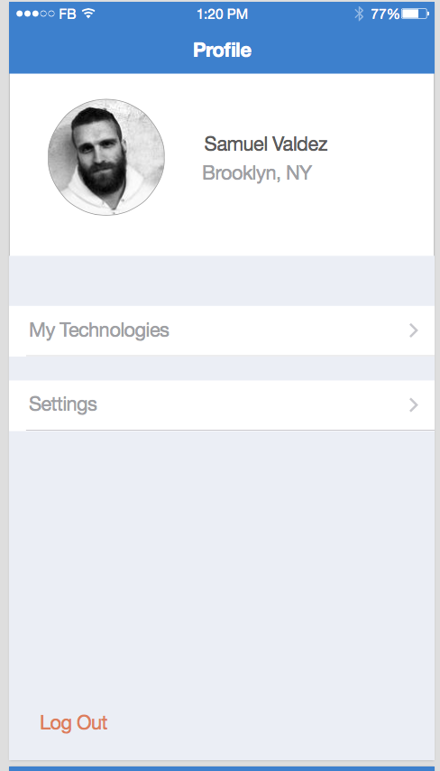

# Chapter 3: The Beginnings of an App

## 3.0 Create an App

1. We're going to start a new React Native project. First create a directory where you will store all folders related to the app -- `mkdir assemblies` - `cd assemblies`

2. After checking to make sure you have all the requirements (see Chapter 2), create your app with the command `react-native init assembliesTutorial`

You should see something like this: 

3. Once the React Native packager is done installing, you will see a list of the packages installed by `NPM` (in a nested tree structure) and instructions on running the app. 

3. Let's run our app! 

Just `cd` into the directory, and type the command `react-native run-ios` to open XCode and run the app on the simulator. After opening another terminal window to run the JS, your app should load on the iOS simulator. (It's a lot of logs to look at the first time, but don't worry). 

Alternatively, you can also open the `.xcodeproj` file in XCode with the command `open ios/assembliesTutorial.xcodeproj`, and then press the `run` button to launch it on the Simulator. I prefer this way, just because it's good to get acquainted with the XCode environment. 

4. Now is a good time for a `git` commit. As we go through the tutorial, we'll provide commits as snapshots of the app at different phases. It's always a good habit to commit early and often. Here's a link to some pointers on good `git` hygiene. 

**** 
 [Commit 1](https://github.com/buildreactnative/assemblies-tutorial/tree/ch-3.0) - `Initialize React native app`
**** 


## Hot Loading - say what?!?

Thanks to the amazing team of contributors (including @gaeron) to `react-native`, recent versions enable hot loading. This makes development simply a joy -- style changes appear instantly without having to navigate to a particular component. So try it out. Open `index.ios.js` in your favorite text editor (I use `Atom`, `Sublime`, or `Vim`). First make sure LiveReload is enabled by opening up the options panel with `cmd D`. Now change the line `Welcome to React Native` to `Welcome to Assemblies`. Did you see how that changed right away? Amazing, I know :).


## Navigator Drama - what should I use?

Next we will look at one of the most important parts of an app - navigation. This has been a topic of concern with React Native since the very beginning, when React Native came with both `NavigatorIOS` and `Navigator`. Facebook uses and maintains the `Navigator` component, but many people still prefer `NavigatorIOS` because it has excellent animation performance. Let's look at the pros and cons of these two options for routing. 

### NavigatorIOS

`NavigatorIOS` has great performance because the animation is handled outside of the main JavaScript thread. I features a simple layout and API to support pushing and popping routes off of the stack. Downsides are that it is highly opinionated and less configurable. It can be appropriate for simple apps or when customization isn't needed.

`Navigator`, on the other hand, is highly customizable. It has options for different sliding and fading transitions, and is neutral in regards to UI. Downsides are that the animation runs on the JavaScript thread, and so, this can cause performance lags. 

We will be using `Navigator` for this project, because it is more widely supported and seen in complex apps. However, to get a feel for NavigatorIOS, let's implement it in a simple two-route app. If you have experience with `NavigatorIOS` or are not interested in seeing what it has to offer, you can skip to the next commit. 

## 3.1 Using NavigatorIOS - a small example

Now we're ready to start writing some components! First, let's setup our file directory structure. Create a folder in the root level called `application`, and within that, a folder called `components`. There we will create 2 `.js` files, `Landing.js` and `Dashboard.js`. 

Let's build our Landing component - 

```
import React from 'react-native';
import Dashboard from './Dashboard';

let {
  View,
  Text,
  Component,
} = React;

export default class Landing extends Component{
  render(){
    return (
      <View style={styles.container}>
        <Text style={styles.h1}>This is Landing</Text>
        <TouchableOpacity onClick={() => {
          this.props.navigator.push({
            title: 'Dashboard',
            component: Dashboard,
          });
        }}>
          <Text>Go to Dashboard</Text>
        </TouchableOpacity>
      </View>
    );
  }
};

let styles = StyleSheet.create({
  container: {
    flex: 1,
    justifyContent: 'center',
    alignItems: 'center',
  },
  h1: {
    fontSize: 22,
    fontWeight: 'bold',
    padding: 20,
  },
});
```

And our Dashboard component (with the same styles)- 

```
import React from 'react-native';
import Landing from './Landing';

let {
  View, 
  Text,
  Component,
} = React;

export default class Dashboard extends Component{
  render(){
    return (
      <View style={styles.container}>
        <Text style={styles.h1}>This is Dashboard</Text>
        <TouchableOpacity onPress={() => {
          this.props.navigator.push({
            title: 'Landing',
            component: Landing,
          });
        }}>
          <Text >Go to Landing</Text>
        </TouchableOpacity>
      </View>
    );
  }
}; 

let styles = StyleSheet.create({ .... (same as previous file)

```


Finally, let's connect them in our `index.ios.js` file - 


```
import React from 'react-native';
import Landing from './application/components/Landing';

let {
  AppRegistry,
  Component,
  NavigatorIOS,
  StyleSheet,
} = React;

class assembliesTutorial extends Component{
  render(){
    return (
      <NavigatorIOS
        style={{flex: 1}}
        barTintColor='#3A7BD2'
        titleTextColor='white'
        tintColor='white'
        shadowHidden={true}
        translucent={false}
        initialRoute={{
          component: Landing,
          title: 'Landing',
        }}
    );
  }
};

AppRegistry.registerComponent('assembliesTutorial', () => assembliesTutorial);

```

## Time for a commit 

Well, that's a quick look at what NavigatorIOS does. If it seems appropriate for a particular app, by all means, use it. Nick and I used NavigatorIOS for our Bhagavad Gita app because we didn't understand at the time how to handle the animations for Navigator. Not to worry - we'll make sure that you don't have that situation. Let's make a commit before moving to `Navigator`.


**** 
 [Commit 2](https://github.com/buildreactnative/assemblies-tutorial/tree/Ch3-0) - "Simple NavigatorIOS example"
**** 


## 3.2 Navigator - the real deal

Now we'll take our implementation with `NavigatorIOS` and switch to `Navigator`. You'll notice some differences. For one, `Navigator` doesn't have a interace component. That's why we'll be using the `react-native-navbar` package by @kureev. We'll also want to install the `react-native-vector-icons` package by @oblador to use cool icons in our navbar. Type the following in the terminal 

```npm install --save react-native-navbar react-native-vector-icons```

This will install the packages to our `node_modules` folder. Now, one issue that React Native developers often face is linking NPM libraries to XCode. Most packages have instructions on how to do this the long way. Fortunately, there is a package `rnpm` which handles the linking process for us. Just install `npm install -g rnpm`, and then run `rnpm link` to link the libraries we installed. 

 `magical linking :)`

Now we can switch out `NavigatorIOS` for `Navigator` in our `index.ios.js` file. In `Navigator`, we must provide an initial route and a `renderScene` function which acts as a `switch()` statement for all of our main routes. Let's setup the Navigator for our two previous components, `Dashboard` and `Landing`.

```
import React, {
  AppRegistry,
  Component,
  Navigator,
  StyleSheet,
} from 'react-native';

import Landing from './application/components/Landing';
import Dashboard from './application/components/Dashboard';

class assembliesTutorial extends Component{
  render(){
    <Navigator
      style={styles.container}
      initialRoute={{
        name: 'Landing'
      }}
      renderScene={(route, navigator) => {
        switch(route.name){
          case 'Landing':
            return <Landing />
          case 'Dashboard':
            return <Dashboard />
        }
      }}
      configureScene={() => Navigator.SceneConfigs.FadeAndroid}
      }}
    />
  }
}
...
```

Notice that the `configureScene` option decides what type of animation our navigation uses to transition between scenes. Feel free to experiment and try other configurations, such as `FloatFromLeft`, `HorizontalSwipeJump`, and `VerticalUpSwipeJump`.

Next we redesign our 2 screens so that they route to each other and also include our navbar with a back icon. Let's look at `Landing.js`

```
import NavigationBar from 'react-native-navbar';
import React, {
  View,
  Text,
  StyleSheet,
  Component, 
  TouchableOpacity,
} from 'react-native';

export default class Landing extends Component{
  render(){
    return (
      <View style={{flex: 1}}>
        <NavigationBar
          title={{title: 'Landing', tintColor: 'white'}}
          tintColor='#3A7BD2'
        />
        <View style={styles.container}>
          <Text style={styles.h1}>This is Landing</Text>
          <TouchableOpacity onPress={() => {
            this.props.navigator.push({
              name: 'Dashboard'
            });
          }}>
            <Text>Go to Dashboard</Text>
          </TouchableOpacity>
        </View>
      </View>
    );
  }
};
```

That should give us our first screen with the navigation bar. If there are errors compiling, it may be that you did not re-build the app after the command `rnpm link`. If so, try pressing the `stop` button on XCode and restarting. 

For the `Dashboard` component, we'll add an icon on the left of the navbar to `pop()` to the previous route. 

```
import NavigationBar from 'react-native-navbar';
import Icon from 'react-native-vector-icons/Ionicons';
import React, {
  View,
  Text,
  StyleSheet,
  TouchableOpacity,
  Component,
} from 'react-native';

export default class Dashboard extends Component{
  _renderBackButton(){
    return (
      <TouchableOpacity
        onPress={() => this.props.navigator.pop()}
        style={styles.backBtn}>
        <Icon name='ios-arrow-back' size={25} color='white' />
      </TouchableOpacity>
    )
  }
  render(){
    return (
      <View style={{flex: 1}}>
        <NavigationBar
          title={{title: 'Dashboard', tintColor: 'white'}}
          tintColor='#3A7BD2'
          leftButton={this._renderBackButton()}
        />
        <View style={styles.container}>
          <Text style={styles.h1}>This is Dashboard</Text>
          <TouchableOpacity onPress={() => {
              this.props.navigator.push({
                name: 'Landing'
              })
            }}>
            <Text>Go to Landing</Text>
          </TouchableOpacity>
        </View>
      </View>
    )
  }
};

let styles = StyleSheet.create({
  backBtn: {
    paddingTop: 10,
    paddingHorizontal: 20,
  }
  ...
```


As you can see, the nice thing about `Navigator` is that we can customize how our screen looks at any given time. We can have a navbar with `react-native-navbar` and customize it with icons, or we can use navigation in a different way. It's worth looking at the different options before deciding what's right for your app. 

Okay, now it's time for another commit! Congrats on having delved into navigation with React Native. The `Navigator` API has many more options, some of which we will use in the tutorial. Please check out the [docs](https://facebook.github.io/react-native/docs/navigator.html) for specific API information.


*** 
 [Commit 3](https://github.com/buildreactnative/assemblies-tutorial/tree/ch-3.2) - "Create basic navigation with Navigator"

*** 

## 3.3 TabBar Navigation

One important thing to understand about an open source project like React Native is what its roadmap is. Facebook uses React Native currently in 2 apps - the Ads Manager app for iOS and Android, and partially in the Groups app. If we look at these apps, we can see where React Native's strengths are, and we should be looking to leverage them. This is why we decided to use TabBar navigation in Assemblies. Facebook uses this type of navigation in both apps and more apps are following suit. In this chapter, we will implement a simple TabBar navigation. 

The interesting thing about TabBar navigation is that to accomplish it, you often need each tab to have its own `Navigator`. So we end up with `Navigator`s inside of `Navigators`... It actually creates a nice effect and makes our app easy to get around. 

I've gone ahead and picked out a few routes based on the sketches that Nick has given me. In all, there will be 5 tabs, but for now, I'll start with a Profile view, a Dashboard view, and a Messages view. Here's a look at the early sketches we used. 

<div style="display: flex; align-items: center;">
  
  
  
  
</div>


