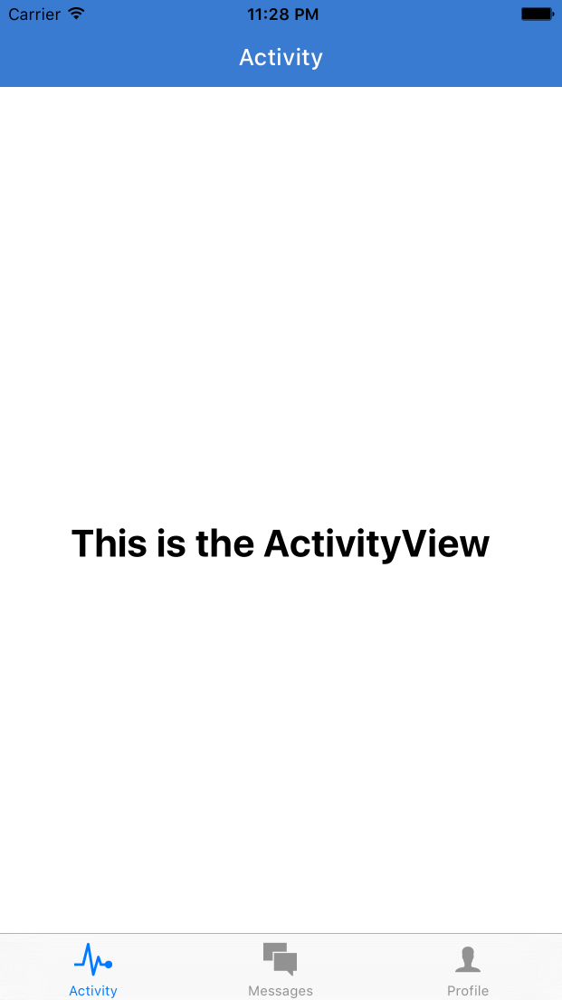

## Putting Together the Pieces

Last chapter we left off with the start of our project -- a working `Navigator` and a styled landing page. Next we're going to implement `TabBar` navigation inside of our `Dashboard` component.

Let's start by making three tabs - Dashboard, Messages, and Profile. We'll then fill out the screens with fake data. First replace the contents of `application/components/Dashboard.js` with the code below. Notice that we use the `react-native-vector-icons` package to customize our tab bar.

Before we replace `Dashboard.js`, let's take our `BackButton` component and give it it's own file, under `application/shared/BackButton.js`.

```javascript
import React from 'react';
import { TouchableOpacity } from 'react-native';
import Icon from 'react-native-vector-icons/Ionicons';
import { globals } from '../styles';

const BackButton = ({ handlePress }) => (
  <TouchableOpacity onPress={handlePress} style={globals.pa1}>
    <Icon name='ios-arrow-back' size={25} color='white' />
  </TouchableOpacity>
);

export default BackButton;

```

Here's our new `Dashboard.js`:

```javascript
import React, { Component } from 'react';
import { TabBarIOS } from 'react-native';
import { TabBarItemIOS } from 'react-native-vector-icons/Ionicons';

import ActivityView from './activity/ActivityView';
import MessagesView from './messages/MessagesView';
import ProfileView from './profile/ProfileView';

class Dashboard extends Component{
  constructor(){
    super();
    this.state = {
      selectedTab: 'Activity'
    }
  }
  render(){
    return (
      <TabBarIOS>
        <TabBarItemIOS
          title='Activity'
          selected={this.state.selectedTab === 'Activity'}
          iconName='ios-pulse'
          onPress={() => this.setState({ selectedTab: 'Activity' })}
        >
          <ActivityView />
        </TabBarItemIOS>
        <TabBarItemIOS
          title='Messages'
          selected={this.state.selectedTab === 'Messages'}
          iconName='ios-chatboxes'
          onPress={() => this.setState({ selectedTab: 'Messages' })}
        >
          <MessagesView />
        </TabBarItemIOS>
        <TabBarItemIOS
          title='Profile'
          selected={this.state.selectedTab === 'Profile'}
          iconName='ios-person'
          onPress={() => this.setState({ selectedTab: 'Profile' })}
        >
          <ProfileView />
        </TabBarItemIOS>
      </TabBarIOS>
    )
  }
}

export default Dashboard;

```

Here's what we just did:

- we define each tab with information such as its title, icon, and the component it should render
- each time a tab is selected, the value of `this.state.selectedTab` changes, rendering a different component
- we reference the components `<ActivityView/>`, `<MessagesView/>`, and `<ProfileView/>`, which we still have to define in our project

Let's create the folders `activity`, `messages`, and `profile`, under our `application/components` directory, and create the files `ActivityView.js`, `MessagesView.js`, and `ProfileView.js` under each respectively. Here is the code to `ActivityView.js`. Simple change the name of the component and its title to see the basic `TabBar` functionality.

```javascript
application/components/activity/ActivityView.js

import React, { Component } from 'react';
import { View, Text } from 'react-native';
import Icon from 'react-native-vector-icons/Ionicons';
import NavigationBar from 'react-native-navbar';

import Colors from '../../styles/colors';
import { globals } from '../../styles';

class ActivityView extends Component{
  render(){
    return (
      <View style={globals.flex}>
        <NavigationBar
          title={{ title: 'Activity', tintColor: 'white' }}
          tintColor={Colors.brandPrimary}
        />
        <View style={globals.flexCenter}>
          <Text style={globals.h2}>This is the ActivityView</Text>
        </View>
      </View>
    )
  }
}

export default ActivityView;
```

Here's what we have so far, after creating `MessagesView` and `ProfileView`. Let's make a commit at this point.




***

[ Commit 5](https://github.com/buildreactnative/assemblies-tutorial/tree/19afd0331e19182106243827d05818779b8015a0) - "Create empty TabBar views"

***

## Styling the Profile View

Let's build out the tab screens. We'll be using fixtures for this. Add [this gist](https://gist.github.com/tgoldenberg/6e7682d958edabea90616a1706e30af7) as a file in `application/fixtures/index.js`. Let's use this fixtures file to build out our `ProfileView` component. We will also need to `npm install --save underscore`.

```javascript
import React, { Component } from 'react';
import { View, Text, ScrollView, Image, TouchableOpacity } from 'react-native';
import Icon from 'react-native-vector-icons/Ionicons';
import NavigationBar from 'react-native-navbar';

import Colors from '../../styles/colors';
import { currentUser } from '../../fixtures';
import { globals, profileStyles } from '../../styles';

const styles = profileStyles;

class ProfileView extends Component{
  render() {
    return (
      <View style={[globals.flexContainer, globals.inactive]}>
        <NavigationBar
          title={{ title: 'Profile', tintColor: 'white' }}
          tintColor={Colors.brandPrimary}
        />
        <ScrollView style={globals.flex}>
          <View style={styles.flexRow}>
            <TouchableOpacity style={[globals.flexCenter, globals.pv1]}>
              <Image source={{uri: currentUser.avatar}} style={styles.avatar}/>
            </TouchableOpacity>
            <View style={styles.infoContainer}>
              <Text style={globals.h4}>{currentUser.firstName} {currentUser.lastName}</Text>
              <Text style={globals.h5}>{currentUser.location.city.long_name}, {currentUser.location.state.short_name}</Text>
            </View>
          </View>
          <TouchableOpacity style={styles.formButton}>
            <Text style={globals.h4}>My Technologies</Text>
            <Icon name='ios-arrow-forward' size={30} color='#ccc' />
          </TouchableOpacity>
          <TouchableOpacity style={styles.formButton}>
            <Text style={globals.h4}>Settings</Text>
            <Icon name='ios-arrow-forward' size={30} color='#ccc' />
          </TouchableOpacity>
          <TouchableOpacity style={styles.logoutButton}>
            <Text style={styles.logoutText}>Logout</Text>
          </TouchableOpacity>
        </ScrollView>
      </View>
    );
  }
};

export default ProfileView;

```

Here we use the `ScrollView` component for the first time. ScrollView gives us greater layout flexibility then relying on a simple `View` component. Even though the components may fit on a certain view, using `ScrollView` ensures that all components will be visible on all phone sizes. As for the functionality of the `TouchableOpacity` components, we will add that in later.

Note that we also added an `inactive` variable to our `colors.js` file:

```javascript
export default Colors = {
  brandPrimary: '#3A7BD2',
  inactive: '#EBEEF5'
};
```

We are also referencing a `fixtures.js` file in a newly-created `application/fixtures` folder. You can download that file from GitHub by following the commit link below and add it to your project directory at the appropriate path.

Now let's make a commit.


***
[ Commit 6](https://github.com/buildreactnative/assemblies-tutorial/commit/a82cbed80bf43464669182fb61ada3fa2d37234d) - "Add fixtures file and style profile view"
***

## 4.2 Messages View

Next let's fill in our Messages View. We'll be using our fixtures file with messages for now. One thing you'll notice is that these messages include all the relevant data for rendering them, including the author name and avatar url. Later, when implementing our backend, we will separate some of these data points, since a user can change their name or profile photo. Therefore, it's better to store the `authorId` in the message and refer to the `user` object.
For convenience, we'll be storing all the data in the messages object for now. We will be using the `ListView` in this component. The first thing we will need to do is convert our array of messages into an array of unique conversations. We then pass this conversation array (with the first message of each conversation) to our `ListView` as its `DataSource`. Let's look at the constructor for `MessagesView`

```javascript
...
// import messages from fixture file
import { messages } from '../../fixtures/fixtures';
import _ from 'underscore';

export default class MessagesView extends Component{
  constructor(props){
    super(props);
    let conversations = {};
    // store each message under a conversation key
    messages.forEach((msg) => {
      let key = msg.participants.sort().join('-');
      if (conversations[key]) { conversations[key].push(msg); }
      else { conversations[key] = [msg]; }
    });
    let dataBlob = _.keys(conversations)
                      .map((key) => conversations[key]);
    // take the first message from each conversation
    this.state = {
      dataSource: new ListView.DataSource({
        rowHasChanged: (r1, r2) => r1 != r2
      })
      .cloneWithRows(dataBlob)
    };
  }
...
}

```

Now that we have our data, here's what the rest of the component looks like. By the way, we're using fake messages from [www.hipsteripsum.co](www.hipsteripsum.co). I find it to be more fun to work with than the traditional Latin lorem ipsum.

```javascript
  _renderRow(rowData){
    console.log('ROW DATA', rowData);
    return (
      <Text>{rowData[0].senderName}: {rowData[0].text}</Text>
    );
  }
  render() {
    return (
      <View style={{ flex: 1 }}>
        <NavigationBar
          title={{ title: 'Messages', tintColor: 'white' }}
          tintColor={Colors.brandPrimary}
        />
        <ListView
          dataSource={this.state.dataSource}
          contentInset={{ bottom: 49 }}
          automaticallyAdjustContentInsets={false}
          ref='messagesList'
          renderRow={this._renderRow.bind(this)}
        />
      </View>
    );
  }
};

let styles = StyleSheet.create({
  container: {
    flex: 1,
    justifyContent: 'center',
    alignItems: 'center',
  },
  h1: {
    fontSize: 22,
    fontWeight: 'bold',
    padding: 20,
  },
});
```


Once we've confirmed that the data is being processed into conversations (both through the Chrome console React Native opens for debugging and our Simulator screen), we can refactor the rows into `Conversation` components. Replace the `Text` component in `_renderRow` with ```<Conversation conversation={rowData} />```. We'll also be using `moment` here for time/date formatting:

```javascript

import _ from 'underscore';
import Colors from '../../styles/colors';
import moment from 'moment';
import Icon from 'react-native-vector-icons/Ionicons';
import { currentUser, FAKE_USERS } from '../../fixtures/fixtures';

import React, {
  Component,
  StyleSheet,
  View,
  Text,
  Image,
  TouchableOpacity,
  Dimensions,
} from 'react-native';

let { width: deviceWidth, height: deviceHeight } = Dimensions.get('window');

export default class Conversation extends Component{
  render(){
    let { conversation } = this.props;
    let msg = conversation[0].text;
    let date = new Date(conversation[0].createdAt);
    let user = _.find(FAKE_USERS, (usr) => {
      return (
        _.contains(conversation[0].participants, usr.id) &&
        usr.id != currentUser.id
      )
    });
    return (
      <TouchableOpacity style={{ flex: 1 }}>
        <View style={styles.container}>
          <Image style={styles.profile} source={{uri: user.avatarUrl}}/>
          <View style={styles.fromContainer}>
            <View style={styles.container}>
              <Text style={styles.fromText}>{user.firstName} {user.lastName}</Text>
              <Text style={styles.sentText}>{moment(date).fromNow()}</Text>
            </View>
            <Text style={styles.messageText}>{msg.substring(0, 40)}...</Text>
          </View>
          <View style={styles.iconHolder}>
            <Icon size={30} name="ios-arrow-forward" color={Colors.bodyTextLight}/>
          </View>
        </View>
        <View style={styles.center}>
          <View style={styles.border}/>
        </View>
      </TouchableOpacity>
    );
  }
};

let styles = StyleSheet.create({
  container:{
    flex: 1,
    flexDirection: 'row',
    alignItems: 'center',
  },
  profile:{
    width: 50,
    height: 50,
    borderRadius: 25,
    marginHorizontal: 10,
    marginVertical: 10,
  },
  fromContainer:{
    justifyContent: 'center',
    marginLeft: 10,
    flex: 1,
  },
  fromText:{
    fontSize: 12,
    fontWeight: '700'
  },
  sentText:{
    fontSize: 12,
    fontWeight: '300',
    color: Colors.bodyTextGray,
    marginLeft: 10,
    fontWeight: '300',
    marginLeft: 10
  },
  iconHolder: {
    flex: 0.5,
    alignItems: 'flex-end',
    paddingRight: 25,
  },
  border: {
    height: 0,
    borderBottomWidth: 1,
    width: deviceWidth * 0.95,
    borderBottomColor: Colors.inactive,
  },
  messageText:{
    fontSize: 16,
    color: '#9B9B9B',
    fontStyle: 'italic',
    fontWeight: '300',
  },
  center: {
    alignItems: 'center',
  },
});
```


***
[ Commit 7](https://github.com/buildreactnative/assemblies-tutorial/commit/fc9866ccabbac243960912cc3206db62dec25a97) - "Render messages view with fixture data"
***

## 4.3 Styling the Activity View

So far we have a tab bar with two views filled in - `ProfileView` and `MessagesView`. Now let's fill in the other view, our `ActivityView." We'll add a heading with our next upcoming event and a map of it's location (hard-coded for now, of course). We'll make this screen more interesting later:

```javascript

import React, {
  Component,
} from 'react';

import {
  Dimensions,
  MapView,
  ScrollView,
  StyleSheet,
  Text,
  TouchableOpacity,
  View,
} from 'react-native';

import NavigationBar from 'react-native-navbar';
import Colors from '../../styles/colors';
import moment from 'moment';
import { notifications, upcomingEvent } from '../../fixtures/fixtures';

let { width: deviceWidth, height: deviceHeight } = Dimensions.get('window');

export default class ActivityView extends Component{
  _renderScrollView(){
    const mapRegion = {
      latitude: upcomingEvent.location.lat,
      longitude: upcomingEvent.location.lng,
      latitudeDelta: 0.01,
      longitudeDelta: 0.01,
    };
    return (
      <ScrollView
        contentContainerStyle={styles.scrollView}
        automaticallyAdjustContentInsets={false}
      >
        <View>
          <View style={styles.nextAssemblyContainer}>
            <Text style={styles.bodyText}>Next Assembly: </Text>
            <TouchableOpacity>
              <Text style={styles.eventName}>{upcomingEvent.name}</Text>
            </TouchableOpacity>
          </View>
          <Text style={styles.dateText}>{moment(new Date(upcomingEvent.start)).format('dddd MMM Do, h:mm a')}</Text>
        </View>
        <MapView
          style={styles.map}
          region={mapRegion}
          annotations={[{latitude: mapRegion.latitude, longitude: mapRegion.longitude}]}
        />
      </ScrollView>
    );
  }
  render() {
    return (
      <View style={{ flex: 1 }}>
        <NavigationBar
          title={{ title: 'Activity', tintColor: 'white' }}
          tintColor={Colors.brandPrimary}
        />
        <View style={styles.container}>
          {this._renderScrollView()}
        </View>
      </View>
    );
  }
};

let styles = StyleSheet.create({
  scrollView: {
    flex: 1,
    paddingBottom: 80,
  },
  nextAssemblyContainer: {
    flexDirection: 'row',
    alignItems: 'center',
  },
  eventName: {
    color: Colors.brandPrimary,
    fontWeight: '500',
  },
  map: {
		height: (deviceHeight / 3),
		width: deviceWidth
	},
  bodyText: {
    color: Colors.bodyText,
		fontSize: 16,
    fontWeight: '400',
		paddingHorizontal: 15,
    paddingVertical: 10,
  },
  nextEvent: {
    color: Colors.bodyTextLight,
    fontSize: 14,
    fontWeight: '300',
    fontStyle: 'italic',
  },
  dateText: {
    fontSize: 14,
    paddingBottom: 4,
    fontWeight: '300',
    fontStyle: 'italic',
    paddingHorizontal: 15,
    color: Colors.bodyText,
  },
});

```


***
[ Commit 8](https://github.com/buildreactnative/assemblies-tutorial/commit/95d72386aa41693a9aff2513e91d7113ad6ee028) - "Basic activity view"
***


## Summing Up

So far, we explored several of the UI components of React Native, navigation, and styling. We used fixture data to make this process as fast as possible. In the coming chapters we will start to flesh out the app with an external database and REST-ful read & write operations. We will also explore how to share components among different tabs and make our code more modular. The first step to this is user authentication, which we'll cover in the next chapter.
