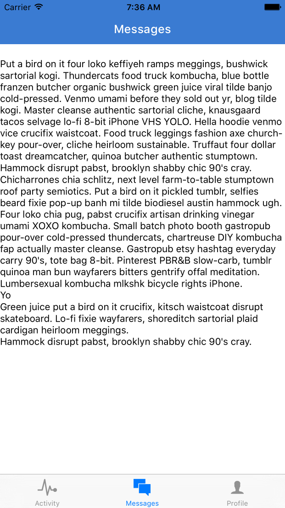
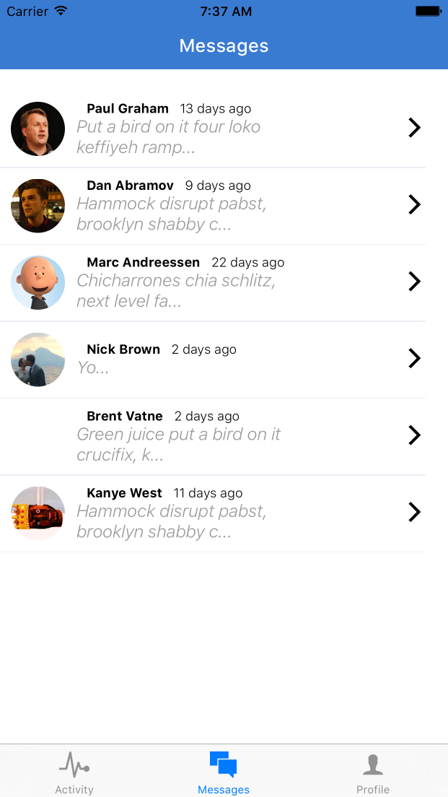

## Putting Together the Pieces

Last chapter we left off with the start of our project -- a working `Navigator` and a styled landing page. Next we're going to implement `TabBar` navigation inside of our `Dashboard` component.

Let's start by making three tabs - Dashboard, Messages, and Profile. We'll then fill out the screens with fake data. First replace the contents of `application/components/Dashboard.js` with the code below. Notice that we use the `react-native-vector-icons` package to customize our tab bar.

Before we replace `Dashboard.js`, let's take our `BackButton` component and give it it's own file, under `application/shared/BackButton.js`.

```javascript
import React from 'react';
import { TouchableOpacity } from 'react-native';
import Icon from 'react-native-vector-icons/Ionicons';
import { globals } from '../styles';

const BackButton = ({ handlePress }) => (
  <TouchableOpacity onPress={handlePress} style={globals.pa1}>
    <Icon name='ios-arrow-back' size={25} color='white' />
  </TouchableOpacity>
);

export default BackButton;

```

Here's our new `Dashboard.js`:

```javascript
import React, { Component } from 'react';
import { TabBarIOS } from 'react-native';
import { TabBarItemIOS } from 'react-native-vector-icons/Ionicons';

import ActivityView from './activity/ActivityView';
import MessagesView from './messages/MessagesView';
import ProfileView from './profile/ProfileView';

class Dashboard extends Component{
  constructor(){
    super();
    this.state = {
      selectedTab: 'Activity'
    }
  }
  render(){
    return (
      <TabBarIOS>
        <TabBarItemIOS
          title='Activity'
          selected={this.state.selectedTab === 'Activity'}
          iconName='ios-pulse'
          onPress={() => this.setState({ selectedTab: 'Activity' })}
        >
          <ActivityView />
        </TabBarItemIOS>
        <TabBarItemIOS
          title='Messages'
          selected={this.state.selectedTab === 'Messages'}
          iconName='ios-chatboxes'
          onPress={() => this.setState({ selectedTab: 'Messages' })}
        >
          <MessagesView />
        </TabBarItemIOS>
        <TabBarItemIOS
          title='Profile'
          selected={this.state.selectedTab === 'Profile'}
          iconName='ios-person'
          onPress={() => this.setState({ selectedTab: 'Profile' })}
        >
          <ProfileView />
        </TabBarItemIOS>
      </TabBarIOS>
    )
  }
}

export default Dashboard;

```

Here's what we just did:

- we define each tab with information such as its title, icon, and the component it should render
- each time a tab is selected, the value of `this.state.selectedTab` changes, rendering a different component
- we reference the components `<ActivityView/>`, `<MessagesView/>`, and `<ProfileView/>`, which we still have to define in our project

Let's create the folders `activity`, `messages`, and `profile`, under our `application/components` directory, and create the files `ActivityView.js`, `MessagesView.js`, and `ProfileView.js` under each respectively. Here is the code to `ActivityView.js`. Simple change the name of the component and its title to see the basic `TabBar` functionality.

```javascript
application/components/activity/ActivityView.js

import React, { Component } from 'react';
import { View, Text } from 'react-native';
import Icon from 'react-native-vector-icons/Ionicons';
import NavigationBar from 'react-native-navbar';

import Colors from '../../styles/colors';
import { globals } from '../../styles';

class ActivityView extends Component{
  render(){
    return (
      <View style={globals.flex}>
        <NavigationBar
          title={{ title: 'Activity', tintColor: 'white' }}
          tintColor={Colors.brandPrimary}
        />
        <View style={globals.flexCenter}>
          <Text style={globals.h2}>This is the ActivityView</Text>
        </View>
      </View>
    )
  }
}

export default ActivityView;
```

Here's what we have so far, after creating `MessagesView` and `ProfileView`. Let's make a commit at this point.


***

[ Commit 5](https://github.com/buildreactnative/assemblies-tutorial/tree/19afd0331e19182106243827d05818779b8015a0) - "Create empty TabBar views"

***

## Styling the Profile View

Let's build out the tab screens. We'll be using fixtures for this. Add [this gist](https://gist.github.com/tgoldenberg/6e7682d958edabea90616a1706e30af7) as a file in `application/fixtures/index.js`. Let's use this fixtures file to build out our `ProfileView` component. We will also need to `npm install --save underscore`.

```javascript
import React, { Component } from 'react';
import { View, Text, ScrollView, Image, TouchableOpacity } from 'react-native';
import Icon from 'react-native-vector-icons/Ionicons';
import NavigationBar from 'react-native-navbar';

import Colors from '../../styles/colors';
import { currentUser } from '../../fixtures';
import { globals, profileStyles } from '../../styles';

const styles = profileStyles;

class ProfileView extends Component{
  render() {
    return (
      <View style={[globals.flexContainer, globals.inactive]}>
        <NavigationBar
          title={{ title: 'Profile', tintColor: 'white' }}
          tintColor={Colors.brandPrimary}
        />
        <ScrollView style={globals.flex}>
          <View style={styles.flexRow}>
            <TouchableOpacity style={[globals.flexCenter, globals.pv1]}>
              <Image source={{uri: currentUser.avatar}} style={styles.avatar}/>
            </TouchableOpacity>
            <View style={styles.infoContainer}>
              <Text style={globals.h4}>{currentUser.firstName} {currentUser.lastName}</Text>
              <Text style={globals.h5}>{currentUser.location.city.long_name}, {currentUser.location.state.short_name}</Text>
            </View>
          </View>
          <TouchableOpacity style={styles.formButton}>
            <Text style={globals.h4}>My Technologies</Text>
            <Icon name='ios-arrow-forward' size={30} color='#ccc' />
          </TouchableOpacity>
          <TouchableOpacity style={styles.formButton}>
            <Text style={globals.h4}>Settings</Text>
            <Icon name='ios-arrow-forward' size={30} color='#ccc' />
          </TouchableOpacity>
          <TouchableOpacity style={styles.logoutButton}>
            <Text style={styles.logoutText}>Logout</Text>
          </TouchableOpacity>
        </ScrollView>
      </View>
    );
  }
};

export default ProfileView;

```

Here we use the `ScrollView` component for the first time. ScrollView gives us greater layout flexibility then relying on a simple `View` component. Even though the components may fit on a certain view, using `ScrollView` ensures that all components will be visible on all phone sizes. As for the functionality of the `TouchableOpacity` components, we will add that in later.

Now let's make a commit.


***
[ Commit 6](https://github.com/buildreactnative/assemblies-tutorial/tree/4ddce2b8eb25177a5c58588dcb1a17f3a831d32c) - "Add fixtures file and style profile view"
***

## 4.2 Messages View

Next let's fill in our Messages View. We'll be using our fixtures file with `FakeConversations` for now. One thing you'll notice is that these conversations depend on matching a `userId` with an actual user for rendering information like the username, etc. By the way, we're using fake messages from [www.hipsteripsum.co](www.hipsteripsum.co). I find it to be more fun to work with than the traditional Latin lorem ipsum.

We will be using the `ListView` in this component. We pass our array of conversations to our `ListView` as its `DataSource`. Let's look at the constructor for `MessagesView`

```javascript
...
import React, { Component } from 'react';
import { View, Text, Image, TouchableOpacity, ListView } from 'react-native';
import moment from 'moment';
import Icon from 'react-native-vector-icons/Ionicons';
import NavigationBar from 'react-native-navbar';
import { find } from 'underscore';

import Colors from '../../styles/colors';
import { FakeConversations, FakeUsers, currentUser } from '../../fixtures';
import { globals, messagesStyles } from '../../styles';

const styles = messagesStyles;

class Conversations extends Component{
  constructor(){
    super();
    this._renderRow = this._renderRow.bind(this);
    this.dataSource = this.dataSource.bind(this);
  }

  _renderRow(conversation){
    return (
      <Text>{conversation.lastMessageText}</Text>
    )
  }
  dataSource(){
    return (
      new ListView.DataSource({
        rowHasChanged: (r1,r2) => r1 != r2
      })
      .cloneWithRows(FakeConversations)
    );
  }
  render() {
    return (
      <View style={globals.flexContainer}>
        <NavigationBar
          title={{ title: 'Messages', tintColor: 'white' }}
          tintColor={Colors.brandPrimary}
        />
        <ListView
          dataSource={this.dataSource()}
          contentInset={{ bottom: 49 }}
          renderRow={this._renderRow}
        />
      </View>
    );
  }
};

export default Conversations;

```


Here's what we just did:

- imported necessary components from React and React Native, as usual
- import our `globals` and `messagesStyles` style objects, as well as our `Colors` variables
- import `FakeConversations`, along with `FakeUsers` and `currentUser` from our fixtures file
- render a ListView with the following fields:
  - dataSource: this is the data that the ListView renders. In it's most simple format, this can be an array of data that is converted into a `ListView.DataSource`. Later on, we'll see more examples with headers, etc.
  - contentInset: this is the margin for the `ListView`. We added 49 because of the tabbar at the bottom
  - renderRow: this function returns the UI for each row
- render a simple `<Text/>` element for each row with the last message

Now we can fill in our `renderRow` function with some style.


```javascript
...
 _renderRow(conversation){
    let otherUserID = find([conversation.user1Id, conversation.user2Id], (id) => id !== currentUser.id);
    let user = find(FakeUsers, ({ id }) => id === otherUserID);
    return (
      <TouchableOpacity style={globals.flexContainer}>
        <View style={globals.flexRow}>
          <Image style={globals.avatar} source={{uri: user.avatar}}/>
          <View style={globals.flex}>
            <View style={globals.textContainer}>
              <Text style={styles.h5}>{user.firstName} {user.lastName}</Text>
              <Text style={styles.h6}>{moment(conversation.lastMessageDate).fromNow()}</Text>
            </View>
            <Text style={styles.h4}>{conversation.lastMessageText.substring(0, 40)}...</Text>
          </View>
          <View style={styles.arrowContainer}>
            <Icon size={30} name="ios-arrow-forward" color={Colors.bodyTextLight}/>
          </View>
        </View>
        <View style={styles.divider}/>
      </TouchableOpacity>
    )
  }
...
```


Although we haven't added any dynamic data to this view, it's still looking pretty good! Here's what we did with our `renderRow` function:

- We use the `currentUser` fixture to find the other user in the conversation, then find that user in our `FakeUsers` array. We use the `find` function from `underscore`, a JavaScript utility package.
- We wrap our row in a `TouchableOpacity` component, and separate the row into parts: the avatar image, the conversation info, and an icon to route to the conversation
- We use the `moment` package to format our conversations. We probably ought to sort them by the `lastMessageDate`, but we can do that later

Since we're going to be using the `ListView` component quite a bit, we can refactor the `rowHasChanged` function to a utilities file. Create the folder `application/utilities` and place these contents there in an `index.js` file:

```javascript
application/utilities/index.js
export function rowHasChanged(r1, r2){
  return r1 != r2;
}

```

Now we can simplify our `ListView.DataSource` code somewhat:

```javascript
...
import { rowHasChanged } from '../../utilities';
...
dataSource(){
  return (
    new ListView.DataSource({ rowHasChanged: rowHasChanged }).cloneWithRows(FakeConversations)
  );
}
...
```


***
[ Commit 7](https://github.com/buildreactnative/assemblies-tutorial/tree/839957ac1b0e457c2a1e2267a3d9ee240713953b) - "Render MessagesView with fixture data"
***

## 4.3 Styling the Activity View

So far we have a tab bar with two views filled in - `ProfileView` and `MessagesView`. Now let's fill in the other view, our `ActivityView." We'll add a heading with our next upcoming event and a map of it's location (hard-coded for now, of course). We'll make this screen more interesting later:

```javascript
import moment from 'moment';
import Icon from 'react-native-vector-icons/Ionicons';
import NavigationBar from 'react-native-navbar';
import React, { Component } from 'react';
import { ScrollView, View, Text, TouchableOpacity, MapView } from 'react-native';

import Colors from '../../styles/colors';
import { globals, activityStyles } from '../../styles';
import { upcomingEvent, FakeNotifications } from '../../fixtures';

const styles = activityStyles;

const ActivityMap = ({ event }) => {
  const mapRegion = {
    latitude: event.location.lat,
    longitude: event.location.lng,
    latitudeDelta: 0.01,
    longitudeDelta: 0.01,
  };
  return (
    <MapView
      style={globals.map}
      region={mapRegion}
      annotations={[{latitude: mapRegion.latitude, longitude: mapRegion.longitude}]}
    />
  )
};

const Notification = ({ notification }) => (
  <TouchableOpacity style={[globals.flexRow, globals.ph1]}>
    <View style={globals.flex}>
      <View style={globals.flexRow}>
        <View style={styles.circle}/>
        <View style={[globals.textContainer, globals.pv1]}>
          <Text style={styles.h4}>New {notification.type}</Text>
        </View>
        <Text style={styles.h5}>{moment(new Date(new Date(notification.createdAt))).fromNow()}</Text>
      </View>
      <View style={globals.flex}>
        <Text style={styles.messageText}>{notification.message}</Text>
      </View>
    </View>
    <View>
      <Icon name='ios-arrow-forward' color='#777' size={25} />
    </View>
  </TouchableOpacity>
)

class Activity extends Component{
  render() {
    return (
      <View style={globals.flexContainer}>
        <NavigationBar
          title={{ title: 'Activity', tintColor: 'white' }}
          tintColor={Colors.brandPrimary}
        />
        <ScrollView>
          <TouchableOpacity>
            <View style={[globals.flexRow, globals.mb1]}>
              <Text style={styles.h4}>Next Assembly: </Text>
              <Text style={globals.primaryText}>{ upcomingEvent.name }</Text>
            </View>
            <Text style={[styles.dateText, globals.mb1]}>{moment(new Date(upcomingEvent.start)).format('dddd MMM Do, h:mm a')}</Text>
          </TouchableOpacity>
          <ActivityMap event={upcomingEvent}/>
          <View>
            <Text style={[styles.h4, globals.mv1]}>Notifications</Text>
            <View style={globals.divider}/>
            <View style={globals.flex}>
              {FakeNotifications.map((n, idx) => (
                <View key={idx} style={globals.flex}>
                  <Notification notification={n} />
                </View>
              ))}
              <View style={styles.emptySpace} />
            </View>
          </View>
        </ScrollView>
      </View>
    );
  }
};

export default Activity;


```

Let's go over what we just did:
- we imported our normal packages, along with the `FakeNotifications` array and `upcomingEvent` object from our fixtures file
- We render a top section with data from the upcoming event, then a `MapView` of the next event location, then a list of notifications
- We refactor both the `MapView` component and the `Notification` component into their own stateless functional components


***
[ Commit 8](https://github.com/buildreactnative/assemblies-tutorial/tree/be23993f480a585ff3aa99a44bd3abcbb3f06ef5) - "Create a basic ActivityView"
***


## Summing Up

So far, we explored several of the UI components of React Native, navigation, and styling. We used fixture data to make this process as fast as possible. In the coming chapters we will start to flesh out the app with an external database and REST-ful read & write operations. We will also explore how to share components among different tabs and make our code more modular. The first step to this is user authentication, which we'll cover in the next chapter.
