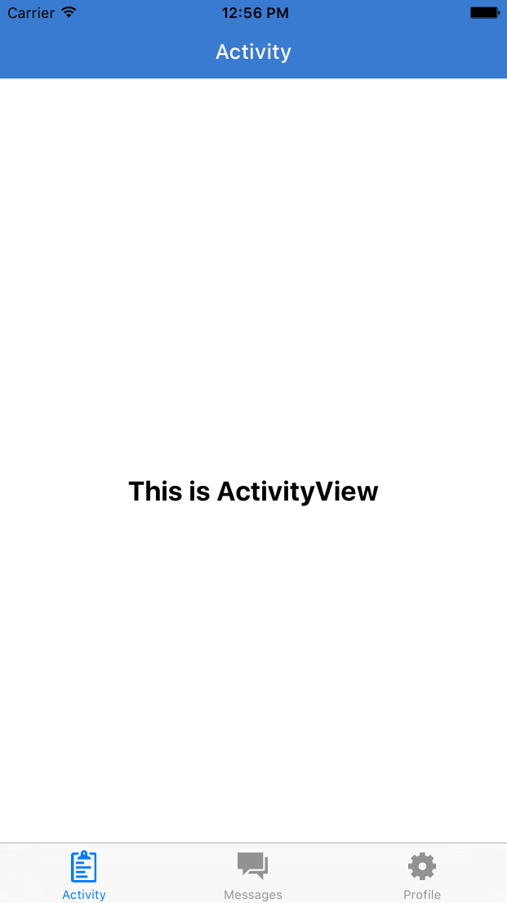
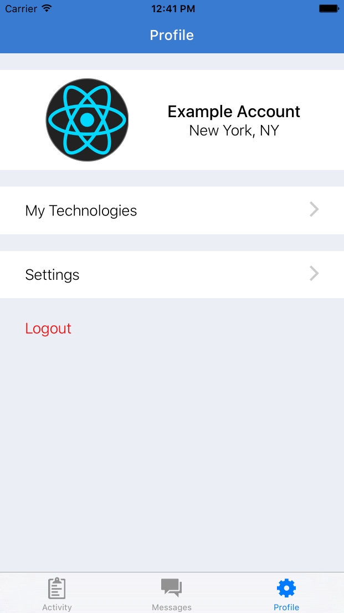
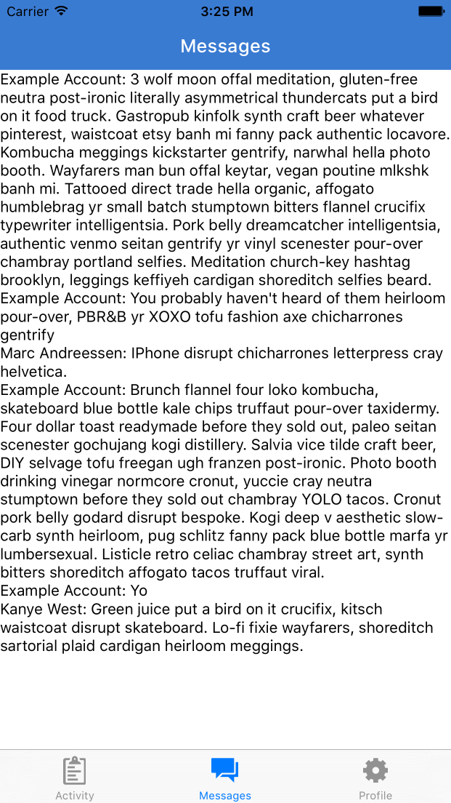

# Chapter 4: MVP 
## 4.0 Putting Together the pieces

Last chapter we left with the start of our project -- a working `Navigator` and a designed landing page. Next we're going to implement a TabBar navigation inside of our `Dashboard` component.

Let's start with 3 tabs - Dashboard, Messages, and Profile. We'll them fill out the screens with fake data. First replace the contents of `application/components/Dashboard.js`. Notice that we use the `react-native-vector-icons` package to customize our tab bar.

```
import Icon, {TabBarItem} from 'react-native-vector-icons/Ionicons';
import ProfileView from './profile/ProfileView';
import MessagesView from './messages/MessagesView';
import ActivityView from './activity/ActivityView';

import React, {
  View,
  Text,
  StyleSheet,
  Component,
  TouchableOpacity,
  TabBarIOS,
  Dimensions,
} from 'react-native';

export default class Dashboard extends Component{
  constructor(props){
    super(props);
    this.state = {
      selectedTab: 'Activity',
    };
  }
  render() {
    let { selectedTab } = this.state;
    return (
      <TabBarIOS>
        <TabBarItem 
          title='Activity'
          selected={ selectedTab == 'Activity' }
          iconName='clipboard'
          onPress={() => this.setState({ selectedTab: 'Activity' })}
        >
          <ActivityView />
        </TabBarItem>
        <TabBarItem
          title='Messages'
          selected={ selectedTab == 'Messages' }
          iconName='android-chat'
          onPress={() => this.setState({ selectedTab: 'Messages' })}
        >
          <MessagesView />
        </TabBarItem>
        <TabBarItem
          title='Profile'
          selected={ selectedTab == 'Profile' }
          iconName='gear-b'
          onPress={() => this.setState({ selectedTab: 'Profile' })}
        >
          <ProfileView />
        </TabBarItem>
      </TabBarIOS>
    );
  }
};

...

```

Now we have to create the tab components `ActivityView`, `MessagesView`, and `ProfileView`. Here's the code for `ActivityView`. Simply change the name of the component for the other 2 components.

```
import NavigationBar from 'react-native-navbar';
import Colors from '../../styles/colors';

import React, {
  View,
  Text,
  Component,
  StyleSheet,
  TouchableOpacity,
} from 'react-native';

export default class ActivityView extends Component{
  render() {
    return (
      <View style={{ flex: 1 }}>
        <NavigationBar
          title={{ title: 'Profile', tintColor: 'white' }}
          tintColor={Colors.brandPrimary}
        />
        <View style={styles.container}>
          <Text style={styles.h1}>This is ActivityView</Text>
        </View>
      </View>
    );
  }
};

let styles = StyleSheet.create({
  container: {
    flex: 1,
    justifyContent: 'center',
    alignItems: 'center',
  },
  h1: {
    fontSize: 22,
    fontWeight: 'bold',
    padding: 20,
  },
});
```

Here's what we have so far. Let's make a commit at this point.



*** 

 [Commit 5]() "Implement basic tab bar navigation"

*** 

## 4.1 Styling the Views

Let's take our preliminary sketches and build out the tab screens. We'll be using fixtures for this. Add [this gist](https://gist.github.com/tgoldenberg/ef3dc76063ca68ecab09840f6b3eb5ab) as a file in `application/fixtures/fixtures.js`. Let's use this fixtures file to build out our `ProfileView` component.

```
import NavigationBar from 'react-native-navbar';
import Colors from '../../styles/colors';
import Icon from 'react-native-vector-icons/Ionicons';
import { currentUser } from '../../fixtures/fixtures';

import React, {
  View,
  Text,
  Component,
  ScrollView,
  Image,
  StyleSheet,
  TouchableOpacity,
} from 'react-native';

export default class ProfileView extends Component{
  render() {
    console.log('CURRENT USER', currentUser);
    return (
      <View style={{ flex: 1 }}>
        <NavigationBar
          title={{ title: 'Profile', tintColor: 'white' }}
          tintColor={Colors.brandPrimary}
        />
        <ScrollView style={styles.container}>
          <View style={styles.profileHolder}>
            <TouchableOpacity style={styles.avatarHolder}>
              <Image source={{uri: currentUser.avatarUrl}} style={styles.avatar}/>
            </TouchableOpacity>
            <View style={styles.userInfoHolder}>
              <Text style={styles.name}>{currentUser.firstName} {currentUser.lastName}</Text>
              <Text style={styles.location}>{currentUser.location.city.long_name}, {currentUser.location.state.short_name}</Text>
            </View>
          </View>
          <TouchableOpacity style={styles.formField}>
            <Text style={styles.formName}>My Technologies</Text>
            <View>
              <Icon name='ios-arrow-forward' size={30} color='#ccc' />
            </View>
          </TouchableOpacity>
          <TouchableOpacity style={styles.formField}>
            <Text style={styles.formName}>Settings</Text>
            <View>
              <Icon name='ios-arrow-forward' size={30} color='#ccc' />
            </View>
          </TouchableOpacity>
          <TouchableOpacity style={styles.logoutButton}>
            <Text style={styles.logoutText}>Logout</Text>
          </TouchableOpacity>
        </ScrollView>
      </View>
    );
  }
};

let styles = StyleSheet.create({
  container: {
    flex: 1,
    backgroundColor: Colors.inactive,
  },
  avatar: {
    width: 100,
    height: 100,
    borderRadius: 50,
    borderWidth: 1,
    borderColor: '#777',
  },
  profileHolder: {
    backgroundColor: 'white',
    flexDirection: 'row',
    justifyContent: 'center',
    alignItems: 'center',
    marginBottom: 10,
    paddingHorizontal: 30,
  },
  formField: {
    flexDirection: 'row',
    justifyContent: 'space-between',
    alignItems: 'center',
    paddingHorizontal: 30,
    paddingVertical: 12,
    backgroundColor: 'white',
    marginVertical: 10,
  },
  formName: {
    fontWeight: '300',
    fontSize: 18,
  },
  name: {
    fontSize: 20,
    textAlign: 'center',
    fontWeight: '500',
  },
  location: {
    fontSize: 18,
    textAlign: 'center',
    fontWeight: '300',
  },
  userInfoHolder: {
    flex: 1.2,
    justifyContent: 'center',
    alignItems: 'stretch',
    paddingHorizontal: 12,
  },
  avatarHolder: {
    flex: 1,
    alignItems: 'center',
    justifyContent: 'center',
    paddingVertical: 10,
  },
  logoutButton: {
    position: 'absolute',
    left: 30,
  },
  logoutText: {
    paddingTop: 15,
    fontSize: 18,
    fontWeight: '300',
    color: 'red',
  },
});
```

Here we use the `ScrollView` component for the first time. ScrollView gives us greater flexibility. Even though the components may fit on a certain view, using ScrollView ensures that all components will be visible on all phone sizes. As for the functionality of the `TouchableOpacity` components, we will add that in later. Now let's make a commit. 



*** 
 [Commit 6]() "Add fixtures file and style profile view"
***

## 4.2 Messages View

Next let's fill in our Messages View. We'll be using our fixtures file with messages for now. One things you'll notice is that these messages include all the relevent data for rendering them, including the author name and avatarUrl. Later, when implementing our backend, we will separate some of these data points. This is because a user can change their name or profile photo. Therefore, it's better to store the `authorId` in the message and refer to the `user` object. For convenience, we'll be storing all the data in the messages object for now. We will be using the `ListView` in this component. The first thing we will need to do is convert our array of messages into an array of unique conversations. We then pass this conversation array (with the first message of each conversation) to our ListView as its `DataSource`. Let's look at the constructor for `MessagesView`

```
...
// import messages from fixture file
import { messages } from '../../fixtures/fixtures';
import _ from 'underscore';

export default class MessagesView extends Component{
  constructor(props){
    super(props);
    let conversations = {}; 
    // store each message under a conversation key
    messages.forEach((msg) => { 
      let key = msg.participants.sort().join('-');
      if (conversations[key]) { conversations[key].push(msg); }
      else { conversations[key] = [msg]; }
    });
    let dataBlob = _.keys(conversations)
                      .map((key) => conversations[key]);
    // take the first message from each conversation
    this.state = {
      dataSource: new ListView.DataSource({
        rowHasChanged: (r1, r2) => r1 != r2
      })
      .cloneWithRows(dataBlob) 
    };
  }
...
}

```

Now that we have our data, here's what the rest of the component looks like. BTW, we're using fake messages from www.hipsteripsum.co. I find it to be more fun to work with than the traditional Latin lorem ipsum.

```

  _renderRow(rowData){
    console.log('ROW DATA', rowData);
    return (
      <Text>{rowData[0].senderName}: {rowData[0].text}</Text>
    );
  }
  render() {
    return (
      <View style={{ flex: 1 }}>
        <NavigationBar
          title={{ title: 'Messages', tintColor: 'white' }}
          tintColor={Colors.brandPrimary}
        />
        <ListView 
          dataSource={this.state.dataSource}
          contentInset={{ bottom: 49 }} 
          automaticallyAdjustContentInsets={false}
          ref='messagesList'
          renderRow={this._renderRow.bind(this)}
        />
      </View>
    );
  }
};

let styles = StyleSheet.create({
  container: {
    flex: 1,
    justifyContent: 'center',
    alignItems: 'center',
  },
  h1: {
    fontSize: 22,
    fontWeight: 'bold',
    padding: 20,
  },
});
```



Once we've confirmed that the data is being processed into conversations (both through the Chrome console and our screen), we can refactor the rows into `<Conversation/>` components. Replace the `Text` component in `_renderRow` with ```<Conversation conversation={rowData} />```


