# Chapter 5: User Accounts - pt.1

In the last chapter we left off with a nice prototype to build from. Now it’s time to flesh out the app with real dynamic data. This means we’ll be needing an **API** endpoint to send requests to.  The word **API** stands for **application programming interface** – it's the tool we use to interact with our data, through HTTP requests. 

## 5.1 Setting up Deployd 

One of the first concerns with just about any API is creating and managing user accounts. Users should be able to create an account, login, logout, etc. While there are several good options for user management such as **Rails** (the *Devise* gem), **MeteorJS**, etc., we will be using the Node package **Deployd** as our API. 

**Deployd** abstracts the API creation process for us through an easy-to-use command line tool and intuitive interface. Since we want to focus on the mobile development aspects of React Native in this tutorial, we thought it would be an excellent tool to use. There are, of course, situations where a more configurable API would be very useful. But we found that **Deployd** meets our needs for the most part.

Getting the API started is easy. As per **Deployd**’s documentation, we make sure that the package is installed globally on our machine. 

```npm install –g dpd```

Check to make sure that the package was installed. `dpd –version`. You should see something like this. 

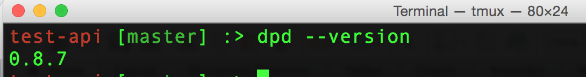 

Next, we can create our API with a simple command. `dpd create assemblies-api`.
You should see instructions for opening and running the newly created API. If we `cd` into the created folder and type the command `dpd`, our API will be up and running.

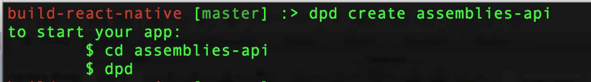 

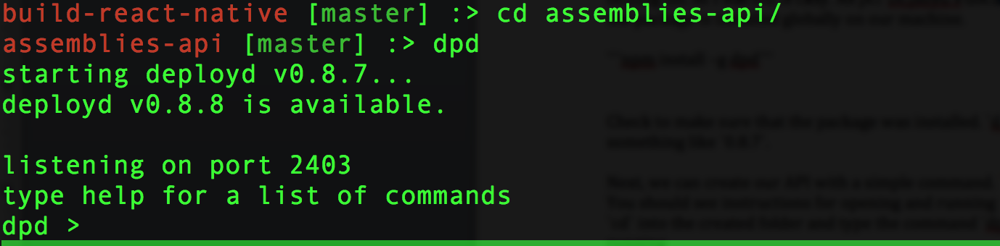
 
If you open your browser to `localhost:2403/dashboard`, you can see a visual representation of the API. We can use the dashboard to add "resources", and it is easy to edit the fields of our resources as well. 

We know that we need a users collection, so let’s start by creating that. By selecting the `users` options under *adding resources*, we can see that **Deployd** creates a default collection with the fields `id`, `username`, and `password`. **Deployd** requires these three fields, even if you don’t plan on having a username for your users. One way around this is to designate the `username` field for the user’s email. The only criteria is that this field be unique for all users.

We can add other fields to our user collection. How about location? We will want to know where our users live, in order to suggest other assemblies. We will also want their first and last names, a URL for their avatar, and some of their interests, in order to filter the assemblies we suggest for them. Here are all the fields  we'll be adding to our `users` collection, along with their data type.

```JavaScript
username    String
id          String
password    String
firstName   String
lastName    String
location    Object
interests   Array
avatarUrl   String
```

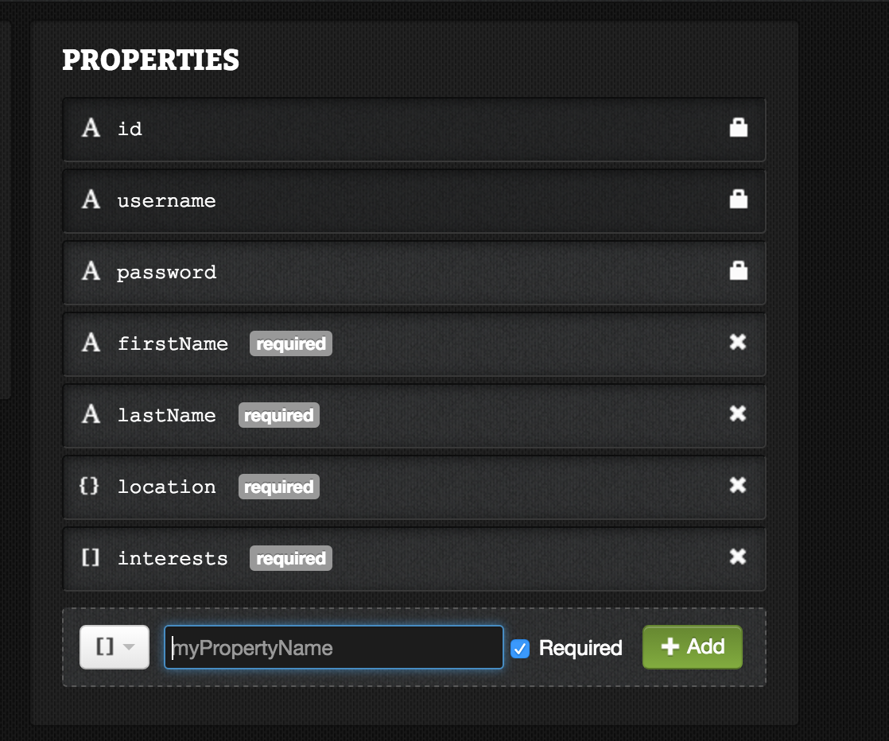 


Now in our `Landing` component, let’s add two buttons in place of the previous `Go to dashboard` button - `Login` and `Signup`. 

In place of the previous button on `Landing.js`, put this code: 
```JavaScript
…
<TouchableOpacity
  style={[styles.button, styles.loginButton]}
  onPress={() => {
    this.props.navigator.push({
      name: 'Login' 
    })
  }}
>
  <Icon style={styles.icon} name='person' size={36} color={Colors.brandPrimary} />
  <Text style={[styles.buttonText, styles.loginButtonText]}>Login</Text>
</TouchableOpacity>
<TouchableOpacity
  style={styles.button}
  onPress={() => {
    this.props.navigator.push({
      name: 'Register'
    })
  }}
>
  <Icon style={styles.icon} name='person' size={36} color='white' />
  <Text style={styles.buttonText}>Create an account</Text>
</TouchableOpacity>
…
```
and add the following styles below it:

```javascript
…
loginButton: {
    bottom: 80,
    backgroundColor: Colors.inactive
  },
loginButtonText: {
    color: Colors.brandPrimary
  }
…
```
Notice how we use an array of styles for two of the elements, in order to reuse the styles we already created. This is a common convention in React Native. Ideally, you would like to follow the principle of **DRY** – don’t repeat yourself. This means that wherever there is duplication of code, we refactor out those styles to a more general style, for example, a “*button*” style. 

However, part of the fun of building with React Native is the fast iteration. Later on, we’ll be able to assess how we can best refactor our styles for future maintainability. For now, it’s enough if we refactor styles whenever it’s convenient. This doesn’t mean that we should make a big spaghetti mess of JavaScript styles, but we want to build out our prototype quickly. Follow Nick’s advice for styling in React Native for more insight.

Next, we have to create the routes for both “**Register**” and “**Login**” and create forms for our users to create an account and sign in.  In `index.ios.js` or `index.android.js` (depending on what you are building), add the following lines in the `switch` statement. Don’t forget to `import` the referenced files at the top of the file.
```javascript
…
import Register from './application/components/accounts/Register';
import Login from './application/components/accounts/Login';
…
case 'Register':
  return <Register navigator={navigator} />
case 'Login':
  return <Login navigator={navigator} />
…
```

Now let’s create our `<Login/>` and `<Register/>` components. To test out the routing, let’s just start with some minimal components.

```javascript
application/components/accounts/Register.js

import React, { Component } from 'react';
import {
  Text,
  View
} from 'react-native';

class Register extends Component{
  render(){
    return (
      <View style={styles.container}>
        <Text>REGISTER</Text>
      </View>
    )
  }
}

let styles = {
  container: {
    flex: 1,
    backgroundColor: 'white',
    justifyContent: 'center',
    alignItems: 'center'
  }
}

export default Register;
```

```JavaScript
application/components/accounts/Login.js

import React, { Component } from 'react';
import {
  Text,
  View
} from 'react-native';

class Login extends Component{
  render(){
    return (
      <View style={styles.container}>
        <Text>LOGIN</Text>
      </View>
    )
  }
}

let styles = {
  container: {
    flex: 1,
    justifyContent: 'center',
    backgroundColor: 'white',
    alignItems: 'center'
  }
}

export default Login;

```

You should see something like these screenshots when you click to either the `Login` or `Register` routes.

  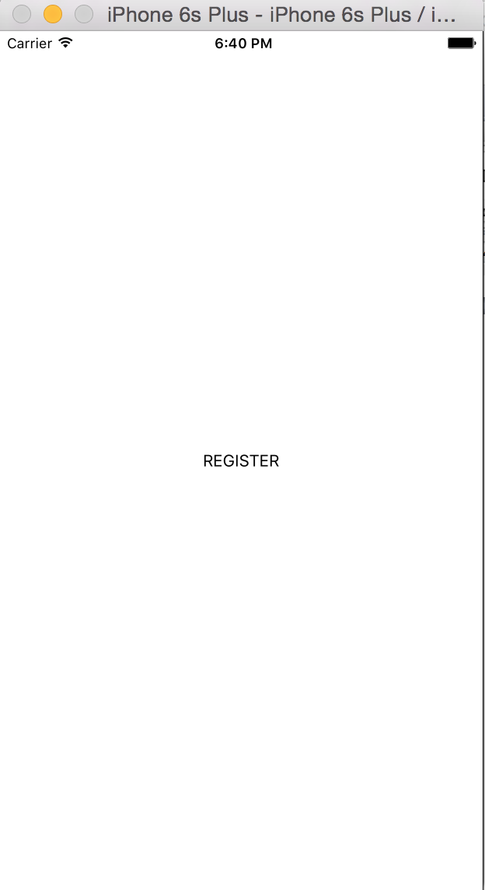
  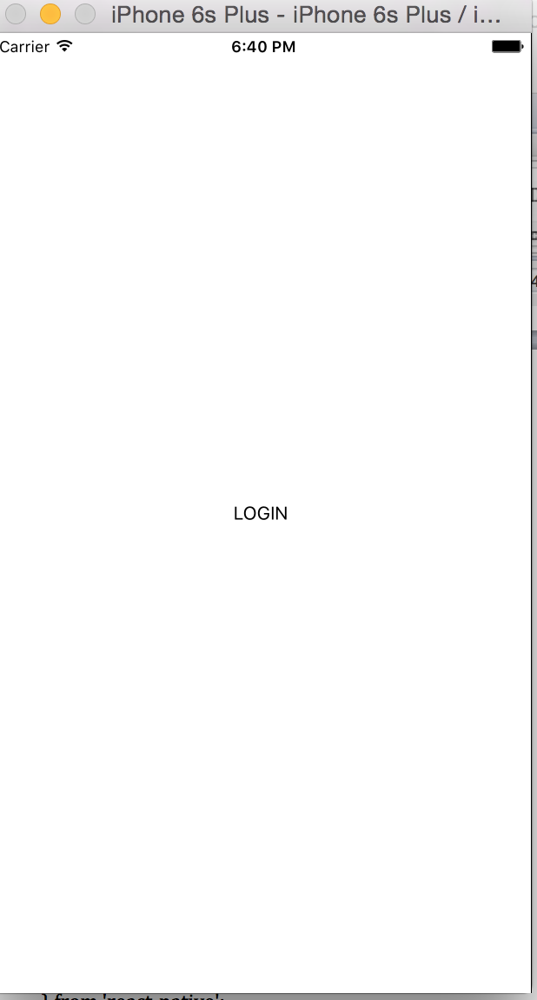

Now is probably a good time to commit our changes. 

***
[ Commit 1: "Add basic Login and Register routes"]()

## 5.2. Building a Login and Register Form 

Now that our routing works, let’s build a form for our users to fill out. For login, we’ll only need an email and password. For registration, however, we’ll need more data. Let’s start with the login form, since it’s a bit easier. 

Now, there are several unique issues that we have to deal with when building forms in React Native. You may be used to building forms for the web, using the `<form>` element and maybe the `onSubmit` callback in React for the web.  In React Native, we’ll primarily be using components such as `<TextInput/>`, `<PickerIOS/>`, and so on. We’ll trigger our `onSubmit` callback when the user presses the submit button. Also, it’s important to be aware of whether the user can see the input field when the keyboard expands up. This is an issue we’ll deal with later. For now, let’s just build a simple login form.

```javascript
Login.js

import React, { Component } from 'react';
import {
  Text,
  View,
  Dimensions,
  ScrollView,
  TextInput,
  TouchableOpacity,
} from 'react-native';
import Globals from '../../styles/globals';
import Colors from '../../styles/colors';

const { width: deviceWidth, height: deviceHeight } = Dimensions.get('window');

class Login extends Component{
  constructor(props){
    super(props);
    this.loginUser = this.loginUser.bind(this)
    this.state = {
      email           : '',
      password        : '',
      errorMsg        : '',
      sendingData     : false,
    };
  }
  loginUser(){
    console.log('Logging in...');
  }
  render(){
    let { errorMsg } = this.state;
    return (
      <View style={styles.container}>
        <ScrollView
          ref="scrollView"
          keyboardDismissMode="interactive"
          contentContainerStyle={styles.contentContainerStyle}
          style={styles.formContainer}>
          <Text style={styles.h4}>{"Login with your email and password."}</Text>
          <Text style={styles.h4}>Email</Text>
          <View style={styles.formField} ref="email">
            <TextInput
              ref="email"
              autoFocus={true}
              returnKeyType="next"
              onSubmitEditing={() => this.refs.passwordField.focus()}
              onChangeText={(text)=> this.setState({email: text})}
              keyboardType="email-address"
              autoCapitalize="none"
              maxLength={140}
              placeholderTextColor='#bbb'
              style={styles.input}
              placeholder="Your email address"
            />
          </View>
          <Text style={styles.h4}>Password</Text>
          <View style={styles.formField} ref="password">
            <TextInput
              ref="passwordField"
              returnKeyType="next"
              onChangeText={(text)=> this.setState({password: text})}
              secureTextEntry={true}
              autoCapitalize="none"
              maxLength={140}
              placeholderTextColor='#bbb' style={styles.input} placeholder="Your password"
            />
          </View>
          <View style={styles.error}>
            <Text>{errorMsg}</Text>
          </View>
        </ScrollView>
        <TouchableOpacity style={Globals.submitButton} onPress={this.loginUser}>
          <Text style={Globals.submitButtonText}>Login</Text>
        </TouchableOpacity>
      </View>
    )
  }
}

let styles = {
  container: {
    flex: 1,
  },
  backButton: {
    paddingLeft: 20,
    paddingRight: 20,
    backgroundColor: 'transparent',
    paddingBottom: 20,
    paddingTop: 0,
    width: 50,
    height: 50,
  },
  formContainer: {
    backgroundColor: Colors.inactive,
    flex: 1,
    paddingTop: 15,
  },
  submitButton: {
    justifyContent: 'center',
    alignItems: 'center',
    backgroundColor: Colors.brandPrimary,
    height: 80,
  },
  error: {
    backgroundColor: Colors.inactive,
  },
  buttonText: {
    color: 'white',
    textAlign: 'center',
    fontSize: 25,
    fontWeight: '400'
  },
  contentContainerStyle: {
    flex: 1,
  },
  h4: {
    fontSize: 20,
    fontWeight: '300',
    color: 'black',
    paddingHorizontal: 20,
    paddingVertical: 5,
  },
  formField: {
    backgroundColor: 'white',
    height: 50,
    paddingTop: 5,
    marginBottom: 10,
  },
  largeFormField: {
    backgroundColor: 'white',
    height: 100,
  },
  addPhotoContainer: {
    backgroundColor: 'white',
    marginVertical: 15,
    marginHorizontal: (deviceWidth - 200) / 2,
    width: 200,
    borderRadius: 30,
    paddingVertical: 15,
    paddingHorizontal: 10,
    flexDirection: 'row',
    justifyContent: 'center',
    alignItems: 'center',
  },
  photoText: {
    fontSize: 18,
    paddingHorizontal: 10,
    color: Colors.brandPrimary
  },
  input: {
    color: '#777',
    fontSize: 18,
    fontWeight: '300',
    height: 40,
    paddingHorizontal: 20,
    paddingVertical: 5,
  },
  largeInput: {
    color: '#ccc',
    fontSize: 18,
    backgroundColor: 'white',
    fontWeight: '300',
    height: 100,
    paddingHorizontal: 20,
    paddingVertical: 5,
  },
}

export default Login;
``` 

Here we start to reference some global styles. Create the file `application/styles/globals.js` and fill it with these styles. Many of these styles won’t be used till later, but better to just have them ready now.

```javascript 
import React from 'react-native';
import Colors from './colors';

let {
  StyleSheet,
  Dimensions,
} = React;

let {
  width: deviceWidth,
  height: deviceHeight
} = Dimensions.get('window');

let globals = StyleSheet.create({
  twoColumnGridContainer: {
    flex: 1,
    flexDirection: 'row',
    flexWrap: 'wrap',
  },
  backButton: {
    paddingLeft: 20,
    paddingRight: 20,
    backgroundColor: 'transparent',
    paddingBottom: 20,
    paddingTop: 0,
    width: 50,
    height: 50,
  },
  inactiveContainer: {
    flex: 1,
    backgroundColor: Colors.inactive
  },
  heading: {
    color: Colors.bodyText,
    fontSize: 22,
    padding: 15
  },
  bodyText: {
    color: Colors.bodyText,
    fontSize: 16,
    paddingHorizontal: 15
  },
  button: {
    height: 60,
    width: deviceWidth,
    backgroundColor: Colors.brandPrimary,
    justifyContent: 'center'
  },
  buttonText: {
    color: '#ffffff',
    textAlign: 'center'
  },
  inputContainer: {
    paddingBottom: 30
  },
  submitButton: {
    justifyContent: 'center',
    alignItems: 'center',
    backgroundColor: Colors.brandPrimary,
    height: 70,
  },
  submitButtonText: {
    color: 'white',
    textAlign: 'center',
    fontSize: 25,
    fontWeight: '400'
  },
  input: {
    borderWidth: 0,
    backgroundColor: '#ffffff',
    height: 50,
    paddingLeft: 12,
    fontSize: 16,
  },
  textarea: {
    borderWidth: 0,
    backgroundColor: '#ffffff',
    height: 100,
    paddingTop: 10,
    paddingLeft: 12,
    paddingBottom: 10,
    fontSize: 16
  },
  inputError: {
    color: 'red',
    paddingHorizontal: 12,
    paddingBottom: 6
  },
  inputLabel: {
    color: Colors.bodyText,
    fontSize: 16,
    paddingHorizontal: 12,
    paddingBottom: 8
  },
  map: {
    height: (deviceHeight / 3),
    width: deviceWidth
  }
})

module.exports = globals;

```

Let’s make a commit here, before making the login calls to our API. 

***
[ Commit 1: "Add basic login component"]()

## 5.3 Adding the API to Login

Now we’re ready to collect our user’s email and password and create a session with our API. In production, we would be pointing our requests to an API hosted on a server such as Digital Ocean, AWS, or Heroku. While in development, it’s enough to point to our localhost with the port that is running Deployd. We can set a config file with our API endpoint set to `localhost:2403`, and when we’re ready for production, we can change the endpoint to the URL of the server that is hosting our API. 

Let’s create a file `application/config/config.js` and add the following lines:

```javascript
export const DEV = true;

export const API = ‘http://localhost:2403’;
```

Now we can refer to our endpoint as ‘../../config/config’ from within our components.

Now, let’s think about what we want to do.  With **Deployd**, we first have to call the `/users/login` endpoint with the username and password. Our API will return the user’s ID, and a session variable (or cookie). From here, we will want to get all of the user’s information, so we will have to call to **Deployd** to fetch the user information for the user_id. This would be `/users/me`, once we’re logged in.

If the user is not allowed to log in, we want to display a generic error message, to the effect that the email and password combination was invalid. Giving too much information in a login form can be a bad idea.

To make our API calls, we’ll be using `fetch`. React Native supports the `fetch` API, which was recently introduced into most browsers, and it gives us a simple way of sending HTTP requests. For more information about `fetch` and about promises in general, check out the W3 documentation.

```JavaScript
Login.js
...
  loginUser(){
    if (DEV) { console.log('Logging in...'); }
    let { email, password } = this.state;
    let { updateUser } = this.props;
    fetch(`${API}/users/login`, {
      method: 'POST',
      headers: {
        'Content-Type': 'application/json'
      },
      body: JSON.stringify({
        username: email,
        password: password
      })
    })
    .then(response => response.json())
    .then(data => {
      if (data.status == 401 ){
        this.setState({ errorMsg: 'Email or password was incorrect.'});
      } else {
        fetch(`${API}/users/me`, {
          method: 'GET',
          headers: {
            'Content-Type': 'application/json',
            'Set-Cookie': `sid=${data.id}`
          }
        })
        .then(response => response.json())
        .then(data => {
          if (DEV) { console.log('Logged in user', data); }
          updateUser(data);
          this.props.navigator.push({
            name: 'Dashboard'
          })
        })
        .catch(err => this.setState({ errorMsg: 'Connection error.'}))
        .done();
      }
    })
    .catch(err => {
      if (DEV) { console.log('Login error: ', err); }
    })
    .done();
  }
...
```

```JavaScript
index.ios.js
...
  constructor(){
    super();
    this.updateUser = this.updateUser.bind(this);
    this.state = {
      user: null
    };
  }
  updateUser(user){
    this.setState({ user: user });
  }
  ...
  case 'Login':
    return <Login navigator={navigator} updateUser={this.updateUser}/>
  ...
```

Notice a few things here. First of all, we are only calling `console.log` if `DEV` is set to true. This is because often times when running the Simulator in React Native, `console.log`'s can slow down performance. When we want to switch to production, it's important to make sure that these aren't being called to ensure a smooth user experience. Here, since we are debugging, we want to see these debugging messages in our browser console.

The parameter to `fetch` is the URL from which we are fetching data. With ES6, we are able to use string interpolation, which feels neater than writing `API + '/users/me'`, etc. We are also specifying the type of HTTP request (usually `GET` or `POST`) and headers. As per the Deployd docs, we supply a session cookie to retrieve the user information. Try logging into the app!

Once we receive the user's information, we send a callback to our `<Navigator/>` component to update it's state, setting `user` to the new data. Then we navigate to the Dashboard with our logged in user, that simple.

When you try logging in, you should see an error message like this. This is because we forgot to create a user! Luckily, Deployd makes this easy to get started.

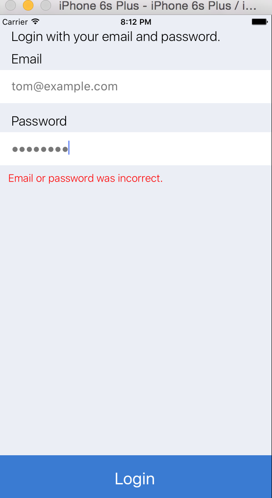

If we open up the dashboard for Deployd in our browser window (at `localhost:2403/dashboard`), we can actually manually insert a user. Open the `users` collection, and select the `data` tab. Now start typing, and you should see the fields fill up. When filling in values that expect arrays or objects, make sure to use double quotes and not single quotes. Here is what our screen looks like. 


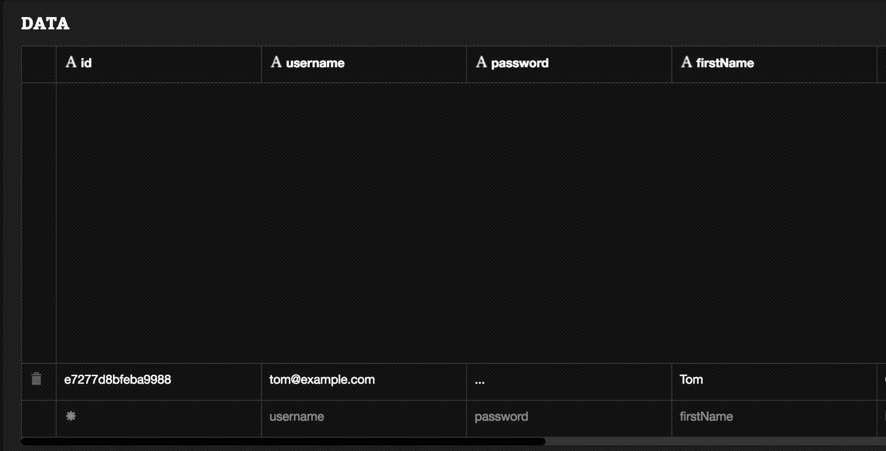
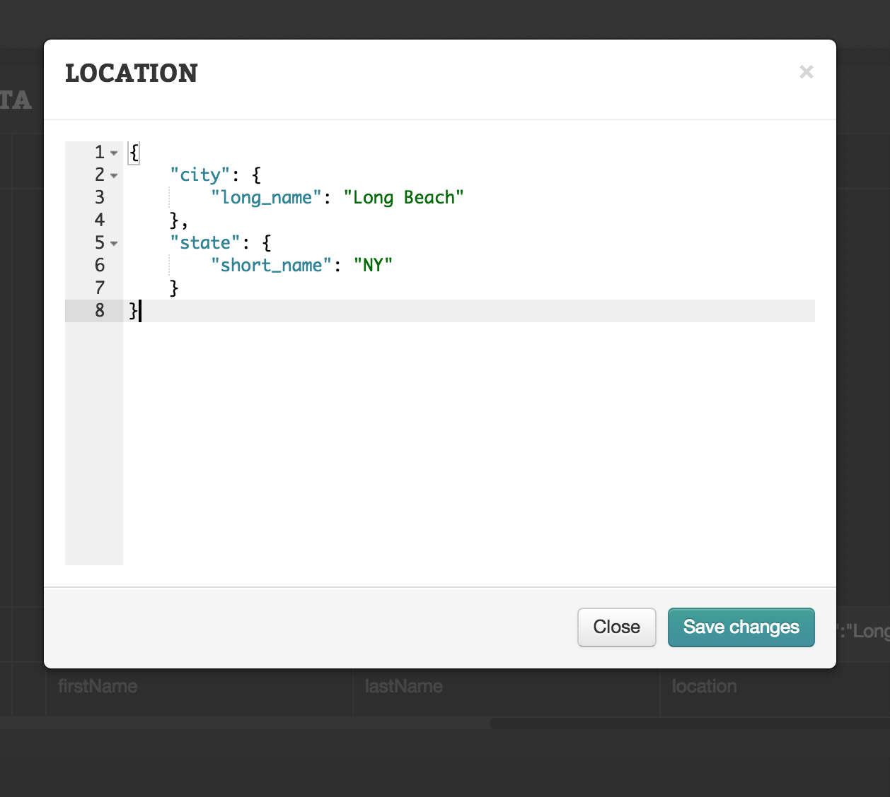
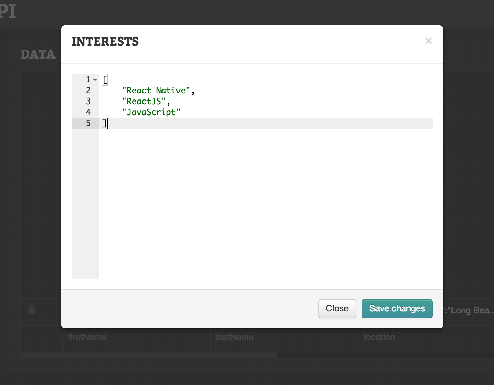

Now when we login with the correct email and password, we should get a response with the user information, and we can then redirect to the dashboard. Voila! Let's not forget to make a commit at this point.

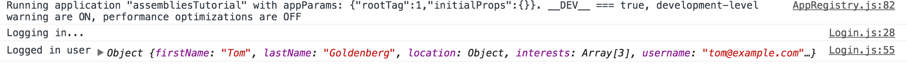
`Git commit -am "Create user login"`

## 5.4 A Real Profile View

Now that we have real user data, we can start to flesh out parts of our app. Our profile view, for example, should be pretty easy to update. We just have to ensure that the user data that is passed to the `<Dashboard/>` component gets passed to our profile view. Let's see what that looks like.

```JavaScript 
application/components/profile/ProfileView.js
...
  // import { currentUser } from '../../fixtures/fixtures';
...
  // console.log('CURRENT USER', currentUser);
  let { currentUser } = this.props;
...
```
```JavaScript
application/components/Dashboard.js
  ...
  let { user } = this.props;
  ...
  <ProfileView currentUser={user}/>
  ...
```

Now our profile view should have real dynamic data. If we log in as a different user, we'll see entirely different information. Pretty cool!

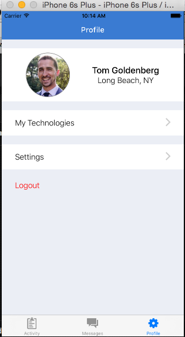

Now that we've allowed our users to log in and fleshed out our `<ProfileView/>` with real data, we still need to allow users to create their account, and logout. That will come next in chapter 6.