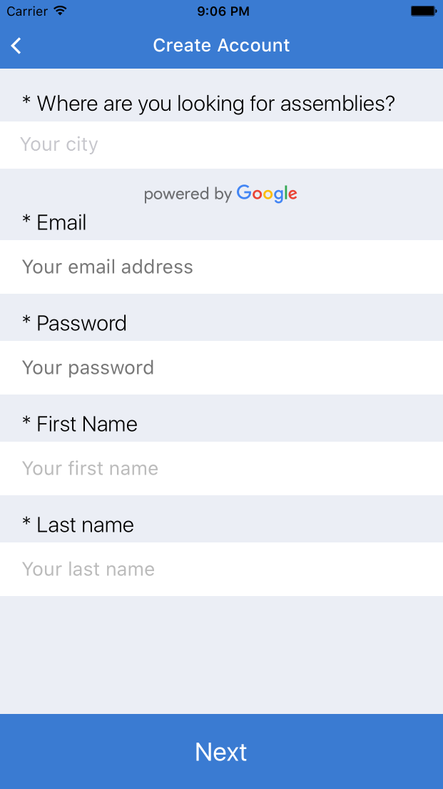

At the end of the last chapter, we had created a user through **Deployd**, logged into the dashboard and fleshed out the Profile view with real data. However, there are two important things that we neglected related to user accounts. These are logging out and registering an account.

## Logging Out

Since registering is much trickier, let’s first implement logging out. Our API has an endpoint for logout - **/users/logout**. When the user initiates logout, we want to call this endpoint and then redirect the user to the Landing page.

Let’s edit our **ProfileView** and **Dashboard** to reflect these changes. We will reference `this.props.logout` in the **ProfileView** and define the method in the parent **Dashboard**.

```javascript
/* application/components/profile/ProfileView.js */
…
<TouchableOpacity 
  style={styles.logoutButton} 
  onPress={this.props.logout}
>
  <Text style={styles.logoutText}>
    Logout
  </Text>
</TouchableOpacity>
…
```
```javascript
/* application/components/Dashboard.js */
...
import { Headers } from '../fixtures';
import { API } from '../config';

class Dashboard extends Component{
  constructor(){
    super();
    this.logout = this.logout.bind(this);
    this.state = {
      selectedTab: 'Activity'
    };
  }
  logout(){ 
    fetch(`${API}/users/logout`, { method: 'POST', headers: Headers })
    .then(response => response.json())
    .then(data => this.props.logout())
    .catch(err => {})
    .done();
  }
  render(){
    return (
  ...
  
        <TabBarItemIOS
          title='Profile'
          selected={this.state.selectedTab === 'Profile'}
          iconName='ios-person'
          onPress={() => this.setState({ selectedTab: 'Profile' })}
        >
          <ProfileView currentUser={user} logout={this.logout}/>
        </TabBarItemIOS>
      </TabBarIOS>
    )
  }
}

export default Dashboard;

```
Finally, we need to receive the **logout** callback in our main **Navigator** component, and direct the navigation back to **Landing**. 

```javascript
/* index.ios.js */
...
class assemblies extends Component {
  constructor(){
    super();
    this.logout = this.logout.bind(this);
    this.updateUser = this.updateUser.bind(this);
    this.state = {
      user: null
    }
  }
  logout(){
    this.nav.push({ name: 'Landing' })
  }
  render() {
    return (
      <Navigator
        style={globals.flex}
        ref={(el) => this.nav = el }
        initialRoute={{ name: 'Landing' }}
        renderScene={(route, navigator) => {
          switch(route.name){
            case 'Landing':
              return (
                <Landing navigator={navigator}/>
            );
            case 'Dashboard':
              return (
                <Dashboard
                  navigator={navigator}
                  logout={this.logout}
                />
            );
           /* ... */
          }
        }}
      />
    );
  }
}
...
```

Let’s commit at this point.

[Commit 10 - "Add logout" ](https://github.com/buildreactnative/assemblies-tutorial/tree/5ea8b37ecd7d40f66a7270f6c60a0e4115264413)

## Registration Form - Part 1

Now we’re left with the most complex part of user accounts – registration. This doesn’t *have* to be complicated; we could just ask for our users' email and a password. After all, that’s enough information to create a user with Deployd. However, we want more information about our users. We want to know what city they live in, so we can suggest nearby meetups. We want to know what technologies they are interested in, for similar reasons. We want their first and last name, since many “assemblies” require a person’s real name to be admitted to the venue location. Finally, we want an avatar for our users so that our users are able to know each other a little better.

We could, of course, just make a single view with all of these inputs available. However, that wouldn’t be a very good user experience. Long forms are off-putting to potential users, and we want our registration process to be relatively smooth. That’s why we take a step-wise approach for user registration.

In step 1, the user will enter their email, first and last name, and password – all absolutely necessary information. In step 2, we will ask the user for their interests, location, and a photo to use as their avatar. All of these steps, except for the user’s location, are optional. If the user doesn’t select an avatar, we can use a default image. If the user doesn’t specify their interests, we can ask for them later.

Let’s flesh out step 1 of our user registration process. Include these in your `package.json` and then run `npm install`:

```
"react-native-config": "0.0.7",
"react-native-google-places-autocomplete": "https://github.com/tgoldenberg/react-native-google-places-autocomplete/tarball/master"
```

We're using a fork `react-native-google-places-autocomplete` since we've found some errors in different versions of React Native. This version should work fine, though.

### Google Places Autocomplete

We'll be using Google's Places API to get exact latitude and longitude information. To get an API key, which we will need, go to the website for [Google's Places services](https://developers.google.com/places/). From there, you will want to select the `Google Places API Web Service`, which is an `HTML` button. From there you can follow the steps to get your API key (You will have to create a project, and then access your credentials to get the API key).

Once we have the API key, where do we store it? Well, we want to make sure that we don't store it in our `git` repository, especially if our code will be hosted on a service like Github.

We'll be using the [`react-native-config`](https://github.com/luggg/react-native-config) package to manage these environment variables.

`npm install --save react-native-config`
`rnpm link`

Then create a `.env` file with your API key variable:
```
GOOGLE_PLACES_API_KEY=abcdefghijk
```
now add this filename to your `.gitignore` file

```
.env
```
If you check `git` with `git status`, you'll see that your file doesn't appear, which means it has effectively been ignored. Now we can access the variable in our `Register.js` file.
```javascript
...
import Config from 'react-native-config'
const key = Config.GOOGLE_PLACES_API_KEY,
...
```
You might have to restart all of the `node` processes to get this to work properly.

Now that we've set up our Google Places credentials, we can use them with the `react-native-google-places-autocomplete` package to help our users communicate their hometown.

```javascript
application/components/accounts/Register.js

import React, { Component } from 'react';
import Config from 'react-native-config';
import { Text, View, TextInput, TouchableOpacity, ScrollView } from 'react-native';
import Icon from 'react-native-vector-icons/Ionicons';
import NavigationBar from 'react-native-navbar';
import { GooglePlacesAutocomplete } from 'react-native-google-places-autocomplete';

import Colors from '../../styles/colors';
import BackButton from '../shared/BackButton';
import { DEV } from '../../config';
import { formStyles, autocompleteStyles, globals } from '../../styles';

const styles = formStyles;
const GooglePlacesKey = Config.GOOGLE_PLACES_API_KEY;

class Register extends Component{
  constructor(){
    super();
    this.goBack = this.goBack.bind(this);
    this.handleSubmit = this.handleSubmit.bind(this);
    this.selectLocation = this.selectLocation.bind(this);
    this.state = {
      email       : '',
      firstName   : '',
      lastName    : '',
      location    : null,
      password    : '',
    }
  }
  goBack(){
    this.props.navigator.pop();
  }
  selectLocation(data, details){
    /* TODO: handle location selection */
  }
  handleSubmit(){
    /* TODO: handle submit and direct to pt. 1 */
  }
  render(){
    return (
      <View style={globals.flexContainer}>
        <NavigationBar
          leftButton={<BackButton handlePress={this.goBack}/>}
          tintColor={Colors.brandPrimary}
          title={{ title: 'Create Account', tintColor: 'white' }}
        />
        <ScrollView style={styles.container}>
          <Text style={styles.h4}>* Where are you looking for assemblies?</Text>
          <View style={globals.flex}>
            <GooglePlacesAutocomplete
              autoFocus={false}
              currentLocation={false}
              currentLocationLabel="Current location"
              fetchDetails={true}
              filterReverseGeocodingByTypes={['street_address']}
              getDefaultValue={() => {return '';}}
              GooglePlacesSearchQuery={{rankby: 'distance',}}
              GoogleReverseGeocodingQuery={{}}
              minLength={2}
              nearbyPlacesAPI='GooglePlacesSearch'
              onPress={this.selectLocation}
              placeholder='Your city'
              predefinedPlaces={[]}
              query={{
                key: GooglePlacesKey,
                language: 'en',
                types: '(cities)',
              }}
              styles={autocompleteStyles}>
            </GooglePlacesAutocomplete>
          </View>
          <Text style={styles.h4}>* Email</Text>
          <View style={styles.formField}>
            <TextInput
              autoCapitalize="none"
              keyboardType="email-address"
              maxLength={144}
              onChangeText={(email) => this.setState({ email })}
              onSubmitEditing={() => this.password.focus()}
              placeholder="Your email address"
              placeholderTextColor={Colors.copyMedium}
              returnKeyType="next"
              style={styles.input}
            />
          </View>
          <Text style={styles.h4}>* Password</Text>
          <View style={styles.formField}>
            <TextInput
              autoCapitalize="none"
              maxLength={20}
              onChangeText={(password) => this.setState({ password })}
              onSubmitEditing={() => this.firstName.focus()}
              placeholder="Your password"
              placeholderTextColor={Colors.copyMedium}
              ref={(el) => this.password = el }
              returnKeyType="next"
              secureTextEntry={true}
              style={styles.input}
            />
          </View>
          <Text style={styles.h4}>* First Name</Text>
          <View style={styles.formField}>
            <TextInput
              maxLength={20}
              onChangeText={(firstName) => this.setState({ firstName })}
              onSubmitEditing={() => this.lastName.focus()}
              placeholder="Your first name"
              placeholderTextColor='#bbb'
              ref={(el) => this.firstName = el }
              returnKeyType="next"
              style={styles.input}
            />
          </View>
          <Text style={styles.h4}>* Last name</Text>
          <View style={styles.formField}>
            <TextInput
              maxLength={20}
              onChangeText={(lastName) => this.setState({ lastName })}
              placeholder="Your last name"
              placeholderTextColor='#bbb'
              ref={(el) => this.lastName = el }
              returnKeyType="next"
              style={styles.input}
            />
         </View>
       </ScrollView>
        <TouchableOpacity  style={styles.submitButton} onPress={this.handleSubmit}>
          <Text style={globals.largeButtonText}>Next</Text>
        </TouchableOpacity>
      </View>
    )
  }
}

export default Register;

```
Let's go through some new things here:
- Try not to be perplexed by the number of properties our `GooglePlacesAutocomplete` component takes in. The `query` field is where we establish our credentials, as well as specify whether we are searching for cities, addresses, etc. 
- There are many other options to customize the autocomplete component, but we find that the default settings as described on the Github repo work just fine. 
- The inputs for first name, last name, email, and password should look very familiar. They use the same properties that we discussed when building the Login component.
- We still need to fill in two functions -- `selectLocation` and `handleSubmit`. We've defined them but haven't added any code yet.



Let's make a commit there.

[Commit 11]() - "Add Google Places API configuration and render Register component"

## Saving Location Information

Alright, so that was the toughest part of building the first part of our registration form. Let's fill in the rest. We'll start by defining the methods `selectLocation` and `handleSubmit`. 

```javascript
...
selectLocation(data, details){
  if ( ! details ) { return; }
  let location = {
    ...details.geometry.location,
    city: find(details.address_components, (c) => c.types[0] === 'locality'),
    state: find(details.address_components, (c) => c.types[0] === 'administrative_area_level_1'),
    county: find(details.address_components, (c) => c.types[0] === 'administrative_area_level_2'),
    formattedAddress: details.formatted_address
  };
  this.setState({ location });
}
handleSubmit(){
  this.props.navigator.push({
    name: 'RegisterConfirmation',
    ...this.state
  })
}
...
```

Here's what is happening:
- The Google Places API gives us a lot of data. We are mainly concerned with the latitude, longitude (included in `details.geometry.location`), but also, the city, state, county, and formatted address information. Therefore, we save this information to  a location object.
- As for our `handleSubmit` method, we simply pass the component state to the next route, `RegisterConfirm`. 

Now we have to define our new route, `RegisterConfirm`. Let's start with a simple component, as we usually do.

```javascript
import React, { Component } from 'react';
import { View, Text } from 'react-native';
import Icon from 'react-native-vector-icons/Ionicons';
import NavigationBar from 'react-native-navbar';

import Colors from '../../styles/colors';
import BackButton from '../shared/BackButton';
import { globals } from '../../styles';

class RegisterConfirmation extends Component{
  constructor(){
    super();
    this.goBack = this.goBack.bind(this);
  }
  goBack(){
    this.props.navigator.pop();
  }
  render(){
    return (
      <View style={globals.flexContainer}>
        <NavigationBar
          leftButton={<BackButton handlePress={this.goBack}/>}
          tintColor={Colors.brandPrimary}
          title={{ title: 'Create Account', tintColor: 'white' }}
        />
        <View style={globals.flexCenter}>
          <Text style={globals.h2}>RegisterConfirmation</Text>
        </View>
      </View>
    );
  }
};

export default RegisterConfirmation;

```

and let's reference it in our `index.ios.js` file:
```javascript
...
import RegisterConfirmation from './application/components/accounts/RegisterConfirmation';
...
case 'RegisterConfirmation':
  return (
    <RegisterConfirmation 
      {...route}
      updateUser={this.updateUser}
      navigator={navigator}  
    />
  );
...
```

Now when you press `Next` on the `Register.js` screen, you should be directed to a screen that looks like this:


Also notice that by passing in `{...route}` to our component, we pass as `props` all the variable that the `route` object contains. This means that we'll have access to the `email`, `password`, and other values from the first part of the registration form.

## Adding User Avatars

Now let's fill in `RegisterConfirmation` component. We want to ask the user for their interests, i.e. which technologies they are interested in. We also want to ask them for an avatar, an image we can display about them. Finally we want to display any errors on submission.

First let's install the `react-native-image-picker` and `react-native-selectme` package for uploading user avatars and for a dropdown menu of technologies.

```
npm install --save react-native-image-picker react-native-selectme
```

```
rnpm link
```

You may need to shut down the Node processes and restart the app to avoid any errors from the new packages.

```javascript
application/components/accounts/RegisterConfirm.js

import React, { Component } from 'react';
import { Image, ScrollView, Text, TouchableOpacity, View, Dimensions } from 'react-native';
import Icon from 'react-native-vector-icons/MaterialIcons';
import ImagePicker from 'react-native-image-picker';
import NavigationBar from 'react-native-navbar';
import Dropdown, { Select, Option, OptionList } from 'react-native-selectme';

import { uniq, extend } from 'underscore';
import Colors from '../../styles/colors';
import { Headers } from '../../fixtures';
import BackButton from '../shared/BackButton';
import { DEV, API } from '../../config';
import { Technologies, ImageOptions, DefaultAvatar } from '../../fixtures';
import { formStyles, globals, selectStyles, optionTextStyles, overlayStyles } from '../../styles';

const styles = formStyles;
const { width: deviceWidth, height: deviceHeight } = Dimensions.get('window');

/* selected technologies by user */
const TechnologyList = ({ technologies, handlePress }) => (
  <View style={styles.textContainer}>
    {technologies.map((technology, idx) => (
      <TouchableOpacity key={idx} onPress={() => handlePress(idx)} style={styles.technology}>
        <Text style={[styles.h6, globals.primaryText]}>{technology}</Text>
      </TouchableOpacity>
    ))}
  </View>
)

class RegisterConfirm extends Component{
  constructor(){
    super();
    this.goBack = this.goBack.bind(this);
    this.removeTechnology = this.removeTechnology.bind(this);
    this.selectTechnology = this.selectTechnology.bind(this);
    this.showImagePicker = this.showImagePicker.bind(this);
    this.submitForm = this.submitForm.bind(this);
    this.state = {
      avatar        : DefaultAvatar,
      errorMsg      : '',
      technologies  : [],
    }
  }
  submitForm(){
    /* TODO: submit completed user information */
  }
  showImagePicker(){ /* select image from camera roll for avatar */
    ImagePicker.showImagePicker(ImageOptions, (response) => {
      if (response.didCancel || response.error) { return; }
      const avatar = 'data:image/png;base64,' + response.data;
      this.setState({ avatar });
    });
  }
  selectTechnology(technology){
    /* TODO: choose technology from dropdown */
  }
  removeTechnology(index){
     /* TODO: remove pressed technology */
  }
  goBack(){
    this.props.navigator.pop();
  }
  render(){
    return (
      <View style={[globals.flex, globals.inactive]}>
        <NavigationBar
          title={{ title: 'Confirm Account', tintColor: 'white' }}
          leftButton={<BackButton handlePress={this.goBack}/>}
          tintColor={Colors.brandPrimary}
        />
        <ScrollView style={styles.container}>
          <View style={globals.flex}>
            <Text style={styles.h4}>{"Select technologies"}</Text>
            <Select
              defaultValue="Add a technology"
              height={55}
              onSelect={this.selectTechnology}
              optionListRef={() => this.options}
              style={selectStyles}
              styleText={optionTextStyles}
              width={deviceWidth}
            >
              {Technologies.map((technology, idx) => (
                <Option styleText={optionTextStyles} key={idx}>
                  {technology}
                </Option>
              ))}
            </Select>
            <OptionList overlayStyles={overlayStyles} ref={(el) => this.options = el }/>
          </View>
          <View>
            <TechnologyList technologies={this.state.technologies} handlePress={this.removeTechnology} />
          </View>
          <TouchableOpacity style={styles.avatarContainer} onPress={this.showImagePicker}>
            <Icon name="camera" size={30} color={Colors.brandPrimary}/>
            <Text style={[styles.h4, globals.primaryText]}>Add a Profile Photo</Text>
          </TouchableOpacity>
          <View style={styles.avatarImageContainer}>
            <Image source={{uri: this.state.avatar}} style={styles.avatarImage}/>
          </View>
          <View style={styles.errorContainer}>
            <Text style={styles.errorText}>{this.state.errorMsg}</Text>
          </View>
        </ScrollView>
        <TouchableOpacity style={styles.submitButton} onPress={this.submitForm}>
          <Text style={globals.largeButtonText}>Create Account</Text>
        </TouchableOpacity>
      </View>
    )
  }
}

export default RegisterConfirm;

```

Once again, let's break down what's happening:
- We have several methods that are just placeholders for now
  - `selectTechnology` is invoked when a user chooses a technology
  - `removeTechnology` is for when a user wants to remove a technology
  - `showImagePicker` is where we display our widget for uploading a photo
  - `submitForm` is form submitting the final form

- We are using the package `react-native-selectme` for a dropdown functionality, and provide it a list of technologies from our `fixtures` file. More info on this package can be found in the [documentation](https://github.com/gs-akhan/react-native-select).
- The `react-native-image-picker` code should be pretty straightforward. This component provides many options for saving photos. Here we are saving the photo as a Base64 string. You can find more information on customizing the ImagePicker in their [documentation](https://github.com/marcshilling/react-native-image-picker) as well.

With the `ImagePicker` component, we are able to set the `avatar` object in our component state to the image source. We then render the uploaded image. Try it out now!


## Adding User Technologies

We still have to flesh out our component with some methods. For one, we need to add and remove technologies. Let's add in those first:

```javascript
selectTechnology(technology){
  this.setState({
    technologies: uniq(this.state.technologies.concat(technology))
  });
}
removeTechnology(index){
  let { technologies } = this.state;
  this.setState({
    technologies: [
    ...technologies.slice(0, index),
    ...technologies.slice(index + 1)
    ]
  })
}
```

Here we are using the ES6 spread operator (`...`) to remove technologies. If you're not familiar with the way this works, please check out the appendix chapter on ES6 syntax. Now we should be able to add and remove technologies.


We still need to save our user's information, create an account, log in, and then navigate to the `Dashboard` component. We also want to catch any errors and display them for the user. Let's add that functionality. Well create a utility function to test errors and then fill out our submit functionality.
```javascript
application/utilities/index.js

export function setRegistrationErrorMsg({ email, password, location, firstName, lastName}){
  if (! /@/.test(email)) { return 'Invalid email address'; }
  if (! password.length) { return 'Must set a password.'; }
  if (! location || typeof location !== "object") { return "Must set a valid location."; }
  if (firstName === '') { return 'Must set a first name.' }
  if (lastName === '') { return 'Must set a last name.' }
  return '';
}
```
```javascript
...
import { setRegistrationErrorMsg } from '../../utilities';
...
submitForm(){ /* aggregate user information from <Register/> and <RegisterConfirm/> */
  let errorMsg = setRegistrationErrorMsg(this.props);
  if (errorMsg !== '') { /* return error if missing information */
    this.setState({ errorMsg: errorMsg}); return;
  }
  let user = {
    avatar: this.state.avatar,
    firstName: this.props.firstName,
    lastName: this.props.lastName,
    location: this.props.location,
    password: this.props.password,
    technologies: this.state.technologies,
    username: this.props.email,
  };
  fetch(`${API}/users`, {
    method: 'POST',
    headers: Headers,
    body: JSON.stringify(user)
  })
  .then(response => response.json())
  .then(user => this.loginUser(this.props.email, this.props.password))
  .catch(err => {})
  .done();
}
loginUser(email, password){ /* email and password based authentication with Deployd */
  fetch(`${API}/users/login`, {
    method: 'POST',
    headers: Headers,
    body: JSON.stringify({username: email, password: password})
  })
  .then(response => response.json())
  .then(data => this.getUserInfo(data.id))
  .catch(err => {})
  .done();
}
getUserInfo(sid){ /* use session id to retreive user information and store session id in local storage */
  fetch(`${API}/users/me`, { headers: extend(Headers, { 'Set-Cookie': `sid=${sid}`}) })
  .then(response => response.json())
  .then(user => {
    this.props.updateUser(user);
    this.props.navigator.push({
      name: 'Dashboard'
    });
  })
  .catch((err) => {})
  .done();
}

...

```

After filling out the form, you should be directed to the `Dashboard` again with the newly created user. If we check on `localhost:2403/dashboard`, we should see our new user in the `data` section of the `users` collection.


Let's commit there and call it a wrap!

[Commit 12](https://github.com/buildreactnative/assemblies-tutorial/tree/1123b5df4d6067b53a6551e08f8010a435dbd9e6) - "Create user registration and redirect to Dashboard"

## Summing Up

In this chapter, we learned how to build a complex form and create accounts for our users. In the process, we used the `Google Places Autocomplete` API, as well as packages such as `react-native-image-picker` and `react-native-selectme`. There is much more to learn about forms, and our forms can be much improved. But this is a good start, and now we are able to register, login, and logout users.

In the next few chapters, we will use our newly created users to create groups, events, messages, and comments. We will also look at establishing a database schema for our entire app.
