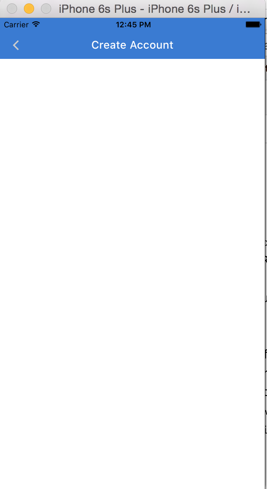
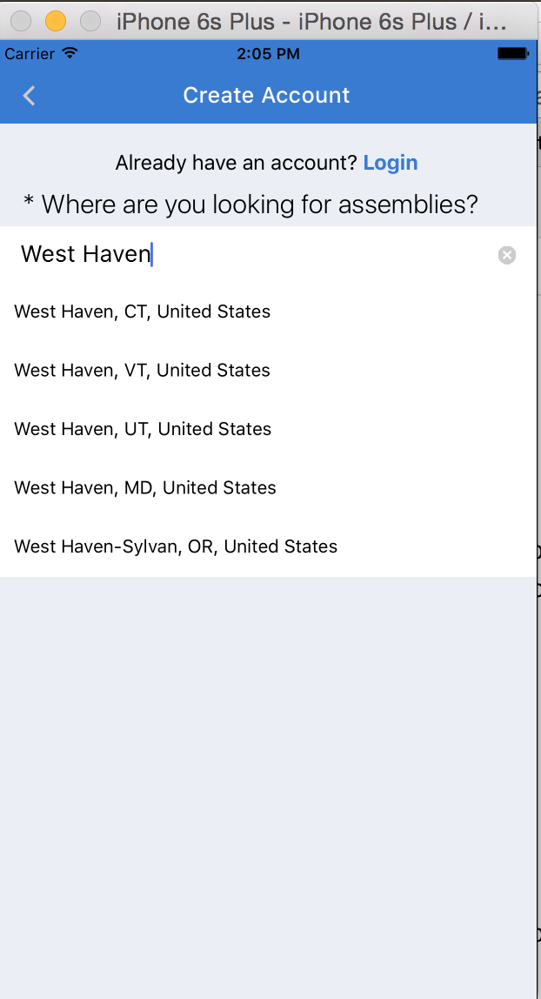
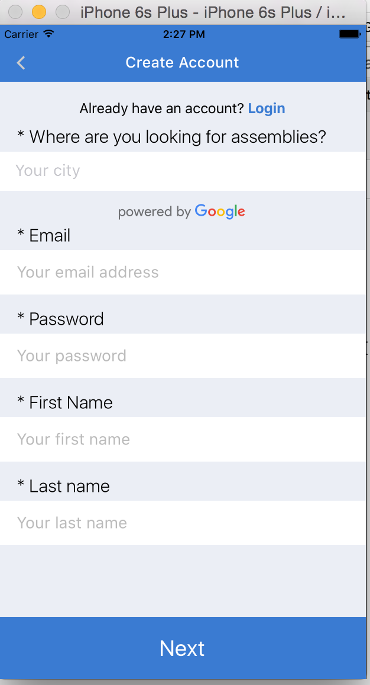
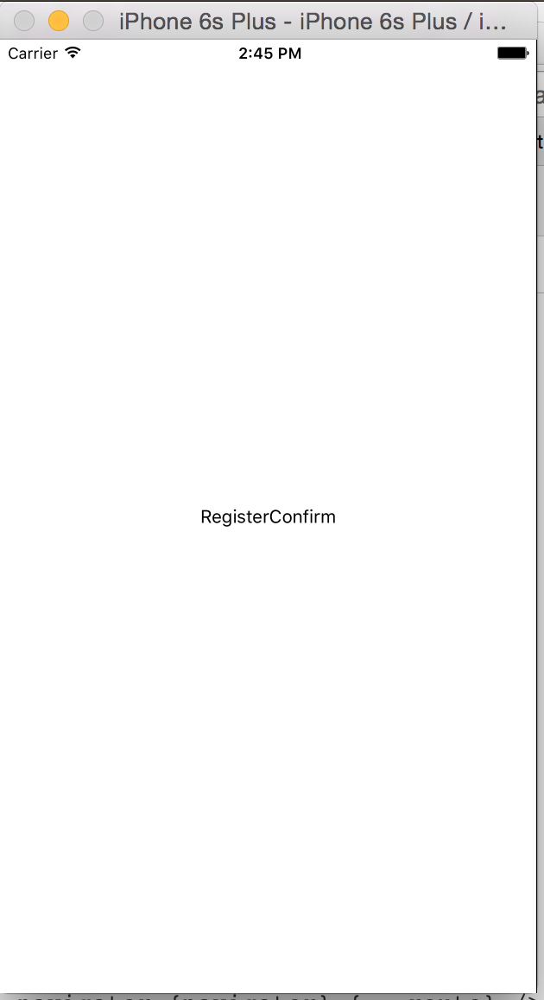

# Chapter 6: User Accounts Pt. 2

At the end of the last chapter, we had created a user through **Deployd**, logged into the dashboard and fleshed out the Profile view with real data. However, there are two important things that we neglected related to user accounts. These are logging out and registering an account. 

## 6.1 Logging Out

Since registering is much trickier, let’s first implement logging out. Our API has an endpoint for logout - `/users/logout`. When the user initiates logout, we want to call this endpoint and then redirect the user to the Landing page.

Let’s edit our ProfileView and Dashboard to reflect these changes. We will reference a `prop` of `logout` in the ProfileView and define the method in the parent `Dashboard`.

```javascript
application/components/profile/ProfileView.js
…

render() {
  let { currentUser, logout } = this.props;
  console.log('CURRENT USER', currentUser);
  return (
…
<TouchableOpacity style={styles.logoutButton} onPress={logout}>
  <Text style={styles.logoutText}>Logout</Text>
</TouchableOpacity>
…

```

```javascript
application/components/Dashboard.js
…
import { DEV, API } from ‘./config’;
…
constructor(props){
  super(props);
  this.logout = this.logout.bind(this);
  this.state = {
    selectedTab: 'Activity',
  };
}
logout(){
  fetch(`${API}/users/logout`, {
    method: 'POST',
    headers: {
      'Content-Type': 'application/json'
    }
  })
  .then(response => response.json())
  .then(data => {
    this.props.navigator.popToTop();
  })
  .catch(err => {})
  .done();
}
…
<ProfileView currentUser={currentUser} logout={this.logout}/>
…
```

Let’s commit at this point.

## 6.2 Registration Form - pt. 1

Now we’re left with the most complex part of user accounts – registration. This doesn’t have to be complicated; we could just ask for our users email and a password. After all, that’s enough information to create a user with Deployd. However, we want more information about our users. We want to know what city they live in, so we can suggest nearby meetups. We want to know what technologies they are interested in, for similar reasons. We want their first and last name, since many “assemblies” require a person’s real name to be admitted to the venue location. Finally, we want an avatar for our users so that our users are able to know each other a little better.

We could, of course, just make a single view with all of these inputs available. However, that wouldn’t be a very good user experience. Long forms are off-putting to potential users, and we want our registration process to be relatively smooth. That’s why we take a step approach for user registration. 

In step 1, the user will enter their email, first and last name, and password – all absolutely necessary information. In step 2, we will ask the user for their interests, location, and a photo to use as their avatar. All of these steps, except for the user’s location, are optional. If the user doesn’t select an avatar, we can use a default image. If the user doesn’t specify their interests, we can ask them for them later. 

Let’s flesh out step 1 of our user registration process.

```javascript
application/components/accounts/Register.js

import React, { Component } from 'react';
import {
  Text,
  View,
  ScrollView,
  TextInput,
  TouchableOpacity,
  Dimensions
} from 'react-native';
import Icon from 'react-native-vector-icons/Ionicons';
import NavigationBar from 'react-native-navbar';
import Colors from '../../styles/colors';
import Globals from '../../styles/globals';
import {GooglePlacesAutocomplete} from 'react-native-google-places-autocomplete';
import {DEV} from '../../config';

const { width: deviceWidth, height: deviceHeight } = Dimensions.get('window');

const LeftButton = ({ navigator }) => {
  return (
    <TouchableOpacity style={Globals.backButton} onPress={()=>{
      navigator.pop();
    }}>
      <Icon name="ios-arrow-back" size={25} color="#ccc" />
    </TouchableOpacity>
  );
};


class Register extends Component{
  constructor(){
    super();
    this.state = {
      email: '',
      password: '',
      firstName: '',
      lastName: '',
      location: null
    }
  }
  render(){
    let { navigator } = this.props;
    let titleConfig = { title: 'Create Account', tintColor: 'white' };
    return (
      <View style={styles.container}>
        <NavigationBar title={titleConfig} tintColor={Colors.brandPrimary} leftButton={<LeftButton navigator={navigator}/>} />
        <ScrollView>
        </ScrollView>
      </View>
    )
  }
}

let styles = {
  container: {
    flex: 1,
    backgroundColor: 'white',
  }
}

export default Register;
```

Here we introduce a new `npm` package, `react-native-google-places-autocomplete`. To avoid errors, we have to install it. Remember, `npm install --save react-native-google-places-autocomplete`, and then `rnpm link` to make sure the new package is linked to our iOS and Android code.

Also, you may notice that we refactor the left button of our navigation to a stateless functional component. These are components that have no local state (i.e., no `constructor(){}` method). These components render faster than state-ful components, so we'll try to use them more frequently. If you'll notice the ` ({ navigator }) ` syntax is a way of destructuring our props, and reduces the amount of code. We can now refactor this to its own file and use it in both `Register.js` and `Login.js`. Remember to `import` the file in both components.


Here's what the refactored component would look like: 

```javascript
import React from 'react';
import {
  TouchableOpacity
} from 'react-native';

import Icon from 'react-native-vector-icons/Ionicons';
import Globals from '../../styles/globals';

const LeftButton = ({ navigator }) => {
  return (
    <TouchableOpacity style={Globals.backButton} onPress={()=>{
      navigator.pop();
    }}>
      <Icon name="ios-arrow-back" size={25} color="#ccc" />
    </TouchableOpacity>
  );
};

export default LeftButton;
```

Let's make a commit there, and now we can add in some of the form content.

[Commit]() - Add autocomplete package and refactor LeftButton for navigation bar 

## 6.3 Using Google Places Autocomplete

```javascript
...
<ScrollView style={styles.formContainer}>
  <TouchableOpacity onPress={()=> navigator.push({ name: 'Login' })}>
    <Text style={styles.h5}>
      Already have an account? <Text style={styles.technologyList}>Login</Text>
    </Text>
  </TouchableOpacity>
  <Text style={styles.h4}>{"* Where are you looking for assemblies?"}</Text>
  <View ref="location" style={{flex: 1,}}>
    <GooglePlacesAutocomplete
      styles={autocompleteStyles}
      placeholder='Your city'
      minLength={2}
      autoFocus={false}
      fetchDetails={true}
      onPress={(data, details = null) => { // 'details' is provided when fetchDetails = true
        if (DEV) {console.log(data);}
        if (DEV) {console.log(details);}
        this.setState({
          location: _.extend({}, details.geometry.location, {
            city: _.find(details.address_components, (c) => c.types[0] == 'locality'),
            state: _.find(details.address_components, (c) => c.types[0] == 'administrative_area_level_1'),
            county: _.find(details.address_components, (c) => c.types[0] == 'administrative_area_level_2'),
            formattedAddress: details.formatted_address,
          })
        });
      }}
      getDefaultValue={() => {return '';}}
      query={{
        key       : 'YOUR_GOOGLE_PLACES_AUTOCOMPLETE_API_KEY',
        language  : 'en', // language of the results
        types     : '(cities)', // default: 'geocode'
      }}
      currentLocation={false}
      currentLocationLabel="Current location"
      nearbyPlacesAPI='GooglePlacesSearch'
      GoogleReverseGeocodingQuery={{}}
      GooglePlacesSearchQuery={{rankby: 'distance',}}
      filterReverseGeocodingByTypes={['street_address']} // filter the reverse geocoding results by types - ['locality', 'administrative_area_level_3'] if you want to display only cities
      predefinedPlaces={[]}>
    </GooglePlacesAutocomplete>
  </View>
</ScrollView>
...

const autocompleteStyles = StyleSheet.create({
  container: {
    flex: 1,
    backgroundColor: 'white',
  },
  textInputContainer: {
    backgroundColor: 'white',
    height: 44,
    borderTopColor: 'white',
    borderBottomColor: 'white',
  },
  textInput: {
    backgroundColor: 'white',
    height: 28,
    borderRadius: 5,
    paddingTop: 4.5,
    paddingBottom: 4.5,
    paddingLeft: 10,
    paddingRight: 10,
    marginTop: 7.5,
    marginLeft: 8,
    marginRight: 8,
    fontSize: 18,
  },
  poweredContainer: {
    justifyContent: 'center',
    alignItems: 'center',
    backgroundColor: Colors.inactive,
  },
  powered: {
    marginTop: 15,
  },
  row: {
    padding: 13,
    height: 44,
    flexDirection: 'row',
  },
  separator: {
    height: 1,
    backgroundColor: 'white',
  },
  loader: {
    flexDirection: 'row',
    justifyContent: 'flex-end',
    height: 20,
  },
  androidLoader: {
    marginRight: -15,
  },
});
...
```

You'll notice a few things here. In our `react-native-google-places-autocomplete` package, we need an API key. To do this, go to the website for [Google's Places services](https://developers.google.com/places/). From there, you will want to select the `Google Places API Web Service`, which is an `HTML` button. From there you can follow the steps to get your API key (You will have to create a project, and then access your credentials to get the API key).

Once we have the API key, where do we store it? Well, we want to make sure that we don't store it in our `git` repository, especially if our code will be hosted on a service like Github. 

We'll be using the [`react-native-config`](https://github.com/luggg/react-native-config) package to manage these environment variables.

`npm install --save react-native-config`
`rnpm link`

Then create a `.env` file with your API key variable:
```
GOOGLE_PLACES_API_KEY=abcdefghijk
```
now add this filename to your `.gitignore` file

```
.env
...
```
If you check `git` with `git status`, you'll see that your file doesn't appear, which means it has effectively been ignored. Now we can access the variable in our `Register.js` file.
```javascript
...
import Config from 'react-native-config'
...
key       :  Config.GOOGLE_PLACES_API_KEY,
...
```
You might have to restart all of the `node` processes to get this to work properly.




Another you may notice is that the package we use for `react-native-google-places-autocomplete` is a little buggy. That is, it works, but it throws a few warnings when we use it. If you'd like to use a version without these warnings, follow these steps.

* Run `npm uninstall --save react-native-google-places-autocomplete`
* Add this line to your `package.json` file under `dependencies`: 

```    
"react-native-google-places-autocomplete": "https://github.com/tgoldenberg/react-native-google-places-autocomplete/tarball/master",
```
* Run `npm install` and restart the `node` processes.

[Commit]() - Add environment variables and Google Places Autocomplete to registration form

## 6.4 Finishing the Registration Form pt.1 

Alright, so that was the toughest part of building the first part of our registration form. Let's fill in the rest.

```javascript
application/components/accounts/Register.js
...
<Text style={styles.h4}>* Email</Text>
  <View ref="email" style={styles.formField}>
    <TextInput
      ref="emailField"
      returnKeyType="next"
      onSubmitEditing={() => this.refs.passwordField.focus()}
      onChangeText={(text) => this.setState({email: text})}
      keyboardType="email-address"
      autoCapitalize="none"
      maxLength={144}
      placeholderTextColor='#bbb'
      style={styles.input}
      placeholder="Your email address"
    />
  </View>
  <Text style={styles.h4}>* Password</Text>

  <View style={styles.formField} ref="password">
    <TextInput
      ref="passwordField"
      returnKeyType="next"
      onSubmitEditing={() => this.refs.firstNameField.focus()}
      onChangeText={(text) => this.setState({password: text})}
      secureTextEntry={true}
      autoCapitalize="none"
      maxLength={20}
      placeholderTextColor='#bbb'
      style={styles.input}
      placeholder="Your password"
    />
  </View>
  <Text style={styles.h4}>* First Name</Text>
  <View style={styles.formField} ref="firstName">
    <TextInput
      ref="firstNameField"
      returnKeyType="next"
      onSubmitEditing={() => this.refs.lastNameField.focus()}
      maxLength={20}
      onChangeText={(text) => this.setState({ firstNameError: ''})}
      placeholderTextColor='#bbb'
      style={styles.input}
      placeholder="Your first name"
    />
  </View>
  <Text style={styles.h4}>* Last name</Text>
  <View style={styles.formField} ref="lastName">
    <TextInput
      returnKeyType="next"
      maxLength={20}
      ref="lastNameField"
      onChangeText={(text) => this.setState({lastName: text})}
      placeholderTextColor='#bbb'
      style={styles.input}
      placeholder="Your last name"
    />
 </View>
</ScrollView>
<TouchableOpacity style={Globals.submitButton} onPress={()=>{
  this.props.navigator.push({
    name: 'RegisterConfirm',
    email: this.state.email,
    password: this.state.password,
    firstName: this.state.firstName,
    lastName: this.state.lastName,
    location: this.state.location,
  })
}}>
  <Text style={Globals.submitButtonText}>Next</Text>
</TouchableOpacity>
</View>
...
```

The page should now look something like this: 


Notice also that we have to define a new route in our `index.ios.js` file, with the name `RegisterConfirm`.

```javascript
application/components/accounts/RegisterConfirm.js
import React, { Component } from 'react';
import {
  View,
  Text
} from 'react-native';

export default class RegisterConfirm extends Component{
  render(){
    return (
      <View style={styles.container}>
        <Text>RegisterConfirm</Text>
      </View>
    )
  }
}

let styles = {
  container: {
    flex: 1,
    justifyContent: 'center',
    alignItems: 'center'
  }
}
```

and let's reference it in our `index.ios.js` file:
```javascript
...
import RegisterConfirm from './application/components/accounts/RegisterConfirm';
...
case 'RegisterConfirm':
  return (
    <RegisterConfirm navigator={navigator} {...route} />
  );
...
```

Now when you press `Next` on the `Register.js` screen, you should be directed to a screen that looks like this: 


Also notice that by passing in `{...route}` to our component, we pass it as `props` all the variable that the `route` object contains. This means that we'll have access to the `email`, `password`, and other values from the first part of the registration form.

Now let's fill in `RegisterConfirm` component. We want to ask the user for their interests, i.e. which technologies they are interested in. We also want to ask them for an avatar, an image we can display about them. Finally we want to display any errors on submission.

```javascript
application/components/accounts/RegisterConfirm.js


```