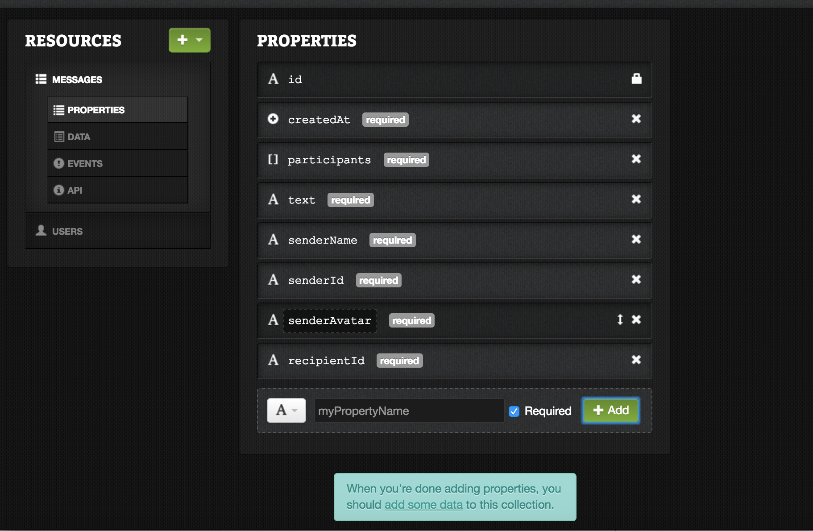
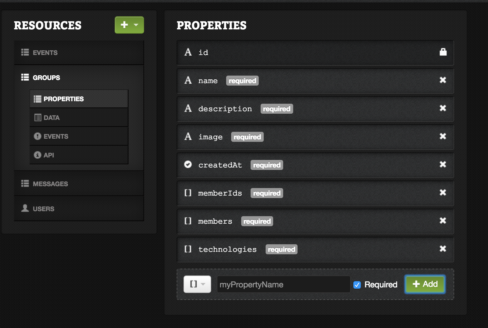
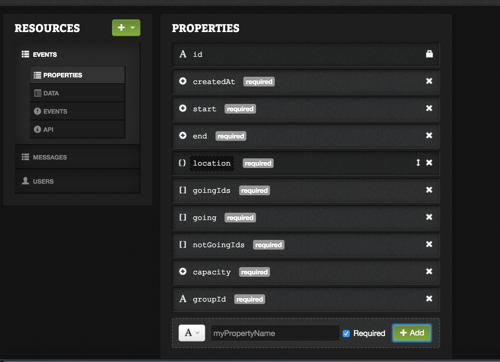
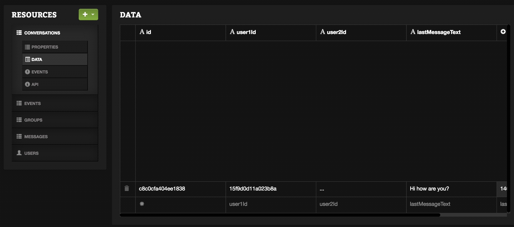
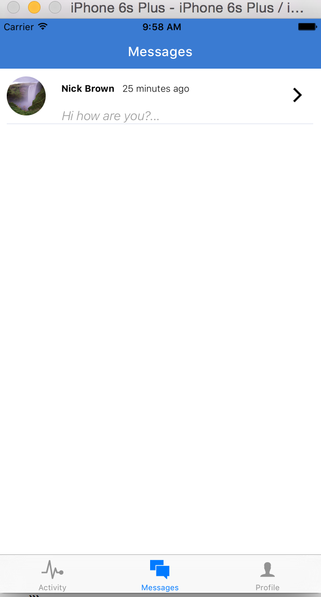
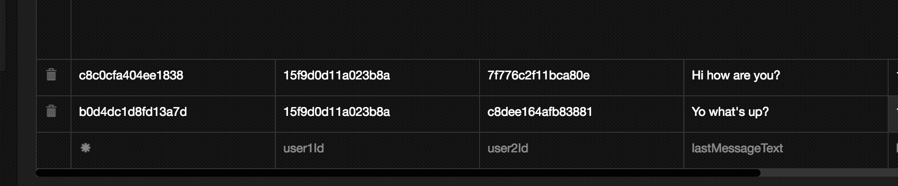
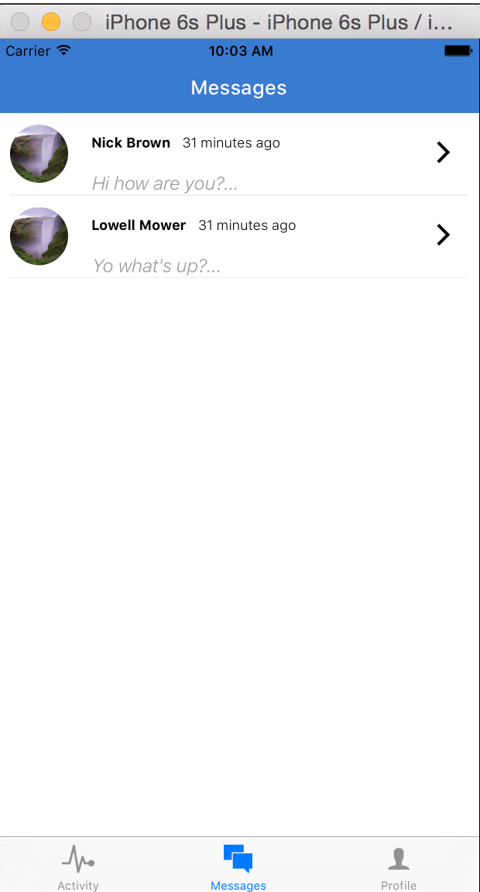

# Chapter 7: Establishing a Database Schema

Let's go over what we want to do in our app and what kind of data we'll need. Already we have a `users` collection, with the following relevant fields: 
```
id: String
username: String
password: String
firstName: String
lastName: String
technologies: Array of Strings
avatar: String
location: Object {
  city: Object { 
    long_name: String,
    short_name: String
  }
  state: Object {
    long_name: String,
    short_name: String
  }
  formattedAddress: String,
  lat: Float,
  lng: Float
}
```
This way of notation simply expresses that location is an `Object` with a field `city` which is also an object with the fields `long_name` and `short_name`. It's important to keep track of the structure of our data as we create it, since the wrong data type can cause errors in our program.

## 7.1 Defining Collections

Now what other collections will we need? We certainly need a `messages` collection, since we offer user-to-user messaging as a feature of our app. We also need a `groups` collection, since an assembly is a type of group that has members and hosts events. We need an `events` collection to highlight new events for our users. Here's a schema we can use for each one. Finally, we will want a `comments` collection for users to comment on individual events.

```
**messages**

id: String
createdAt: Integer
participants: Array of Strings
text: String
senderName: String
senderAvatar: String
senderId: String
recipientId: String

**groups**

id: String,
createdAt: Integer
memberIds: Array of Strings
members: Array of Objects {
  userId: String,
  confirmed: Boolean,
  role: String
}
name: String
technologies: Array of Strings
description: String
image: String

**events**

id: String
groupId: String
createdAt: Integer
start: Integer
end: Integer
location: Object {
  lat: Float
  lng: Float
  city: Object
  state: Object
  formattedAddress: String
}
goingIds: Array of Strings
going: Array of Objects {
  userId: String
}
notGoingIds: Array of String
capacity: Integer

**comments**
id: String
eventId: String
createdAt: Integer
text: String
likes: Object of userId Strings

```

Now let's create these collections from our Deployd interface at `localhost:2403`. This should be a straight-forward process of creating a collection and then editing its fields in the `properties` tab.







## 7.2 Deployd in Production

While all this is well and good for local development, what about when we want our app to go live? At that point we will need to deploy Deployd to an actual server. For full instructions on this, please read the Deployment chapter in the appendix.

## 7.3 Creating Messages

Now that we have our data models in place, we can start to replace our fixture data with real data. We also have to consider what we want our `MessagesView` to contain.

Currently `MessagesView.js` displays a list of conversations with the last message sent displayed. Intuitively, if we press on one of these conversations, we should be directed to a conversation view, where we can scroll through all the messages and create new messages. We also may want to be able to direct to a Profile View for when any of the user’s avatars is pressed. 

Therefore, we have to replace the static component of `MessagesView` and replace it with a new `Navigator` with the routes `Conversations`, `Conversation`, and `Profile`. While the `Conversations` and `Conversation` route will be specific to the `MessagesView`, we will reuse the `Profile` view in other parts of our app. We will also reuse the other components, for example, when a user wants to message another user from a different part of our app.

Let’s move the contents of `MessagesView.js` to another file, `Conversations.js`, and fill in `MessagesView.js` with a new `Navigator` component.

```javascript
application/components/messages/MessagesView.js
import React, { Component } from 'react';
import {
  StyleSheet,
  View,
  Navigator,
  Dimensions
} from 'react-native';
import Conversations from './Conversations';
import Conversation from './Conversation';
import UserProfile from '../profile/UserProfile';

export default class MessagesView extends Component{
  constructor(){
    super();
    this.state = {
      conversations: []
    }
  }
  render(){
    let { conversations } = this.state;
    return (
      <Navigator
        style={styles.container}
        initialRoute={{
          name: 'Conversations'
        }}
        renderScene={(route, navigator) => {
          switch(route.name){
            case 'Conversations':
              return (
                <Conversations conversations={conversations} />
              );
            case 'Conversation':
              return (
                <Conversation conversation={route.conversation} />
              );
            case 'Profile':
              return (
                <Profile user={route.user} />
              );
          }
        }}
      />
    )
  }
};

let styles = StyleSheet.create({
  container: {
    flex: 1
  }
})

```

Now we have to create the components `UserProfile` and `Conversation`. For now we can just create simple components, as we usually start with.

```javascript
application/components/profile/UserProfile.js
import React, { Component } from 'react';
import {
  View,
  Text,
  StyleSheet
} from 'react-native';

export default class UserProfile extends Component{
  render(){
    <View style={styles.container}>
      <Text>USER PROFILE</Text>
    </View>
  }
};

let styles = StyleSheet.create({
  container: {
    flex: 1,
    justifyContent: 'center',
    alignItems: 'center'
  }
})

application/components/messages/Conversation.js
import React, { Component } from 'react';
import {
  View,
  Text,
  StyleSheet
} from 'react-native';

export default class Conversation extends Component{
  render(){
    <View style={styles.container}>
      <Text>CONVERSATION</Text>
    </View>
  }
};

let styles = StyleSheet.create({
  container: {
    flex: 1,
    justifyContent: 'center',
    alignItems: 'center'
  }
})

```
If done correctly, the Messages View should look exactly the same as before! Don’t worry, we have a long way to go. Let’s commit here.

[Commit]() – "Refactor MessagesView into a Navigation component and create simple Conversation and UserProfile components"

## 7.4 Fetching Message Data

Now we will want to replace our `FAKE_USERS` and `FAKE_MESSAGES` data for real data. First we will create a collection called `conversations`. This will make the data fetching easier. Our collection will have the following fields

```
lastMessageText: String
lastMessageDate: Integer
user1Id: String
user2Id: String
```

We can also create a fake conversation in the `data` tab of the collection, at `localhost:2403/dashboard`. Once we have a conversation in the database, we can work on fetching the data from the `MessagesView`. 



```javascript
application/components/messages/MessagesView.js

import React, { Component } from 'react';
import {
  StyleSheet,
  View,
  Navigator,
  Dimensions
} from 'react-native';
import Conversations from './Conversations';
import Conversation from './Conversation';
import UserProfile from '../profile/UserProfile';
import { DEV, API } from '../../config';
import _ from 'underscore';

export default class MessagesView extends Component{
  constructor(){
    super();
    this.state = {
      conversations: [],
      users: [],
      ready: false,
    }
  }
  componentDidMount(){
    let conversationQuery = {
      $or: [
        {user1Id: currentUser.id},
        {user2Id: currentUser.id}
      ]
    };
    fetch(`${API}/conversations?${JSON.stringify(conversationQuery)}`, {
      method: 'GET',
      headers: {
        'Content-Type': 'application/json'
      }
    })
    .then(response => response.json())
    .then(conversations => {
      let userIds = _.uniq(_.flatten(conversations.map(d => ([d.user1Id, d.user2Id]))));
      let userQuery = {
        id: { $in: userIds }
      }
      fetch(`${API}/users?${userQuery}`, {
        method: 'GET',
        headers: {
          'Content-Type': 'application/json'
        }
      })
      .then(response => response.json())
      .then(users => {
        this.setState({ conversations, users });
      })
      .catch(err => { console.log('ERR: ', err)})
      .done();
    })
    .catch(err => { console.log('ERR:', err)})
    .done();
  }
  render(){
    let { conversations, users } = this.state;
    return (
      <Navigator
        style={styles.container}
        initialRoute={{
          name: 'Conversations'
        }}
        renderScene={(route, navigator) => {
          switch(route.name){
            case 'Conversations':
              return (
                <Conversations
                  {...this.props}
                  {...route}
                  conversations={conversations}
                  users={users}
                />
              );
            case 'Conversation':
              return (
                <Conversation conversation={route.conversation} />
              );
            case 'Profile':
              return (
                <Profile user={route.user} />
              );
          }
        }}
      />
    )
  }
};

let styles = StyleSheet.create({
  container: {
    flex: 1
  }
})

```

Here you can see that we are first fetching the conversations that are relevant to the user. Then we collect the userID’s that are relevant and fetch the user data for those IDs. This data then gets passed on to the `Conversations` component. 

Also notice that we are using queries to fetch our data. In Deployd, we can add these Mongo queries at the end of our API call, preceded by a `?`. In the first query, we are asking for all conversations where the `user1Id` or the `user2Id` is equal to the current user's `id`. In the second we are fetching all users who have an `id` that is contained in the array of `userId`s. 

We also have to slightly modify our `Conversations.js` component.

```javascript

import React, { Component } from 'react';

import {
  StyleSheet,
  Text,
  TouchableOpacity,
  View,
  ListView,
  Image,
} from 'react-native';

import NavigationBar from 'react-native-navbar';
import Colors from '../../styles/colors';
import ConversationRow from './ConversationRow';

import { messages } from '../../fixtures';

export default class Conversations extends Component{
  _renderRow(rowData){
    console.log('ROW DATA', rowData);
    let { users, currentUser } = this.props;
    let otherUserId = rowData.user1Id == currentUser.id ? rowData.user2Id : rowData.user1Id;
    let otherUserIdx = users.map(u => u.id).indexOf(otherUserId);
    let otherUser = users[otherUserIdx];
    return (
      <ConversationRow conversation={rowData} user={otherUser}/>
    );
  }
  render() {
    let { conversations, users } = this.props;
    return (
      <View style={{ flex: 1 }}>
        <NavigationBar
          title={{ title: 'Messages', tintColor: 'white' }}
          tintColor={Colors.brandPrimary}
        />
        <ListView
          dataSource={new ListView.DataSource({
              rowHasChanged: (r1,r2) => r1 != r2
            })
            .cloneWithRows(conversations)
          }
          enableEmptySections={true}
          contentInset={{ bottom: 49 }}
          automaticallyAdjustContentInsets={false}
          ref='messagesList'
          renderRow={this._renderRow.bind(this)}
        />
      </View>
    );
  }
};

let styles = StyleSheet.create({
  container: {
    flex: 1,
    justifyContent: 'center',
    alignItems: 'center',
  },
  h1: {
    fontSize: 22,
    fontWeight: 'bold',
    padding: 20,
  },
});

```

Finally, we have to modify our `ConversationRow` component.

```javascript
…

  render(){
    let { conversation, user } = this.props;
    let msg = conversation.lastMessageText;
    let date = new Date(conversation.lastMessageDate);
…
```

Let’s create another user and another conversation and see how the UI changes. 






And now is a good time to make a commit.

[commit]() – Fetch conversation data and render in Conversations component

## 7.5 Adding routing to our Messages View

Now that we at least have real `conversation` objects, we need to add routing to an individual `conversation` component. 


