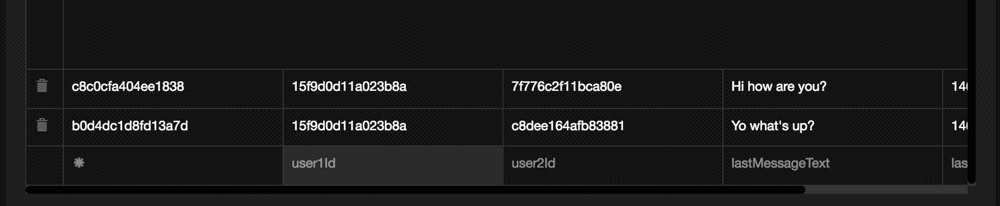

# Establishing a Database Schema

Let's go over what we want to do in our app and what kind of data we'll need. Already we have a `users` collection, with the following relevant fields:
```
id: String
username: String
password: String
firstName: String
lastName: String
technologies: Array of Strings
avatar: String
location: Object {
  city: Object {
    long_name: String,
    short_name: String
  }
  state: Object {
    long_name: String,
    short_name: String
  }
  formattedAddress: String,
  lat: Float,
  lng: Float
}
```
This way of notation simply expresses that location is an `Object` with a field `city` which is also an object with the fields `long_name` and `short_name`. It's important to keep track of the structure of our data as we create it, since the wrong data type can cause errors in our program.

## Defining Collections

Now what other collections will we need? We certainly need a `messages` collection, since we offer user-to-user messaging as a feature of our app. We also need a `groups` collection, since an assembly is a type of group that has members and hosts events. We need an `events` collection to highlight new events for our users. Here's a schema we can use for each one. We'll want a `conversations` collection to easily render conversation data, and a `notifications` collection for informing users of new messages and events.

```
**messages**

id: String
createdAt: Integer
text: String
senderId: String
recipientId: String

**conversations**

id: String
user1Id: String
user2Id: String
lastMessageText: String
lastMessageDate: Integer

**groups**

id: String,
createdAt: Integer
members: Array of Objects {
  userId: String,
  confirmed: Boolean,
  role: String,
  joinedAt: Integer
}
name: String
technologies: Array of Strings
description: String
color: String
image: String

**events**

id: String
groupId: String
createdAt: Integer
start: Integer
end: Integer
location: Object {
  lat: Float
  lng: Float
  city: Object
  state: Object
  formattedAddress: String
}
going: Array of Strings
capacity: Integer

**notifications**
id: String
type: String
message: String
participants: Array of Strings
createdAt: Integer

```

Now let's create these collections from our Deployd interface at `localhost:2403`. This should be a straight-forward process of creating a collection and then editing its fields in the `properties` tab.


## Deployd in Production

While all this is well and good for local development, what about when we want our app to go live? At that point we will need to deploy Deployd to an actual server. For full instructions on this, please read the API deployment chapter in the appendix.

## Creating Messages

Now that we have our data models in place, we can start to replace our fixture data with real data. We also have to consider what we want our `MessagesView` to contain.

Currently `MessagesView.js` displays a list of conversations with the last message sent displayed. Intuitively, if we press on one of these conversations, we should be directed to a conversation view, where we can scroll through all the messages and create new messages. We also may want to be able to direct to a Profile View for when any of the user’s avatars is pressed.

Therefore, we have to replace the static component of `MessagesView` and replace it with a new `Navigator` with the two routes `Conversations` and `Conversation`. 

Let’s move the contents of `MessagesView.js` to another file, `Conversations.js`, and fill in `MessagesView.js` with a new `Navigator` component. We'll also create a dumb `Conversation.js` file for now.

```javascript
application/components/messages/Conversation.js

import Icon from 'react-native-vector-icons/Ionicons';
import NavigationBar from 'react-native-navbar';
import React, { Component } from 'react';
import { View, Text } from 'react-native';

import { globals } from '../../styles';
import BackButton from '../shared/BackButton';

class Conversation extends Component{
  constructor(){
    super();
    this.goBack = this.goBack.bind(this);
  }
  goBack(){
    this.props.navigator.pop();
  }
  render(){
    let { user, currentUser } = this.props;
    return (
      <View style={globals.flexContainer}>
        <NavigationBar
          tintColor={Colors.brandPrimary}
          title={{ title: `${user.firstName} ${user.lastName}`, tintColor: 'white' }}
          leftButton={<BackButton handlePress={this.goBack}/>}
        />
        <View style={globals.flexCenter}>
          <Text style={globals.h2}>Conversation</Text>
        </View>
      </View>
    )
  }
};

export default Conversation;
```

```javascript
application/components/messages/MessagesView.js

import React, { Component } from 'react';
import { Navigator } from 'react-native';
import { flatten, uniq } from 'underscore';

import Conversation from './Conversation';
import Conversations from './Conversations';
import { DEV, API } from '../../config';
import { globals } from '../../styles';

class MessagesView extends Component{
  constructor(){
    super();
    this.state = {
      conversations : [],
      ready         : false,
      users         : [],
    };
  }
  componentDidMount(){
    this._loadConversations();
  }
  _loadConversations(){
    let { currentUser } = this.props;
    let query = {
      $or: [
        { user1Id: currentUser.id },
        { user2Id: currentUser.id }
      ],
      $limit: 10, $sort: { lastMessageDate: -1 }
    };
    fetch(`${API}/conversations?${JSON.stringify(query)}`)
    .then(response => response.json())
    .then(conversations => this._loadUsers(conversations))
    .catch(err => this.ready(err))
    .done();
  }
  _loadUsers(conversations){
    let userIds = uniq(flatten(conversations.map(c => [c.user1Id, c.user2Id])));
    let query = { id: { $in: userIds }};
    fetch(`${API}/users?${JSON.stringify(query)}`)
    .then(response => response.json())
    .then(users => this.setState({ conversations, users, ready: true }))
    .catch(err => this.ready(err))
    .done();
  }
  ready(err){
    this.setState({ ready: true });
  }

  render(){
    return (
      <Navigator
        style={globals.flex}
        initialRoute={{ name: 'Conversations' }}
        renderScene={(route, navigator) => {
          switch(route.name){
            case 'Conversations':
              return (
                <Conversations
                  {...this.props}
                  {...this.state}
                  navigator={navigator}
                />
            );
            case 'Conversation':
              return (
                <Conversation
                  {...this.props}
                  {...this.state}
                  {...route}
                  navigator={navigator}
                />
            );
          }
        }}
      />
    )
  }
}

export default MessagesView;
```

If done correctly, the Messages View should look exactly the same as before! Don’t worry, we have a long way to go. Let’s commit here.

[Commit]() – "Refactor MessagesView into a Navigation component and create simple Conversation and UserProfile components"

## Fetching Message Data

Now we will want to replace our `FAKE_USERS` and `FAKE_MESSAGES` data for real data. To get started, we can create a conversation in the `data` tab of the collection, at `localhost:2403/dashboard`. 

To do this, we should first create a few users, but using the `data` tab of the `users` collection. You can add different emails and names, and copy/paste the location and technologies from the already existing user.

Once we have some users, we can then do the same for our `conversations` collection. Add your user id as `user1Id` and the other user as `user2Id`. Then fill in the `lastMessageText` with a text string and the `lastMessageDate` with a date value (simply typing `new Date().valueOf()` in the browser console is enough to get this.

Once we have a conversation in the database, we can work on fetching the data from the `MessagesView`. Replace the instances of `FakeUsers`, `FakeNotifications`, etc. in `Conversations.js`.

```javascript
import React, { Component } from 'react';
import { View, Text, Image, TouchableOpacity, ListView } from 'react-native';
import moment from 'moment';
import Icon from 'react-native-vector-icons/Ionicons';
import NavigationBar from 'react-native-navbar';
import { find } from 'underscore';

import Colors from '../../styles/colors';
import { globals, messagesStyles } from '../../styles';
import { rowHasChanged } from '../../utilities';

const styles = messagesStyles;

class Conversations extends Component{
  constructor(){
    super();
    this._renderRow = this._renderRow.bind(this);
    this.dataSource = this.dataSource.bind(this);
  }

  _renderRow(conversation){
    let { currentUser } = this.props;
    let otherUserID = find([conversation.user1Id, conversation.user2Id], (id) => id !== currentUser.id);
    let user = find(this.props.users, ({ id }) => id === otherUserID);
    return (
      <TouchableOpacity style={globals.flexContainer}>
        <View style={globals.flexRow}>
          <Image style={globals.avatar} source={{uri: user.avatar}}/>
          <View style={globals.flex}>
            <View style={globals.textContainer}>
              <Text style={styles.h5}>{user.firstName} {user.lastName}</Text>
              <Text style={styles.h6}>{moment(conversation.lastMessageDate).fromNow()}</Text>
            </View>
            <Text style={[styles.h4, globals.mh1]}>{conversation.lastMessageText.substring(0, 40)}...</Text>
          </View>
          <View style={styles.arrowContainer}>
            <Icon size={30} name="ios-arrow-forward" color={Colors.bodyTextLight}/>
          </View>
        </View>
        <View style={styles.divider}/>
      </TouchableOpacity>
    )
  }
  dataSource(){
    return (
      new ListView.DataSource({ rowHasChanged: rowHasChanged }).cloneWithRows(this.props.conversations)
    );
  }
  render() {
    return (
      <View style={globals.flexContainer}>
        <NavigationBar
          title={{ title: 'Messages', tintColor: 'white' }}
          tintColor={Colors.brandPrimary}
        />
        <ListView
          enableEmptySectionHeaders={true}
          dataSource={this.dataSource()}
          contentInset={{ bottom: 49 }}
          renderRow={this._renderRow}
        />
      </View>
    );
  }
};

export default Conversations;


```


Now you should see some real conversation data!

Here you can see that we are first fetching the conversations that are relevant to the user. Then we collect the userID’s that are relevant and fetch the user data for those IDs. This data then gets passed on to the `Conversations` component.

Also notice that we are using queries to fetch our data. In Deployd, we can add these Mongo queries at the end of our API call, preceded by a `?`. In the first query, we are asking for all conversations where the `user1Id` or the `user2Id` is equal to the current user's `id`. In the second we are fetching all users who have an `id` that is contained in the array of `userId`s.

Let’s create another user and another conversation and see how the UI changes.



And now is a good time to make a commit.

[Commit 13]() – "Fetch conversation data and render in Conversations component"

## Adding Routing to our Messages View

Now that we at least have real `conversation` objects, we need to add routing to an individual `conversation` component.

Let's modify the file `application/components/messages/ConversationRow.js`

```javascript
...
  render(){
    let { conversation, user, handlePress } = this.props;
    let msg = conversation.lastMessageText;
    let date = new Date(conversation.lastMessageDate);
    return (
      <TouchableOpacity style={{ flex: 1 }} onPress={handlePress}>
...
```

Then let's define our new `handlePress` prop in the parent component, `Conversations`.

```javascript
...
_renderRow(rowData){
    console.log('ROW DATA', rowData);
    let { users, currentUser, navigator } = this.props;
    let otherUserId = rowData.user1Id == currentUser.id ? rowData.user2Id : rowData.user1Id;
    let otherUserIdx = users.map(u => u.id).indexOf(otherUserId);
    let otherUser = users[otherUserIdx];
    return (
      <ConversationRow
        conversation={rowData}
        user={otherUser}
        handlePress={() => {
          navigator.push({
            name: 'Conversation',
            conversation: rowData,
            user: otherUser
          });
        }}
      />
    );
  }
...
```


You should now get directed to our `Conversation` screen when you press on a conversation. Now we need to flesh out that view. Ideally we want to have all the messages in reverse chronological order, along with an input field on the bottom to send a new message.

Let's create a few messages in Deployd to get started. Here is some data to get started (replace the userIds with the appropriate ones from your Deployd database):

```
senderId: 15f9d0d11a023b8a
recipientId: b0d4dc1d8fd13a7d
createdAt: 1467764227276
text: "How are you?"

senderId: b0d4dc1d8fd13a7d
recipientId: 15f9d0d11a023b8a
createdAt: 1467764227276
text: "Fine, and you?"

senderId: 15f9d0d11a023b8a
recipientId: c8c0cfa404ee1831
createdAt: 1467764227276
text: "So what's going on tonight?"

senderId: c8c0cfa404ee1831
recipientId: 15f9d0d11a023b8a
createdAt: 1467764227276
text: "I don't know. You tell me."

```


Now we can query the related messages in the `componentWillMount` phase of our `Conversation` component and then render the messages in reverse chronological order.

```javascript
application/components/messages/Conversation.js

import React, { Component } from 'react';
import {
  View,
  Text,
  StyleSheet,
  TouchableOpacity,
  TextInput,
  Dimensions
} from 'react-native';
import Globals from '../../styles/globals';
import Colors from '../../styles/colors';
import NavigationBar from 'react-native-navbar';
import LeftButton from '../accounts/LeftButton';
import InvertibleScrollView from 'react-native-invertible-scroll-view';
import moment from 'moment';
import KeyboardSpacer from 'react-native-keyboard-spacer';
import { DEV, API } from '../../config';


const { width: deviceWidth, height: deviceHeight } = Dimensions.get('window');

export default class Conversation extends Component{
  constructor(){
    super();
    this.createMessage = this.createMessage.bind(this);
    this.state = {
      msg: ''
    }
  }
  componentWillMount(){
    /* TODO: fetch all messages */
  }
  createMessage(msg){
     /* TODO: save message */
  }
  render(){
    let { user, navigator, currentUser } = this.props;
    let { msg, messages } = this.state;
    let titleConfig = { title: `${user.firstName} ${user.lastName}`, tintColor: 'white' };
    return(
      <View style={styles.container}>
        <NavigationBar
          tintColor={Colors.brandPrimary}
          title={titleConfig}
          leftButton={<LeftButton navigator={navigator}/>}
        />
        <InvertibleScrollView
          inverted={true}
          contentContainerStyle={{paddingTop: 10}}
          ref="scroll">
          {messages.map((msg, idx) => (
            <Message
              message={msg}
              user={msg.senderId === currentUser.id ? currentUser : user}
              key={idx}
              navigator={navigator}
            />
          ))}
        </InvertibleScrollView>

        <View style={styles.inputBox}>
          <TextInput
            multiline={true}
            value={this.state.newMessage}
            placeholder='Say something...'
            placeholderTextColor={Colors.bodyTextLight}
            onChange={(e) => this.setState({msg: e.nativeEvent.text})}
            style={styles.input}
          />
          <TouchableOpacity
            style={ msg ? styles.buttonActive : styles.buttonInactive }
            underlayColor='#D97573'
            onPress={this.createMessage}>
            <Text style={ msg ? styles.submitButtonText : styles.inactiveButtonText }>Send</Text>
          </TouchableOpacity>
        </View>
        <KeyboardSpacer topSpacing={-50}/>
      </View>
    )

  }
};

let styles = StyleSheet.create({
  inputBox: {
    marginBottom: 50,
    height: 60,
    left: 0,
    right: 0,
    backgroundColor: '#F3EFEF',
    backgroundColor: Colors.inactive,
    flexDirection: 'row',
  },
  input: {
    height: 40,
    padding: 8,
    flex: 1,
    marginRight: 5,
    fontSize: 14,
    borderColor: '#E0E0E0',
    margin: 10,
    borderColor: '#b4b4b4',
    borderRadius: 8,
    color: Colors.bodyText,
    backgroundColor: 'white',
  },
  buttonActive: {
    flex: 0.4,
    backgroundColor: "#E0514B",
    backgroundColor: Colors.brandPrimary,
    borderRadius: 6,
    justifyContent: 'center',
    margin: 10,
  },
  buttonInactive: {
    flex: 0.4,
    backgroundColor: "#eeeeee",
    borderWidth: 1,
    borderColor: '#ffffff',
    borderRadius: 6,
    justifyContent: 'center',
    margin: 10,
  },
  buttonText: {
    textAlign: 'center',
    color: 'white',
    fontSize: 16,
  },
  centering: {
    alignItems: 'center',
    justifyContent: 'center',
    height: deviceHeight,
  },
  sentText:{
    fontSize: 14,
    padding: 10,
    marginRight: 15,
    fontWeight: '300',
  },
  backButton: {
    position: 'absolute',
    left: 20,
  },
  backButtonText: {
    color: 'white',
  },
  fromContainer:{
    flexDirection: 'row',
    flex: 1,
    justifyContent: 'space-between',
    alignItems: 'center',
  },
  fromText:{
    fontSize: 16,
    fontWeight: '500',
  },
  messageTextContainer:{
    flex: 1,
  },
  messageText:{
    fontSize: 18,
    fontWeight: '300',
    paddingHorizontal: 15,
  },
  messageContainer:{
    flex: 1,
    flexDirection: 'row',
    alignItems: 'center',
  },
  profile:{
    width: 60,
    height: 60,
    borderRadius: 30,
    marginHorizontal: 10,
    marginVertical: 10,
  },
  container: {
    flex: 1,
    backgroundColor: 'white'
  },
  header: {
    height: 70,
    backgroundColor: Colors.brandPrimary,
    justifyContent: 'center',
    alignItems: 'center',
  },
  headerText: {
    color: 'white',
    fontSize: 22,
  },
  submitButtonText: {
    textAlign: 'center',
    fontSize: 18,
    fontWeight: '400',
    color: 'white',
  },
  inactiveButtonText: {
    textAlign: 'center',
    fontSize: 18,
    fontWeight: '400',
    color: '#999'
  }
});

```

We use two new libraries here: `react-native-invertible-scroll-view`, and `react-native-keyboard-spacer`. The first one allows to keep the screen at the bottom of our list of messages. This way when we add a new message, it is easy to scroll to the bottom with `this.refs.scrollView.scroll(0)`. The other package allows us to raise the input field just above the phone's keyboard, which provides a better user experience.

Let's place our `Message` component in the same file below.

```javascript
const Message = ({ user, message, navigator }) => {
  return (
    <View style={messageStyles.container}>
      <TouchableOpacity>
        <Image
          style={messageStyles.icon}
          source={{uri: user.avatar? user.avatar : DefaultAvatar }}
        />
      </TouchableOpacity>
      <View style={messageStyles.messageBox}>
        <View style={messageStyles.row}>
          <Text style={messageStyles.author}>{`${user.firstName} ${user.lastName}`}</Text>
          <Text style={messageStyles.sent}>{moment(new Date(message.createdAt)).fromNow()}</Text>
        </View>
        <View style={messageStyles.messageView}>
          <Text style={messageStyles.messageText}>{message.text}</Text>
        </View>
      </View>
    </View>
  )
};

let messageStyles = StyleSheet.create({
  container:{
    flex: 1,
    flexDirection: 'row',
    justifyContent: 'flex-start',
    paddingVertical: 10,
    backgroundColor: 'white',
  },
  icon: {
    marginTop: 10,
    marginLeft: 13,
    width: 50,
    height: 50,
    borderRadius: 25,
  },
  messageBox: {
    flex: 1,
    alignItems: 'stretch',
    padding: 10,
  },
  row: {
    flexDirection: 'row',
    marginBottom: 2,
    marginTop: 10
  },
  messageView: {
    backgroundColor: 'white',
    flex: 1,
    paddingRight: 15
  },
  messageText: {
    fontSize: 16,
    fontWeight: '300',
  },
  author:{
    fontSize: 12,
    fontWeight: '700'
  },
  sent:{
    fontSize: 12,
    fontWeight: '300',
    color: '#9B9B9B',
    marginLeft: 10,
    color: '#9B9B9B',
    fontWeight: '300',
    marginLeft: 10
  }
})
```

Now let's fetch our messages, and save new messages.

```javascript
...
 componentWillMount(){
    /* TODO: fetch all messages */
    let { user, currentUser } = this.props;
    let query = {
      $or: [
        { user1Id: user.id, user2Id: currentUser.id },
        { user2Id: user.id, user1Id: currentUser.id }
      ],
      $sort: {
        createdAt: -1
      },
      $limit: 10
    };
    fetch(`${API}/messages?${JSON.stringify(query)}`)
    .then(response => response.json())
    .then(messages => this.setState({ messages }))
    .catch(err => console.log('ERR:', err))
    .done();
  }
  createMessage(){
    /* TODO: create message */
    let { msg } = this.state;
    let { currentUser, user } = this.props;
    fetch(`${API}/messages`, {
      method: 'POST',
      headers: {
        'Content-Type': 'application/json'
      },
      body: JSON.stringify({
        senderId: currentUser.id,
        recipientId: user.id,
        text: msg,
        createdAt: new Date().valueOf()
      })
    })
    .then(response => response.json())
    .then(data => this.setState({ msg: '', messages: [ data, ...this.state.messages ]}))
    .catch(err => console.log('ERR:', err))
    .done();
  }
...
```

## Callback to Update Conversations (Optional)

One cool thing about Deployd is that we can set callback hooks from within our REST-ful actions. For example, once we send a new message, we should update the relevant `conversation` with the latest message and timestamp. Using the `Events` tab in our Deployd dashboard, this is done easily. Under `POST`, add the following lines.
```javascript
console.log('MESSAGE CREATED', this);
var text = this.text;
var senderId = this.senderId;
var recipientId = this.recipientId;
var createdAt = this.createdAt;

dpd.conversations.get({
    $or: [
        {user1Id: senderId, user2Id: recipientId},
        {user2Id: senderId, user1Id: recipientId}
    ]
})
.then(function(data){
    console.log('DATA', data);
    if (data.length) {
        dpd.conversations.put(data.id, {
            lastMessageText: text,
            lastMessageDate: createdAt
        });
    } else {
        dpd.conversations.post({
            user1Id: senderId,
            user2Id: recipientId,
            lastMessageText: text,
            lastMessageDate: createdAt
        });
    }
});
```

Notice how we can use this hooks to log statements and to update other collections.

## Conclusion

In this chapter, we built out a message view for our users. We created a user-friendly way to share messages between two users. While this is a feature of numerous mobile applications, our work is not yet done. We still have a lot of features to build out - Calendar View, more Profile customizations, creating and editing Groups and Events, etc.

If you're interested in improving your messaging view even further, you can explore options like creating a real-time connection for live chat. This can be done in a number of ways - through a 3rd-party service such as Firebase or Pusher, through establishing a websocket connection with our Deployd API, or by using a real-time framework such as MeteorJS. In any case, congratulations and continue the good work!
