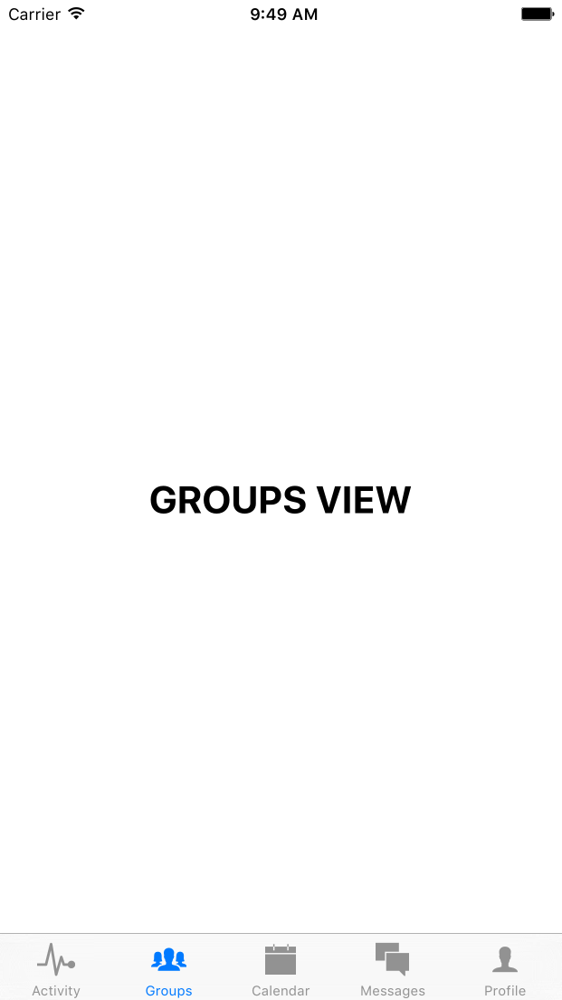
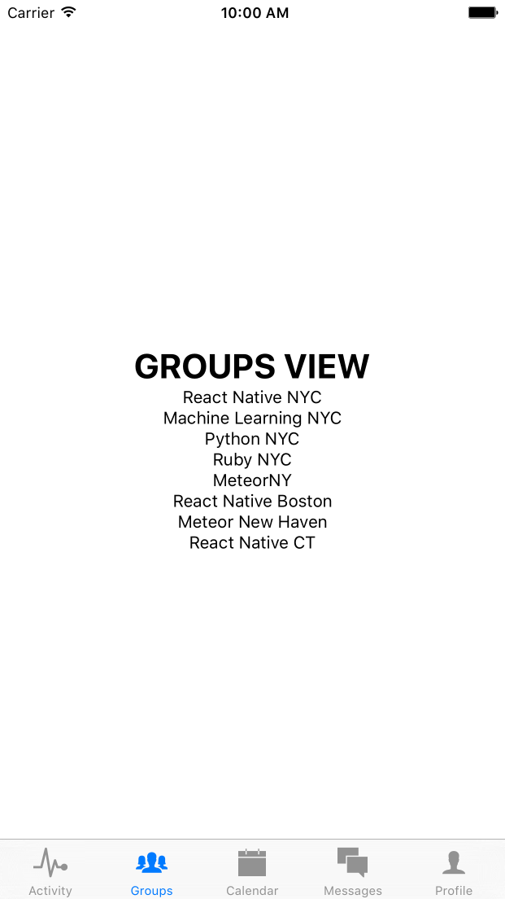
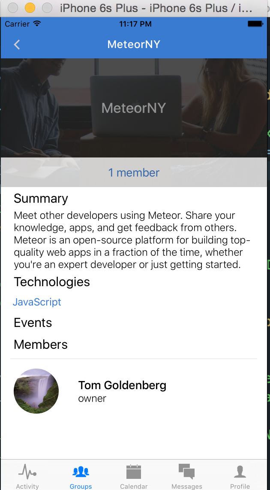

# Chapter 8: Creating Groups

In the last chapter, we built out a messaging feature. We were able to fetch messages related to a group of users and create new messages. Now we’ll focus on adding some new features to our tab-bar navigation – `Groups` and `Calendar`.

Before we get started, let's make the development process easier and add persistent user login. This way, every time we refresh the app, we won't have to login. 

### Persistent User Login

To do this, when a user logs in, we need to store their session id in local storage. We use React Native's `AsyncStorage` module for this. `AsyncStorage` works as a simple dictionary of keys and values, with a `getItem` and `setItem` method. Let's edit `Login.js` and `RegisterConfirmation.js` to save this session id.

```javascript
application/components/accounts/Login.js
...
import { Text, View, ScrollView, TextInput, TouchableOpacity, AsyncStorage } from 'react-native';
...
fetchUserInfo(sid){
  AsyncStorage.setItem('sid', sid);
  fetch(`${API}/users/me`, { headers: extend(Headers, { 'Set-Cookie': `sid=${sid}`}) })
  .then(response => response.json())
  .then(user => this.updateUserInfo(user))
  .catch(err => this.connectionError())
  .done();
}
...
```

```javascript
application/components/RegisterConfirmation.js
...
import { Image, ScrollView, Text, TouchableOpacity, View, Dimensions, AsyncStorage } from 'react-native';
...
getUserInfo(sid){ /* use session id to retreive user information and store session id in local storage */
  AsyncStorage.setItem('sid', sid);
  fetch(`${API}/users/me`, { headers: extend(Headers, { 'Set-Cookie': `sid=${sid}`}) })
  .then(response => response.json())
  .then(user => {
    this.props.updateUser(user);
    this.props.navigator.push({
      name: 'Dashboard'
    });
  })
  .catch((err) => {})
  .done();
}
...
```

Now in our main `index.ios.js` we can modify our component to first check if a session id is saved. If it is, we can fetch the user information and direct the user to the dashboard. If not, we load the landing screen as per usual.

```javascript
index.ios.js
import React, { Component } from 'react';
import {
  AppRegistry,
  ActivityIndicator,
  View,
  Navigator,
  AsyncStorage
} from 'react-native';

import Landing from './application/components/Landing';
import Register from './application/components/accounts/Register';
import RegisterConfirmation from './application/components/accounts/RegisterConfirmation';
import Login from './application/components/accounts/Login';
import Dashboard from './application/components/Dashboard';
import { Headers } from './application/fixtures';
import { extend } from 'underscore';
import { API, DEV } from './application/config';
import { globals } from './application/styles';

const Loading = () => (
  <View style={globals.flexCenter}>
    <ActivityIndicator size='large'/>
  </View>
);

class assembliesTutorial extends Component {
  constructor(){
    super();
    this.logout = this.logout.bind(this);
    this.updateUser = this.updateUser.bind(this);
    this.state = {
      user          : null,
      ready         : false,
      initialRoute  : 'Landing',
    }
  }
  componentDidMount(){
    this._loadLoginCredentials()
  }
  async _loadLoginCredentials(){
    try {
      let sid = await AsyncStorage.getItem('sid');
      console.log('SID', sid);
      if (sid){
        this.fetchUser(sid);
      } else {
        this.ready();
      }
    } catch (err) {
      this.ready(err);
    }
  }
  ready(err){
    this.setState({ ready: true });
  }
  fetchUser(sid){
    fetch(`${API}/users/me`, { headers: extend(Headers, { 'Set-Cookie': `sid=${sid}`})})
    .then(response => response.json())
    .then(user => this.setState({ user, ready: true, initialRoute: 'Dashboard' }))
    .catch(err => this.ready(err))
    .done();
  }
  logout(){
    this.nav.push({ name: 'Landing' })
  }
  updateUser(user){
    this.setState({ user });
  }
  render() {
    if ( ! this.state.ready ) { return <Loading /> }
    return (
      <Navigator
        style={globals.flex}
        ref={(el) => this.nav = el }
        initialRoute={{ name: this.state.initialRoute }}
        renderScene={(route, navigator) => {
          switch(route.name){
            case 'Landing':
              return (
                <Landing navigator={navigator}/>
            );
            case 'Dashboard':
              return (
                <Dashboard
                  navigator={navigator}
                  logout={this.logout}
                  user={this.state.user}
                />
            );
            case 'Register':
              return (
                <Register navigator={navigator}/>
            );
            case 'RegisterConfirmation':
              return (
                <RegisterConfirmation
                  {...route}
                  updateUser={this.updateUser}
                  navigator={navigator}
                />
            );
            case 'Login':
              return (
                <Login
                  navigator={navigator}
                  updateUser={this.updateUser}
                />
            );
          }
        }}
      />
    );
  }
}

AppRegistry.registerComponent('assembliesTutorial', () => assembliesTutorial);

```

A few things:
- We are using the `async` and `await` functionality to retreive the local storage information. `await` is used to ensure that the value is properly retreived before running subsequent code.
- We use React Native's `ActivityIndicator` component to show a spinner while the session id is being fetched. We can move this to a separate file for reuse, like `application/components/shared/Loading.js`.
- We also make our `initialRoute` dynamic, meaning that it is dependant on `this.state.initialRoute`. If our async function returns false, the landing page will render as usual. If it is successful, the value of `this.state.initialRoute` will be set to 'Dashboard`, and the app will automatically log our user in.

[Commit 16](https://github.com/buildreactnative/assemblies-tutorial/tree/161c53bf7f30d9098a231805a47411827c436a4d) - "Add persistent user login"

### Adding a Groups and Calendar Tab

Now we want to add a tab for showing groups and for showing a calendar view. Let’s edit `Dashboard.js` and add the two files `application/calendar/CalendarView.js` and `application/groups/GroupsView.js`. 

```javascript
application/components/Dashboard.js
…
import CalendarView from './calendar/CalendarView';
import GroupsView from './groups/GroupsView';
…
<TabBarItemIOS
  title='Groups'
  selected={ this.state.selectedTab == 'Groups' }
  iconName='ios-people'
  onPress={() => this.setState({ selectedTab: 'Groups' })}
>
  <GroupsView currentUser={user}/>
</TabBarItemIOS>
<TabBarItemIOS
  title='Calendar'
  selected={ this.state.selectedTab == 'Calendar' }
  iconName='ios-calendar'
  onPress={() => this.setState({ selectedTab: 'Calendar'})}
>
  <CalendarView currentUser={user}/>
</TabBarItemIOS>
…
```
```javascript
application/components/calendar/CalendarView.js

import React, { Component } from 'react';
import { View, Text } from 'react-native';
import { globals } from '../../styles';

class CalendarView extends Component{
  render(){
    return (
      <View style={globals.flexCenter}>
        <Text style={globals.h2}>CALENDAR VIEW</Text>
      </View>
    )
  }
};

export default CalendarView;

application/components/groups/GroupsView.js

import React, { Component } from 'react';
import { View, Text } from 'react-native';
import { globals } from '../../styles';

class GroupsView extends Component{
  render(){
    return (
      <View style={globals.flexCenter}>
        <Text style={globals.h2}>GROUPS VIEW</Text>
      </View>
    )
  }
};

export default GroupsView;

```


## 8.2 Rendering Groups

We want to start off by rendering some groups. But we haven’t created any. How can we get around this? We can create some data, of course! Let’s create some groups in our Deployd dashboard `localhost:2403/dashboard`, and then render them in our groups view.

In the Deployd dashboard, add the following groups, replacing the `userId` with your personal user `id`.
```
name: “React Native NYC”,
description: “A meetup for people interested in learning React Native, the mobile development library created by Facebook.”,
users: [
    {
        "userId": "15f9d0d11a023b8a",
        "confirmed": true,
        "role": "owner",
        "joinedOn": 1468113633150
    }
]
image: “”,
technologies: [“React Native” ],
location: {
	"lat": 41.308274,
	"lng": -72.9278835,
	"city": {
		"long_name": "New Haven",
		"short_name": "New Haven",
		"types": [
			"locality",
			"political"
		]
	},
	"state": {
		"long_name": "Connecticut",
		"short_name": "CT",
		"types": [
			"administrative_area_level_1",
			"political"
		]
	},
	"county": {
		"long_name": "New Haven County",
		"short_name": "New Haven County",
		"types": [
			"administrative_area_level_2",
			"political"
		]
	},
	"formattedAddress": "New Haven, CT, USA"
}	

```

Now copy the data with new titles and descriptions, such as : 

```
title: “Machine Learning NYC”
description: “Meetup for machine learning enthusiasts”

title: “Python NYC”
description: “Meetup for Python enthusiasts”

title: “Ruby NYC”
description: “Meetup for Ruby enthusiasts”
```


Now we’re ready to fetch these groups and render them in our `GroupsView` page!

First, we have to turn `GroupsView` into another `Navigator` component. We will set `Groups` as our initial route, and render the a blank screen in `Groups.js`.

```javascript
import React, { Component } from 'react';
import { Navigator } from 'react-native';
import { find, isEqual } from 'underscore';

import Groups from './Groups';
import Headers from '../../fixtures/headers';
import { API, DEV } from '../../config';
import { globals } from '../../styles';

class GroupsView extends Component{
  constructor(){
    super();
    this.state = {
      groups            : [],
      ready             : false,
      suggestedGroups   : [],
    }
  }
  componentWillMount(){
    this._loadGroups(this.props.currentUser);
  }
  _loadGroups(currentUser){ /* fetch all groups that the current user belongs to */
    let query = {
      members: { $elemMatch: { userId: currentUser.id } },
      $limit: 10
    };
    fetch(`${API}/groups/?${JSON.stringify(query)}`)
    .then(response => response.json())
    .then(groups => this._loadSuggestedGroups(groups))
    .catch(err => this.ready(err))
    .done();
  }
  _loadSuggestedGroups(groups){
    this.setState({ groups, ready: true });
    let query = { /* query groups that the user does not belong to but are nearby */
      id: { $nin: groups.map(group => group.id) },
      'location.city.long_name': this.props.currentUser.location.city.long_name,
      $limit: 4
    };
    fetch(`${API}/groups/?${JSON.stringify(query)}`)
    .then(response => response.json())
    .then(suggestedGroups => this.setState({ suggestedGroups }))
    .catch(err => this.ready(err))
    .done();
  }
  ready(err){
    this.setState({ ready: true })
  }
  render(){
    return (
      <Navigator
        style={globals.flex}
        initialRoute={{ name: 'Groups' }}
        renderScene={(route, navigator) => {
          switch(route.name){
            case 'Groups':
              return (
                <Groups
                  {...this.props}
                  {...this.state}
                  navigator={navigator}
                />
            );
          }
        }}
      />
    );
  }
};

export default GroupsView;
```
```javascript
application/components/groups/Groups.js

import React, { Component } from 'react';
import { View, Text } from 'react-native';
import { globals } from '../../styles';

class Groups extends Component{
  render(){
    return (
      <View style={globals.flexCenter}>
        <Text style={globals.h2}>GROUPS VIEW</Text>
        {this.props.groups.map((group, idx) => (
          <Text key={idx}>{group.name}</Text>
        ))}
      </View>
    )
  }
};

export default Groups;
```



Let's go over the above code:
- As before, we're setting `GroupsView` to be a `Navigator` component, this time with only one route so far, `Groups`. The `Groups` component expect `props` of an array of groups and suggested groups. We fetch these in the `componentDidMount` method of `GroupsView`, using MongoDB queries. 
- The `$elemMatch` query in Mongo looks for nested values in an object. Here, our `members` fields of the `groups` collection is an object with a nested field of `userId`. We search for groups that have a `members` object with the `userId` of our current user.
- We use the `$nin` Mongo query to find groups that are in the same city as our user, but that do **not** have the same id as any of the groups that the user belongs to. This way we can show groups that the user might be interested in.
- In `Groups.js`, we use the groups that we fetched and render a simple `<Text/>` component with each group's name. We will flesh this out more next.

## 8.3 Rendering Groups

Now that we've successfully fetched our data, we need to render it properly. We should also make sure that while the value `ready` is set to `false`, we should load our loading spinner (which we moved to `application/components/shared/Loading.js`). Here is the updated `Groups.js`:

```javascript
import Icon from 'react-native-vector-icons/MaterialIcons';
import NavigationBar from 'react-native-navbar';
import React, { Component } from 'react';
import { View, Text, TouchableOpacity, Image, ScrollView } from 'react-native';

import Colors from '../../styles/colors';
import Loading from '../shared/Loading';
import { globals, groupsStyles } from '../../styles';

const styles = groupsStyles;

export function formatGroups(groups){
  if (groups.length % 2 === 1 ){
    return groups.concat(null);
  } else {
    return groups;
  }
};

const AddGroupBox = ({ handlePress }) => (
  <TouchableOpacity
    onPress={handlePress}
    style={styles.groupImage}>
    <View style={[styles.groupBackground, globals.inactive]} >
      <Icon name="add-circle" size={60} color={Colors.brandPrimary} />
    </View>
  </TouchableOpacity>
);

export const EmptyGroupBox = () => (
  <View style={styles.groupsContainer}>
    <View style={styles.groupImage}>
      <View style={[styles.groupBackground, globals.inactive]} />
    </View>
  </View>
);

const EmptyGroupBoxes = ({ handlePress }) => (
  <View style={styles.boxContainer}>
    <View style={styles.groupsContainer}>
      <AddGroupBox handlePress={handlePress}/>
      <EmptyGroupBox />
    </View>
  </View>
);

const EmptySuggestedGroupBoxes = () => (
  <View style={styles.boxContainer}>
    <View style={globals.flexRow}>
      <EmptyGroupBox />
      <EmptyGroupBox />
    </View>
  </View>
)

export const GroupBoxes = ({ groups, visitGroup, visitCreateGroup }) => {
  console.log('GROUPS', groups);
  if (! groups.length ) { return <EmptyGroupBoxes handlePress={visitCreateGroup}/> }
  return (
    <View style={styles.boxContainer}>
      {groups.map((group, idx) => {
        if (!group) { return <EmptyGroupBox key={idx}/>}
        return (
          <TouchableOpacity key={idx} style={globals.flexRow} onPress={() => visitGroup(group)}>
            <Image source={{uri: group.image}} style={styles.groupImage}>
              <View style={[styles.groupBackground, {backgroundColor: group.color,}]} >
                <Text style={styles.groupText}>{group.name}</Text>
              </View>
            </Image>
          </TouchableOpacity>
        )
      })}
    </View>
  );
}

const SuggestedGroupBoxes = ({ groups, visitGroup }) => {
  if (! groups.length ) { return <EmptySuggestedGroupBoxes /> }
  return (
    <View style={styles.boxContainer}>
      {groups.map((group, idx) => {
        if (!group) { return <EmptyGroupBox key={idx}/>}
        return (
          <TouchableOpacity key={idx} style={globals.flexRow} onPress={() => visitGroup(group)}>
            <Image source={{uri: group.image}} style={styles.groupImage}>
              <View style={[styles.groupBackground, {backgroundColor: group.color,}]} >
                <Text style={styles.groupText}>{group.name}</Text>
              </View>
            </Image>
          </TouchableOpacity>
        );
      })}
    </View>
  );
};

const AddButton = ({ handlePress }) => (
  <TouchableOpacity style={globals.pa1} onPress={handlePress}>
    <Icon name="add-circle" size={25} color="#ccc" />
  </TouchableOpacity>
)

class Groups extends Component{
  constructor(){
    super();
    this.visitCreateGroup = this.visitCreateGroup.bind(this);
    this.visitGroup = this.visitGroup.bind(this);
  }
  visitGroup(group){
    this.props.navigator.push({
      name: 'Group',
      group
    })
  }
  visitCreateGroup(){
    this.props.navigator.push({ name: 'CreateGroup' })
  }
  render(){
    let { groups, suggestedGroups, ready, navigator } = this.props;
    if (! ready ) { return <Loading /> }
    return (
      <View style={globals.flexContainer}>
        <NavigationBar
          title={{title: 'My Groups', tintColor: 'white'}}
          tintColor={Colors.brandPrimary}
          rightButton={<AddButton handlePress={this.visitCreateGroup}/>}
        />
        <ScrollView style={[globals.flex, globals.mt1]}>
          <Text style={[globals.h4, globals.mh2]}>Your Assemblies</Text>
          <GroupBoxes
            groups={formatGroups(groups)}
            navigator={navigator}
            visitGroup={this.visitGroup}
            visitCreateGroup={this.visitCreateGroup}
          />
          <Text style={[globals.h4, globals.mh2]}>You Might Like</Text>
          <SuggestedGroupBoxes
            groups={formatGroups(suggestedGroups)}
            navigator={navigator}
            visitGroup={this.visitGroup}
          />
        </ScrollView>
      </View>
    )
  }
};

export default Groups;
```


Let's review what we just did:
- We add a `formatGroups` function to ensure that there is an even number of both groups and suggested groups. This is to maintain an even layout with Flexbox's `flexWrap` quality.
- If a group is `null`, we render an empty box, that's all. We refactor this empty box into the component `<EmptyGroupBox/>`.
- If there are no groups at all, we just need to render empty boxes, except we want one of the boxes to have a call to action, or CTA. That is where our `<AddGroupBox/>` comes in. It has a `handlePress` method, that when press, should redirect to a form to create a new group.
- We render our suggested groups in much the same way, except if there are no suggested groups, we can just show two empty boxes. That is what our `<EmptySuggestedGroupBoxes/>` component does.
- Each of the `<GroupBoxes/>` elements has a callback when pressed that routes the user to the screen of that particular group. 
- You'll also notice that we add a `<AddButton/>` component as our `rightButton` property of the navigation bar. This is another way that a user can initiate the group creation process.
- We still have to wire up the new routes of 'Group' and 'CreateGroup', but we're well on our way!

Let's make a commit here.

[Commit 17]() - "Render groups in main Groups screen"


### Loading State

Just as we did for our groups screen, it's a good standard to show a spinner or other animation when making any data fetch. Let's implement this in our `Conversations` component as well.

```javascript
application/components/messages/Conversations.js

...
import Loading from '../shared/Loading';
...

class Conversations extends Component{
  ....
  
  dataSource(){
    return (
      new ListView.DataSource({ rowHasChanged: rowHasChanged }).cloneWithRows(this.props.conversations)
    );
  }
  render() {
    if (! this.props.ready) { return <Loading/> }
    return (
      <View style={globals.flexContainer}>
        <NavigationBar
          title={{ title: 'Messages', tintColor: 'white' }}
          tintColor={Colors.brandPrimary}
        />
        <ListView
          enableEmptySections={true}
          dataSource={this.dataSource()}
          contentInset={{ bottom: 49 }}
          renderRow={this._renderRow}
        />
      </View>
    );
  }
};

export default Conversations;


```


Let's add this functionality to our Messages view as well. Just edit `application/components/messages/Conversations.js`.

```javascript
...
import React, { Component } from 'react';

import {
  StyleSheet,
  Text,
  TouchableOpacity,
  View,
  ListView,
  Image,
  ActivityIndicator
} from 'react-native';

const Loading = () => (
  <View style={styles.loadingContainer}>
    <ActivityIndicator size='large'/>
  </View>
)
...
render() {
    let { conversations, users, ready } = this.props;
    if (! ready ) { return <Loading /> }
```

Now if we refresh and visit the messages tab, we should see a spinner before the data is loaded. A better experience, don't you think?


## 8.4 Creating Groups

Out of the four operations of `create`, `read`, `update`, and `delete`, we have accomplished the `read` part of our `groups` collection. Now what about creating groups? 

Well, we can certainly reuse elements from our user login and registration forms to make it easier. What information are we looking for? 

```
name: String
description: String
location: Object
technologies: Array
color: String
image: String
```

The last two fields are really optional, but we can include them in our form too. Let's design another two-part form to create a feed, somewhat similar to our user registration process. We will need routes in our parent-level `GroupsView` component for both `CreateFeed` and `CreateFeedConfirm`. Let's add those in.

```javascript
application/components/groups/GroupsView.js
...
import CreateGroup from './CreateGroup';
import CreateGroupConfirm from './CreateGroupConfirm';
...
switch(route.name){
  case 'Groups':
    return (
      <Groups {...route} {...this.props} {...this.state} naviagator={navigator}/>
    );
  case 'CreateGroup':
    return (
      <CreateGroup {...this.props} navigator={navigator}/>
    );
  case 'CreateGroupConfirm':
    return (
      <CreateGroupConfirm {...this.props} {...route} navigator={navigator}/>
    )
}
...
```

Now of course we have to define `CreateGroup.js` and `CreateGroupConfirm.js`.

```javascript
application/components/groups/CreateGroup.js

import React, { Component } from 'react';

import {
  View,
  Text,
  StyleSheet
} from 'react-native';

const CreateGroup = () => (
  <View style={styles.container}>
    <Text>CREATE GROUP</Text>
  </View>
);

let styles = StyleSheet.create({
  container: {
    flex: 1,
    backgroundColor: 'white',
    justifyContent: 'center',
    alignItems: 'center'
  }
});

export default CreateGroup;

application/components/groups/CreateGroupConfirm.js

import React, { Component } from 'react';

import {
  View,
  Text,
  StyleSheet
} from 'react-native';

const CreateGroupConfirm = (props) => (
  <View style={styles.container}>
    <Text>CREATE GROUP CONFIRM</Text>
  </View>
);

let styles = StyleSheet.create({
  container: {
    flex: 1,
    backgroundColor: 'white',
    justifyContent: 'center',
    alignItems: 'center'
  }
});

export default CreateGroupConfirm;
```

Now we can link to our new routes when a user presses the `Add Group` button in `Groups.js`.

```javascript
...
const EmptyGroupBoxes = ({ navigator }) => (
  <View style={styles.assemblyBoxContainer}>
    <View style={styles.groupsContainer}>
      <AddGroupBox navigator={navigator}/>
      <EmptyGroupBox />
    </View>
  </View>
);

const AddGroupBox = ({ navigator }) => (
  <TouchableOpacity
    onPress={()=> {
      navigator.push({ name: 'CreateGroup' })
    }}
    style={styles.groupImage}>
    <View style={[styles.group, {backgroundColor: Colors.inactive,}]} >
      <Icon name="add-circle" size={60} color={Colors.brandPrimary} />
    </View>
  </TouchableOpacity>
);
...
_renderAddButton(){
  return (
    <TouchableOpacity style={styles.navButton} onPress={()=>{
      this.props.navigator.push({
        name: 'CreateGroup'
      })
    }}>
      <Icon name="add-circle" size={25} color="#ccc" />
    </TouchableOpacity>
  )
}
render(){
    let { groups, suggestedGroups, ready, navigator } = this.props;
...
    {groups.length ? <GroupBoxes groups={groups} /> : <EmptyGroupBoxes navigator={navigator}/>}
...
```
Now when you press the `Add Group` button, you should see a simple screen like this: 


Now we need to flesh out the form a bit.

```javascript
application/components/groups/CreateGroup.js
import React, { Component } from 'react';
import Icon from 'react-native-vector-icons/Ionicons';
import NavigationBar from 'react-native-navbar';
import Colors from '../../styles/colors';
import Globals from '../../styles/globals';
import {GooglePlacesAutocomplete} from 'react-native-google-places-autocomplete';
import LeftButton from '../accounts/LeftButton';
import Config from 'react-native-config';
import _ from 'underscore';
import { autocompleteStyles } from '../accounts/Register';

import {
  ScrollView,
  View,
  Text,
  StyleSheet,
  TextInput,
  TouchableOpacity,
  Dimensions
} from 'react-native';

const { width: deviceWidth, height: deviceHeight } = Dimensions.get('window');

class CreateGroup extends Component{
  constructor(){
    super();
    this.handleSubmit = this.handleSubmit.bind(this);
    this.handlePress = this.handlePress.bind(this);
    this.state = {
      name: '',
      description: '',
      location: null,
      errorMsg: ''
    }
  }
  handleSubmit(){
    let { name, location, summary } = this.state;
    this.props.navigator.push({
      name        : 'CreateGroupConfirm',
      groupName   : name,
      location,
      summary
    })
  }
  handlePress(data, details){
    this.setState({
      location: _.extend({}, details.geometry.location, {
        city: _.find(details.address_components, (c) => c.types[0] == 'locality'),
        state: _.find(details.address_components, (c) => c.types[0] == 'administrative_area_level_1'),
        county: _.find(details.address_components, (c) => c.types[0] == 'administrative_area_level_2'),
        formattedAddress: details.formatted_address,
      })
    })
  }
  render(){
    let { navigator } = this.props;
    let titleConfig = {title: 'Create Assembly', tintColor: 'white'}
    let leftButtonConfig = <LeftButton navigator={navigator}/>
    return (
      <View style={styles.container}>
        <NavigationBar
          title={titleConfig}
          tintColor={Colors.brandPrimary}
          leftButton={leftButtonConfig}
        />
        <ScrollView
          style={styles.formContainer}
          contentContainerStyle={styles.scrollView}>
          <Text style={styles.h4}>* Name of your assembly</Text>
          <View style={styles.formField}>
            <TextInput
              ref="name"
              returnKeyType="next"
              autofocus={true}
              onChangeText={(text)=> this.setState({name: text})}
              placeholderTextColor='#bbb'
              style={styles.input}
              placeholder="Name of your assembly"
            />
          </View>
          <Text style={styles.h4}>* Where is your group located?</Text>
          <GooglePlacesAutocomplete
            styles={autocompleteStyles}
            placeholder='Your city'
            minLength={2} // minimum length of text to search
            autoFocus={false}
            ref="location"
            fetchDetails={true}
            onPress={this.handlePress}
            getDefaultValue={() => { return ''; }}
            query={{
              key       : Config.GOOGLE_PLACES_API_KEY,
              language  : 'en', // language of the results
              types     : '(cities)', // default: 'geocode'
            }}
            currentLocation={false} // Will add a 'Current location' button at the top of the predefined places list
            currentLocationLabel="Current location"
            nearbyPlacesAPI='GooglePlacesSearch' // Which API to use: GoogleReverseGeocoding or GooglePlacesSearch
            GoogleReverseGeocodingQuery={{}}
            GooglePlacesSearchQuery={{ rankby: 'distance',}}
            filterReverseGeocodingByTypes={['locality', 'administrative_area_level_3']} // filter the reverse geocoding results by types - ['locality', 'administrative_area_level_3'] if you want to display only cities
            predefinedPlaces={[]}
          />
          <Text style={styles.h4}>Who should join and why?</Text>
          <TextInput
            ref="summary"
            returnKeyType="next"
            blurOnSubmit={true}
            clearButtonMode='always'
            onChangeText={(text)=> this.setState({summary: text})}
            placeholderTextColor='#bbb'
            style={styles.largeInput}
            multiline={true}
            placeholder="Type a message to get people interested in your group..."
          />
        </ScrollView>
        <TouchableOpacity
          onPress={this.handleSubmit}
          style={[Globals.submitButton, {marginBottom: 50}]}>
          <Text style={Globals.submitButtonText}>Next</Text>
        </TouchableOpacity>
      </View>
    )
  }
}
let styles = StyleSheet.create({
  container: {
    flex: 1,
    backgroundColor: 'white'
  },
  backButton: {
    paddingLeft: 20,
    backgroundColor: 'transparent',
    paddingBottom: 10,
  },
  formContainer: {
    backgroundColor: Colors.inactive,
    flex: 1,
    paddingTop: 25,
  },
  submitButton: {
    justifyContent: 'center',
    alignItems: 'center',
    backgroundColor: Colors.brandPrimary,
    height: 80,
    marginBottom: 50,
  },
  buttonText: {
    color: 'white',
    textAlign: 'center',
    fontSize: 25,
    fontWeight: '400'
  },
  h4: {
    fontSize: 20,
    fontWeight: '300',
    color: 'black',
    paddingHorizontal: 20,
    paddingVertical: 5,
  },
  formField: {
    backgroundColor: 'white',
    height: 50,
    paddingTop: 5,
  },
  largeFormField: {
    backgroundColor: 'white',
    height: 100,
  },
  addPhotoContainer: {
    backgroundColor: 'white',
    marginVertical: 15,
    marginHorizontal: (deviceWidth - 200) / 2,
    borderRadius: 30,
    paddingVertical: 15,
    paddingHorizontal: 10,
    flexDirection: 'row',
    justifyContent: 'center',
    alignItems: 'center',
  },
  photoText: {
    fontSize: 18,
    paddingHorizontal: 10,
    color: Colors.brandPrimary
  },
  technologyList:{
    textAlign: 'left',
    fontSize: 18,
    fontWeight: 'bold',
    color: Colors.brandPrimary,
    paddingHorizontal: 20,
    paddingVertical: 4,
  },
  input: {
    color: '#777',
    fontSize: 18,
    fontWeight: '300',
    height: 40,
    paddingHorizontal: 20,
    paddingVertical: 5,
  },
  avatar: {
    height: 200,
    width: deviceWidth,
    borderRadius: 3,
    padding: 20,
  },
  largeInput: {
    color: '#777',
    fontSize: 18,
    backgroundColor: 'white',
    fontWeight: '300',
    height: 120,
    paddingHorizontal: 20,
    paddingVertical: 5,
  },
});

export default CreateGroup;

```


You'll notice that this first part is very similar to the forms we created for user registration. In the second part, we want our user to select a possible background image, a color, and technologies for their group. Here we will have to be a little more creative.


Here is the interfact of our `CreateGroupConfirm` component. Notice many of the similarities between it and our `RegisterConfirm` form from before. In both we are using `react-native-image-picker` to set user images, and we are using the `Dropdown` component to select technologies. The only novelty is selecting the colors, which implements the `flex-wrap` functionality of flexbox.

```javascript
import React, { Component } from 'react';
import {
  View,
  Text,
  ScrollView,
  TouchableOpacity,
  TextInput,
  Image,
  Dimensions,
  StyleSheet,
  ActivityIndicator
} from 'react-native';
import _ from 'underscore';
import Icon from 'react-native-vector-icons/Ionicons';
import LeftButton from '../accounts/LeftButton';
import NavigationBar from 'react-native-navbar';
import Colors from '../../styles/colors';
import Globals from '../../styles/globals';
import { Technologies, ImageOptions, DefaultAvatar } from '../../fixtures';
import Dropdown, {
  Select,
  Option,
  OptionList
} from 'react-native-selectme';
import { API, DEV } from '../../config';
const { width: deviceWidth, height: deviceHeight } = Dimensions.get('window');
let ImagePickerManager = require('NativeModules').ImagePickerManager;
const SolidColors = ['red','deepPurple','indigo','teal','orange','blueGrey','purple','green'];
const TechnologyList = ({ technologies, handlePress }) => {
  return (
    <View style={styles.techOuterContainer}>
      {technologies.map((technology, idx) => (
        <TouchableOpacity key={idx} style={styles.techContainer} onPress={() => handlePress(technology)}>
          <Text style={styles.technologyList}>{technology}</Text>
        </TouchableOpacity>
      ))}
    </View>
  )
};

class CreateGroupConfirm extends Component{
  constructor(){
    super();
    this.getOptions = this.getOptions.bind(this);
    this.handleSubmit = this.handleSubmit.bind(this);
    this.showImagePicker = this.showImagePicker.bind(this);
    this.selectTechnology = this.selectTechnology.bind(this);
    this.removeTechnology = this.removeTechnology.bind(this);
    this.state = {
      image: '',
      color: '#3F51B5',
      technologies: []
    }
  }
  getOptions(){
    return this.refs.optionList;
  }
handleSubmit(){
	/* TODO: handle submit functionality */
}
  showImagePicker(){
    ImagePickerManager.showImagePicker(ImageOptions, (response) => {
      if (DEV) {console.log('Response = ', response);}

      if (response.didCancel) {
        if (DEV) {console.log('User cancelled image picker');}
      }
      else if (response.error) {
        if (DEV) {console.log('ImagePickerManager Error: ', response.error);}
      }
      else if (response.customButton) {
        if (DEV) {console.log('User tapped custom button: ', response.customButton);}
      }
      else {
        const source = 'data:image/png;base64,' + response.data;
        // if (DEV) {console.log('SRC', source);}
        this.setState({ image: source });
      }
    });
  }
  selectTechnology(technology){
    this.setState({ technologies: _.uniq(this.state.technologies.concat(technology))})
  }
  removeTechnology(technology){
    this.setState({ technologies: this.state.technologies.filter(tech => tech !== technology)})
  }
  render(){
    let { navigator } = this.props;
    let { technologies, image, color } = this.state;
    let titleConfig = {title: 'Create Assembly', tintColor: 'white'}
    return (
      <View style={styles.container}>
        <NavigationBar
          title={titleConfig}
          tintColor={Colors.brandPrimary}
          leftButton={<LeftButton navigator={navigator}/>}
        />
        <ScrollView
          style={styles.formContainer}>
          <Text style={styles.h4}>{"My technologies"}</Text>
          <Select
            width={deviceWidth}
            height={55}
            ref="select"
            styleText={optionTextStyles}
            style={selectStyles}
            optionListRef={this.getOptions}
            defaultValue="Add a technology"
            onSelect={this.selectTechnology}>
            {Technologies.map((tech, idx) => (
              <Option styleText={optionTextStyles} key={idx}>
                {tech}
              </Option>
            ))}
          </Select>
          <OptionList ref='optionList' overlayStyles={overlayStyles}/>
          <View>
            { technologies.length ? <TechnologyList technologies={technologies} handlePress={this.removeTechnology}/> : null }
          </View>
          <TouchableOpacity style={styles.addPhotoContainer} onPress={this.showImagePicker.bind(this)}>
            <Icon name="ios-camera" size={30} color={Colors.brandPrimary}/>
            <Text style={styles.photoText}>Add a Photo</Text>
          </TouchableOpacity>
          <View style={{height: 200, alignItems: 'center', backgroundColor: 'black'}}>
            <Image source={image === '' ? require('../../assets/images/welcome.png') : {uri: image}} style={styles.avatar}/>
          </View>
          <Text style={styles.h4}>What background color would you like?</Text>
          <View style={styles.colorContainer}>
            {SolidColors.map((color, idx) => (
              <TouchableOpacity
                key={idx}
                onPress={()=>this.setState({color: Colors[color]})}
                style={[styles.colorBox, {backgroundColor: Colors[color], borderColor: this.state.color == Colors[color] ? Colors.highlight : 'transparent' }]}
              >
              </TouchableOpacity>
            ))}
          </View>
        </ScrollView>
        <TouchableOpacity style={[Globals.submitButton, {marginBottom: 50}]} onPress={this.handleSubmit}>
          <Text style={Globals.submitButtonText}>Create group</Text>
        </TouchableOpacity>
      </View>
    )
  }
}

let styles = StyleSheet.create({
  container: {
    flex: 1,
  },
  colorContainer: {
    flex: 1,
    flexDirection: 'row',
    justifyContent: 'center',
    alignItems: 'stretch',
    flexWrap: 'wrap'
  },
  colorBox: {
    flex: 1,
    height: (deviceWidth / 4) - 20,
    width: (deviceWidth / 4) - 20,
    margin: 10,
    borderWidth: 4,
  },
  avatar: {
    height: 200,
    width: deviceWidth,
    borderRadius: 3,
    padding: 20,
  },
  technologyList:{
    textAlign: 'left',
    fontSize: 18,
    fontWeight: 'bold',
    backgroundColor: 'transparent',
    color: Colors.brandPrimary,
    paddingHorizontal: 2,
    paddingVertical: 4,
  },
  backButton: {
    paddingLeft: 20,
    backgroundColor: 'transparent',
    paddingBottom: 10,
  },
  formContainer: {
    backgroundColor: Colors.inactive,
    flex: 1,
    paddingTop: 15,
  },
  submitButton: {
    justifyContent: 'center',
    alignItems: 'center',
    backgroundColor: Colors.brandPrimary,
    height: 80,
  },
  buttonText: {
    color: 'white',
    textAlign: 'center',
    fontSize: 25,
    fontWeight: '400'
  },
  h4: {
    fontSize: 20,
    fontWeight: '300',
    marginTop: 15,
    color: 'black',
    paddingHorizontal: 20,
    paddingVertical: 5,
  },
  formField: {
    backgroundColor: 'white',
    height: 50,
    paddingTop: 5,
    marginBottom: 10,
  },
  techContainer: {
    paddingHorizontal: 2,
    marginHorizontal: 2,
    marginVertical: 4,
  },
  largeFormField: {
    backgroundColor: 'white',
    height: 100,
  },
  addPhotoContainer: {
    backgroundColor: 'white',
    marginVertical: 15,
    marginHorizontal: (deviceWidth - 250) / 2,
    width: 250,
    borderRadius: 30,
    paddingVertical: 15,
    paddingHorizontal: 10,
    flexDirection: 'row',
    justifyContent: 'center',
    alignItems: 'center',
  },
  photoText: {
    fontSize: 18,
    paddingHorizontal: 10,
    color: Colors.brandPrimary
  },
  input: {
    color: '#ccc',
    fontSize: 18,
    fontWeight: '300',
    height: 40,
    paddingHorizontal: 20,
    paddingVertical: 5,
  },
  largeInput: {
    color: '#777',
    fontSize: 18,
    backgroundColor: 'white',
    fontWeight: '300',
    height: 100,
    paddingHorizontal: 20,
    paddingVertical: 5,
  },
  formField:{
    flexDirection: 'row',
    justifyContent: 'space-between',
    alignItems: 'center',
    paddingHorizontal: 30,
    paddingVertical: 10,
    backgroundColor: 'white',
    marginVertical: 25,
  },
  formName:{
    fontWeight: '300',
    fontSize: 20,
  },
  techContainer: {
    paddingHorizontal: 2,
    marginHorizontal: 2,
    marginVertical: 4,
  },
  techOuterContainer: {
    flex: 1,
    flexDirection: 'row',
    flexWrap: 'wrap',
    paddingHorizontal: 10
  },
});

let selectStyles = {
  backgroundColor: 'white',
  justifyContent: 'center',
  paddingLeft: 10,
  borderTopWidth: 0,
  borderBottomWidth: 0,
};

let optionTextStyles = {
  fontSize: 18,
  fontWeight: '300',
}

let overlayStyles = {
  position: 'relative',
  width: window.width,
  height: window.height,
  flex : 1,
  justifyContent : "flex-start",
  alignItems : "center",
  backgroundColor : "#ffffff",
};

export default CreateGroupConfirm;
```


Now all we have to do is pass all of our data to the `handleSubmit` function and create a new group. We should also watch for errors and alert the user of any. Let’s fill in that function.

```javascript
handleSubmit(){
  let { color, image, technologies } = this.state;
  let { name, description, location, updateGroups, navigator } = this.props;
  if (! location ){
    this.setState({ errorMsg: 'You must provide a location.'})
  } else if (! name ){
    this.setState({ errorMsg: 'You must provide a name.'})
  } else if (! description){
    this.setState({ errorMsg: 'You must provide a description.'})
  } else {
    let group = { color, image, technologies, name, description, location };
    fetch(`${API}/groups`, {
      method: 'POST',
      body: JSON.stringify(group);
    })
    .then(response => response.json())
    .then(group => {
      updateGroups(group);
      navigator.push({
        name: 'Group',
        group: group
      })
    })
    .catch(err => console.log('ERR:', err))
    .done();
  }
}
```

Notice that we invoke a function `updateGroups` after the successful submission. This is because we want to update the `groups` array that we have in our parent `GroupsView` component. We then use `navigator` to navigate to our newly created `group`. Let’s make sure we create the function `updateGroups` and that we add a new route `Group` with a corresponding component.

```javascript
application/components/groups/GroupsView.js
…
import Group from './Group';
…
constructor(){
  super();
  this.addGroup = this.addGroup.bind(this);
…
addGroup(group){
  this.setState({ groups: this.state.groups.concat(group)})
}
…
case 'CreateGroupConfirm':
  return (
    <CreateGroupConfirm 
      {...this.props} 
      {...route} 
      navigator={navigator}
      addGroup={this.addGroup}
    />
  );
case 'Group':
  return (
    <Group 
      {...this.props}
      {...route}
      navigator={navigator}
    />
  )
```
Now let’s create the file `application/components/groups/Group.js`. Like usual, we’ll start off with a very simple component.

```javascript
import React, { Component } from 'react';
import {
  View,
  Text,
  StyleSheet
} from 'react-native';

const Group = ({group}) => (
  <View style={styles.container}>
    <Text>{group.name}</Text>
  </View>
);

let styles = StyleSheet.create({
  container: {
    flex: 1,
    justifyContent: 'center',
    alignItems: 'center',
    backgroundColor: 'white'
  }
});

export default Group;

```

Now when we create a new group, we should be directed to a blank screen with the group name. If we refresh, we will see the new group in our `Groups` view.


## 8.5 Viewing a Group

Now that we're able to create groups, we want to flesh out our `Group` view. Ideally, we want to show the group's background image, information on how many users it has, and a list of events. Let's edit `application/components/groups/Group.js`. We should also change `Groups.js` to make each group box link to `Group`. 

```javascript
application/components/groups/Groups.js

...
const GroupBoxes = ({ groups, navigator }) => (
  <View style={{justifyContent: 'center', flexDirection: 'row', flexWrap: 'wrap'}}>
    {groups.map((group, idx) => {
      if (!group) { return <EmptyGroupBox key={idx}/>}
      return (
        <TouchableOpacity
          key={idx}
          style={styles.groupsContainer}
          onPress={() => navigator.push({
            name: 'Group',
            group
          })}
        >
          <Image source={{uri: group.image}} style={styles.groupImage}>
            <View style={[styles.group, {backgroundColor: group.color,}]} >
              <Text style={styles.groupText}>{group.name}</Text>
            </View>
          </Image>
        </TouchableOpacity>
      )
    })}
  </View>
);
...

application/components/Group.js

import React, { Component } from 'react';
import {
  View,
  ScrollView,
  Dimensions,
  TouchableOpacity,
  ActivityIndicator,
  Text,
  Image,
  StyleSheet
} from 'react-native';

import NavigationBar from 'react-native-navbar';
import Icon from 'react-native-vector-icons/Ionicons';
import LeftButton from '../accounts/LeftButton';
import { API, DEV } from '../../config';

const { width: deviceWidth, height: deviceHeight } = Dimensions.get('window');

class Group extends Component{
  constructor(){
    super();
    this.state = {
      users: []
    }
  }
  componentDidMount(){
    let { group } = this.props;
    let query = {
      id: { $in: group.members.map(member => member.userId) }
    }
    fetch(`${API}/users?${JSON.stringify(query)}`)
    .then(response => response.json())
    .then(users => this.setState({ users, ready: true }))
    .catch(err => this.setState({ ready: true }))
    .done();
  }
  render(){
    let { users } = this.state;
    let { group, currentUser, navigator } = this.props;
    return (
      <View style={styles.container}>
        <NavigationBar
          title={{title: group.name, tintColor: 'white'}}
          tintColor={Colors.brandPrimary}
          leftButton={<LeftButton navigator={navigator}/>}
        />
        <ScrollView style={styles.scrollView}>
          <Image source={{uri: group.image}} style={styles.topImage}>
            <View style={styles.overlayBlur}>
              <Text style={styles.h1}>{group.name}</Text>
            </View>
            <View style={styles.bottomPanel}>
              <Text style={styles.memberText}>{group.members.length} {group.members.length === 1 ? 'member' : 'members'}</Text>
            </View>
          </Image>
          <Text style={styles.h2}>Summary</Text>
          <Text style={[styles.h4, {paddingHorizontal: 20,}]}>{group.description}</Text>
          <Text style={styles.h2}>Technologies</Text>
          <Text style={styles.h3}>{group.technologies.join(', ')}</Text>
          { group.members.map(m => m.userId).indexOf(currentUser.id) === -1 ? this._renderJoin() : null}
          <Text style={styles.h2}>Events</Text>
          <Text style={styles.h2}>Members</Text>
          <View style={styles.break} />
          {group.members.map((member, idx) => {
            if (DEV) {console.log('MEMBER', member)}
            let user = users[users.map(u => u.id).indexOf(member.userId)];
            let isOwner = member.role === 'owner';
            let isAdmin = member.role === 'admin';
            let status = isOwner ? 'owner' : isAdmin ? 'admin' : 'member'
            if ( ! user ) { return; }
            return (
              <TouchableOpacity key={idx} style={styles.memberContainer}>
                <Image source={{uri: user.avatar}} style={styles.avatar}/>
                <View style={styles.memberInfo}>
                  <Text style={styles.h5}>{user.firstName} {user.lastName}</Text>
                  <Text style={styles.h4}>{status}</Text>
                </View>
              </TouchableOpacity>
            )
          })}
        </ScrollView>
      </View>
    )
  }
}

let styles = StyleSheet.create({
  backButton: {
    paddingLeft: 20,
    paddingBottom: 10,
    backgroundColor: 'transparent',
  },
  addButton: {
    backgroundColor: 'transparent',
    paddingRight: 20,
    paddingBottom: 10,
  },
  container: {
    flex: 1,
    backgroundColor: 'white',
  },
  scrollView: {
    flex: 1,
  },
  topImage: {
    width: deviceWidth,
    height: 200,
    flexDirection: 'column',
  },
  overlayBlur: {
    backgroundColor: '#333',
    opacity: 0.5,
    justifyContent: 'center',
    alignItems: 'center',
    flex: 1,
  },
  h1: {
    fontSize: 22,
    color: 'white',
    fontWeight: '500',
    textAlign: 'center',
  },
  bottomPanel: {
    flex: 0.3,
    backgroundColor: 'white',
    opacity: 0.8,
    justifyContent: 'center',
    alignItems: 'center',
  },
  memberText: {
    textAlign: 'center',
    color: Colors.brandPrimary,
    fontSize: 18,
    fontWeight: '400',
  },
  h4: {
    fontSize: 16,
    fontWeight: '300',
  },
  h3: {
    fontSize: 16,
    color: Colors.brandPrimary,
    paddingHorizontal: 18,
    paddingVertical: 5,
    fontWeight: '400',
  },
  break: {
    height: 1,
    borderBottomWidth: 1,
    borderBottomColor: '#eee',
    marginHorizontal: 15,
    marginVertical: 5,
  },
  h2: {
    fontSize: 20,
    fontWeight: '400',
    paddingHorizontal: 20,
    paddingVertical: 5,
  },
  eventContainer: {
    flexDirection: 'row',
    justifyContent: 'space-between',
    alignItems: 'center',
    paddingHorizontal: 20,
    paddingVertical: 10,
  },
  joinContainer: {
    flex: 1,
    paddingHorizontal: 20,
  },
  joinButton: {
    flex: 1,
    flexDirection: 'row',
    justifyContent: 'center',
    alignItems: 'center',
    borderRadius: 4,
    backgroundColor: Colors.brandPrimary,
  },
  joinText: {
    fontSize: 22,
    color: 'white',
    fontWeight: 'bold',
    paddingHorizontal: 10,
    paddingVertical: 10,
    textAlign: 'center',
  },
  joinIcon: {

  },
  eventInfo: {
    flex: 1,
  },
  h5: {
    fontSize: 18,
    fontWeight: '500',
  },
  goingContainer: {
    flex: 0.8,
    alignItems: 'center',
    justifyContent: 'center',
  },
  goingText: {
    fontSize: 17,
    color: Colors.brandPrimary
  },
  memberContainer: {
    flexDirection: 'row',
    justifyContent: 'flex-start',
    paddingHorizontal: 20,
    paddingVertical: 10,
    alignItems: 'center',
  },
  avatar: {
    height: 70,
    width: 70,
    borderRadius: 35,
  },
  memberInfo: {
    paddingLeft: 30,
  },
});

export default Group;

```
 
## Wrapping Up

So far in this chapter, we rendered groups that belong to a user and that are nearby. We created a form for making new groups and rendered individual groups. Next we have to add the ability to join different groups and create events for them. 


