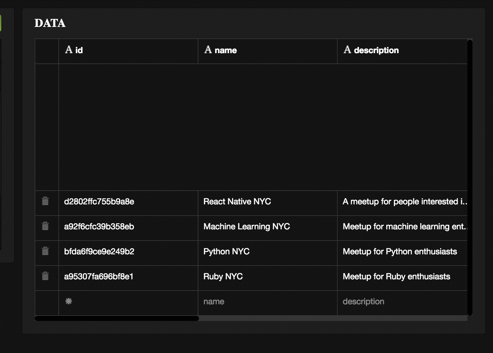
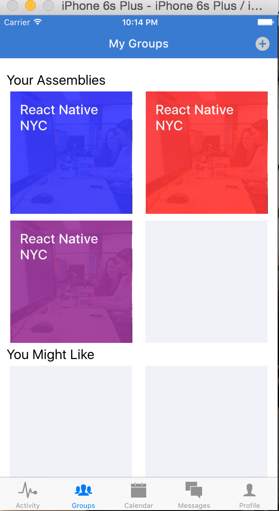

# Chapter 8: Creating Groups

In the last chapter, we built out a messaging feature. We were able to fetch messages related to a group of users and create new messages. Now we’ll focus on adding some new features to our tab-bar navigation – `Groups` and `Calendar`.

First we need to add these components to our tab-bar navigation. Let’s edit `Dashboard.js` and add the two files `application/calendar/CalendarView.js` and `application/groups/GroupsView.js`. 

```javascript
application/components/Dashboard.js
…
import CalendarView from './calendar/CalendarView';
import GroupsView from './groups/GroupsView';
…
<TabBarItemIOS
  title='Groups'
  selected={ selectedTab == 'Groups' }
  iconName=''
  onPress={() => this.setState({ selectedTab: 'Groups' })}
>
  <GroupsView {...this.props}/>
</TabBarItemIOS>
<TabBarItemIOS
  title='Calendar'
  selected={ selectedTab == 'Calendar' }
  iconName=''
  onPress={() => this.setState({ selectedTab: 'Calendar '})}
>
  <CalendarView {...this.props}/>
</TabBarItemIOS>
…

application/components/calendar/CalendarView.js

import React, { Component } from 'react';
import {
  View,
  Text,
  StyleSheet
} from 'react-native';

class CalendarView extends Component{
  render(){
    return (
      <View style={styles.container}>
        <Text>CALENDAR VIEW</Text>
      </View>
    )
  }
};

let styles = StyleSheet.create({
  container: {
    flex: 1,
    justifyContent: 'center',
    alignItems: 'center'
  }
});

export default CalendarView;

application/components/groups/GroupsView.js

import React, { Component } from 'react';
import {
  View,
  Text,
  StyleSheet
} from 'react-native';

class GroupsView extends Component{
  render(){
    return (
      <View style={styles.container}>
        <Text>GROUPS VIEW</Text>
      </View>
    )
  }
};

let styles = StyleSheet.create({
  container: {
    flex: 1, 
    justifyContent: 'center',
    alignItems: 'center'
  }
});

export default GroupsView;
```

Also, if you’re tired of logging in every time you have to refresh the app, you can use this hack to load a fake user on refresh and direct the `navigator` to the `Dashboard` route.

```javascript
index.ios.js
…
const FAKE_USER = {
  avatar: 'https://confluence.slac.stanford.edu/s/en_GB/5996/4a6343ec7ed8542179d6c78fa7f87c01f81da016.20/_/images/icons/profilepics/default.png',
  technologies: [
  	"JavaScript",
  	"Machine Learning",
  	"React Native",
  	"Redux"
  ],
  id: '15f9d0d11a023b8a',
  username: 'tom@example.com',
  password: 'password',
  firstName: 'Tom',
  lastName: 'Goldenberg',
  location : {
  	lat: 41.308274,
  	lng: -72.9278835,
  	city: {
  		long_name: "New Haven",
  		short_name: "New Haven",
  		types: [
  			"locality",
  			"political"
  		]
  	},
  	state: {
  		long_name: "Connecticut",
  		short_name: "CT",
  		types: [
  			"administrative_area_level_1",
  			"political"
  		]
  	},
  	county: {
  		long_name: "New Haven County",
  		short_name: "New Haven County",
  		types: [
  			"administrative_area_level_2",
  			"political"
  		]
  	},
  	formattedAddress: "New Haven, CT, USA"
  }
}

class assemblies extends Component {
  constructor(){
    super();
    this.updateUser = this.updateUser.bind(this);
    this.state = {
      user: FAKE_USER
    }
  }
  updateUser(user){
    this.setState({ user: user });
  }
  render() {
    let { user } = this.state;
    return (
      <Navigator
      initialRoute={{name: 'Dashboard', index: 0}}
```

## 8.2 Rendering Groups

We want to start off by rendering some groups. But we haven’t created any. How can we get around this? Of course, fake data! Let’s create some groups in our Deployd dashboard `localhost:2403/dashboard`, and then render them in our groups view.

In the Deployd dashboard, add the following groups: 
```
title  “React Native NYC”
description: “A meetup for people interested in learning React Native, the mobile development library created by Facebook.”
users: [
    {
        "user_id": "15f9d0d11a023b8a",
        "confirmed": true,
        "role": "owner",
        "joined_on": 1468113633150,
        "notifications": {
            "email": true
        }
    }
]
userIds: [ “15f9d0d11a023b8a” ]
image: “”,
technologies: [“React Native” ]
location: {
	"lat": 41.308274,
	"lng": -72.9278835,
	"city": {
		"long_name": "New Haven",
		"short_name": "New Haven",
		"types": [
			"locality",
			"political"
		]
	},
	"state": {
		"long_name": "Connecticut",
		"short_name": "CT",
		"types": [
			"administrative_area_level_1",
			"political"
		]
	},
	"county": {
		"long_name": "New Haven County",
		"short_name": "New Haven County",
		"types": [
			"administrative_area_level_2",
			"political"
		]
	},
	"formattedAddress": "New Haven, CT, USA"
}	

```

Now copy the data with new titles and descriptions, such as : 

```
title: “Machine Learning NYC”
description: “Meetup for machine learning enthusiasts”

title: “Python NYC”
description: “Meetup for Python enthusiasts”

title: “Ruby NYC”
description: “Meetup for Ruby enthusiasts”
```


Now we’re ready to fetch these groups and render them in our `GroupsView` page!

First, we have to turn `GroupsView` into another `Navigator` component. We will set `Groups` as our initial route, and render the groups in `Groups.js`.

```javascript
application/components/groups/GroupsView.js
import React, { Component } from 'react';
import {
  View,
  Text,
  StyleSheet,
  Navigator,
} from 'react-native';
import Groups from './Groups';

class GroupsView extends Component{
  constructor(){
    super();
    this.state = {
      groups: [],
      suggestedGroups: [],
      ready: false,
    }
  }
  componentWillMount(){
    this.loadGroups(this.props.currentUser.id);
  }
  loadGroups(userId){
    /* TODO: load user groups and suggested groups */
  }
  render(){
    return (
      <Navigator
        style={styles.container}
        initialRoute={{ name: 'Groups' }}
        renderScene={(route, navigator) => {
          switch(route.name){
            case 'Groups':
              return (
                <Groups {...route} {...this.props}/>
              );
          }
        }}
      />
    )
  }
};

let styles = StyleSheet.create({
  container: {
    flex: 1,
  }
});

export default GroupsView;

application/components/groups/Groups.js

import React, { Component } from 'react';
import {
  View,
  Text,
  TouchableOpacity,
  Image,
  ScrollView,
  Dimensions,
  StyleSheet,
} from 'react-native';
import Colors from '../../styles/colors';
import NavigationBar from 'react-native-navbar';
import Icon from 'react-native-vector-icons/MaterialIcons';

const { width: deviceWidth, height: deviceHeight } = Dimensions.get('window');

const AddGroupBox = ({ addGroup }) => (
  <TouchableOpacity
    onPress={()=> {
      /* TODO: redirect to create group */
    }}
    style={styles.groupImage}>
    <View style={[styles.group, {backgroundColor: Colors.inactive,}]} >
      <Icon name="add-circle" size={60} color={Colors.brandPrimary} />
    </View>
  </TouchableOpacity>
);

const GroupBox = ({ group }) => (
  <View></View>
);

const EmptyGroupBox = () => (
  <View style={styles.groupsContainer}>
    <View style={styles.groupImage}>
      <View style={[styles.group, {backgroundColor: Colors.inactive,}]} />
    </View>
  </View>
);

const EmptyGroupBoxes = () => (
  <View style={styles.assemblyBoxContainer}>
    <View style={styles.groupsContainer}>
      <AddGroupBox />
      <EmptyGroupBox />
    </View>
  </View>
);

const EmptySuggestedGroupBoxes = () => (
  <View style={styles.assemblyBoxContainer}>
    <View style={styles.groupsContainer}>
      <EmptyGroupBox />
      <EmptyGroupBox />
    </View>
  </View>
)

const GroupBoxes = ({ groups }) => (
  <View style={{justifyContent: 'center', flexDirection: 'row', flexWrap: 'wrap'}}>
    {groups.map((group, idx) => {
      if (!group) { return <EmptyGroupBox key={idx}/>}
      return (
        <View key={idx} style={styles.groupsContainer}>
          <Image source={{uri: group.image}} style={styles.groupImage}>
            <View style={[styles.group, {backgroundColor: group.color,}]} >
              <Text style={styles.groupText}>{group.title}</Text>
            </View>
          </Image>
        </View>
      )
    })}
  </View>
);

const SuggestedGroupBoxes = ({ groups }) => (
  <View>
    {groups.map((group, idx) => (
      <Text key={idx}>{group.title}</Text>
    ))}
  </View>
);

class Groups extends Component{
  constructor(){
    super();
    this._renderAddButton = this._renderAddButton.bind(this);
  }
  _renderAddButton(){
    return (
      <TouchableOpacity style={styles.navButton} onPress={()=>{
        /* TODO: redirect to create group */
      }}>
        <Icon name="add-circle" size={25} color="#ccc" />
      </TouchableOpacity>
    )
  }
  render(){
    let { groups, suggestedGroups } = this.props;
    groups = [
      {
        id: 'abc',
        title: 'React Native NYC',
        description: 'Meetup for React Native enthusiasts',
        image: 'https://c2.staticflickr.com/8/7495/16029420669_1e1cc4fccf_b.jpg',
        createdAt: 1468113633150,
        color: 'blue',
      },
      {
        id: 'abc',
        title: 'React Native NYC',
        description: 'Meetup for React Native enthusiasts',
        image: 'https://c2.staticflickr.com/8/7495/16029420669_1e1cc4fccf_b.jpg',
        createdAt: 1468113633150,
        color: 'red',
      },
      {
        id: 'abc',
        title: 'React Native NYC',
        description: 'Meetup for React Native enthusiasts',
        image: 'https://c2.staticflickr.com/8/7495/16029420669_1e1cc4fccf_b.jpg',
        createdAt: 1468113633150,
        color: 'purple',
      },
    ]
    if (groups.length % 2 === 1){
      groups = groups.concat(null);
    }
    let rightButtonConfig = this._renderAddButton()
    let titleConfig = {title: 'My Groups', tintColor: 'white'}
    return (
      <View style={styles.container}>
        <NavigationBar
          statusBar={{style: 'light-content', hidden: false}}
          title={titleConfig}
          tintColor={Colors.brandPrimary}
          rightButton={rightButtonConfig}
        />
        <ScrollView style={styles.assembliesContainer}>
          <Text style={styles.h2}>Your Assemblies</Text>
          {groups.length ? <GroupBoxes groups={groups} /> : <EmptyGroupBoxes />}
          <Text style={styles.h2}>You Might Like</Text>
          {suggestedGroups.length ? <SuggestedGroupBoxes groups={suggestedGroups} /> : <EmptySuggestedGroupBoxes />}
        </ScrollView>
      </View>
    )
  }
};

let styles = StyleSheet.create({
  container: {
    flex: 1,
    backgroundColor: 'white',
  },
  h2: {
    fontSize: 20,
    fontWeight: '400',
    paddingHorizontal: 10,
    color: Colors.bodyText,
  },
  group: {
    opacity: 0.9,
    flex: 1,
    padding: 15,
    height: (deviceWidth / 2) - 25,
    width: (deviceWidth / 2) - 25,
  },
  groupsContainer: {
    flexDirection: 'row',
    paddingHorizontal: 5,
  },
  groupImage: {
    height: (deviceWidth / 2) - 25,
    width: (deviceWidth / 2) - 25,
    opacity: 0.8,
    margin: 5,
  },
  navButton: {
    padding: 10,
  },
  groupText: {
    color: 'white',
    fontSize: 20,
    position: 'absolute',
    fontWeight: '500',
  },
});

export default Groups;

```



## 8.3 Fetching Groups

Now let's replace our fixture data with an actual API call. Let's fill in our `loadGroups` function in `GroupsView.js`.

```javascript
...
import { API, DEV } from '../../config';
...
loadGroups(userId){
  /* TODO: load user groups and suggested groups */
  let query = {
    members: {
      $elemMatch: {
        user_id: userId
      }
    }
  };
  fetch(`${API}/groups/?${JSON.stringify(query)}`)
  .then(response => response.json())
  .then(groups => this.setState({ groups, ready: true }))
  .catch(err => {
    console.log('ERR:', err);
    this.setState({ ready: true });
  })
  .done();
}

```

Now you should see the groups appearing as before. However, there's one problem -- a problem we didn't really address with our `Messages` component. We aren't displaying a `loading` state while the data is being fetched. Let's make sure that our component renders a loader while the `ready` field is set to `false`. Here's what that looks like in `application/components/groups/Groups.js`.

```javascript
import React, { Component } from 'react';
import {
  View,
  Text,
  TouchableOpacity,
  Image,
  ScrollView,
  Indicator,
  Dimensions,
  StyleSheet,
} from 'react-native';
...
const Loading = () => (
  <View style={styles.loadingContainer}>
    <ActivityIndicator size='large'/>
  </View>
)
...
   render(){
    let { groups, suggestedGroups, ready } = this.props;
    if (! ready ) { return <Loading /> }
...
```