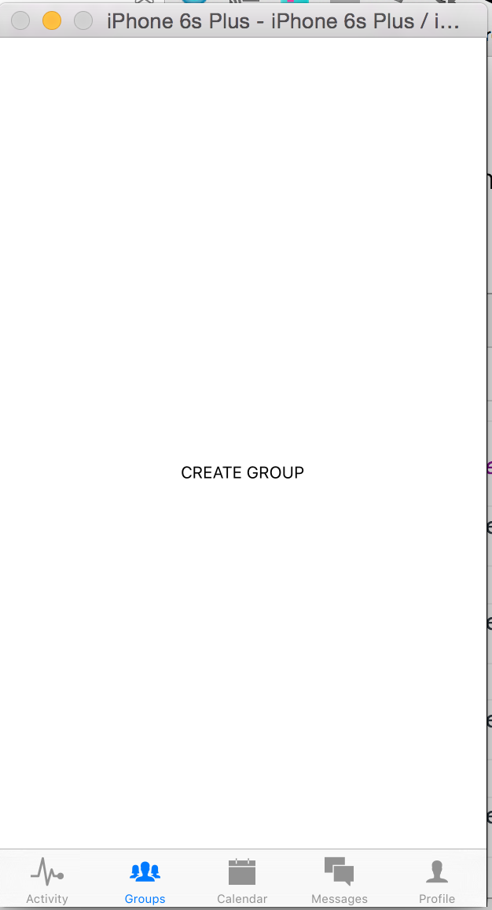
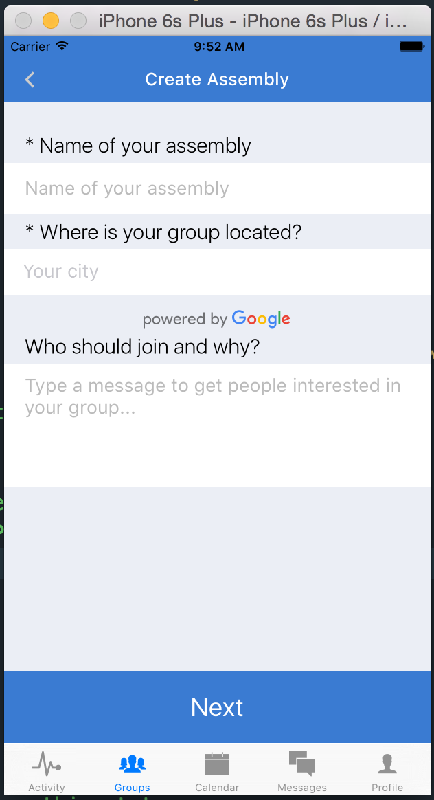
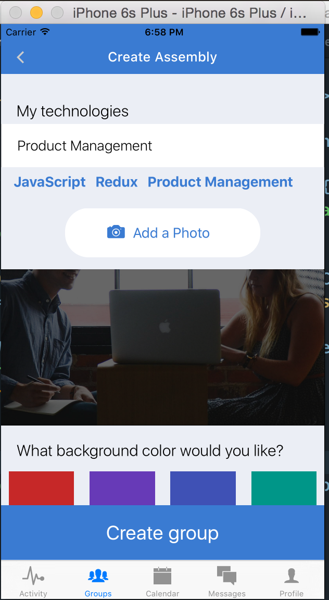
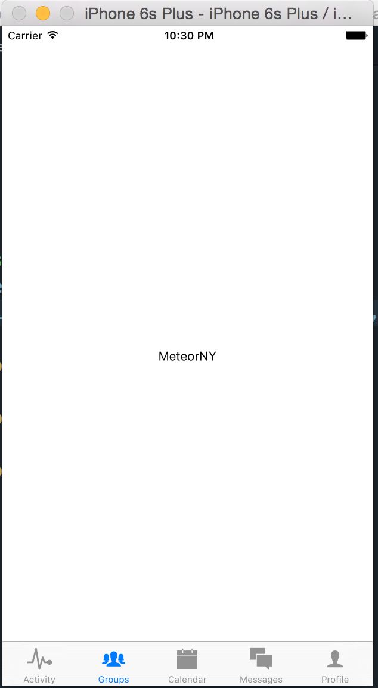
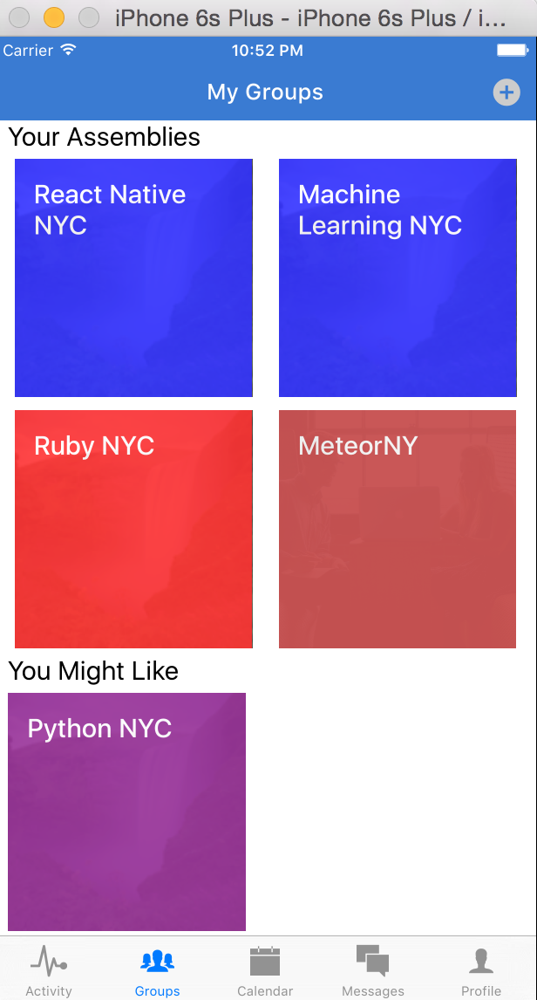

# Chapter 8: Creating Groups

In the last chapter, we built out a messaging feature. We were able to fetch messages related to a group of users and create new messages. Now we’ll focus on adding some new features to our tab-bar navigation – `Groups` and `Calendar`.

First we need to add these components to our tab-bar navigation. Let’s edit `Dashboard.js` and add the two files `application/calendar/CalendarView.js` and `application/groups/GroupsView.js`. 

```javascript
application/components/Dashboard.js
…
import CalendarView from './calendar/CalendarView';
import GroupsView from './groups/GroupsView';
…
<TabBarItemIOS
  title='Groups'
  selected={ selectedTab == 'Groups' }
  iconName=''
  onPress={() => this.setState({ selectedTab: 'Groups' })}
>
  <GroupsView {...this.props}/>
</TabBarItemIOS>
<TabBarItemIOS
  title='Calendar'
  selected={ selectedTab == 'Calendar' }
  iconName=''
  onPress={() => this.setState({ selectedTab: 'Calendar '})}
>
  <CalendarView {...this.props}/>
</TabBarItemIOS>
…

application/components/calendar/CalendarView.js

import React, { Component } from 'react';
import {
  View,
  Text,
  StyleSheet
} from 'react-native';

class CalendarView extends Component{
  render(){
    return (
      <View style={styles.container}>
        <Text>CALENDAR VIEW</Text>
      </View>
    )
  }
};

let styles = StyleSheet.create({
  container: {
    flex: 1,
    justifyContent: 'center',
    alignItems: 'center'
  }
});

export default CalendarView;

application/components/groups/GroupsView.js

import React, { Component } from 'react';
import {
  View,
  Text,
  StyleSheet
} from 'react-native';

class GroupsView extends Component{
  render(){
    return (
      <View style={styles.container}>
        <Text>GROUPS VIEW</Text>
      </View>
    )
  }
};

let styles = StyleSheet.create({
  container: {
    flex: 1, 
    justifyContent: 'center',
    alignItems: 'center'
  }
});

export default GroupsView;
```

Also, if you’re tired of logging in every time you have to refresh the app, you can use this hack to load a fake user on refresh and direct the `navigator` to the `Dashboard` route.

```javascript
index.ios.js
…
const FAKE_USER = {
  avatar: 'https://confluence.slac.stanford.edu/s/en_GB/5996/4a6343ec7ed8542179d6c78fa7f87c01f81da016.20/_/images/icons/profilepics/default.png',
  technologies: [
  	"JavaScript",
  	"Machine Learning",
  	"React Native",
  	"Redux"
  ],
  id: '15f9d0d11a023b8a',
  username: 'tom@example.com',
  password: 'password',
  firstName: 'Tom',
  lastName: 'Goldenberg',
  location : {
  	lat: 41.308274,
  	lng: -72.9278835,
  	city: {
  		long_name: "New Haven",
  		short_name: "New Haven",
  		types: [
  			"locality",
  			"political"
  		]
  	},
  	state: {
  		long_name: "Connecticut",
  		short_name: "CT",
  		types: [
  			"administrative_area_level_1",
  			"political"
  		]
  	},
  	county: {
  		long_name: "New Haven County",
  		short_name: "New Haven County",
  		types: [
  			"administrative_area_level_2",
  			"political"
  		]
  	},
  	formattedAddress: "New Haven, CT, USA"
  }
}

class assemblies extends Component {
  constructor(){
    super();
    this.updateUser = this.updateUser.bind(this);
    this.state = {
      user: FAKE_USER
    }
  }
  updateUser(user){
    this.setState({ user: user });
  }
  render() {
    let { user } = this.state;
    return (
      <Navigator
      initialRoute={{name: 'Dashboard', index: 0}}
```

## 8.2 Rendering Groups

We want to start off by rendering some groups. But we haven’t created any. How can we get around this? Of course, fake data! Let’s create some groups in our Deployd dashboard `localhost:2403/dashboard`, and then render them in our groups view.

In the Deployd dashboard, add the following groups: 
```
title  “React Native NYC”
description: “A meetup for people interested in learning React Native, the mobile development library created by Facebook.”
users: [
    {
        "user_id": "15f9d0d11a023b8a",
        "confirmed": true,
        "role": "owner",
        "joined_on": 1468113633150,
        "notifications": {
            "email": true
        }
    }
]
userIds: [ “15f9d0d11a023b8a” ]
image: “”,
technologies: [“React Native” ]
location: {
	"lat": 41.308274,
	"lng": -72.9278835,
	"city": {
		"long_name": "New Haven",
		"short_name": "New Haven",
		"types": [
			"locality",
			"political"
		]
	},
	"state": {
		"long_name": "Connecticut",
		"short_name": "CT",
		"types": [
			"administrative_area_level_1",
			"political"
		]
	},
	"county": {
		"long_name": "New Haven County",
		"short_name": "New Haven County",
		"types": [
			"administrative_area_level_2",
			"political"
		]
	},
	"formattedAddress": "New Haven, CT, USA"
}	

```

Now copy the data with new titles and descriptions, such as : 

```
title: “Machine Learning NYC”
description: “Meetup for machine learning enthusiasts”

title: “Python NYC”
description: “Meetup for Python enthusiasts”

title: “Ruby NYC”
description: “Meetup for Ruby enthusiasts”
```


Now we’re ready to fetch these groups and render them in our `GroupsView` page!

First, we have to turn `GroupsView` into another `Navigator` component. We will set `Groups` as our initial route, and render the groups in `Groups.js`.

```javascript
application/components/groups/GroupsView.js
import React, { Component } from 'react';
import {
  View,
  Text,
  StyleSheet,
  Navigator,
} from 'react-native';
import Groups from './Groups';

class GroupsView extends Component{
  constructor(){
    super();
    this.state = {
      groups: [],
      suggestedGroups: [],
      ready: false,
    }
  }
  componentWillMount(){
    this.loadGroups(this.props.currentUser.id);
  }
  loadGroups(userId){
    /* TODO: load user groups and suggested groups */
  }
  render(){
    return (
      <Navigator
        style={styles.container}
        initialRoute={{ name: 'Groups' }}
        renderScene={(route, navigator) => {
          switch(route.name){
            case 'Groups':
              return (
                <Groups {...route} {...this.props}/>
              );
          }
        }}
      />
    )
  }
};

let styles = StyleSheet.create({
  container: {
    flex: 1,
  }
});

export default GroupsView;

application/components/groups/Groups.js

import React, { Component } from 'react';
import {
  View,
  Text,
  TouchableOpacity,
  Image,
  ScrollView,
  Dimensions,
  StyleSheet,
} from 'react-native';
import Colors from '../../styles/colors';
import NavigationBar from 'react-native-navbar';
import Icon from 'react-native-vector-icons/MaterialIcons';

const { width: deviceWidth, height: deviceHeight } = Dimensions.get('window');

const AddGroupBox = ({ addGroup }) => (
  <TouchableOpacity
    onPress={()=> {
      /* TODO: redirect to create group */
    }}
    style={styles.groupImage}>
    <View style={[styles.group, {backgroundColor: Colors.inactive,}]} >
      <Icon name="add-circle" size={60} color={Colors.brandPrimary} />
    </View>
  </TouchableOpacity>
);

const GroupBox = ({ group }) => (
  <View></View>
);

const EmptyGroupBox = () => (
  <View style={styles.groupsContainer}>
    <View style={styles.groupImage}>
      <View style={[styles.group, {backgroundColor: Colors.inactive,}]} />
    </View>
  </View>
);

const EmptyGroupBoxes = () => (
  <View style={styles.assemblyBoxContainer}>
    <View style={styles.groupsContainer}>
      <AddGroupBox />
      <EmptyGroupBox />
    </View>
  </View>
);

const EmptySuggestedGroupBoxes = () => (
  <View style={styles.assemblyBoxContainer}>
    <View style={styles.groupsContainer}>
      <EmptyGroupBox />
      <EmptyGroupBox />
    </View>
  </View>
)

const GroupBoxes = ({ groups }) => (
  <View style={{justifyContent: 'center', flexDirection: 'row', flexWrap: 'wrap'}}>
    {groups.map((group, idx) => {
      if (!group) { return <EmptyGroupBox key={idx}/>}
      return (
        <View key={idx} style={styles.groupsContainer}>
          <Image source={{uri: group.image}} style={styles.groupImage}>
            <View style={[styles.group, {backgroundColor: group.color,}]} >
              <Text style={styles.groupText}>{group.title}</Text>
            </View>
          </Image>
        </View>
      )
    })}
  </View>
);

const SuggestedGroupBoxes = ({ groups }) => (
  <View>
    {groups.map((group, idx) => (
      <Text key={idx}>{group.title}</Text>
    ))}
  </View>
);

class Groups extends Component{
  constructor(){
    super();
    this._renderAddButton = this._renderAddButton.bind(this);
  }
  _renderAddButton(){
    return (
      <TouchableOpacity style={styles.navButton} onPress={()=>{
        /* TODO: redirect to create group */
      }}>
        <Icon name="add-circle" size={25} color="#ccc" />
      </TouchableOpacity>
    )
  }
  render(){
    let { groups, suggestedGroups } = this.props;
    groups = [
      {
        id: 'abc',
        title: 'React Native NYC',
        description: 'Meetup for React Native enthusiasts',
        image: 'https://c2.staticflickr.com/8/7495/16029420669_1e1cc4fccf_b.jpg',
        createdAt: 1468113633150,
        color: 'blue',
      },
      {
        id: 'abc',
        title: 'React Native NYC',
        description: 'Meetup for React Native enthusiasts',
        image: 'https://c2.staticflickr.com/8/7495/16029420669_1e1cc4fccf_b.jpg',
        createdAt: 1468113633150,
        color: 'red',
      },
      {
        id: 'abc',
        title: 'React Native NYC',
        description: 'Meetup for React Native enthusiasts',
        image: 'https://c2.staticflickr.com/8/7495/16029420669_1e1cc4fccf_b.jpg',
        createdAt: 1468113633150,
        color: 'purple',
      },
    ]
    if (groups.length % 2 === 1){
      groups = groups.concat(null);
    }
    let rightButtonConfig = this._renderAddButton()
    let titleConfig = {title: 'My Groups', tintColor: 'white'}
    return (
      <View style={styles.container}>
        <NavigationBar
          statusBar={{style: 'light-content', hidden: false}}
          title={titleConfig}
          tintColor={Colors.brandPrimary}
          rightButton={rightButtonConfig}
        />
        <ScrollView style={styles.assembliesContainer}>
          <Text style={styles.h2}>Your Assemblies</Text>
          {groups.length ? <GroupBoxes groups={groups} /> : <EmptyGroupBoxes />}
          <Text style={styles.h2}>You Might Like</Text>
          {suggestedGroups.length ? <SuggestedGroupBoxes groups={suggestedGroups} /> : <EmptySuggestedGroupBoxes />}
        </ScrollView>
      </View>
    )
  }
};

let styles = StyleSheet.create({
  container: {
    flex: 1,
    backgroundColor: 'white',
  },
  h2: {
    fontSize: 20,
    fontWeight: '400',
    paddingHorizontal: 10,
    color: Colors.bodyText,
  },
  group: {
    opacity: 0.9,
    flex: 1,
    padding: 15,
    height: (deviceWidth / 2) - 25,
    width: (deviceWidth / 2) - 25,
  },
  groupsContainer: {
    flexDirection: 'row',
    paddingHorizontal: 5,
  },
  groupImage: {
    height: (deviceWidth / 2) - 25,
    width: (deviceWidth / 2) - 25,
    opacity: 0.8,
    margin: 5,
  },
  navButton: {
    padding: 10,
  },
  groupText: {
    color: 'white',
    fontSize: 20,
    position: 'absolute',
    fontWeight: '500',
  },
});

export default Groups;

```


## 8.3 Fetching Groups

Now let's replace our fixture data with an actual API call. Let's fill in our `loadGroups` function in `GroupsView.js`.

```javascript
...
import { API, DEV } from '../../config';
...
  loadGroups(currentUser){
    /* TODO: load user groups and suggested groups */
    let query = {
      members: {
        $elemMatch: {
          user_id: currentUser.id
        }
      }
    };
    fetch(`${API}/groups/?${JSON.stringify(query)}`)
    .then(response => response.json())
    .then(groups => {
      this.setState({ groups, ready: true });
      let suggestedGroupsQuery = {
        id: { $nin: groups.map(group => group.id) },
        'location.city.long_name': currentUser.location.city.long_name
      };
      fetch(`${API}/groups/?${JSON.stringify(suggestedGroupsQuery)}`)
      .then(response => response.json())
      .then(suggestedGroups => this.setState({ suggestedGroups }))
      .catch(err => { console.log('ERR:', err)})
      .done();
    })
    .catch(err => {
      console.log('ERR:', err);
      this.setState({ ready: true });
    })
    .done();
  }

```

Now you should see the groups appearing as before. However, there's one problem -- a problem we didn't really address with our `Messages` component. We aren't displaying a `loading` state while the data is being fetched. Let's make sure that our component renders a loader while the `ready` field is set to `false`. Here's what that looks like in `application/components/groups/Groups.js`.

```javascript
import React, { Component } from 'react';
import {
  View,
  Text,
  TouchableOpacity,
  Image,
  ScrollView,
  Indicator,
  Dimensions,
  StyleSheet,
} from 'react-native';
...
const Loading = () => (
  <View style={styles.loadingContainer}>
    <ActivityIndicator size='large'/>
  </View>
)
...
   render(){
    let { groups, suggestedGroups, ready } = this.props;
    if (! ready ) { return <Loading /> }
...
```

Let's add this functionality to our Messages view as well. Just edit `application/components/messages/Conversations.js`.

```javascript
...
import React, { Component } from 'react';

import {
  StyleSheet,
  Text,
  TouchableOpacity,
  View,
  ListView,
  Image,
  ActivityIndicator
} from 'react-native';

const Loading = () => (
  <View style={styles.loadingContainer}>
    <ActivityIndicator size='large'/>
  </View>
)
...
render() {
    let { conversations, users, ready } = this.props;
    if (! ready ) { return <Loading /> }
```

Now is actually a good time to refactor this `<Loading/>` component to a separate file, where it can be referenced by the `Groups` view and the `Messages` view. Let's make a `utilities` folder and add it as `Loading.js`.

```javascript
import React from 'react';
import {
  View,
  ActivityIndicator
} from 'react-native';

const Loading = () => (
  <View style={styles.loadingContainer}>
    <ActivityIndicator size='large'/>
  </View>
);

let styles = StyleSheet.create({
  loadingContainer: {
    flex: 1,
    justifyContent: 'center',
    alignItems: 'center',
    backgroundColor: 'white'
  }
})

export default Loading;
```
Now we can reference our new component in both files as `import Loading from '../utilities/Loading'`, and delete our code in the those specific files.

## 8.4 Creating Groups

Out of the four operations of `create`, `read`, `update`, and `delete`, we have accomplished the `read` part of our `groups` collection. Now what about creating groups? 

Well, we can certainly reuse elements from our user login and registration forms to make it easier. What information are we looking for? 

```
name: String
description: String
location: Object
technologies: Array
color: String
image: String
```

The last two fields are really optional, but we can include them in our form too. Let's design another two-part form to create a feed, somewhat similar to our user registration process. We will need routes in our parent-level `GroupsView` component for both `CreateFeed` and `CreateFeedConfirm`. Let's add those in.

```javascript
application/components/groups/GroupsView.js
...
import CreateGroup from './CreateGroup';
import CreateGroupConfirm from './CreateGroupConfirm';
...
switch(route.name){
  case 'Groups':
    return (
      <Groups {...route} {...this.props} {...this.state} naviagator={navigator}/>
    );
  case 'CreateGroup':
    return (
      <CreateGroup {...this.props} navigator={navigator}/>
    );
  case 'CreateGroupConfirm':
    return (
      <CreateGroupConfirm {...this.props} {...route} navigator={navigator}/>
    )
}
...
```

Now of course we have to define `CreateGroup.js` and `CreateGroupConfirm.js`.

```javascript
application/components/groups/CreateGroup.js

import React, { Component } from 'react';

import {
  View,
  Text,
  StyleSheet
} from 'react-native';

const CreateGroup = () => (
  <View style={styles.container}>
    <Text>CREATE GROUP</Text>
  </View>
);

let styles = StyleSheet.create({
  container: {
    flex: 1,
    backgroundColor: 'white',
    justifyContent: 'center',
    alignItems: 'center'
  }
});

export default CreateGroup;

application/components/groups/CreateGroupConfirm.js

import React, { Component } from 'react';

import {
  View,
  Text,
  StyleSheet
} from 'react-native';

const CreateGroupConfirm = (props) => (
  <View style={styles.container}>
    <Text>CREATE GROUP CONFIRM</Text>
  </View>
);

let styles = StyleSheet.create({
  container: {
    flex: 1,
    backgroundColor: 'white',
    justifyContent: 'center',
    alignItems: 'center'
  }
});

export default CreateGroupConfirm;
```

Now we can link to our new routes when a user presses the `Add Group` button in `Groups.js`.

```javascript
...
const EmptyGroupBoxes = ({ navigator }) => (
  <View style={styles.assemblyBoxContainer}>
    <View style={styles.groupsContainer}>
      <AddGroupBox navigator={navigator}/>
      <EmptyGroupBox />
    </View>
  </View>
);

const AddGroupBox = ({ navigator }) => (
  <TouchableOpacity
    onPress={()=> {
      navigator.push({ name: 'CreateGroup' })
    }}
    style={styles.groupImage}>
    <View style={[styles.group, {backgroundColor: Colors.inactive,}]} >
      <Icon name="add-circle" size={60} color={Colors.brandPrimary} />
    </View>
  </TouchableOpacity>
);
...
_renderAddButton(){
  return (
    <TouchableOpacity style={styles.navButton} onPress={()=>{
      this.props.navigator.push({
        name: 'CreateGroup'
      })
    }}>
      <Icon name="add-circle" size={25} color="#ccc" />
    </TouchableOpacity>
  )
}
render(){
    let { groups, suggestedGroups, ready, navigator } = this.props;
...
    {groups.length ? <GroupBoxes groups={groups} /> : <EmptyGroupBoxes navigator={navigator}/>}
...
```
Now when you press the `Add Group` button, you should see a simple screen like this: 


Now we need to flesh out the form a bit.

```javascript
application/components/groups/CreateGroup.js
import React, { Component } from 'react';
import Icon from 'react-native-vector-icons/Ionicons';
import NavigationBar from 'react-native-navbar';
import Colors from '../../styles/colors';
import Globals from '../../styles/globals';
import {GooglePlacesAutocomplete} from 'react-native-google-places-autocomplete';
import LeftButton from '../accounts/LeftButton';
import Config from 'react-native-config';
import _ from 'underscore';
import { autocompleteStyles } from '../accounts/Register';

import {
  ScrollView,
  View,
  Text,
  StyleSheet,
  TextInput,
  TouchableOpacity,
  Dimensions
} from 'react-native';

const { width: deviceWidth, height: deviceHeight } = Dimensions.get('window');

class CreateGroup extends Component{
  constructor(){
    super();
    this.handleSubmit = this.handleSubmit.bind(this);
    this.handlePress = this.handlePress.bind(this);
    this.state = {
      name: '',
      description: '',
      location: null,
      errorMsg: ''
    }
  }
  handleSubmit(){
    let { name, location, summary } = this.state;
    this.props.navigator.push({
      name        : 'CreateGroupConfirm',
      groupName   : name,
      location,
      summary
    })
  }
  handlePress(data, details){
    this.setState({
      location: _.extend({}, details.geometry.location, {
        city: _.find(details.address_components, (c) => c.types[0] == 'locality'),
        state: _.find(details.address_components, (c) => c.types[0] == 'administrative_area_level_1'),
        county: _.find(details.address_components, (c) => c.types[0] == 'administrative_area_level_2'),
        formattedAddress: details.formatted_address,
      })
    })
  }
  render(){
    let { navigator } = this.props;
    let titleConfig = {title: 'Create Assembly', tintColor: 'white'}
    let leftButtonConfig = <LeftButton navigator={navigator}/>
    return (
      <View style={styles.container}>
        <NavigationBar
          title={titleConfig}
          tintColor={Colors.brandPrimary}
          leftButton={leftButtonConfig}
        />
        <ScrollView
          style={styles.formContainer}
          contentContainerStyle={styles.scrollView}>
          <Text style={styles.h4}>* Name of your assembly</Text>
          <View style={styles.formField}>
            <TextInput
              ref="name"
              returnKeyType="next"
              autofocus={true}
              onChangeText={(text)=> this.setState({name: text})}
              placeholderTextColor='#bbb'
              style={styles.input}
              placeholder="Name of your assembly"
            />
          </View>
          <Text style={styles.h4}>* Where is your group located?</Text>
          <GooglePlacesAutocomplete
            styles={autocompleteStyles}
            placeholder='Your city'
            minLength={2} // minimum length of text to search
            autoFocus={false}
            ref="location"
            fetchDetails={true}
            onPress={this.handlePress}
            getDefaultValue={() => { return ''; }}
            query={{
              key       : Config.GOOGLE_PLACES_API_KEY,
              language  : 'en', // language of the results
              types     : '(cities)', // default: 'geocode'
            }}
            currentLocation={false} // Will add a 'Current location' button at the top of the predefined places list
            currentLocationLabel="Current location"
            nearbyPlacesAPI='GooglePlacesSearch' // Which API to use: GoogleReverseGeocoding or GooglePlacesSearch
            GoogleReverseGeocodingQuery={{}}
            GooglePlacesSearchQuery={{ rankby: 'distance',}}
            filterReverseGeocodingByTypes={['locality', 'administrative_area_level_3']} // filter the reverse geocoding results by types - ['locality', 'administrative_area_level_3'] if you want to display only cities
            predefinedPlaces={[]}
          />
          <Text style={styles.h4}>Who should join and why?</Text>
          <TextInput
            ref="summary"
            returnKeyType="next"
            blurOnSubmit={true}
            clearButtonMode='always'
            onChangeText={(text)=> this.setState({summary: text})}
            placeholderTextColor='#bbb'
            style={styles.largeInput}
            multiline={true}
            placeholder="Type a message to get people interested in your group..."
          />
        </ScrollView>
        <TouchableOpacity
          onPress={this.handleSubmit}
          style={[Globals.submitButton, {marginBottom: 50}]}>
          <Text style={Globals.submitButtonText}>Next</Text>
        </TouchableOpacity>
      </View>
    )
  }
}
let styles = StyleSheet.create({
  container: {
    flex: 1,
    backgroundColor: 'white'
  },
  backButton: {
    paddingLeft: 20,
    backgroundColor: 'transparent',
    paddingBottom: 10,
  },
  formContainer: {
    backgroundColor: Colors.inactive,
    flex: 1,
    paddingTop: 25,
  },
  submitButton: {
    justifyContent: 'center',
    alignItems: 'center',
    backgroundColor: Colors.brandPrimary,
    height: 80,
    marginBottom: 50,
  },
  buttonText: {
    color: 'white',
    textAlign: 'center',
    fontSize: 25,
    fontWeight: '400'
  },
  h4: {
    fontSize: 20,
    fontWeight: '300',
    color: 'black',
    paddingHorizontal: 20,
    paddingVertical: 5,
  },
  formField: {
    backgroundColor: 'white',
    height: 50,
    paddingTop: 5,
  },
  largeFormField: {
    backgroundColor: 'white',
    height: 100,
  },
  addPhotoContainer: {
    backgroundColor: 'white',
    marginVertical: 15,
    marginHorizontal: (deviceWidth - 200) / 2,
    borderRadius: 30,
    paddingVertical: 15,
    paddingHorizontal: 10,
    flexDirection: 'row',
    justifyContent: 'center',
    alignItems: 'center',
  },
  photoText: {
    fontSize: 18,
    paddingHorizontal: 10,
    color: Colors.brandPrimary
  },
  technologyList:{
    textAlign: 'left',
    fontSize: 18,
    fontWeight: 'bold',
    color: Colors.brandPrimary,
    paddingHorizontal: 20,
    paddingVertical: 4,
  },
  input: {
    color: '#777',
    fontSize: 18,
    fontWeight: '300',
    height: 40,
    paddingHorizontal: 20,
    paddingVertical: 5,
  },
  avatar: {
    height: 200,
    width: deviceWidth,
    borderRadius: 3,
    padding: 20,
  },
  largeInput: {
    color: '#777',
    fontSize: 18,
    backgroundColor: 'white',
    fontWeight: '300',
    height: 120,
    paddingHorizontal: 20,
    paddingVertical: 5,
  },
});

export default CreateGroup;

```



You'll notice that this first part is very similar to the forms we created for user registration. In the second part, we want our user to select a possible background image, a color, and technologies for their group. Here we will have to be a little more creative.


Here is the interfact of our `CreateGroupConfirm` component. Notice many of the similarities between it and our `RegisterConfirm` form from before. In both we are using `react-native-image-picker` to set user images, and we are using the `Dropdown` component to select technologies. The only novelty is selecting the colors, which implements the `flex-wrap` functionality of flexbox.

```javascript
import React, { Component } from 'react';
import {
  View,
  Text,
  ScrollView,
  TouchableOpacity,
  TextInput,
  Image,
  Dimensions,
  StyleSheet,
  ActivityIndicator
} from 'react-native';
import _ from 'underscore';
import Icon from 'react-native-vector-icons/Ionicons';
import LeftButton from '../accounts/LeftButton';
import NavigationBar from 'react-native-navbar';
import Colors from '../../styles/colors';
import Globals from '../../styles/globals';
import { Technologies, ImageOptions, DefaultAvatar } from '../../fixtures';
import Dropdown, {
  Select,
  Option,
  OptionList
} from 'react-native-selectme';
import { API, DEV } from '../../config';
const { width: deviceWidth, height: deviceHeight } = Dimensions.get('window');
let ImagePickerManager = require('NativeModules').ImagePickerManager;
const SolidColors = ['red','deepPurple','indigo','teal','orange','blueGrey','purple','green'];
const TechnologyList = ({ technologies, handlePress }) => {
  return (
    <View style={styles.techOuterContainer}>
      {technologies.map((technology, idx) => (
        <TouchableOpacity key={idx} style={styles.techContainer} onPress={() => handlePress(technology)}>
          <Text style={styles.technologyList}>{technology}</Text>
        </TouchableOpacity>
      ))}
    </View>
  )
};

class CreateGroupConfirm extends Component{
  constructor(){
    super();
    this.getOptions = this.getOptions.bind(this);
    this.handleSubmit = this.handleSubmit.bind(this);
    this.showImagePicker = this.showImagePicker.bind(this);
    this.selectTechnology = this.selectTechnology.bind(this);
    this.removeTechnology = this.removeTechnology.bind(this);
    this.state = {
      image: '',
      color: '#3F51B5',
      technologies: []
    }
  }
  getOptions(){
    return this.refs.optionList;
  }
handleSubmit(){
	/* TODO: handle submit functionality */
}
  showImagePicker(){
    ImagePickerManager.showImagePicker(ImageOptions, (response) => {
      if (DEV) {console.log('Response = ', response);}

      if (response.didCancel) {
        if (DEV) {console.log('User cancelled image picker');}
      }
      else if (response.error) {
        if (DEV) {console.log('ImagePickerManager Error: ', response.error);}
      }
      else if (response.customButton) {
        if (DEV) {console.log('User tapped custom button: ', response.customButton);}
      }
      else {
        const source = 'data:image/png;base64,' + response.data;
        // if (DEV) {console.log('SRC', source);}
        this.setState({ image: source });
      }
    });
  }
  selectTechnology(technology){
    this.setState({ technologies: _.uniq(this.state.technologies.concat(technology))})
  }
  removeTechnology(technology){
    this.setState({ technologies: this.state.technologies.filter(tech => tech !== technology)})
  }
  render(){
    let { navigator } = this.props;
    let { technologies, image, color } = this.state;
    let titleConfig = {title: 'Create Assembly', tintColor: 'white'}
    return (
      <View style={styles.container}>
        <NavigationBar
          title={titleConfig}
          tintColor={Colors.brandPrimary}
          leftButton={<LeftButton navigator={navigator}/>}
        />
        <ScrollView
          style={styles.formContainer}>
          <Text style={styles.h4}>{"My technologies"}</Text>
          <Select
            width={deviceWidth}
            height={55}
            ref="select"
            styleText={optionTextStyles}
            style={selectStyles}
            optionListRef={this.getOptions}
            defaultValue="Add a technology"
            onSelect={this.selectTechnology}>
            {Technologies.map((tech, idx) => (
              <Option styleText={optionTextStyles} key={idx}>
                {tech}
              </Option>
            ))}
          </Select>
          <OptionList ref='optionList' overlayStyles={overlayStyles}/>
          <View>
            { technologies.length ? <TechnologyList technologies={technologies} handlePress={this.removeTechnology}/> : null }
          </View>
          <TouchableOpacity style={styles.addPhotoContainer} onPress={this.showImagePicker.bind(this)}>
            <Icon name="ios-camera" size={30} color={Colors.brandPrimary}/>
            <Text style={styles.photoText}>Add a Photo</Text>
          </TouchableOpacity>
          <View style={{height: 200, alignItems: 'center', backgroundColor: 'black'}}>
            <Image source={image === '' ? require('../../assets/images/welcome.png') : {uri: image}} style={styles.avatar}/>
          </View>
          <Text style={styles.h4}>What background color would you like?</Text>
          <View style={styles.colorContainer}>
            {SolidColors.map((color, idx) => (
              <TouchableOpacity
                key={idx}
                onPress={()=>this.setState({color: Colors[color]})}
                style={[styles.colorBox, {backgroundColor: Colors[color], borderColor: this.state.color == Colors[color] ? Colors.highlight : 'transparent' }]}
              >
              </TouchableOpacity>
            ))}
          </View>
        </ScrollView>
        <TouchableOpacity style={[Globals.submitButton, {marginBottom: 50}]} onPress={this.handleSubmit}>
          <Text style={Globals.submitButtonText}>Create group</Text>
        </TouchableOpacity>
      </View>
    )
  }
}

let styles = StyleSheet.create({
  container: {
    flex: 1,
  },
  colorContainer: {
    flex: 1,
    flexDirection: 'row',
    justifyContent: 'center',
    alignItems: 'stretch',
    flexWrap: 'wrap'
  },
  colorBox: {
    flex: 1,
    height: (deviceWidth / 4) - 20,
    width: (deviceWidth / 4) - 20,
    margin: 10,
    borderWidth: 4,
  },
  avatar: {
    height: 200,
    width: deviceWidth,
    borderRadius: 3,
    padding: 20,
  },
  technologyList:{
    textAlign: 'left',
    fontSize: 18,
    fontWeight: 'bold',
    backgroundColor: 'transparent',
    color: Colors.brandPrimary,
    paddingHorizontal: 2,
    paddingVertical: 4,
  },
  backButton: {
    paddingLeft: 20,
    backgroundColor: 'transparent',
    paddingBottom: 10,
  },
  formContainer: {
    backgroundColor: Colors.inactive,
    flex: 1,
    paddingTop: 15,
  },
  submitButton: {
    justifyContent: 'center',
    alignItems: 'center',
    backgroundColor: Colors.brandPrimary,
    height: 80,
  },
  buttonText: {
    color: 'white',
    textAlign: 'center',
    fontSize: 25,
    fontWeight: '400'
  },
  h4: {
    fontSize: 20,
    fontWeight: '300',
    marginTop: 15,
    color: 'black',
    paddingHorizontal: 20,
    paddingVertical: 5,
  },
  formField: {
    backgroundColor: 'white',
    height: 50,
    paddingTop: 5,
    marginBottom: 10,
  },
  techContainer: {
    paddingHorizontal: 2,
    marginHorizontal: 2,
    marginVertical: 4,
  },
  largeFormField: {
    backgroundColor: 'white',
    height: 100,
  },
  addPhotoContainer: {
    backgroundColor: 'white',
    marginVertical: 15,
    marginHorizontal: (deviceWidth - 250) / 2,
    width: 250,
    borderRadius: 30,
    paddingVertical: 15,
    paddingHorizontal: 10,
    flexDirection: 'row',
    justifyContent: 'center',
    alignItems: 'center',
  },
  photoText: {
    fontSize: 18,
    paddingHorizontal: 10,
    color: Colors.brandPrimary
  },
  input: {
    color: '#ccc',
    fontSize: 18,
    fontWeight: '300',
    height: 40,
    paddingHorizontal: 20,
    paddingVertical: 5,
  },
  largeInput: {
    color: '#777',
    fontSize: 18,
    backgroundColor: 'white',
    fontWeight: '300',
    height: 100,
    paddingHorizontal: 20,
    paddingVertical: 5,
  },
  formField:{
    flexDirection: 'row',
    justifyContent: 'space-between',
    alignItems: 'center',
    paddingHorizontal: 30,
    paddingVertical: 10,
    backgroundColor: 'white',
    marginVertical: 25,
  },
  formName:{
    fontWeight: '300',
    fontSize: 20,
  },
  techContainer: {
    paddingHorizontal: 2,
    marginHorizontal: 2,
    marginVertical: 4,
  },
  techOuterContainer: {
    flex: 1,
    flexDirection: 'row',
    flexWrap: 'wrap',
    paddingHorizontal: 10
  },
});

let selectStyles = {
  backgroundColor: 'white',
  justifyContent: 'center',
  paddingLeft: 10,
  borderTopWidth: 0,
  borderBottomWidth: 0,
};

let optionTextStyles = {
  fontSize: 18,
  fontWeight: '300',
}

let overlayStyles = {
  position: 'relative',
  width: window.width,
  height: window.height,
  flex : 1,
  justifyContent : "flex-start",
  alignItems : "center",
  backgroundColor : "#ffffff",
};

export default CreateGroupConfirm;
```


Now all we have to do is pass all of our data to the `handleSubmit` function and create a new group. We should also watch for errors and alert the user of any. Let’s fill in that function.

```javascript
handleSubmit(){
  let { color, image, technologies } = this.state;
  let { name, description, location, updateGroups, navigator } = this.props;
  if (! location ){
    this.setState({ errorMsg: 'You must provide a location.'})
  } else if (! name ){
    this.setState({ errorMsg: 'You must provide a name.'})
  } else if (! description){
    this.setState({ errorMsg: 'You must provide a description.'})
  } else {
    let group = { color, image, technologies, name, description, location };
    fetch(`${API}/groups`, {
      method: 'POST',
      body: JSON.stringify(group);
    })
    .then(response => response.json())
    .then(group => {
      updateGroups(group);
      navigator.push({
        name: 'Group',
        group: group
      })
    })
    .catch(err => console.log('ERR:', err))
    .done();
  }
}
```

Notice that we invoke a function `updateGroups` after the successful submission. This is because we want to update the `groups` array that we have in our parent `GroupsView` component. We then use `navigator` to navigate to our newly created `group`. Let’s make sure we create the function `updateGroups` and that we add a new route `Group` with a corresponding component.

```javascript
application/components/groups/GroupsView.js
…
import Group from './Group';
…
constructor(){
  super();
  this.addGroup = this.addGroup.bind(this);
…
addGroup(group){
  this.setState({ groups: this.state.groups.concat(group)})
}
…
case 'CreateGroupConfirm':
  return (
    <CreateGroupConfirm 
      {...this.props} 
      {...route} 
      navigator={navigator}
      addGroup={this.addGroup}
    />
  );
case 'Group':
  return (
    <Group 
      {...this.props}
      {...route}
      navigator={navigator}
    />
  )
```
Now let’s create the file `application/components/groups/Group.js`. Like usual, we’ll start off with a very simple component.

```javascript
import React, { Component } from 'react';
import {
  View,
  Text,
  StyleSheet
} from 'react-native';

const Group = ({group}) => (
  <View style={styles.container}>
    <Text>{group.name}</Text>
  </View>
);

let styles = StyleSheet.create({
  container: {
    flex: 1,
    justifyContent: 'center',
    alignItems: 'center',
    backgroundColor: 'white'
  }
});

export default Group;

```

Now when we create a new group, we should be directed to a blank screen with the group name. If we refresh, we will see the new group in our `Groups` view.






## 8.5 Viewing a Group

Now that we're able to create groups, we want to flesh out our `Group` view. Ideally, we want to show the group's background image, information on how many users it has, and a list of events. Let's edit `application/components/groups/Group.js`.

```javascript

```
 
