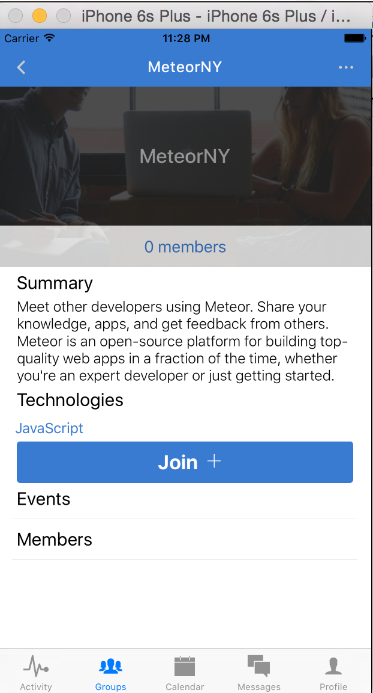
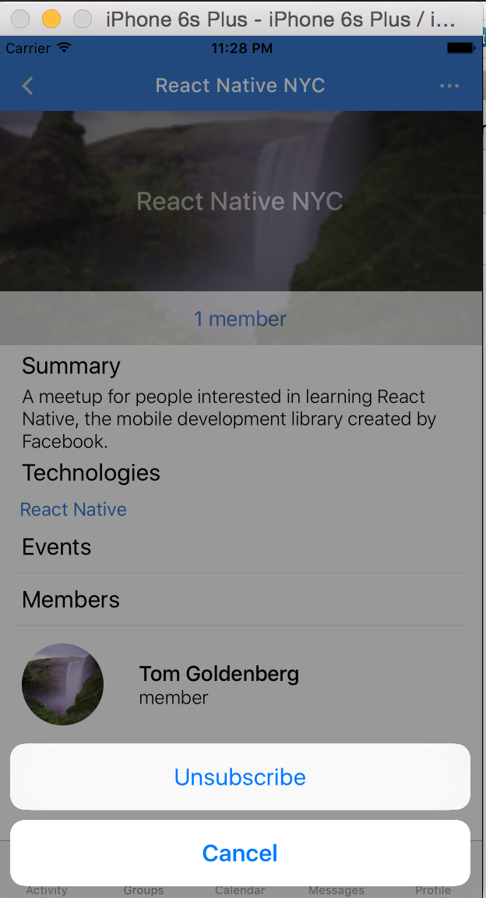
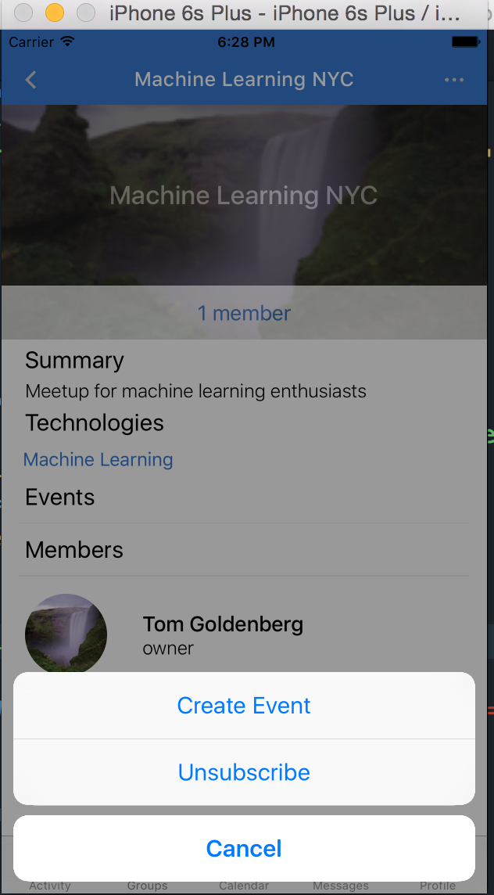
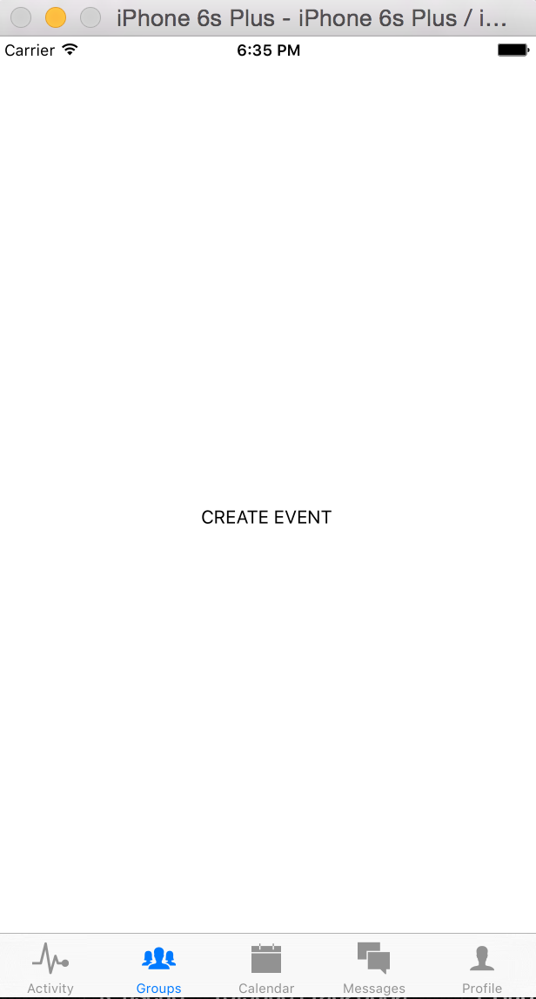
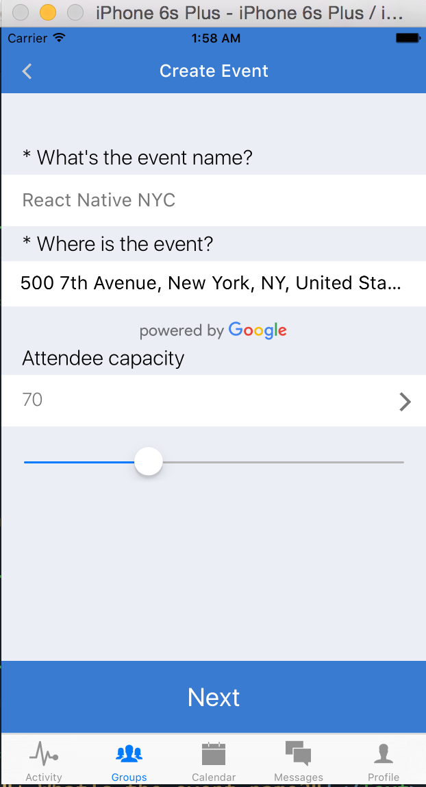
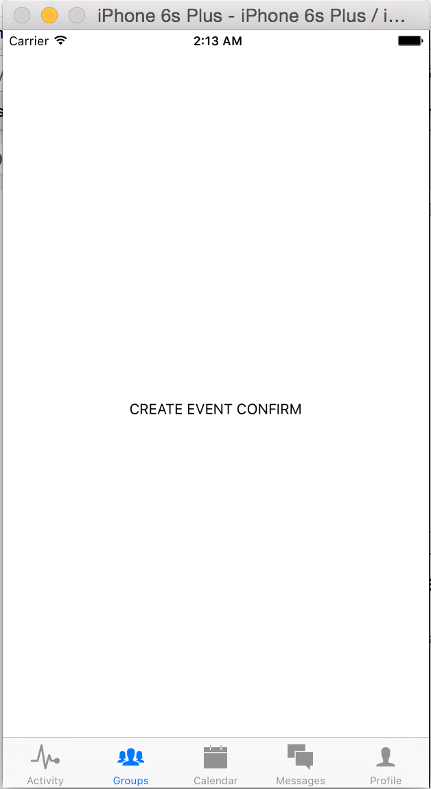

# Chapter 9: Creating Events

## 9.1 Joining groups

When we left off in chapter 8, we had added the ability to view groups, to create groups, and to view an individual group. We now need to add in the ability to join a group, as well as the ability to create and join events for a group.

From the `Groups` screen, let’s make suggested groups clickable, and add an icon for users to join them.

```javascript
application/components/groups/Groups.js

…
const SuggestedGroupBoxes = ({ groups, navigator }) => (
  <View style={{justifyContent: 'center', flexDirection: 'row', flexWrap: 'wrap'}}>
    {groups.map((group, idx) => {
      if (!group) { return <EmptyGroupBox key={idx}/>}
      return (
        <TouchableOpacity
          key={idx}
          style={styles.groupsContainer}
          onPress={() => navigator.push({ name: 'Group', group})}
        >
          <Image source={{uri: group.image}} style={styles.groupImage}>
            <View style={[styles.group, {backgroundColor: group.color,}]} >
              <Text style={styles.groupText}>{group.name}</Text>
            </View>
          </Image>
        </TouchableOpacity>
      );
    })}
  </View>
);

class Groups extends Component{
  constructor(){
    super();
    this._renderAddButton = this._renderAddButton.bind(this);
  }
  _renderAddButton(){
    return (
      <TouchableOpacity style={styles.navButton} onPress={()=>{
        this.props.navigator.push({
          name: 'CreateGroup'
        })
      }}>
        <Icon name="add-circle" size={25} color="#ccc" />
      </TouchableOpacity>
    )
  }
  render(){
    let { groups, suggestedGroups, ready, navigator } = this.props;
    if (! ready ) { return <Loading /> }
    if (groups.length % 2 === 1){
      groups = groups.concat(null);
    }
    let rightButtonConfig = this._renderAddButton()
    let titleConfig = {title: 'My Groups', tintColor: 'white'}
    return (
      <View style={styles.container}>
        <NavigationBar
          statusBar={{style: 'light-content', hidden: false}}
          title={titleConfig}
          tintColor={Colors.brandPrimary}
          rightButton={rightButtonConfig}
        />
        <ScrollView style={styles.assembliesContainer}>
          <Text style={styles.h2}>Your Assemblies</Text>
          {groups.length ? <GroupBoxes groups={groups} navigator={navigator}/> : <EmptyGroupBoxes navigator={navigator}/>}
          <Text style={styles.h2}>You Might Like</Text>
          {suggestedGroups.length ? <SuggestedGroupBoxes groups={suggestedGroups} navigator={navigator}/> : <EmptySuggestedGroupBoxes />}
        </ScrollView>
      </View>
    )
  }
};
…

application/components/groups/Group.js

const Join = () => (
  <Icon name='ios-add' size={30} color='white' style={styles.joinIcon} />
)

const Joined = () => (
  <View style={styles.joinedContainer}>
    <Icon name="ios-checkmark" size={30} color='white' style={styles.joinIcon}/>
  </View>
)

class Group extends Component{
  constructor(){
    super();
    this._renderJoin = this._renderJoin.bind(this);
    this.state = {
      users: [],
      ready: false,
    }
  }
…
_renderJoin(){
    let {group, currentUser, addUserToGroup} = this.props;
    let isMember = group.members.map(m => m.userId).indexOf(currentUser.id) !== -1;
    return (
      <View style={styles.joinContainer}>
        <TouchableOpacity
          onPress={() => addUserToGroup(group, currentUser)}
          style={styles.joinButton}>
          <Text style={styles.joinText}>{ isMember ? 'Joined' : 'Join'}</Text>
          { isMember ? <Joined /> : <Join /> }
        </TouchableOpacity>
      </View>
    )
  }
…

application/components/groups/GroupsView.js
…
  addUserToGroup(group, currentUser){
    let { groups, suggestedGroups } = this.state;
    let member = {
      userId: currentUser.id,
      role: 'member',
      joinedAt: new Date().valueOf(),
      notifications: {
        email: true
      }
    };
    if (group.members.map(m => m.userId).indexOf(currentUser.id) === -1){
      group.members = group.members.concat(member);
      groups = groups.concat(group);
      suggestedGroups = suggestedGroups.filter(g => g.id !== group.id);
      this.setState({ groups, suggestedGroups })
      this.updateGroup(group);
    }
  }
  updateGroup(group){
    fetch(`${API}/groups/${group.id}`, {
      method: 'PUT',
      headers: { 'Content-Type': 'application/json' },
      body: JSON.stringify(group)
    })
    .then(response => response.json())
    .then(data => console.log('RES', data))
    .catch(err => console.log('ERROR', err))
    .done();
  }
…
  case 'Group':
    return (
      <Group
        {...this.props}
        {...route}
        navigator={navigator}
        addUserToGroup={this.addUserToGroup}
      />
    )

```



Now when you click to join a group, our button should change its content to a success message, and the group should be added to our joined groups in the top level `Groups` component. Notice that we don’t just change the component state but also update our database through a PUT call to our Deployd server.

What about removing oneself from a group? For that, we can have an `ActionSheetIOS` component that gives us a list of actions, one of which can be to leave the group.

```javascript
…
const OptionsButton = ({ openActionSheet }) => {
  return (
    <TouchableOpacity style={styles.addButton} onPress={openActionSheet}>
      <Icon name="ios-more" size={25} color="#ccc" />
    </TouchableOpacity >
  )
}
…
class Group extends Component{
  constructor(){
    super();
    this._renderJoin = this._renderJoin.bind(this);
    this.openActionSheet = this.openActionSheet.bind(this);
    this.state = {
      users: [],
      ready: false,
    }
  }
  openActionSheet(){
    let { group, currentUser, unsubscribeFromGroup } = this.props;
    let options = {
      options: ['Unsubscribe', 'Cancel'],
      cancelButtonIndex: 1
    };
    ActionSheetIOS.showActionSheetWithOptions(options, (buttonIndex) => {
      switch(buttonIndex){
        case 0:
          unsubscribeFromGroup(group, currentUser);
        default:
          return;
      }
    });
  }
…
<NavigationBar
  title={{title: group.name, tintColor: 'white'}}
  tintColor={Colors.brandPrimary}
  leftButton={<LeftButton navigator={navigator}/>}
  rightButton={<OptionsButton openActionSheet={this.openActionSheet}/>}
/>
```




Now that we’ve invoked a `prop` `unsubscribeFromGroup`, we have to define it in our `GroupsView` component and pass it as a `prop`.

```javascript
unsubscribeFromGroup(group, currentUser){
  let { groups, suggestedGroups } = this.state;
  group.members = group.members.filter(member => member.userId !== currentUser.id);
  groups = groups.filter(g => g.id !== group.id);
  suggestedGroups = suggestedGroups.concat(group);
  this.setState({ groups, suggestedGroups })
  this.updateGroup(group);
}
```

Now notice that there is a lit of jumpiness when transitioning from the `Group` page to the `Groups` page when `pop`ping from the navigation stack. To eliminate this, we need to specify a `replaceAndPop` method instead of `pop` for the navigator. Let's modify our `LeftButton` component to take a `handlePress` function and then invoke it. Remember to modify the `props` of `<LeftButton` in other files that use it. 

```javascript
application/components/accounts/LeftButton.js

import React from 'react';
import {
  TouchableOpacity
} from 'react-native';

import Icon from 'react-native-vector-icons/Ionicons';
import Globals from '../../styles/globals';

const LeftButton = ({ handlePress }) => {
  return (
    <TouchableOpacity style={Globals.backButton} onPress={handlePress}>
      <Icon name="ios-arrow-back" size={25} color="#ccc" />
    </TouchableOpacity>
  );
};

export default LeftButton;


application/components/groups/Group.js
...
<NavigationBar
  title={{title: group.name, tintColor: 'white'}}
  tintColor={Colors.brandPrimary}
  leftButton={<LeftButton handlePress={() => navigator.replacePreviousAndPop({name: 'Groups'})}/>}
  rightButton={<OptionsButton openActionSheet={this.openActionSheet}/>}
/>
```

## 9.2 Creating Events

In the last part we added the ability to join or unsubscribe from a group. Next we want to give the group owners the ability to create and edit events. We can see that each member to a group has a specific role, currently either `member` or `owner`. We want users with `owner` privileges to be able to create and edit events, while users with `member` privileges have the ability to RSVP or cancel their reservation for an event.

Let’s add a button to our `ActionSheetIOS` to create an event if the user is an owner.

```javascript
…
openActionSheet(){
  let { group, currentUser, unsubscribeFromGroup, navigator } = this.props;
  let role = find(group.members, (member) => member.userId === currentUser.id).role;
  let buttonActions = ['Unsubscribe', 'Cancel'];
  if (role === 'admin' || role === 'owner')
    buttonActions.unshift('Create Event');
  let options = {
    options: buttonActions,
    cancelButtonIndex: buttonActions.length-1
  };
  ActionSheetIOS.showActionSheetWithOptions(options, (buttonIndex) => {
    switch(buttonActions[buttonIndex]){
      case 'Unsubscribe':
        unsubscribeFromGroup(group, currentUser);
      case 'Create Event':
        navigator.push({ name: 'Create Event', group })
      default:
        return;
    }
  });
}

```


Since we are redirecting after the user selects `Create Event`, we also need to define the `Create Event` route and create a `CreateEvent` component.

```javascript
application/components/groups/GroupsView.js
…
import CreateEvent from './CreateEvent';
…
  case 'Create Event':
    return (
      <CreateEvent
        {...this.props}
        {...route}
        navigator={navigator}
      />
    )
…

application/groups/CreateEvent.js

import React from 'react';
import {
  View,
  Text,
  StyleSheet
} from 'react-native';

const CreateEvent = () => (
  <View style={styles.container}>
    <Text>CREATE EVENT</Text>
  </View>
);

let styles = StyleSheet.create({
  container: {
    flex: 1,
    justifyContent: 'center',
    alignItems: 'center',
    backgroundColor: 'white'
  }
});

export default CreateEvent;

```

Now if the user selects `Create Event`, they should be directed to this page. Now we need to fill in the form to create an event. Remember that our `events` have the following schema: 

```
groupId: String
createdAt: Number
start: Number
end: Number
location: Object
going: Array 
name: String
capacity: Number
```

Since many of these fields require a numeric value, we’re going to explore using a Picker component. As far as the starting time and ending time, we will need some type of date selector.  Let’s design our form to take the name, location, and capacity in the first part, and the start and end times for the 2nd part.



```javascript
application/components/groups/CreateEvent.js
import React, { Component, PropTypes } from 'react';
import {
  ScrollView,
  View,
  Text,
  TextInput,
  StyleSheet,
  Slider,
  TouchableOpacity,
  Dimensions,
} from 'react-native';
import Picker from 'react-native-picker';
import Colors from '../../styles/colors';
import Globals from '../../styles/globals';
import Icon from 'react-native-vector-icons/Ionicons';
import NavigationBar from 'react-native-navbar';
import { GooglePlacesAutocomplete } from 'react-native-google-places-autocomplete';
import { extend, find, range } from 'underscore';
import { autocompleteStyles } from '../accounts/Register';
import LeftButton from '../accounts/LeftButton';
import Config from 'react-native-config';

const { width: deviceWidth, height: deviceHeight } = Dimensions.get('window');

class CreateEvent extends Component{
  constructor(){
    super();
    this.submitForm = this.submitForm.bind(this);
    this.saveLocation = this.saveLocation.bind(this);
    this.state = {
      location: null,
      name: '',
      capacity: 50,
      showPicker: false,
    };
  }
  submitForm(){
    let { location, name, capacity } = this.state;
    let { navigator, group } = this.props;
    navigator.push({
      name: 'CreateEventConfirm',
      group,
      location,
      capacity,
      eventName: name
    })
  }
  saveLocation(data, details=null){
    this.setState({
      location: extend({}, details.geometry.location, {
        city: find(details.address_components, (c) => c.types[0] == 'locality'),
        state: find(details.address_components, (c) => c.types[0] == 'administrative_area_level_1'),
        county: find(details.address_components, (c) => c.types[0] == 'administrative_area_level_2'),
        formattedAddress: details.formatted_address,
      })
    });
  }
  render(){
    let { navigator } = this.props;
    let { capacity, showPicker } = this.state;
    let titleConfig = {title: 'Create Event', tintColor: 'white'};
    return (
      <View style={styles.container}>
        <NavigationBar
          title={titleConfig}
          tintColor={Colors.brandPrimary}
          leftButton={<LeftButton handlePress={() => navigator.pop()}/>}
        />
        <ScrollView style={styles.formContainer} contentContainerStyle={styles.scrollViewContainer}>
          <Text style={styles.h4}>{"* What's the event name?"}</Text>
          <View style={styles.formField}>
            <TextInput
              ref="name"
              returnKeyType="next"
              onChangeText={(text)=> this.setState({ name: text })}
              placeholderTextColor='#bbb'
              style={styles.input}
              placeholder="Type a name"
            />
          </View>
          <Text style={styles.h4}>* Where is the event?</Text>
          <GooglePlacesAutocomplete
            styles={autocompleteStyles}
            placeholder='Type a place or street address'
            minLength={2}
            autoFocus={false}
            fetchDetails={true}
            onPress={this.saveLocation}
            getDefaultValue={() => ''}
            query={{
              key       :  Config.GOOGLE_PLACES_API_KEY,
              language  : 'en', // language of the results
            }}
            currentLocation={false}
            currentLocationLabel='Current Location'
            nearbyPlacesAPI='GooglePlacesSearch'
            GoogleReverseGeocodingQuery={{}}
            GooglePlacesSearchQuery={{ rankby: 'distance' }}
            filterReverseGeocodingByTypes={['locality', 'adminstrative_area_level_3']}
            predefinedPlaces={[]}
          />
          <Text style={styles.h4}>Attendee capacity</Text>
          <View style={styles.formField}>
            <View style={styles.pickerButton}>
              <Text style={styles.input}>{capacity ? capacity : 'Choose a duration'}</Text>
            </View>
          </View>
          <Slider
            style={styles.slider}
            defaultValue={capacity}
            step={10}
            minimumValue={10}
            maximumValue={200}
            onValueChange={(val) => this.setState({capacity: val})}
          />
        </ScrollView>
        <TouchableOpacity
          onPress={this.submitForm}
          style={[Globals.submitButton, {marginBottom: 50}]}>
          <Text style={Globals.submitButtonText}>Next</Text>
        </TouchableOpacity>
      </View>
    )
  }
}

let styles = StyleSheet.create({
  container: {
    flex: 1,
  },
  slider: {
    marginHorizontal: 20,
    marginVertical: 15,
  },
  pickerButton: {
    flex: 1,
    flexDirection: 'row',
    justifyContent: 'space-between',
    alignItems: 'center'
  },
  backButton: {
    paddingLeft: 20,
    backgroundColor: 'transparent',
    paddingBottom: 10,
  },
  formContainer: {
    backgroundColor: Colors.inactive,
    flex: 1,
    paddingTop: 25,
  },
  submitButton: {
    justifyContent: 'center',
    alignItems: 'center',
    backgroundColor: Colors.brandPrimary,
    height: 80,
    marginBottom: 50,
  },
  buttonText: {
    color: 'white',
    textAlign: 'center',
    fontSize: 25,
    fontWeight: '400'
  },
  h4: {
    fontSize: 20,
    fontWeight: '300',
    color: 'black',
    paddingHorizontal: 20,
    paddingVertical: 5,
  },
  formField: {
    backgroundColor: 'white',
    height: 50,
    paddingTop: 5,
  },
  largeFormField: {
    backgroundColor: 'white',
    height: 100,
  },
  addPhotoContainer: {
    backgroundColor: 'white',
    marginVertical: 15,
    marginHorizontal: (deviceWidth - 200) / 2,
    width: 200,
    borderRadius: 30,
    paddingVertical: 15,
    paddingHorizontal: 10,
    flexDirection: 'row',
    justifyContent: 'center',
    alignItems: 'center',
  },
  photoText: {
    fontSize: 18,
    paddingHorizontal: 10,
    color: Colors.brandPrimary
  },
  input: {
    color: '#777',
    fontSize: 18,
    fontWeight: '300',
    height: 40,
    paddingHorizontal: 20,
    paddingVertical: 5,
  },
  largeInput: {
    color: '#777',
    fontSize: 18,
    backgroundColor: 'white',
    fontWeight: '300',
    height: 120,
    paddingHorizontal: 20,
    paddingVertical: 5,
  },
});

export default CreateEvent;

```


 
Notice that this is the first time we use the `Slider` component. This is one of many nice React Native components that work equally well in Android as in iOS.

Now that we've saved the `name`, `location`, and `capacity` or our event, we can move on to the second part of the form and collect the start and end times. Once we save the event, we can redirect to the `Group` page again.

## 9.3 Collecting Date Information

In order to render the second part of our `events` form, let's modify `GroupsView.js` to include our new `CreateEventConfirm` route.

```javascript
application/components/groups/GroupsView.js
...
import CreateEventConfirm from './CreateEventConfirm';
...
case 'CreateEventConfirm':
  return (
    <CreateEventConfirm
      {...this.props}
      {...route}
      navigator={navigator}
    />
  );
 
```

And let's add our new `CreateEventConfirm` component:

```javascript
import React from 'react';
import {
  View,
  Text,
  StyleSheet
} from 'react-native';

const CreateEventConfirm = () => (
  <View style={styles.container}>
    <Text>CREATE EVENT CONFIRM</Text>
  </View>
);

let styles = StyleSheet.create({
  container: {
    flex: 1,
    justifyContent: 'center',
    alignItems: 'center',
    backgroundColor: 'white'
  }
});

export default CreateEventConfirm;

```
We should direct to a simple page now after the first part of the form. Now it's time to fill in the rest!


```javascript


```