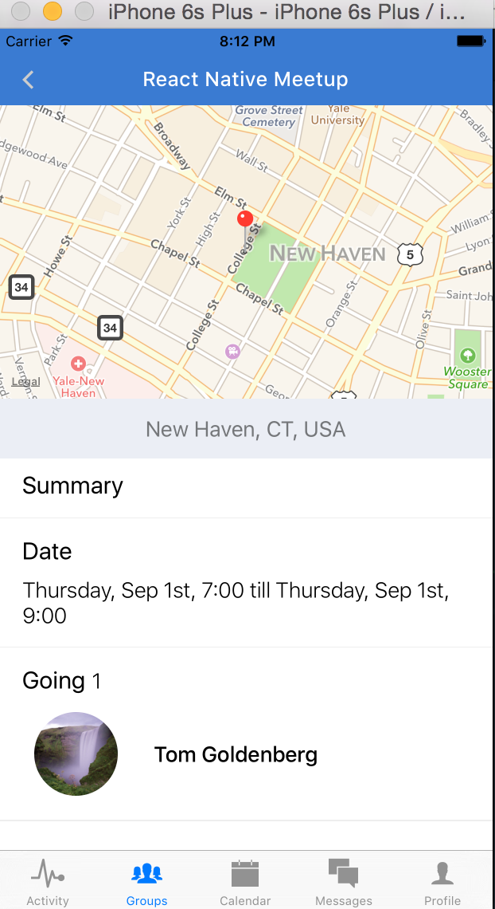

# Chapter 9: Creating Events

## 9.1 Joining groups

When we left off in chapter 8, we had added the ability to view groups, to create groups, and to view an individual group. We now need to add in the ability to join a group, as well as the ability to create and join events for a group.

Let's add this functionality in `GroupsView.js`.

```javascript
application/components/groups/GroupsView.js
…
class GroupsView extends Component{
  constructor(){
    super();
    this.addGroup = this.addGroup.bind(this);
    this.addUserToGroup = this.addUserToGroup.bind(this);
    this.state = {
      groups            : [],
      ready             : false,
      suggestedGroups   : [],
    }
  }
  ...
  addUserToGroup(group, currentUser){
    let { groups, suggestedGroups } = this.state;
    let member = {
      userId    : currentUser.id,
      role      : 'member',
      joinedAt  : new Date().valueOf(),
      notifications: {
        email: true
      }
    };
    if (! find(group.members, ({ userId}) => isEqual(userId, currentUser.id))){
      group.members = [ ...group.members, member ];
      groups = [ ...groups, group ];
      suggestedGroups = suggestedGroups.filter(({ id }) => ! isEqual(id, group.id));
      this.setState({ groups, suggestedGroups })
      this.updateGroup(group);
    }
  }
  updateGroup(group){
    fetch(`${API}/groups/${group.id}`, {
      method: 'PUT',
      headers: Headers,
      body: JSON.stringify(group)
    })
    .then(response => response.json())
    .then(data => {})
    .catch(err => {})
  }
  …
  case 'Group':
    return (
      <Group
        {...this.props}
        {...route}
        navigator={navigator}
        addUserToGroup={this.addUserToGroup}
      />
    )

```


Now when you click to join a group, our button should change its content to a success message, and the group should be added to our joined groups in the top level `Groups` component. Notice that we don’t just change the component state but also update our database through a `PUT` call to our Deployd server.

What about removing oneself from a group? For that, we can have an `ActionSheetIOS` component that gives us a list of actions, one of which can be to leave the group. Let's add an ellipses icon as the right button of our navigation bar, and have it open up the `ActionSheetIOS` component.

```javascript
application/components/groups/Group.js
…
const OptionsButton = ({ openActionSheet }) => {
  return (
    <TouchableOpacity style={globals.pa1} onPress={openActionSheet}>
      <Icon name="ios-more" size={25} color="#ccc" />
    </TouchableOpacity>
  )
}
…
class Group extends Component{
  constructor(){
    super();
    this.goBack = this.goBack.bind(this);
    this.visitProfile = this.visitProfile.bind(this);
    this.visitCreateEvent = this.visitCreateEvent.bind(this);
    this.openActionSheet = this.openActionSheet.bind(this);
    this.state = {
      events    : [],
      ready     : false,
      users     : [],
    }
  }
  openActionSheet(){
    let { group, currentUser } = this.props;
    let member = find(group.members, ({ userId }) => isEqual(userId, currentUser.id));
    let buttonActions = ['Unsubscribe', 'Cancel'];
    if (member && member.role === 'owner') {
      buttonActions.unshift('Create Event');
    }
    let options = {
      options: buttonActions,
      cancelButtonIndex: buttonActions.length-1
    };
    ActionSheetIOS.showActionSheetWithOptions(options, (buttonIndex) => {
      switch(buttonActions[buttonIndex]){
        case 'Unsubscribe':
          this.props.unsubscribeFromGroup(group, currentUser);
          break;
        case 'Create Event':
          this.visitCreateEvent(group);
          break;
        default:
          return;
      }
    });
  }
  visitCreateEvent(group){
    this.props.navigator.push({
      name: 'CreateEvent',
      group
    })
  }
…
<NavigationBar
  title={{title: group.name, tintColor: 'white'}}
  tintColor={Colors.brandPrimary}
  leftButton={<LeftButton navigator={navigator}/>}
  rightButton={<OptionsButton openActionSheet={this.openActionSheet}/>}
/>
```

We also have to define the method of `unsubscribeFromGroup` in our main `GroupsView.js` component.

```javascript
...
class GroupsView extends Component{
  constructor(){
    super();
    this.addGroup = this.addGroup.bind(this);
    this.unsubscribeFromGroup = this.unsubscribeFromGroup.bind(this);
    this.addUserToGroup = this.addUserToGroup.bind(this);
    this.state = {
      groups            : [],
      ready             : false,
      suggestedGroups   : [],
    }
  }
  ...
  unsubscribeFromGroup(group, currentUser){
    let { groups, suggestedGroups } = this.state;
    group.members = group.members.filter(member => member.userId !== currentUser.id);
    groups = groups.filter(g => g.id !== group.id);
    suggestedGroups = [
      ...suggestedGroups, group
    ];
    this.setState({ groups, suggestedGroups })
    this.updateGroup(group);
  }
  ...
  case 'Group':
    return (
      <Group
        {...this.props}
        {...this.state}
        {...route}
        addUserToGroup={this.addUserToGroup}
        navigator={navigator}
        unsubscribeFromGroup={this.unsubscribeFromGroup}
      />
  );
...
```

Let's review:
- We render a button as our right icon of our navigation bar. When it is pressed, we show the `ActionSheetIOS` by invoking the `showActionSheetWithOptions` function. We give two main options - either cancel the action sheet or unsubscribe from the group. We also give a 3rd option of creating an event if the user is an "owner" of the group. 
- When a user presses "unsubscribe", we filter the user out of the group's members and pass the group to the suggested groups array. We then update the state of both our groups and suggested groups. Last, we make changes to the database through an API call.


Let's make a commit here. 

[Commit 20](https://github.com/buildreactnative/assemblies-tutorial/tree/eadafaaa4dad011e4deda51874fc0f90d51aff19) - "Create join and unsubscribe functionality for groups"

## 9.2 Creating Events

In the last part we added the ability to join or unsubscribe from a group. Next we want to give the group owners the ability to create and edit events. We can see that each member to a group has a specific role, currently either `member` or `owner`. We want users with `owner` privileges to be able to create and edit events, while users with `member` privileges have the ability to RSVP or cancel their reservation for an event.

We've already added the code that allows an "owner" to Create an Event on the `ActionSheetIOS`. However, it doesn't lead anywhere. Therefore, we have to create another route for `CreateEvent`.

Let's modify `GroupsViews.js` and add a new file for `application/components/groups/CreateEvents.js`.

```javascript
application/components/groups/GroupsView.js
…
import CreateEvent from './CreateEvent';
…
  case 'Create Event':
    return (
      <CreateEvent
        {...this.props}
        {...route}
        navigator={navigator}
      />
    )
…
```
```javascript
application/components/groups/CreateEvent.js
import React, { Component } from 'react';
import { View, Text } from 'react-native';
import NavigationBar from 'react-native-navbar';
import Icon from 'react-native-vector-icons/Ionicons';

import BackButton from '../shared/BackButton';
import Colors from '../../styles/colors';
import { globals } from '../../styles';

class CreateEvent extends Component{
  constructor(){
    super();
    this.goBack = this.goBack.bind(this);
  }
  goBack(){
    this.props.navigator.pop();
  }
  render(){
    return (
      <View style={globals.flexContainer}>
        <NavigationBar
          title={{ title: 'Create Event', tintColor: 'white' }}
          tintColor={Colors.brandPrimary}
          leftButton={<BackButton handlePress={this.goBack}/>}
        />
        <View style={globals.flexCenter}>
          <Text style={globals.h2}>CreateEvent</Text>
        </View>
      </View>
    );
  }
};

export default CreateEvent;
```


## Selecting Date and Numerical Information

Now if the user selects `Create Event`, they should be directed to this page. Now we need to fill in the form to create an event. Remember that our `events` have the following schema: 

```
groupId: String
createdAt: Number
start: Number
end: Number
location: Object
going: Array 
name: String
capacity: Number
```

Since many of these fields require a numeric value, we’re going to explore using a Picker component. As far as the starting time and ending time, we will need some type of date selector.  Let’s design our form to take the name, location, and capacity in the first part, and the start and end times for the 2nd part.

```javascript
import Icon from 'react-native-vector-icons/Ionicons';
import NavigationBar from 'react-native-navbar';
import React, { Component, PropTypes } from 'react';
import { ScrollView, View, Text, TextInput, Slider, TouchableOpacity } from 'react-native';
import { GooglePlacesAutocomplete } from 'react-native-google-places-autocomplete';
import { find } from 'underscore';

import Colors from '../../styles/colors';
import BackButton from '../shared/BackButton';
import { KeyboardAwareScrollView } from 'react-native-keyboard-aware-scroll-view';
import Config from 'react-native-config';
import { globals, formStyles, autocompleteStyles } from '../../styles';

const styles = formStyles;

class CreateEvent extends Component{
  constructor(){
    super();
    this.saveLocation = this.saveLocation.bind(this);
    this.submitForm = this.submitForm.bind(this);
    this.goBack = this.goBack.bind(this);
    this.state = {
      capacity    : 50,
      location    : null,
      name        : '',
      showPicker  : false,
    };
  }
  submitForm(){
    this.props.navigator.push({
      name: 'CreateEventConfirmation',
      group: this.props.group,
      location: this.state.location,
      capacity: this.state.capacity,
      eventName: this.state.name,
    })
  }
  saveLocation(data, details=null){
    if ( ! details ) { return; }
    let location = {
      ...details.geometry.location,
      city: find(details.address_components, (c) => c.types[0] === 'locality'),
      state: find(details.address_components, (c) => c.types[0] === 'administrative_area_level_1'),
      county: find(details.address_components, (c) => c.types[0] === 'administrative_area_level_2'),
      formattedAddress: details.formatted_address
    };
    this.setState({ location });
    this.name.focus();
  }
  goBack(){
    this.props.navigator.pop();
  }
  render(){
    let { capacity } = this.state;
    return (
      <View style={[globals.flexContainer, globals.inactive]}>
        <NavigationBar
          title={{ title: 'Create Event', tintColor: 'white' }}
          tintColor={Colors.brandPrimary}
          leftButton={<BackButton handlePress={this.goBack}/>}
        />
        <KeyboardAwareScrollView style={[styles.formContainer, globals.mt1]} contentInset={{bottom: 49}}>
          <Text style={styles.h4}>* Where is the event?</Text>
          <View style={globals.flex}>
            <GooglePlacesAutocomplete
              styles={autocompleteStyles}
              placeholder='Type a place or street address'
              minLength={2}
              autoFocus={true}
              fetchDetails={true}
              onPress={this.saveLocation}
              getDefaultValue={() => ''}
              query={{
                key: Config.GOOGLE_PLACES_API_KEY,
                language: 'en'
              }}
              currentLocation={false}
              currentLocationLabel='Current Location'
              nearbyPlacesAPI='GooglePlacesSearch'
              GoogleReverseGeocodingQuery={{}}
              GooglePlacesSearchQuery={{ rankby: 'distance' }}
              filterReverseGeocodingByTypes={['locality', 'adminstrative_area_level_3']}
              predefinedPlaces={[]}
            />
          </View>
          <Text style={styles.h4}>{"* What's the event name?"}</Text>
          <View style={styles.formField}>
            <TextInput
              returnKeyType="next"
              ref={(el) => this.name = el }
              onChangeText={(name) => this.setState({ name })}
              placeholderTextColor='#bbb'
              style={styles.input}
              placeholder="Type a name"
            />
          </View>
          <Text style={styles.h4}>Attendee capacity</Text>
          <View style={styles.formField}>
            <View style={styles.pickerButton}>
              <Text style={styles.input}>{capacity ? capacity : 'Choose a duration'}</Text>
            </View>
          </View>
          <View style={globals.mv1}>
            <Slider
              style={styles.slider}
              defaultValue={capacity}
              value={capacity}
              step={10}
              minimumValue={10}
              maximumValue={200}
              onValueChange={(val) => this.setState({capacity: val})}
            />
          </View>
        </KeyboardAwareScrollView>
        <TouchableOpacity
          onPress={this.submitForm}
          style={[styles.submitButton, styles.buttonMargin]}>
          <Text style={globals.largeButtonText}>Next</Text>
        </TouchableOpacity>
      </View>
    )
  }
}

export default CreateEvent;
```

Let's review the code:
- Our use of Google Places autocomplete should be pretty familiar by now. Notice, however, that we only pass in 2 options to the `query` property, which allows us to search actual addresses, rather than just cities.
- This is the first time we are using the `<Slider/>` component. This is a nice way to get values that are along some sort of numerical range. The API for `Slider` is very simple and straightforward.

After the user fills out this part of the form and presses "Next", they reach a blank screen. That's because we haven't yet defined the second part of event creation -- 'CreateEventConfirmation.'


### Using Mobile Picker Components

In order to render the second part of our `events` form, let's modify `GroupsView.js` to include our new `CreateEventConfirm` route.

```javascript
application/components/groups/GroupsView.js
...
import CreateEventConfirmation from './CreateEventConfirmation';
...
case 'CreateEventConfirmation':
  return (
    <CreateEventConfirmation
      {...this.props}
      {...this.state}
      {...route}
      navigator={navigator}
    />
  );
 
```

And let's add a simple component as our new `CreateEventConfirm` component:

```javascript
import React, { Component } from 'react';
import { View, Text } from 'react-native';
import NavigationBar from 'react-native-navbar';
import Icon from 'react-native-vector-icons/Ionicons';

import Colors from '../../styles/colors';
import BackButton from '../shared/BackButton';
import { globals } from '../../styles';

class CreateEventConfirmation extends Component{
  render(){
    return (
      <View style={globals.flexContainer}>
        <NavigationBar
          title={{ title: 'Create Event', tintColor: 'white' }}
          tintColor={Colors.brandPrimary}
          leftButton={<BackButton handlePress={this.goBack}/>}
        />
        <View style={globals.flexCenter}>
          <Text style={globals.h2}>CreateEventConfirmation</Text>
        </View>
      </View>
    )
  }
};

export default CreateEventConfirmation;

```
We should direct to a simple page now after the first part of the form. Now it's time to fill in the rest! But first, let's make a commit here.

[Commit 21](https://github.com/buildreactnative/assemblies-tutorial/tree/fd1808d98d749c4a9b70c80ed6168e125540646a) - "Render first part of event creation form"


Now let's move on to fleshing out the second part of our form.
```javascript
import React, { Component, PropTypes } from 'react';
import {
  ScrollView,
  View,
  Text,
  TextInput,
  StyleSheet,
  DatePickerIOS,
  Modal,
  TouchableOpacity,
  Dimensions,
} from 'react-native';
import Picker from 'react-native-picker';
import Colors from '../../styles/colors';
import Globals from '../../styles/globals';
import Icon from 'react-native-vector-icons/Ionicons';
import NavigationBar from 'react-native-navbar';
import { GooglePlacesAutocomplete } from 'react-native-google-places-autocomplete';
import { extend, find, range } from 'underscore';
import { autocompleteStyles } from '../accounts/Register';
import LeftButton from '../accounts/LeftButton';
import moment from 'moment';
import Config from 'react-native-config';

const { width: deviceWidth, height: deviceHeight } = Dimensions.get('window');

class CreateEvent extends Component{
  constructor(){
    super();
    this.submitForm = this.submitForm.bind(this);
    this.state = {
      start: new Date(),
      showStartModal: false,
      showEndModal: false,
      end: new Date(),
      description: '',
      finalStart: new Date(),
      finalEnd: new Date()
    };
  }
  submitForm(){
    /* TODO: submit form */
  }
  render(){
    let { navigator } = this.props;
    let { start, end, finalStart, finalEnd, showStartModal, showEndModal, description } = this.state;
    let titleConfig = {title: 'Confirm Event', tintColor: 'white'};
    return (
      <View style={styles.container}>
        <NavigationBar
          title={titleConfig}
          tintColor={Colors.brandPrimary}
          leftButton={<LeftButton handlePress={() => navigator.pop()}/>}
        />
        <ScrollView style={styles.formContainer} contentContainerStyle={styles.scrollViewContainer}>
          <Text style={styles.h4}>{"* When does the event start?"}</Text>
          <View style={styles.formField}>
            <TouchableOpacity style={styles.pickerButton} onPress={() => this.setState({ showStartModal: ! showStartModal })}>
              <Text style={styles.input}>{finalStart ? moment(finalStart).format('dddd MMM Do, h:mm a') : 'Choose a starting time'}</Text>
              <Icon name="ios-arrow-forward" color='#777' size={30} style={{marginRight: 15}}/>
            </TouchableOpacity>
          </View>
          <Text style={styles.h4}>* When does the event end?</Text>
          <View style={styles.formField}>
            <TouchableOpacity style={styles.pickerButton} onPress={() => this.setState({ showEndModal: ! showEndModal })}>
              <Text style={styles.input}>{finalEnd ? moment(finalEnd).format('dddd MMM Do, h:mm a') : 'Choose an ending time'}</Text>
              <Icon name="ios-arrow-forward" color='#777' size={30} style={{marginRight: 15}}/>
            </TouchableOpacity>
          </View>
          <Text style={styles.h4}>Leave a note for your attendees</Text>
          <TextInput
            ref="summary"
            returnKeyType="next"
            blurOnSubmit={true}
            clearButtonMode='always'
            onChangeText={(text)=> this.setState({ description: text })}
            placeholderTextColor='#bbb'
            style={styles.largeInput}
            multiline={true}
            placeholder="Type a summary of the event..."
          />
        </ScrollView>
        <TouchableOpacity
          onPress={this.submitForm}
          style={[Globals.submitButton, {marginBottom: 50}]}>
          <Text style={Globals.submitButtonText}>Save</Text>
        </TouchableOpacity>
        <Modal
          animationType={"slide"}
          transparent={true}
          visible={showStartModal}
          onRequestClose={() => this.setState({ showStartModal: false, finalStart: this.state.start })}
          >
         <View style={styles.modal}>
           <View style={styles.datepicker}>
             <DatePickerIOS
               date={this.state.start}
               minimumDate={new Date()}
               minuteInterval={15}
               mode='datetime'
               onDateChange={(date) => this.setState({ start: date })}
             />
             <View style={styles.btnGroup}>
               <TouchableOpacity
                 style={styles.pickerBtn}
                 onPress={() => this.setState({ showStartModal: false })}
                 >
                 <Text style={styles.btnText}>Cancel</Text>
               </TouchableOpacity>
               <TouchableOpacity
                 style={[styles.pickerBtn, styles.btnPrimary]}
                 onPress={() => this.setState({ showStartModal: false, finalStart: this.state.start })}
                 >
                 <Text style={[styles.btnText, { color: 'white' }]}>Save</Text>
               </TouchableOpacity>
             </View>
           </View>

         </View>
        </Modal>
        <Modal
          animationType={"slide"}
          transparent={true}
          visible={showEndModal}
          onRequestClose={() => this.setState({ showEndModal: false, finalEnd: this.state.end })}
          >
         <View style={styles.modal}>
           <View style={styles.datepicker}>
             <DatePickerIOS
               date={this.state.end}
               minimumDate={new Date()}
               minuteInterval={15}
               mode='datetime'
               onDateChange={(date) => this.setState({ end: date })}
             />
             <View style={styles.btnGroup}>
               <TouchableOpacity
                 style={styles.pickerBtn}
                 onPress={() => this.setState({ showEndModal: false })}
                 >
                 <Text style={styles.btnText}>Cancel</Text>
               </TouchableOpacity>
               <TouchableOpacity
                 style={[styles.pickerBtn, styles.btnPrimary]}
                 onPress={() => this.setState({ showEndModal: false, finalEnd: this.state.end })}
                 >
                 <Text style={[styles.btnText, { color: 'white' }]}>Save</Text>
               </TouchableOpacity>
             </View>
           </View>

         </View>
        </Modal>
      </View>
    )
  }
}

let styles = StyleSheet.create({
  container: {
    flex: 1,
  },
  modal: {
    backgroundColor: 'rgba(0, 0, 0, 0.7)',
    flex: 1,
    justifyContent: 'center',
    padding: 20
  },
  datepicker: {
    backgroundColor: 'white',
    padding: 20,
    borderRadius: 3,
  },
  btnGroup: {
    flexDirection: 'row',
    alignItems: 'center',
    justifyContent: 'center',
  },
  btnText: {
    fontSize: 15,
  },
  btnPrimary: {
    backgroundColor: Colors.brandPrimary,
  },
  pickerBtn: {
    paddingHorizontal: 15,
    paddingVertical: 8,
    backgroundColor: Colors.inactive,
    marginHorizontal: 5
  },
  backButton: {
    paddingLeft: 20,
    backgroundColor: 'transparent',
    paddingBottom: 10,
  },
  formContainer: {
    backgroundColor: Colors.inactive,
    flex: 1,
    paddingTop: 25,
  },
  submitButton: {
    justifyContent: 'center',
    alignItems: 'center',
    backgroundColor: Colors.brandPrimary,
    height: 80,
    marginBottom: 50,
  },
  buttonText: {
    color: 'white',
    textAlign: 'center',
    fontSize: 25,
    fontWeight: '400'
  },
  h4: {
    fontSize: 20,
    fontWeight: '300',
    color: 'black',
    paddingHorizontal: 20,
    paddingVertical: 5,
  },
  formField: {
    backgroundColor: 'white',
    height: 50,
    paddingTop: 5,
  },
  largeFormField: {
    backgroundColor: 'white',
    height: 100,
  },
  addPhotoContainer: {
    backgroundColor: 'white',
    marginVertical: 15,
    marginHorizontal: (deviceWidth - 200) / 2,
    width: 200,
    borderRadius: 30,
    paddingVertical: 15,
    paddingHorizontal: 10,
    flexDirection: 'row',
    justifyContent: 'center',
    alignItems: 'center',
  },
  photoText: {
    fontSize: 18,
    paddingHorizontal: 10,
    color: Colors.brandPrimary
  },
  input: {
    color: '#777',
    fontSize: 18,
    fontWeight: '300',
    height: 40,
    paddingHorizontal: 20,
    paddingVertical: 5,
  },
  largeInput: {
    color: '#777',
    fontSize: 18,
    backgroundColor: 'white',
    fontWeight: '300',
    height: 120,
    paddingHorizontal: 20,
    paddingVertical: 5,
  },
});

export default CreateEvent;


```

Notice that we use the `Modal` component for the first time, with some custom modifications. Now all we have to do is finish our `submitForm` function to save the results and/or display error messages.

```javascript
...
submitForm(){
  let { finalStart, finalEnd, description } = this.state;
  let { group, eventName, location, capacity, currentUser, navigator } = this.props;
  let event = {
    start: finalStart.valueOf(),
    end: finalEnd.valueOf(),
    description,
    createdAt: new Date().valueOf(),
    groupId: group.id,
    name: eventName,
    location: location || {},
    capacity,
    going: [ currentUser.id ]
  };
  fetch(`${API}/events`, {
    method: 'POST',
    headers: { 'Content-Type': 'application/json' },
    body: JSON.stringify(event)
  })
  .then(response => response.json())
  .then(data => navigator.push({ name: 'Group', group }))
  .catch(err => this.setState({ errorMsg: err.reason }))
  .done();
}
```

Now when a user completes the form and submits, they should be directed back to the `Group` page. From here, we will want to fetch the events related to that group on `componentDidMount` and then render them in the `events` section. Let's modify `Group.js`.

```javascript
application/components/groups/Group.js
...
componentDidMount(){
  let { group } = this.props;
  let eventsQuery = { groupId: group.id };
  fetch(`${API}/events?${JSON.stringify(eventsQuery)}`)
  .then(response => response.json())
  .then(events => {
    this.setState({ events, ready: true });
    let query = {
      id: { $in: group.members.map(member => member.userId) }
    }
    fetch(`${API}/users?${JSON.stringify(query)}`)
    .then(response => response.json())
    .then(users => this.setState({ users, ready: true }))
    .catch(err => { if (DEV) console.log('FETCH USERS ERROR: ', err)})
    .done();
  })
  .catch(err => this.setState({ ready: true }))
  .done();
}
...
<Text style={styles.h2}>Events</Text>
{events.map((event, idx) => {
  let going = find(event.going, (g) => g === currentUser.id);
  return (
    <View style={styles.eventContainer}>
      <TouchableOpacity style={styles.eventInfo}>
        <Text style={styles.h5}>{event.name}</Text>
        <Text style={styles.h4}>{moment(event.start).format('dddd, MMM Do')}</Text>
        <Text style={styles.h4}>{event.going.length} Going</Text>
      </TouchableOpacity>
      <View style={styles.goingContainer}>
        <Text style={styles.goingText}>{going ? "You're Going" : "Want to go?"}</Text>
        {going ? <Icon name="ios-checkmark" size={30} color={Colors.brandPrimary} /> : <Icon name="ios-add" size={30} color={Colors.brandPrimary} /> }
      </View>
    </View>
  )
})}
```


## 9.4 Joining an event

Once we have created an event, we want our users to be able to RSVP for them, or cancel their reservation. Now is a good opportunity to use a swipe-to-join functionality. When our user swipes left on the event, we want to show them the option to either join or leave the event. We can use the package `react-native-swipeout` for this. As usual, install the package via `npm` - `npm install --save react-native-swipeout`. 

```javascript
application/components/groups/Group.js
...
import Swipeout from 'react-native-swipeout';
import {
  View,
  ListView,
...
class EventList extends Component{
  constructor(){
    super();
    this._renderRow = this._renderRow.bind(this);
  }
  _renderRow(event, sectionID, rowID){
    let { currentUser, cancelRSVP, joinEvent, events } = this.props;
    let going = find(event.going, (g) => g === currentUser.id);
    let right = [{
      text: 'RSVP',
      type: 'primary',
      onPress: () => { joinEvent(event, currentUser) }
    }];
    if (going) {
      right = [{
        text: 'Cancel',
        type: 'delete',
        onPress: () => { cancelRSVP(event, currentUser) }
      }];
    }
    return (
      <Swipeout
        backgroundColor='white'
        rowID={rowID}
        right={right}
      >
        <View style={styles.eventContainer}>
          <TouchableOpacity style={styles.eventInfo}>
            <Text style={styles.h5}>{event.name}</Text>
            <Text style={styles.h4}>{moment(event.start).format('dddd, MMM Do')}</Text>
            <Text style={styles.h4}>{event.going.length} Going</Text>
          </TouchableOpacity>
          <View style={styles.goingContainer}>
            <Text style={styles.goingText}>{going ? "You're Going" : "Want to go?"}</Text>
            {going ? <Icon name="ios-checkmark" size={30} color={Colors.brandPrimary} /> : <Icon name="ios-add" size={30} color={Colors.brandPrimary} /> }
          </View>
        </View>
      </Swipeout>
    )
  }
  render(){
    let { events } = this.props
    return (
      <ListView
        enableEmptySections={true}
        dataSource={new ListView.DataSource({rowHasChanged: (r1, r2) => r1 != r2 }).cloneWithRows(events)}
        renderRow={this._renderRow.bind(this)}
        style={styles.listview}
      />
    )
  }
};

...
cancelRSVP(event, currentUser){
  let { events } = this.state;
  event.going = event.going.filter(userId => userId !== currentUser.id);
  let idx = events.map(evt => evt.id).indexOf(event.id);
  this.setState({ events: [
    ...events.slice(0, idx),
    event,
    ...events.slice(idx + 1)
  ]});
}
joinEvent(event, currentUser){
  console.log('JOIN RSVP', event, currentUser);
  let { events } = this.state;
  event.going = event.going.concat(currentUser.id);
  let idx = events.map(evt => evt.id).indexOf(event.id);
  this.setState({ events: [
    ...events.slice(0, idx),
    event,
    ...events.slice(idx + 1)
  ]});
}
...
<Text style={styles.h2}>Events</Text>
<EventList
  {...this.state}
  {...this.props}
  joinEvent={this.joinEvent}
  cancelRSVP={this.cancelRSVP}
/>

```

However, notice how we get an error when we use the `react-native-swipeout` package... This is beacuse of breaking changes in the latest versions of React Native. When this happens, there is often a simple solution -- use the source code of the package in your project and modify the part that is buggy. In this case, the only change needed is to `import` `React` from `react` and not from `'react-native'`. Let's change our `import` statement to this:
```import Swipeout from '../3rd_party/react-native-swipeout` and add a new directory called `3rd_party`. Inside that directory, create another directory called `react-native-swipeout` with an `index.js` and a `styles.js` file. From there, we can copy over the source code for those files. The only part that needs to be changed is this:

```javascript
application/components/3rd_party/react-native-swipeout/index.js

var React = require('react')
var ReactNative = require('react-native')
var tweenState = require('react-tween-state')
var {PanResponder, TouchableHighlight, StyleSheet, Text, View} = ReactNative
...

```
and this:

```javascript
application/components/3rd_party/react-native-swipeout/styles.js

var ReactNative = require('react-native')
var {StyleSheet} = ReactNative
```

Now we should be able to see our swipe-left functionality.


Although we are updating the `state` of the event, we also have to make sure we make the corresponding changes to the API. Let's add our API update methods in `Group`.

```javascript
application/components/groups/Group.js

...
cancelRSVP(event, currentUser){
  let { events } = this.state;
  event.going = event.going.filter(userId => userId !== currentUser.id);
  let idx = events.map(evt => evt.id).indexOf(event.id);
  this.setState({ events: [
    ...events.slice(0, idx),
    event,
    ...events.slice(idx + 1)
  ]});
  this.updateEventGoing(event);
}
updateEventGoing(event){
  fetch(`${API}/events/${event.id}`, {
    method: 'PUT',
    headers: {'Content-Type': 'application/json'},
    body: JSON.stringify({ going: event.going })
  })
  .then(response => response.json())
  .then(data => console.log('RESPONSE', data))
  .catch(err => console.log('ERROR', err))
  .done();
}
joinEvent(event, currentUser){
  let { events } = this.state;
  event.going = event.going.concat(currentUser.id);
  let idx = events.map(evt => evt.id).indexOf(event.id);
  this.setState({ events: [
    ...events.slice(0, idx),
    event,
    ...events.slice(idx + 1)
  ]});
  this.updateEventGoing(event);
}

```


Now that we can join and leave a group, we should enable our user to view an individual event and its relevant information. Let’s create a new route, ‘Event’, and direct to it when the user presses on the event section..

```javascript
application/components/groups/GroupsView.js
...
import Event from './Event';
...
case 'Event':
  return (
    <Event 
      {...this.props}
      {...route}
      navigator={navigator}
    />
  )

application/components/groups/Event.js
import React from 'react';
import {
  View,
  Text,
  StyleSheet
} from 'react-native';

const Event = ({ event }) => (
  <View style={styles.container}>
    <Text>{event.name}</Text>
  </View>
);

let styles = StyleSheet.create({
  container: {
    flex: 1,
    backgroundColor: 'white',
    justifyContent: 'center',
    alignItems: 'center'
  }
});

export default Event;

...
<TouchableOpacity style={styles.eventInfo} onPress={navigator.push({ name: 'Event', event, group })}>
  <Text style={styles.h5}>{event.name}</Text>
  <Text style={styles.h4}>{moment(event.start).format('dddd, MMM Do')}</Text>
  <Text style={styles.h4}>{event.going.length} Going</Text>
</TouchableOpacity>
...
```

Now when you press on an event row, you should be directed to a screen with just the event name:


Now that this route is working, let’s fill in the parts with our `event` data.

```javascript
application/components/groups/Event.js

import moment from 'moment';
import Icon from 'react-native-vector-icons/Ionicons';
import NavigationBar from 'react-native-navbar';
import React, { Component } from 'react';
import { find, uniq } from 'underscore';
import {
  View,
  Text,
  StyleSheet,
  ScrollView,
  Image,
  Dimensions,
  MapView,
  InteractionManager,
  TouchableOpacity
} from 'react-native';

import Colors from '../../styles/colors';
import Globals from '../../styles/globals';
import LeftButton from '../accounts/LeftButton';
import { API, DEV } from '../../config';

const { width: deviceWidth, height: deviceHeight } = Dimensions.get('window');

const EmptyMap = ({ going }) => (
  <View>
    <View style={[Globals.map, {backgroundColor: Colors.inactive}]}/>
    <View style={styles.bottomPanel}>
      <Text style={styles.memberText}>{going.length} going</Text>
    </View>
  </View>
);

const MapFiller = () => (
  <View>
    <View style={[Globals.map, {backgroundColor: Colors.inactive}]}/>
    <View style={styles.bottomPanel}>
      <Text style={styles.memberText}/>
    </View>
  </View>
)

const Join = () => (
  <Icon name='ios-add' size={30} color='white' style={styles.joinIcon} />
)

const Joined = () => (
  <View style={styles.joinedContainer}>
    <Icon name="ios-checkmark" size={30} color='white' style={styles.joinIcon}/>
  </View>
);

const EventMap = ({ location, going, ready }) => {
  if (Object.keys(location).length === 0) { return <EmptyMap going={going}/>}
  if (! ready ){ return <MapFiller />}
  const mapRegion = {
      latitude        : location.lat,
      longitude       : location.lng,
      latitudeDelta   : 0.01,
      longitudeDelta  : 0.01
    }
  return (
    <View style={{backgroundColor: Colors.inactive}}>
      <MapView
        style={Globals.map}
        region={mapRegion}
        annotations={[{latitude: mapRegion.latitude, longitude: mapRegion.longitude}]}
      />
      <View style={styles.bottomPanel}>
        <Text style={styles.memberText}>{location.formattedAddress}</Text>
      </View>
    </View>
  )
}

const JoinControls = ({ hasJoined, joinEvent }) => (
  <View style={styles.joinContainer}>
    <TouchableOpacity
      onPress={() => { if (!hasJoined) joinEvent() }}
      style={styles.joinButton}>
      <Text style={styles.joinText}>{ hasJoined ? 'Joined' : 'Join'}</Text>
      { hasJoined ? <Joined /> : <Join /> }
    </TouchableOpacity>
  </View>
)
class Event extends Component{
  constructor(){
    super();
    this.joinEvent = this.joinEvent.bind(this);
    this.state = {
      ready         : false,
      eventMembers  : []
    }
  }
  componentDidMount(){
    let { event } = this.props;
    InteractionManager.runAfterInteractions(() => {
      this.setState({ ready: true })
    });
    let query = { id: { $in: event.going }}
    fetch(`${API}/users?${JSON.stringify(query)}`)
    .then(response => response.json())
    .then(eventMembers => this.setState({ eventMembers }))
    .catch(err => console.log('FETCH USERS ERROR: ', err))
    .done();
  }
  joinEvent(){
    let { eventMembers } = this.state;
    let { event, currentUser } = this.props;
    event.going = event.going.concat(currentUser.id);
    let users = eventMembers.concat(currentUser);
    this.setState({ eventMembers: users });
    fetch(`${API}/events/${event.id}`, {
      method: 'PUT',
      headers: { 'Content-Type': 'application/json' },
      body: JSON.stringify({going: event.going})
    })
    .then(response => response.json())
    .then(data => {})
    .catch(err => console.log('UPDATE EVENT ERROR: ', err))
    .done();
  }
  render(){
    let { ready, eventMembers } = this.state;
    let { event, group, currentUser, navigator } = this.props;
    let hasJoined = event.going.indexOf(currentUser.id) !== -1;
    let justJoined = this.state.eventMembers.map(m => m.id).indexOf(currentUser.id) !== -1;
    let hasDescription = event.description && event.description !== '';
    return (
      <View style={styles.container}>
        <NavigationBar
          title={{title: event.name, tintColor: 'white'}}
          tintColor={Colors.brandPrimary}
          leftButton={<LeftButton handlePress={() => navigator.pop()}/>}
        />
        <ScrollView style={styles.scrollView}>
          <EventMap location={event.location} going={event.going} ready={ready}/>
          <View style={styles.infoContainer}>
            <Text style={styles.h2}>Summary</Text>
            { hasDescription ? <Text style={[styles.h4, {paddingHorizontal: 20,}]}>{event.description}</Text> : null }
          </View>
          <View style={styles.break} />
          <View style={styles.infoContainer}>
            <Text style={styles.h2}>Date</Text>
            <Text style={styles.h4}>
              {moment(event.start).format('dddd, MMM Do, h:mm')} till {moment(event.end).format('dddd, MMM Do, h:mm')}
            </Text>
          </View>
          <View style={styles.break} />
          { event.going.indexOf(currentUser.id) === -1 ? <JoinControls hasJoined={justJoined} joinEvent={this.joinEvent} /> : null}
          <View style={styles.infoContainer}>
            <Text style={styles.h2}>Going <Text style={styles.h4}>{event.going.length}</Text></Text>
              {eventMembers.map((member, idx) => (
                <TouchableOpacity key={idx} style={styles.memberContainer}>
                  <Image source={{uri: member.avatar}} style={styles.avatar}/>
                  <View style={styles.memberInfo}>
                    <Text style={styles.h5}>{member.firstName} {member.lastName}</Text>
                  </View>
                </TouchableOpacity>
              ))}
            </View>
          <View style={styles.break} />
        </ScrollView>
      </View>
    )
  }
}

let styles = StyleSheet.create({
  backButton: {
    paddingLeft: 20,
    paddingBottom: 10,
    backgroundColor: 'transparent',
  },
  infoContainer: {
    marginHorizontal: 10,
    paddingVertical: 5,
  },
  submitButtonText: {
    color: 'white',
    textAlign: 'center',
    fontSize: 16,
    fontWeight: '300'
  },
  addButton: {
    backgroundColor: 'transparent',
    paddingRight: 20,
    paddingBottom: 10,
  },
  container: {
    flex: 1,
    backgroundColor: 'white',
  },
  inputBox: {
    height: 60,
    backgroundColor: '#f2f2f2',
    flexDirection: 'row',
  },
  input: {
    height: 40,
    padding: 8,
    flex: 1,
    fontSize: 16,
    margin: 10,
    marginRight: 5,
    borderColor: '#b4b4b4',
    borderRadius: 8,
    color: Colors.bodyText,
    backgroundColor: 'white',
  },
  buttonActive: {
    flex: 0.4,
    backgroundColor: Colors.brandPrimary,
    borderRadius: 6,
    justifyContent: 'center',
    margin: 10,
  },
  buttonInactive: {
    flex: 0.4,
    backgroundColor: "#eeeeee",
    borderWidth: 1,
    borderColor: '#ffffff',
    borderRadius: 6,
    justifyContent: 'center',
    margin: 10,
  },
  buttonText: {
    textAlign: 'center',
    color: 'white',
    fontSize: 16,
  },
  centering: {
    alignItems: 'center',
    justifyContent: 'center',
    height: deviceHeight,
  },
  sentText:{
    fontSize: 14,
    padding: 10,
    marginRight: 15,
    fontWeight: '300',
  },
  scrollView: {
    flex: 1,
  },
  commentTitleContainer: {
    flexDirection: 'row',
    justifyContent: 'space-between',
    alignItems: 'center',
    paddingRight: 20,
  },
  topImage: {
    width: deviceWidth,
    height: 200,
    flexDirection: 'column',
  },
  overlayBlur: {
    backgroundColor: '#333',
    opacity: 0.5,
    justifyContent: 'center',
    alignItems: 'center',
    flex: 1,
  },
  h1: {
    fontSize: 22,
    color: 'white',
    fontWeight: '500',
    textAlign: 'center',
  },
  bottomPanel: {
    flex: 0.3,
    backgroundColor: Colors.inactive,
    opacity: 0.5,
    height: 50,
    justifyContent: 'center',
    paddingVertical: 12,
    alignItems: 'center',
  },
  memberText: {
    textAlign: 'center',
    color: Colors.bodyText,
    fontSize: 18,
    fontWeight: '400',
  },
  h4: {
    fontSize: 18,
    fontWeight: '300',
    paddingHorizontal: 10,
    paddingVertical: 5,
  },
  h3: {
    fontSize: 18,
    color: Colors.brandPrimary,
    paddingHorizontal: 18,
    paddingVertical: 5,
    fontWeight: '500',
  },
  break: {
    height: 1,
    borderBottomWidth: 1,
    borderBottomColor: '#eee',
    marginVertical: 5,
  },
  h2: {
    fontSize: 20,
    fontWeight: '400',
    paddingHorizontal: 10,
    paddingVertical: 5,
  },
  eventContainer: {
    flexDirection: 'row',
    justifyContent: 'space-between',
    alignItems: 'center',
    paddingHorizontal: 20,
    paddingVertical: 10,
  },
  joinContainer: {
    flex: 1,
    paddingHorizontal: 20,
    marginVertical: 10,
  },
  joinButton: {
    flex: 1,
    flexDirection: 'row',
    justifyContent: 'center',
    alignItems: 'center',
    borderRadius: 4,
    backgroundColor: Colors.brandPrimary,
  },
  joinText: {
    fontSize: 22,
    color: 'white',
    fontWeight: 'bold',
    paddingHorizontal: 10,
    paddingVertical: 10,
    textAlign: 'center',
  },
  joinIcon: {
    paddingVertical: 10,
  },
  eventInfo: {
    flex: 1,
  },
  h5: {
    fontSize: 18,
    fontWeight: '500',
  },
  goingContainer: {
    backgroundColor: 'white',
    marginHorizontal: 10,
    overflow: 'hidden',
    marginBottom: 50,
    paddingHorizontal: 10,
  },
  goingText: {
    fontSize: 17,
    color: Colors.brandPrimary
  },
  memberContainer: {
    flexDirection: 'row',
    justifyContent: 'flex-start',
    paddingHorizontal: 20,
    paddingVertical: 10,
    alignItems: 'center',
  },
  avatar: {
    height: 70,
    width: 70,
    borderRadius: 35,
  },
  memberInfo: {
    paddingLeft: 30,
  },
});


export default Event;


```


## Wrapping Up

There are a lot of enhancements we can make, but we essentially have created the ability for our users to create, manage, and join groups, as well as to create and join events nearby. Here are some ideas for further enhancements / features:

-	More control over managing user roles within a group (ability to nominate another user as an ‘admin’, adding the ability to delete a group, etc.)
-	Ability to write comments in an event
-	Ability to contact group members and write private messages to them

These are all things that are possible, and indeed, are built into the final version of Assemblies! But for now, we’ll be moving on to building out our Calendar and Activity Views. 

Congrats on building out a pretty complex user interface! We have considered a lot of user interactions and data changes, so great job on completing this part!


